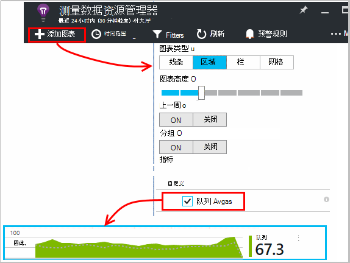

<properties 
    pageTitle="对于自定义事件和指标应用见解 API |Microsoft Azure" 
    description="插入设备或桌面应用程序、 web 页或服务来跟踪使用率和诊断问题中的几行代码。" 
    services="application-insights"
    documentationCenter="" 
    authors="alancameronwills" 
    manager="douge"/>
 
<tags 
    ms.service="application-insights" 
    ms.workload="tbd" 
    ms.tgt_pltfrm="ibiza" 
    ms.devlang="multiple" 
    ms.topic="article" 
    ms.date="10/19/2016" 
    ms.author="awills"/>

# <a name="application-insights-api-for-custom-events-and-metrics"></a>对于自定义事件和指标应用见解 API 

*在预览是应用程序的见解。*

插入几行代码以了解用户在做什么，或帮助诊断问题的应用程序中。 您可以从设备和桌面应用程序、 web 客户端和 web 服务器发送遥测。 [Visual Studio 应用程序理解](app-insights-overview.md)核心遥测 API 允许您发送自定义事件和指标，以及自己版本的标准遥测。 此 API 是由标准的应用程序理解数据收集器的 API。

## <a name="api-summary"></a>API 摘要

跨所有平台，除了几个微小的差别之外，该 API 是一致的。

方法 | 用于
---|---
[`TrackPageView`](#page-views) | 页面、 屏幕、 刀片或窗体
[`TrackEvent`](#track-event) | 用户操作和其他事件。 用于跟踪用户行为或监视性能。
[`TrackMetric`](#track-metric) | 性能度量，例如不与特定事件相关的队列长度
[`TrackException`](#track-exception)|记录异常的诊断。 跟踪它们相对于其他事件发生和检查堆栈跟踪。
[`TrackRequest`](#track-request)| 日志的频率和持续时间的服务器请求的性能分析。
[`TrackTrace`](#track-trace)|诊断日志消息。 您也可以捕获日志第三方。
[`TrackDependency`](#track-dependency)|记录的持续时间和频率的调用您的应用程序所依赖的外部组件。

您可以对大多数这些遥测调用[附加属性和度量值](#properties)。 


## <a name="prep"></a>在开始之前

如果您还没有这样这些︰

* 向项目中添加应用程序深入 SDK:
 * [ASP.NET 项目][greenbrown]
 * [Java 项目][java] 
 * [在每个网页中的 JavaScript][client]   

* 在设备或 web 服务器代码中，包括︰

    *C#:*`using Microsoft.ApplicationInsights;`

    *VB:*`Imports Microsoft.ApplicationInsights`

    *Java:*`import com.microsoft.applicationinsights.TelemetryClient;`

## <a name="construct-a-telemetryclient"></a>TelemetryClient 的构造

构造的 TelemetryClient 实例 （在网页中的 JavaScript 中除外）︰

*C#:* 

    private TelemetryClient telemetry = new TelemetryClient();

*VB:* 

    Private Dim telemetry As New TelemetryClient

*Java*

    private TelemetryClient telemetry = new TelemetryClient();

TelemetryClient 是线程安全的。

我们建议在您使用的实例`TelemetryClient`为您的应用程序的每个模块。 例如，您可能有一个`TelemetryClient`中您要报告给事件报告业务逻辑的传入的 http 请求，另一个在中间件类的 web 服务。 您可以设置属性，如`TelemetryClient.Context.User.Id`来跟踪用户和会话，或`TelemetryClient.Context.Device.Id`来识别该计算机。 此信息附加到实例发送的所有事件。


## <a name="track-event"></a>跟踪事件

在应用程序的见解，一个*自定义事件*是数据点同时[测量数据资源管理器]中显示，[metrics]聚合计数，而且还作为[诊断搜索]中的单个事件[diagnostic]。 （它不被与 MVC 或其他框架的"事件"。） 

插入 TrackEvent 的调用频率计数的代码在用户选择特定的功能，其频率达到特定目标，或可能使特定类型的错误。 

例如，在游戏的应用程序中，发送事件时用户赢得比赛︰ 

*JavaScript*

    appInsights.trackEvent("WinGame");

*C#*
    
    telemetry.TrackEvent("WinGame");

*VB*


    telemetry.TrackEvent("WinGame")

*Java*

    telemetry.trackEvent("WinGame");


### <a name="view-your-events-in-the-azure-portal"></a>在 Azure 门户中查看您的活动

若要查看您的事件计数，打开一个[规格，资源管理器](app-insights-metrics-explorer.md)叶片、 添加一个新图表并选择事件。  


要比较不同的事件计数，请通过事件名称来对网格和组设置图表类型︰


在网格中，单击通过事件名称来查看单独的事件，该事件。


单击以查看更多详细信息的任何事情。

将注意力集中在搜索或规格，资源管理器中的特定事件，设置您感兴趣的事件名称刀片式服务器的筛选器︰


## <a name="track-metric"></a>跟踪指标

使用 TrackMetric 来发送测量数据，并不附加到特定的事件。 例如，您可以定期监控队列长度。 

指标显示为度量标准的浏览器中的统计图表，但不能与不同的事件，寻找诊断搜索中的单个事件。

指标的值应为 > = 0，则会正确显示。


*JavaScript*

    appInsights.trackMetric("Queue", queue.Length);

*C#*

    telemetry.TrackMetric("Queue", queue.Length);

*VB*

    telemetry.TrackMetric("Queue", queue.Length)

*Java*

    telemetry.trackMetric("Queue", queue.Length);

事实上，您可能这样做在后台线程中︰

*C#*

    private void Run() {
     var appInsights = new TelemetryClient();
     while (true) {
      Thread.Sleep(60000);
      appInsights.TrackMetric("Queue", queue.Length);
     }
    }


若要查看结果，打开测量数据资源管理器，添加一个新图表。 将其设置为显示您的度量标准。



有您可以使用一些[指标的数量上的限制](#limits)。

## <a name="page-views"></a>网页视图

在设备或应用程序的 web 页，页面视图遥测加载每个屏幕或页面时，默认情况下发送。 但是，您可以更改它以附加的或不同时刻跟踪网页视图。 例如，在应用程序中显示的选项卡或刀片式服务器，可能需要跟踪"页面"，无论何时用户打开新的刀片。 


因此用户和会话图栩栩如生，页面视图遥测时作为属性页视图以及发送用户和会话数据。

#### <a name="custom-page-views"></a>自定义页面视图

*JavaScript*

    appInsights.trackPageView("tab1");

*C#*

    telemetry.TrackPageView("GameReviewPage");

*VB*

    telemetry.TrackPageView("GameReviewPage")


如果您有几个不同的 HTML 页面中的选项卡，您可以过指定 URL:

    appInsights.trackPageView("tab1", "http://fabrikam.com/page1.htm");

#### <a name="timing-page-views"></a>计时网页视图

默认情况下，时间报告为"页查看负载时间"从浏览器发送请求，直到调用浏览器的页加载事件时测量。

相反，您可以︰

* [TrackPageView](https://github.com/Microsoft/ApplicationInsights-JS/blob/master/API-reference.md#trackpageview)调用中设置显式的持续时间。
 * `appInsights.trackPageView("tab1", null, null, null, durationInMilliseconds);`
* 使用页面视图模式下计时调用`startTrackPage`， `stopTrackPage`。

*JavaScript*

    // To start timing a page:
    appInsights.startTrackPage("Page1");

... 

    // To stop timing and log the page:
    appInsights.stopTrackPage("Page1", url, properties, measurements);

名称用作第一个参数相关联的开始和停止调用。 它将默认为当前页名称。 

规格，资源管理器中显示结果页负载持续时间将从开始和停止调用之间的时间间隔。 这取决于您什么您实际的时间的间隔。

## <a name="track-request"></a>跟踪请求

服务器使用 SDK 来记录 HTTP 请求。 

您还可以调用它自己如果想要模拟请求的上下文中您没有运行的 web 服务模块。

*C#*

    // At start of processing this request:

    // Operation Id and Name are attached to all telemetry and help you identify
    // telemetry associated with one request:
    telemetry.Context.Operation.Id = Guid.NewGuid().ToString();
    telemetry.Context.Operation.Name = requestName;
    
    var stopwatch = System.Diagnostics.Stopwatch.StartNew();

    // ... process the request ...

    stopwatch.Stop();
    telemetry.TrackRequest(requestName, DateTime.Now,
       stopwatch.Elapsed, 
       "200", true);  // Response code, success


## <a name="operation-context"></a>操作的上下文

遥测项组合在一起可以关联将附加到这些常见的操作 id。 标准的请求跟踪模块执行此操作异常和其他处理 HTTP 请求时发送的事件。 在[搜索](app-insights-diagnostic-search.md)和[分析](app-insights-analytics.md)，可以使用该 ID 用于方便地查找任何与该请求关联的事件。 

将 ID 设置的最简单方法是使用此模式来设置操作的上下文︰

    // Establish an operation context and associated telemetry item:
    using (var operation = telemetry.StartOperation<RequestTelemetry>("operationName"))
    {
        // Telemetry sent in here will use the same operation ID.
        ...
        telemetry.TrackEvent(...); // or other Track* calls
        ...
        // Set properties of containing telemetry item - for example:
        operation.Telemetry.ResponseCode = "200";
        
        // Optional: explicitly send telemetry item:
        telemetry.StopOperation(operation);

    } // When operation is disposed, telemetry item is sent.

设置操作的上下文，以及`StartOperation`创建遥测项指定，并将其发送时处理操作，或者如果您显式地调用该类型的`StopOperation`。 如果您使用`RequestTelemetry`作为遥测类型，则其持续时间设置为开始和停止的时间间隔。

不能嵌套操作的上下文。 如果已经有操作的上下文，则其 ID 是与所有包含的项目，包括使用 StartOperation 创建的项相关联。

在搜索操作的上下文用于创建相关项列表︰


## <a name="track-exception"></a>跟踪异常

将异常发送到应用程序的见解︰ 对[它们进行计数][metrics]，用于指示频率的问题;并[检查单个][diagnostic]。 这些报告包括的堆栈跟踪。

*C#*

    try
    {
        ...
    }
    catch (Exception ex)
    {
       telemetry.TrackException(ex);
    }

*JavaScript*

    try
    {
       ...
    }
    catch (ex)
    {
       appInsights.trackException(ex);
    }

所以不总是需要显式调用 TrackException Sdk，自动捕捉许多异常。

* ASP.NET︰[编写代码以捕获异常](app-insights-asp-net-exceptions.md)
* J2EE︰[自动捕获异常](app-insights-java-get-started.md#exceptions-and-request-failures)
* JavaScript:，自动发现。 如果您想要禁用自动回收，添加一行到您在您的 web 页中插入的代码段︰

    ```
    ({
      instrumentationKey: "your key"
      , disableExceptionTracking: true
    })
    ```


## <a name="track-trace"></a>跟踪跟踪 

使用此工具来帮助诊断问题，通过将痕迹记录发送到应用程序的见解。 您可以发送的诊断数据块，和对其进行检查在[诊断搜索][diagnostic]。 

 

[登录适配器][trace]使用此 API 可以将第三方日志发送到门户网站。


*C#*

    telemetry.TrackTrace(message, SeverityLevel.Warning, properties);


您可以搜索基于邮件的内容，但它能筛选 （与不同的属性值）。

在大小限制`message`要远远高于在属性上的限制。
TrackTrace 的优点是您可以将相对较长的数据放在消息中。 例如，无法编码那里发送数据。  


此外，可以将严重性级别添加到您的邮件。 而且，像其他遥测，可以添加可用于帮助筛选器或搜索组不同的跟踪的属性值。 例如︰


    var telemetry = new Microsoft.ApplicationInsights.TelemetryClient();
    telemetry.TrackTrace("Slow database response",
                   SeverityLevel.Warning,
                   new Dictionary<string,string> { {"database", db.ID} });

这将使您在[搜索][diagnostic]，可以轻松地过滤掉特定严重性级别与特定数据库相关的所有消息。

## <a name="track-dependency"></a>跟踪依赖项

使用此调用跟踪响应时间和成功率，对外部的一段代码的调用。 结果将显示在门户中的依赖关系图表。 

```C#

            var success = false;
            var startTime = DateTime.UtcNow;
            var timer = System.Diagnostics.Stopwatch.StartNew();
            try
            {
                success = dependency.Call();
            }
            finally
            {
                timer.Stop();
                telemetry.TrackDependency("myDependency", "myCall", startTime, timer.Elapsed, success);
            }
```

请记住，服务器 Sdk 包含[依赖模块](app-insights-dependencies.md)，它可以发现和跟踪特定依赖项将自动调用-例如对数据库和 REST Api。 您必须在您的服务器以进行处理的模块上安装代理。 如果您想要跟踪调用不是捕捉的自动跟踪，或者如果您不想安装代理，您将使用此调用。

要关闭标准依赖项跟踪模块，编辑[ApplicationInsights.config](app-insights-configuration-with-applicationinsights-config.md) ，并删除引用`DependencyCollector.DependencyTrackingTelemetryModule`。


## <a name="flushing-data"></a>正在将数据刷新

正常情况下 SDK 发送数据有时选择要对用户的影响降到最低。 但是，在某些情况下您可能需要刷新缓冲区-例如，如果您在关闭应用程序中使用 SDK。

*C#*

    telemetry.Flush();

    // Allow some time for flushing before shutdown.
    System.Threading.Thread.Sleep(1000);

请注意，该函数异步[服务器遥测信道](https://www.nuget.org/packages/Microsoft.ApplicationInsights.WindowsServer.TelemetryChannel/)，但如果您选择使用的内存中通道或[永久通道](app-insights-api-filtering-sampling.md#persistence-channel)同步。


## <a name="authenticated-users"></a>经过身份验证的用户

在 web 应用程序中，用户在默认情况下都将通过 cookie 标识。 如果不从其他计算机或浏览器中，访问您的应用程序或删除 cookie，用户可能多次计算。 

但如果用户登录到您的应用程序，您可以通过在浏览器的代码中设置的身份验证的用户 id 来获取更准确计数︰

*JavaScript*

```JS
    // Called when my app has identified the user.
    function Authenticated(signInId) {
      var validatedId = signInId.replace(/[,;=| ]+/g, "_");
      appInsights.setAuthenticatedUserContext(validatedId);
      ...
    }
```

在 MVC 应用程序中，例如 ASP.NET 网站中︰

*剃刀*

        @if (Request.IsAuthenticated)
        {
            <script>
                appInsights.setAuthenticatedUserContext("@User.Identity.Name
                   .Replace("\\", "\\\\")"
                   .replace(/[,;=| ]+/g, "_"));
            </script>
        }

它不需要使用该用户的实际登录名。 它只有将是唯一的用户 id。 它不能包含空格或字符`,;=|`。 

用户 id 也是设置在会话 cookie 并发送到服务器。 经过身份验证的用户 id 服务器 SDK 安装，如果将作为客户端和服务器遥测的上下文属性的一部分，以便您可以进行筛选和搜索发送它。

如果您的应用程序将用户帐户，还可以传递帐户 （具有相同的字符限制） 的标识符。


      appInsights.setAuthenticatedUserContext(validatedId, accountId);

在[测量数据资源管理器](app-insights-metrics-explorer.md)，您可以创建图表统计**用户、 身份验证**和**用户帐户**。 

您还可以[搜索][diagnostic]客户端数据点，使用特定的用户名和帐户有关。

## <a name="properties"></a>筛选、 搜索和分类属性数据

可以将属性和度量值附加到您的事件 （并也为衡量标准，页面视图、 异常和其他遥测数据）。

**属性**是可用于筛选中使用报告您遥测的字符串值。 例如如果您的应用程序提供了几个游戏，您需要将改头换面附加到每个事件，以便您可以看到哪些游戏会更受欢迎。 

还有约 1 k 字符串长度上的限制。 （如果您想要发送较大的数据块，使用[TrackTrace](#track-trace)的消息参数。

**度量值**是可以以图形方式显示的数字值。 例如，可能要看是否有您游戏玩家获得的分数中的逐步增长。 这样，您可以获得不同关系图可细分与事件，发送的属性或堆积图表的不同的游戏。

指标的值应为 > = 0，则会正确显示。


有一些可以使用的[属性、 属性值和度量值的数量上的限制](#limits)。


*JavaScript*

    appInsights.trackEvent
      ("WinGame",
         // String properties:
         {Game: currentGame.name, Difficulty: currentGame.difficulty},
         // Numeric metrics:
         {Score: currentGame.score, Opponents: currentGame.opponentCount}
         );

    appInsights.trackPageView
        ("page name", "http://fabrikam.com/pageurl.html",
          // String properties:
         {Game: currentGame.name, Difficulty: currentGame.difficulty},
         // Numeric metrics:
         {Score: currentGame.score, Opponents: currentGame.opponentCount}
         );
          

*C#*

    // Set up some properties and metrics:
    var properties = new Dictionary <string, string> 
       {{"game", currentGame.Name}, {"difficulty", currentGame.Difficulty}};
    var metrics = new Dictionary <string, double>
       {{"Score", currentGame.Score}, {"Opponents", currentGame.OpponentCount}};

    // Send the event:
    telemetry.TrackEvent("WinGame", properties, metrics);


*VB*

    ' Set up some properties:
    Dim properties = New Dictionary (Of String, String)
    properties.Add("game", currentGame.Name)
    properties.Add("difficulty", currentGame.Difficulty)

    Dim metrics = New Dictionary (Of String, Double)
    metrics.Add("Score", currentGame.Score)
    metrics.Add("Opponents", currentGame.OpponentCount)

    ' Send the event:
    telemetry.TrackEvent("WinGame", properties, metrics)


*Java*
    
    Map<String, String> properties = new HashMap<String, String>();
    properties.put("game", currentGame.getName());
    properties.put("difficulty", currentGame.getDifficulty());
    
    Map<String, Double> metrics = new HashMap<String, Double>();
    metrics.put("Score", currentGame.getScore());
    metrics.put("Opponents", currentGame.getOpponentCount());
    
    telemetry.trackEvent("WinGame", properties, metrics);


> [AZURE.NOTE] 请注意不要登录属性中的个人身份信息。

**如果您使用的指标**，度量资源管理器打开并从自定义组中选择的度量︰


*如果没有显示您的跃点计数，或自定义标题不存在，请关闭选择刀片式服务器，然后重试。它有时需要花一小时指标通过管道进行聚合。*

**如果您使用属性和度量**，段由属性的度量︰


**在诊断搜索**，您可以查看的属性和度量值的单独发生的事件。


使用搜索字段来查看具有特定属性值的事件。


[了解有关搜索表达式][diagnostic]。

#### <a name="alternative-way-to-set-properties-and-metrics"></a>另一种方法来设置属性和度量值

如果它是更方便，可以收集在一个单独的对象中的事件的参数︰

    var event = new EventTelemetry();

    event.Name = "WinGame";
    event.Metrics["processingTime"] = stopwatch.Elapsed.TotalMilliseconds;
    event.Properties["game"] = currentGame.Name;
    event.Properties["difficulty"] = currentGame.Difficulty;
    event.Metrics["Score"] = currentGame.Score;
    event.Metrics["Opponents"] = currentGame.Opponents.Length;

    telemetry.TrackEvent(event);

> [AZURE.WARNING] 不要重复使用相同的遥测项实例 (`event`在此示例中) 进行多次调用 Track*()。 这可能会导致遥测发送的配置不正确。


## <a name="timed"></a>计时事件

有时您想要执行某项操作所需的时间长短的图表。 例如，您可能想知道多长时间用户要考虑选择在游戏中的花费的时间。 这是一个有用的测量参数的用法示例。


*C#*

    var stopwatch = System.Diagnostics.Stopwatch.StartNew();

    // ... perform the timed action ...

    stopwatch.Stop();

    var metrics = new Dictionary <string, double>
       {{"processingTime", stopwatch.Elapsed.TotalMilliseconds}};

    // Set up some properties:
    var properties = new Dictionary <string, string> 
       {{"signalSource", currentSignalSource.Name}};

    // Send the event:
    telemetry.TrackEvent("SignalProcessed", properties, metrics);


## <a name="defaults"></a>自定义遥测的默认属性

如果您要编写自定义事件的某些设置默认属性值，您可以在 TelemetryClient 中设置它们。 从该客户端发送的每一项遥测与它们相连。 

*C#*

    using Microsoft.ApplicationInsights.DataContracts;

    var gameTelemetry = new TelemetryClient();
    gameTelemetry.Context.Properties["Game"] = currentGame.Name;
    // Now all telemetry will automatically be sent with the context property:
    gameTelemetry.TrackEvent("WinGame");
    
*VB*

    Dim gameTelemetry = New TelemetryClient()
    gameTelemetry.Context.Properties("Game") = currentGame.Name
    ' Now all telemetry will automatically be sent with the context property:
    gameTelemetry.TrackEvent("WinGame")

*Java*

    import com.microsoft.applicationinsights.TelemetryClient;
    import com.microsoft.applicationinsights.TelemetryContext;
    ...


    TelemetryClient gameTelemetry = new TelemetryClient();
    TelemetryContext context = gameTelemetry.getContext();
    context.getProperties().put("Game", currentGame.Name);
    
    gameTelemetry.TrackEvent("WinGame");


    
个别遥测调用可重写其属性字典中的默认值。

**JavaScript 的 web 客户端**，[使用 JavaScript 遥测初始值设定项](#js-initializer)。

**若要将属性添加到所有遥测**标准收集模块中的数据包括[实现`ITelemetryInitializer`](app-insights-api-filtering-sampling.md#add-properties)。


## <a name="sampling-filtering-and-processing-telemetry"></a>抽样、 过滤和处理遥测 

您可以编写代码来处理您的遥测从 SDK 发送之前。 处理过程将包括发送的 HTTP 请求集合等依赖项集合的标准遥测模块的数据。

* [添加属性，](app-insights-api-filtering-sampling.md#add-properties)通过实现遥测与`ITelemetryInitializer`-例如，要添加版本进行编号，或从其他属性的值计算。 
* [筛选](app-insights-api-filtering-sampling.md#filtering)可以修改或放弃遥测，它在发送前从 SDK 通过实施`ITelemetryProcesor`。 控制内容发送或被放弃，但您必须考虑您的度量标准的影响。 这取决于如何放弃的项目，则可能会丢失的能力相关的项之间导航。
* [采样](app-insights-api-filtering-sampling.md#sampling)是一个打包的解决方案，以减少到门户网站从您的应用程序发送的数据量。 它会不会影响显示的度量中，且不影响诊断问题相关的项目比如异常、 请求和页面视图之间导航的能力。

[了解更多信息](app-insights-api-filtering-sampling.md)


## <a name="disabling-telemetry"></a>禁用遥测

对**动态停止和启动**收集和遥测传输︰

*C#*

```C#

    using  Microsoft.ApplicationInsights.Extensibility;

    TelemetryConfiguration.Active.DisableTelemetry = true;
```

**禁用所选的标准收集器**-例如，性能计数器、 HTTP 请求或依赖项的删除或注释掉[ApplicationInsights.config]中的相关行[config]。 要做到这一点，例如，如果您想要发送您自己的 TrackRequest 数据。

## <a name="debug"></a>开发人员模式运行

在调试期间，它可让您，以便您可以立即看到结果通过管道加急的遥测。 您还获得更多消息，以帮助您跟踪遥测的任何问题。 关闭它在生产中，因为它可能会降低您的应用程序。


*C#*
    
    TelemetryConfiguration.Active.TelemetryChannel.DeveloperMode = true;

*VB*

    TelemetryConfiguration.Active.TelemetryChannel.DeveloperMode = True


## <a name="ikey"></a>设置所选的自定义遥测的检测键

*C#*
    
    var telemetry = new TelemetryClient();
    telemetry.InstrumentationKey = "---my key---";
    // ...


## <a name="dynamic-ikey"></a>动态检测键

若要避免混合使用了遥测从开发、 测试和生产环境，您可以[创建单独的应用程序理解资源][create]并更改其根据环境的不同的密钥。

而不是从配置文件获取检测键，可以将其设置在代码中。 在初始化方法中，如 ASP.NET 服务中的 global.aspx.cs 设置项︰

*C#*

    protected void Application_Start()
    {
      Microsoft.ApplicationInsights.Extensibility.
        TelemetryConfiguration.Active.InstrumentationKey = 
          // - for example -
          WebConfigurationManager.Settings["ikey"];
      ...

*JavaScript*

    appInsights.config.instrumentationKey = myKey; 


在 web 页中，您可能需要从 web 服务器的状态，而不是按其原义编码到脚本中设置它。 例如，在 ASP.NET 应用程序中生成一个 web 页︰

*JavaScript 在 Razor 中*

    <script type="text/javascript">
    // Standard Application Insights web page script:
    var appInsights = window.appInsights || function(config){ ...
    // Modify this part:
    }({instrumentationKey:  
      // Generate from server property:
      @Microsoft.ApplicationInsights.Extensibility.
         TelemetryConfiguration.Active.InstrumentationKey"
    }) // ...


## <a name="telemetrycontext"></a>TelemetryContext

TelemetryClient 有一个上下文属性，其中包含一些与所有遥测数据一起发送的值。 他们通常通过标准的遥测模块，设置，但您还可以设置它们自己。 例如︰

    telemetry.Context.Operation.Name = "MyOperationName";

如果设置了任何这些值中的自己，请考虑删除相关行，从[ApplicationInsights.config][config]，以便您的值和标准值不会混乱。

* **组件**标识应用程序和版本
* **设备**有关该应用程序正在其运行的设备的数据 （在 web 应用程序是从其发送遥测的服务器或客户端设备）
* **InstrumentationKey**标识在 Azure 将出现遥测的应用程序的见解资源。 通常从 ApplicationInsights.config 提货
* **位置**标识设备的地理位置。
* **操作**在 web 应用程序，当前的 HTTP 请求。 在其他应用程序类型，您可以设置此对事件进行分组在一起。
 * **Id**︰ 一个生成的值，对应不同的事件，以便当您检查诊断搜索中的任何事件，您可以找到"相关项"
 * **名称**︰ 标识符，通常在 HTTP 请求的 URL。 
 * **SyntheticSource**︰ 如果不为 null 或为空，该字符串指示请求的源已被标识为一个机器人或 web 测试。 默认情况下它将被从计算中排除测量数据资源管理器中。
* **属性**所有遥测数据都发送的属性。 可以重写单个轨道 * 调用中。
* **会话**标识用户的会话。 该 Id 设置为生成的值，当用户尚未活动一段时间更改。
* **用户**用户信息。 

## <a name="limits"></a>限制


[AZURE.INCLUDE [application-insights-limits](../../includes/application-insights-limits.md)]

*如何避免碰到数据速率极限？*

* 使用[采样](app-insights-sampling.md)。

*数据保留多长时间？*

* 请参阅[数据保留和隐私][data]。


## <a name="reference-docs"></a>参考文档

* [ASP.NET 的引用](https://msdn.microsoft.com/library/dn817570.aspx)
* [Java 引用](http://dl.windowsazure.com/applicationinsights/javadoc/)
* [JavaScript 的引用](https://github.com/Microsoft/ApplicationInsights-JS/blob/master/API-reference.md)
* [Android SDK](https://github.com/Microsoft/ApplicationInsights-Android)
* [iOS SDK](https://github.com/Microsoft/ApplicationInsights-iOS)


## <a name="sdk-code"></a>SDK 代码

* [ASP.NET 核心 SDK](https://github.com/Microsoft/ApplicationInsights-dotnet)
* [ASP.NET 5](https://github.com/Microsoft/ApplicationInsights-aspnet5)
* [Windows 服务器程序包](https://github.com/Microsoft/applicationInsights-dotnet-server)
* [Java SDK](https://github.com/Microsoft/ApplicationInsights-Java)
* [JavaScript SDK](https://github.com/Microsoft/ApplicationInsights-JS)
* [所有平台](https://github.com/Microsoft?utf8=%E2%9C%93&query=applicationInsights)

## <a name="questions"></a>问题

* *Track_() 调用可能会引发何种异常？*
    
    无。 您不需要将其包装在 try catch 子句。 如果 SDK 时遇到的问题，它将在调试控制台输出中，记录您将会看到的消息，如果消息获得通过-诊断搜索中。


* *是否有 REST API，从门户网站获取数据？*

    的即将登场。 同时，使用[连续的导出](app-insights-export-telemetry.md)。

## <a name="next"></a>下一步行动


[搜索事件和日志][diagnostic]

[示例和演练](app-insights-code-samples.md)

[故障排除][qna]


<!--Link references-->

[client]: app-insights-javascript.md
[config]: app-insights-configuration-with-applicationinsights-config.md
[create]: app-insights-create-new-resource.md
[data]: app-insights-data-retention-privacy.md
[diagnostic]: app-insights-diagnostic-search.md
[exceptions]: app-insights-asp-net-exceptions.md
[greenbrown]: app-insights-asp-net.md
[java]: app-insights-java-get-started.md
[metrics]: app-insights-metrics-explorer.md
[qna]: app-insights-troubleshoot-faq.md
[trace]: app-insights-search-diagnostic-logs.md

 
