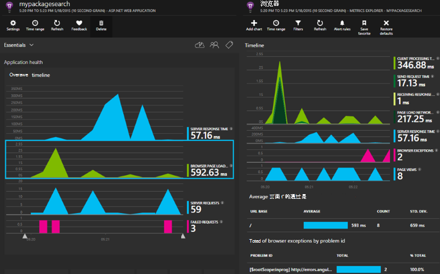

<properties 
    pageTitle="ASP.NET 核心的应用程序理解" 
    description="监视 web 应用程序的可用性、 性能和使用情况。" 
    services="application-insights" 
    documentationCenter=".net"
    authors="alancameronwills" 
    manager="douge"/>

<tags 
    ms.service="application-insights" 
    ms.workload="tbd" 
    ms.tgt_pltfrm="ibiza" 
    ms.devlang="na" 
    ms.topic="article" 
    ms.date="08/30/2016" 
    ms.author="awills"/>

# ASP.NET 核心的应用程序理解

[Visual Studio 应用程序见解](app-insights-overview.md)让您监视 web 应用程序的可用性、 性能和使用情况。 与处于放任状态获得关于性能和您的应用程序的有效性的反馈意见，您可以在每个开发周期中做出明智的选择，关于设计的方向。

您将需要与[Microsoft Azure](http://azure.com)的订阅。 使用 Microsoft 帐户，可能具有 Windows、 XBox Live，或其他 Microsoft 云服务的登录。 您的团队可能拥有对 Azure 组织预订︰ 请将您添加至其使用 Microsoft 帐户所有者。

## 入门教程

请按照[入门指南](https://github.com/Microsoft/ApplicationInsights-aspnetcore/wiki/Getting-Started)。

## 使用应用程序的见解

登录到[Microsoft Azure 门户](https://portal.azure.com)并浏览到该资源创建要监视您的应用程序。

在单独的浏览器窗口中，使用一段时间您的应用程序。 您将看到应用程序理解图表中显示的数据。 （您可能需要单击刷新。）虽然您正在开发的将是只有少量的数据，但这些图表真正栩栩如生发布您的应用程序和具有多个用户时。 

概述页显示性能图表，你最可能感兴趣︰ 服务器的响应时间、 页面加载时间和失败的请求数。 单击任何图表以查看详细的图表和数据。

在门户视图分为两个主要类别︰

* [测量数据资源管理器中](app-insights-metrics-explorer.md)显示图形和表的指标和数量，如响应时间、 故障率或使用[API](app-insights-api-custom-events-metrics.md)创建您自己的指标。 筛选和由属性值，以便更好地理解您的应用程序及其用户的细分数据。
* [搜索资源管理器中](app-insights-diagnostic-search.md)列出个别的事件，例如特定请求、 异常、 日志跟踪信息或使用[API](app-insights-api-custom-events-metrics.md)创建您自己的事件。 筛选和搜索在事件中，并在相关事件，以调查问题之间导航。
* [分析功能](app-insights-analytics.md)使您可以运行类似于 SQL 的查询转移您遥测和是一个功能强大的分析和诊断工具。

## 警报

* 自动获得[诊断的主动预防性警报](app-insights-proactive-diagnostics.md)，告知您有关反常变化故障率和其他指标。
* 设置[可用性测试](app-insights-monitor-web-app-availability.md)，来测试您的网站不断地进行全球范围内，办事处和任意测试失败时，就立即收到电子邮件。
* 设置[指标预警](app-insights-monitor-web-app-availability.md)知道例如响应时间或异常率的指标如果转外可接受的限度。

## 获取更多的遥测

* 为监视页面使用情况和性能[添加到 web 页的遥测](app-insights-javascript.md)。
* [监视器的依赖关系](app-insights-dependencies.md)查看如果其余部分、 SQL 或其他外部资源会变慢。
* [使用 API](app-insights-api-custom-events-metrics.md)来发送事件和度量数据的应用程序的性能和使用情况的更详细的视图。
* [可用性测试](app-insights-monitor-web-app-availability.md)检查您的应用程序不断从世界各地。 

## 打开源

[阅读并参加代码](https://github.com/Microsoft/ApplicationInsights-aspnetcore#recent-updates)

