<properties 
    pageTitle="跟踪应用程序的见解中的依赖项" 
    description="分析使用情况、 可用性和内部部署或 Microsoft Azure 应用程序理解的 web 应用程序的性能。" 
    services="application-insights" 
    documentationCenter=".net"
    authors="alancameronwills" 
    manager="douge"/>

<tags 
    ms.service="application-insights" 
    ms.workload="tbd" 
    ms.tgt_pltfrm="ibiza" 
    ms.devlang="na" 
    ms.topic="article" 
    ms.date="10/24/2016" 
    ms.author="awills"/>


# <a name="set-up-application-insights-dependency-tracking"></a>设置应用程序的见解︰ 依赖项跟踪


[AZURE.INCLUDE [app-insights-selector-get-started-dotnet](../../includes/app-insights-selector-get-started-dotnet.md)]


*相关性*是由您的应用程序调用一个外部组件。 它通常是使用 HTTP，或数据库或文件系统调用的服务。 在 Visual Studio 应用程序的见解，可以轻松查看您的应用程序的依赖项的等待多长时间和频率的依赖项调用将失败。

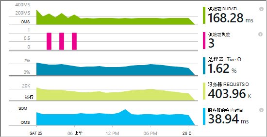

全新的相关性监视器当前报告对这些类型的依赖项的调用︰

* ASP.NET
 * SQL 数据库
 * ASP.NET web 和使用基于 HTTP 绑定的 WCF 服务
 * 本地或远程 HTTP 调用
 * Azure DocumentDb、 表、 blob 存储和队列
* Java
 * 通过[JDBC](http://docs.oracle.com/javase/7/docs/technotes/guides/jdbc/)驱动程序，例如 MySQL、 SQL Server，PostgreSQL 或 SQLite 数据库调用。
* 在网页中的 JavaScript[网页 SDK](app-insights-javascript.md)自动登录 Ajax 调用为依赖项。

您可以编写您自己的 SDK 调用来监视其他使用[TrackDependency API](app-insights-api-custom-events-metrics.md#track-dependency)的依赖项。


## <a name="to-set-up-dependency-monitoring"></a>若要设置依赖项的监视

您需要[Microsoft Azure](http://azure.com)订阅。

### <a name="if-your-app-runs-on-your-iis-server"></a>如果在您的 IIS 服务器上运行您的应用程序

如果在.NET 4.6 或更高版本上运行您的 web 应用程序，您可以[安装应用程序的见解 SDK](app-insights-asp-net.md)或者在您的应用程序，或安装应用程序的见解状态监视器。 您不需要两个。

否则，在服务器上安装应用程序的见解状态监视器︰

1. 在 IIS web 服务器上，使用管理员凭据登录。
2. 下载并运行[状态监视器安装程序](http://go.microsoft.com/fwlink/?LinkId=506648)。
4. 在安装向导中，登录到 Microsoft Azure。

    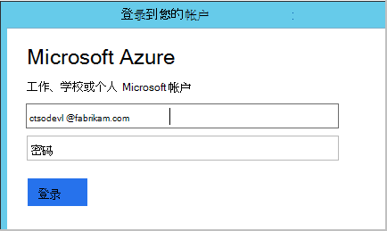

    *连接错误？请参阅[疑难解答](#troubleshooting)。*

5. 选择已安装的 web 应用程序或网站，您想要监视，然后配置您要应用的见解门户中查看结果的资源。

    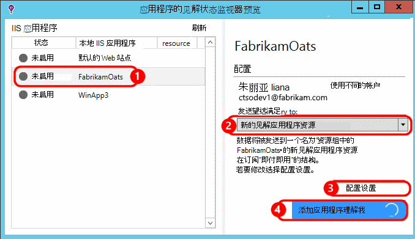

    通常情况下，选择要配置新的资源和[资源组][roles]。

    否则，请使用现有的资源，如果您已经设置了[web 测试][availability]您的网站或[web 客户端监视][client]。

6. 重新启动 IIS。

    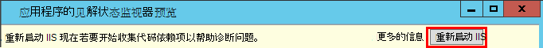

    您的 web 服务将暂时中断。

6. 请注意，ApplicationInsights.config 已插入您想要监视的 web 应用程序。

    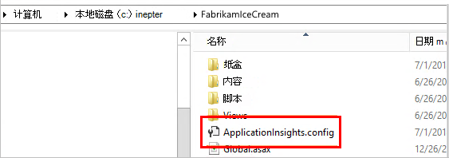

   也有对 web.config 的某些更改。

#### <a name="want-to-reconfigure-later"></a>想要 （重新） 稍后配置？

完成该向导后，可以重新配置该代理，只要您希望。 您还可以使用此如果您安装了代理，但没有初始设置的一些疑难。

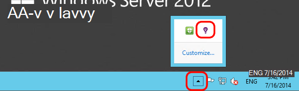


### <a name="if-your-app-runs-as-an-azure-web-app"></a>如果您的应用程序作为一个 Azure Web 应用程序运行

在 Azure 的 Web 应用程序的控制面板中，将添加应用程序的见解扩展。

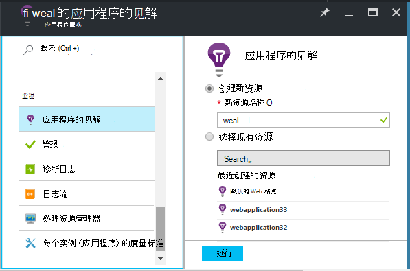


### <a name="if-its-an-azure-cloud-services-project"></a>如果它是 Azure 的云服务项目

[添加到 web 和员工角色的脚本](app-insights-cloudservices.md#dependencies)。 或者[安装.NET framework 4.6 或更高版本](../cloud-services/cloud-services-dotnet-install-dotnet.md)。

## <a name="diagnosis"></a>诊断依赖项性能问题

若要评估的请求在您的服务器性能，请打开性能刀片式服务器然后向下滚动到请求的网格看︰

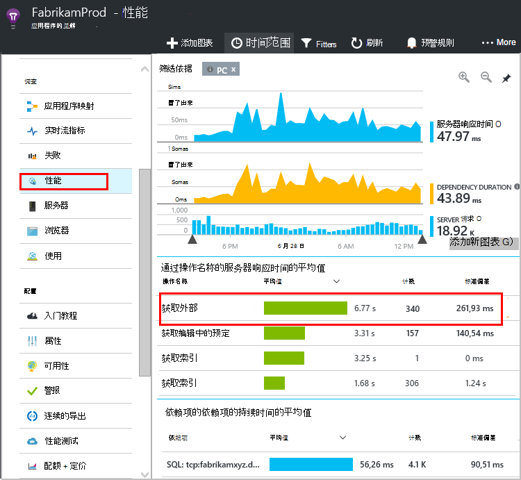

最上面的一个时间很长。 让我们看一下能否找到出其中所用的时间。

单击以查看单个请求事件的行︰


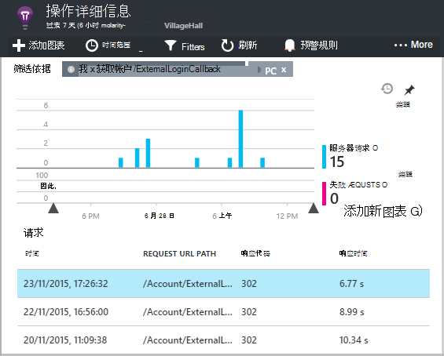

单击任何长时间运行的实例对其进行进一步检查。

向下滚动到与此请求相关的远程相关性调用︰

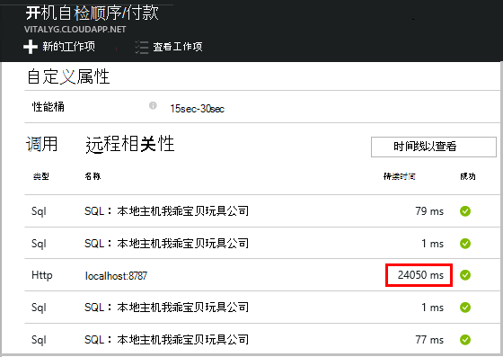

它就像大部分时间处理此请求所用的本地服务调用。 


选择该行以获取更多信息︰

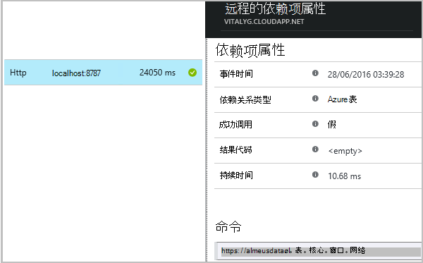

详细信息包括足够的信息来诊断问题。


在不同的情况下，不需要依赖项调用很长，但通过切换到时间线视图，我们可以看到在我们内部处理过程中发生延迟︰


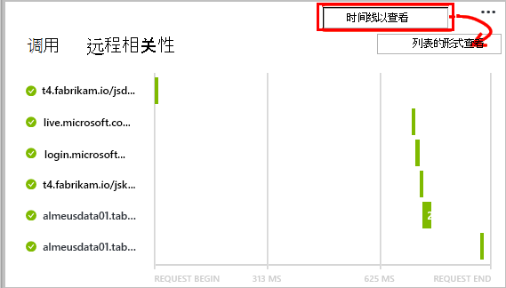


## <a name="failures"></a>失败

如果失败的请求，请单击图表。

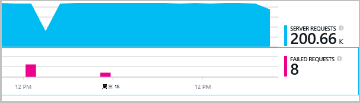

通过查找远程相关性对失败的请求类型和请求实例，请单击。


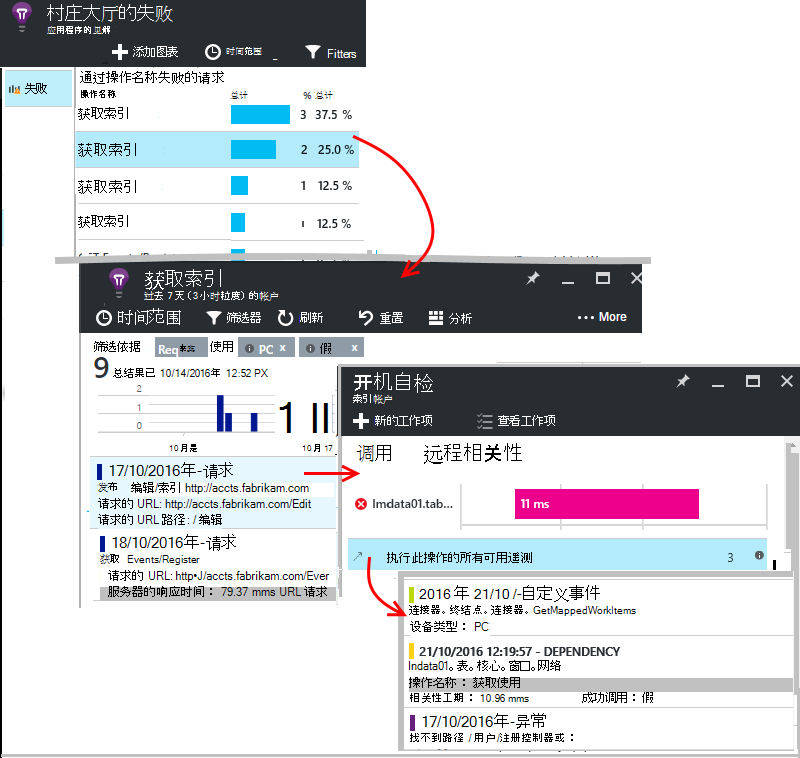


## <a name="custom-dependency-tracking"></a>自定义依赖项跟踪

标准的依赖项跟踪模块可自动发现外部依赖项，如数据库和 REST Api。 但是，您可能希望某些其他组件相同的方式来处理。 

您可以编写代码来发送相关性信息，使用相同的[TrackDependency API](app-insights-api-custom-events-metrics.md#track-dependency)使用的标准模块。

例如，如果您的代码与您没有自己编写的程序集生成时，可能时间所有调用它，了解它对响应时间作出何种贡献。 若要使此应用程序的见解中的依赖关系图表中显示的数据，将其使用发送`TrackDependency`。

```C#

            var startTime = DateTime.UtcNow;
            var timer = System.Diagnostics.Stopwatch.StartNew();
            try
            {
                success = dependency.Call();
            }
            finally
            {
                timer.Stop();
                telemetry.TrackDependency("myDependency", "myCall", startTime, timer.Elapsed, success);
            }
```

如果您想要关闭标准依赖项跟踪模块，在[ApplicationInsights.config](app-insights-configuration-with-applicationinsights-config.md)中删除对 DependencyTrackingTelemetryModule 的引用。

## <a name="troubleshooting"></a>故障排除

*依赖项成功总是标志显示 true 或 false。*

* 升级到最新版本的 SDK。 如果您的.NET 版本小于 4.6，安装[状态监视器](app-insights-monitor-performance-live-website-now.md)。

## <a name="next-steps"></a>下一步行动

- [例外情况](app-insights-asp-net-exceptions.md)
- [用户与页上的数据][client]
- [可用性](app-insights-monitor-web-app-availability.md)


<!--Link references-->

[api]: app-insights-api-custom-events-metrics.md
[apikey]: app-insights-api-custom-events-metrics.md#ikey
[availability]: app-insights-monitor-web-app-availability.md
[azure]: ../insights-perf-analytics.md
[client]: app-insights-javascript.md
[diagnostic]: app-insights-diagnostic-search.md
[metrics]: app-insights-metrics-explorer.md
[netlogs]: app-insights-asp-net-trace-logs.md
[portal]: http://portal.azure.com/
[qna]: app-insights-troubleshoot-faq.md
[redfield]: app-insights-asp-net-dependencies.md
[roles]: app-insights-resources-roles-access-control.md

 
