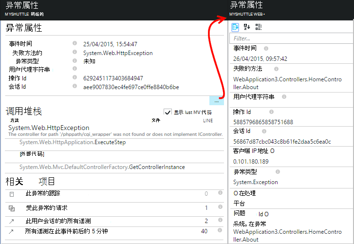

<properties 
    pageTitle="诊断故障和应用程序的见解与 ASP.NET 应用程序中的异常" 
    description="捕获请求遥测以及 ASP.NET 应用程序中的异常。" 
    services="application-insights" 
    documentationCenter=".net"
    authors="alancameronwills" 
    manager="douge"/>

<tags 
    ms.service="application-insights" 
    ms.workload="tbd" 
    ms.tgt_pltfrm="ibiza" 
    ms.devlang="na" 
    ms.topic="article" 
    ms.date="10/27/2016" 
    ms.author="awills"/>


# <a name="set-up-application-insights-diagnose-exceptions"></a>设置应用程序的见解︰ 诊断异常

[AZURE.INCLUDE [app-insights-selector-get-started-dotnet](../../includes/app-insights-selector-get-started-dotnet.md)]


通过监视应用程序提供[Visual Studio 应用程序理解][start]，可以关联失败的请求例外和其他事件在客户端和服务器上，以便您可以快速诊断的原因。

要监视 ASP.NET 应用程序，您必须[添加应用程序深入 SDK] [greenbrown]为您的应用程序，或[安装在您的 IIS 服务器上的状态监视器][redfield]，或者，如果您的应用程序是 Azure Web 应用程序，添加[应用程序的见解扩展](app-insights-azure-web-apps.md)。

## <a name="diagnosing-exceptions-using-visual-studio"></a>使用 Visual Studio 的诊断异常

在 Visual Studio 中，以帮助进行调试打开的应用程序解决方案。

在服务器上或通过使用 F5 开发计算机上运行该应用程序。

在 Visual Studio 中，打开应用程序见解搜索窗口，并将其设置为显示您的应用程序的事件。 在调试时可以执行此操作只需通过单击应用程序信息按钮。


请注意，您可以筛选报表，使显示只是例外情况。 

*显示无例外吗？请参阅[捕获异常](#exceptions)。*

单击要显示其堆栈跟踪的异常报告。


单击要打开的相关文件的堆栈跟踪中所引用的行。  

## <a name="diagnosing-failures-using-the-azure-portal"></a>诊断故障使用 Azure 门户

您的应用程序的应用程序的见解概述，从故障拼贴显示图表的异常和失败的 HTTP 请求，该请求的列表以及造成的最常见故障的 Url。


单击列表中的失败的请求类型获取的单个故障之一。 据此，单击，直至到达异常或与之相关联的任何跟踪数据︰


**或者，**您可以开始从例外列表中，您可以找到进一步关闭故障刀片式服务器。 请单击直到最终到达各个异常。


*显示无例外吗？请参阅[捕获异常](#exceptions)。*

在这里可以查看堆栈跟踪和每个例外的详细的属性并查找相关的日志跟踪或其他事件。




[了解更多关于诊断搜索][diagnostic]。


## <a name="dependency-failures"></a>依赖项失败

*依赖项*是您的应用程序调用，通常通过 REST API 或数据库连接的服务。 [应用程序状态监视器的见解][redfield]自动监视各种类型的依赖项调用，测量呼叫持续时间和成功或失败。 

要获得互依关系数据，您必须[安装状态监视器][redfield]在 IIS 服务器上，或者如果您的应用程序是 Azure Web 应用程序，使用该[应用程序的见解扩展](app-insights-azure-web-apps.md)。 

失败的对依赖项列出故障刀片式服务器，和您还可以找到这些相关项下请求详细信息和异常的详细信息。

*没有依赖项失败？很好。但是，若要验证您将获得互依关系数据，打开性能刀片式服务器并查看相关性工期图表。*

 

## <a name="custom-tracing-and-log-data"></a>自定义跟踪和日志数据

获取诊断数据特定于您的应用程序，您可以插入发送遥测数据的代码。 这显示在旁边请求、 页面视图和其他自动收集数据的诊断搜索。 

有几个选项︰

* [TrackEvent()](app-insights-api-custom-events-metrics.md#track-event)通常用于监视使用模式，但它也会发送的数据诊断搜索显示在自定义事件。 事件命名参数，并可以执行字符串属性，您可以[筛选诊断搜索]的数值指标[diagnostic]。
* [TrackTrace()](app-insights-api-custom-events-metrics.md#track-trace)允许您发送长的数据，例如，发送信息。
* [TrackException()](#exceptions)将发送栈跟踪。 [有关异常的详细信息](#exceptions)。
* 如果您已经使用一个日志记录框架，如 Log4Net 或 NLog，则可以[捕获这些日志][netlogs]和诊断搜索旁边请求和异常数据中看到它们。

打开[搜索]以查看这些事件，[diagnostic]，打开筛选器，然后选择自定义事件、 跟踪或异常。


> [AZURE.NOTE] 如果您的应用程序生成大量的遥测，自适应采样模块会自动降低通过发送仅代表事件的一部分发送到门户的卷。 将选择或取消选择作为一个组中，以便您可以找到相关事件之间属于同一操作的事件。 [了解有关采样。](app-insights-sampling.md)

### <a name="how-to-see-request-post-data"></a>如何查看请求发送的数据

请求的详细信息不包含发送给您的帖子调用的应用程序的数据。 可以使用该数据报告︰

* [安装 SDK] [greenbrown]应用程序项目中。
* 插入的代码在应用程序中调用[Microsoft.ApplicationInsights.TrackTrace()][api]。 发送消息参数发送数据。 没有限制的允许大小，因此您应该尝试发送不仅是重要的数据。
* 当研究失败的申请时，发现关联的跟踪。  


## <a name="exceptions"></a>捕获异常及相关诊断数据

首先，您将看门户中会导致失败，您的应用程序中的所有异常。 您将看到任何浏览器的异常 (如果您正在使用[JavaScript SDK] [client]在 web 页中)。 但大多数服务器异常被捕获由 IIS，您必须编写的代码，以查看它们。

您可以：

* **日志记录异常明确**通过在异常处理程序中插入代码以异常报告。
* 通过配置 ASP.NET 框架来**自动捕获异常**。 必要的附加内容是框架的不同的不同类型。

## <a name="reporting-exceptions-explicitly"></a>明确报告异常

最简单的方法是对 TrackException() 的调用插入异常处理程序中。

JavaScript

    try 
    { ...
    }
    catch (ex)
    {
      appInsights.trackException(ex, "handler loc",
        {Game: currentGame.Name, 
         State: currentGame.State.ToString()});
    }

C#

    var telemetry = new TelemetryClient();
    ...
    try 
    { ...
    }
    catch (Exception ex)
    {
       // Set up some properties:
       var properties = new Dictionary <string, string> 
         {{"Game", currentGame.Name}};

       var measurements = new Dictionary <string, double>
         {{"Users", currentGame.Users.Count}};

       // Send the exception telemetry:
       telemetry.TrackException(ex, properties, measurements);
    }

VB

    Dim telemetry = New TelemetryClient
    ...
    Try
      ...
    Catch ex as Exception
      ' Set up some properties:
      Dim properties = New Dictionary (Of String, String)
      properties.Add("Game", currentGame.Name)

      Dim measurements = New Dictionary (Of String, Double)
      measurements.Add("Users", currentGame.Users.Count)
  
      ' Send the exception telemetry:
      telemetry.TrackException(ex, properties, measurements)
    End Try

属性和度量值的参数是可选的但可用于[筛选和添加][diagnostic]的额外信息。 例如，如果您有一个应用程序，可以运行多个游戏，您可以找到与某个特定游戏相关的异常报告。 您可以添加任意数量的项目，根据需要为每个字典。

## <a name="browser-exceptions"></a>浏览器异常

大多数浏览器异常报告。

如果您的 web 页包含内容交付网络或其他域中的脚本文件，确保脚本标记有特性```crossorigin="anonymous"```，和服务器发送[CORS 头](http://enable-cors.org/)。 这样，您可以获得这些资源的处理 JavaScript 异常堆栈跟踪和细节。

## <a name="web-forms"></a>Web 窗体

Web 窗体中，HTTP 模块将能够获配 CustomErrors 没有重定向时收集异常。

但如果您拥有活动的重定向到 Global.asax.cs 中的 Application_Error 函数中添加以下行。 （添加 Global.asax 文件，如果您还没有）。

*C#*

    void Application_Error(object sender, EventArgs e)
    {
      if (HttpContext.Current.IsCustomErrorEnabled && Server.GetLastError  () != null)
      {
         var ai = new TelemetryClient(); // or re-use an existing instance

         ai.TrackException(Server.GetLastError());
      }
    }


## <a name="mvc"></a>MVC

如果[CustomErrors](https://msdn.microsoft.com/library/h0hfz6fc.aspx)配置为`Off`，则异常将适用于[HTTP 模块](https://msdn.microsoft.com/library/ms178468.aspx)收集。 但是，如果它是`RemoteOnly`（默认值），或`On`，则异常将被清除且不可用于应用程序能够自动收集的见解。 您可以修复，通过重写[System.Web.Mvc.HandleErrorAttribute 类](http://msdn.microsoft.com/library/system.web.mvc.handleerrorattribute.aspx)，并应用重写的类，对应不同的 MVC 版本 （[github 源](https://github.com/AppInsightsSamples/Mvc2UnhandledExceptions/blob/master/MVC2App/Controllers/AiHandleErrorAttribute.cs)） 下面所示︰

    using System;
    using System.Web.Mvc;
    using Microsoft.ApplicationInsights;

    namespace MVC2App.Controllers
    {
      [AttributeUsage(AttributeTargets.Class | AttributeTargets.Method, Inherited = true, AllowMultiple = true)] 
      public class AiHandleErrorAttribute : HandleErrorAttribute
      {
        public override void OnException(ExceptionContext filterContext)
        {
            if (filterContext != null && filterContext.HttpContext != null && filterContext.Exception != null)
            {
                //If customError is Off, then AI HTTPModule will report the exception
                if (filterContext.HttpContext.IsCustomErrorEnabled)
                {   //or reuse instance (recommended!). see note above  
                    var ai = new TelemetryClient();
                    ai.TrackException(filterContext.Exception);
                } 
            }
            base.OnException(filterContext);
        }
      }
    }

#### <a name="mvc-2"></a>MVC 2

HandleError 属性替换为新属性在您的控制器。

    namespace MVC2App.Controllers
    {
       [AiHandleError]
       public class HomeController : Controller
       {
    ...

[示例](https://github.com/AppInsightsSamples/Mvc2UnhandledExceptions)

#### <a name="mvc-3"></a>MVC 3

注册`AiHandleErrorAttribute`Global.asax.cs 中的全局筛选器︰

    public class MyMvcApplication : System.Web.HttpApplication
    {
      public static void RegisterGlobalFilters(GlobalFilterCollection filters)
      {
         filters.Add(new AiHandleErrorAttribute());
      }
     ...

[示例](https://github.com/AppInsightsSamples/Mvc3UnhandledExceptionTelemetry)


#### <a name="mvc-4-mvc5"></a>MVC 4，MVC5

在 FilterConfig.cs 中的全局筛选器注册 AiHandleErrorAttribute:

    public class FilterConfig
    {
      public static void RegisterGlobalFilters(GlobalFilterCollection filters)
      {
        // Default replaced with the override to track unhandled exceptions
        filters.Add(new AiHandleErrorAttribute());
      }
    }

[示例](https://github.com/AppInsightsSamples/Mvc5UnhandledExceptionTelemetry)

## <a name="web-api-1x"></a>Web API 1.x


重写 System.Web.Http.Filters.ExceptionFilterAttribute:

    using System.Web.Http.Filters;
    using Microsoft.ApplicationInsights;

    namespace WebAPI.App_Start
    {
      public class AiExceptionFilterAttribute : ExceptionFilterAttribute
      {
        public override void OnException(HttpActionExecutedContext actionExecutedContext)
        {
            if (actionExecutedContext != null && actionExecutedContext.Exception != null)
            {  //or reuse instance (recommended!). see note above 
                var ai = new TelemetryClient();
                ai.TrackException(actionExecutedContext.Exception);    
            }
            base.OnException(actionExecutedContext);
        }
      }
    }

您可以将此重写的属性添加到特定域控制器，或将其添加到在 WebApiConfig 类中的全局筛选器配置︰ 

    using System.Web.Http;
    using WebApi1.x.App_Start;

    namespace WebApi1.x
    {
      public static class WebApiConfig
      {
        public static void Register(HttpConfiguration config)
        {
            config.Routes.MapHttpRoute(name: "DefaultApi", routeTemplate: "api/{controller}/{id}",
                defaults: new { id = RouteParameter.Optional });
            ...
            config.EnableSystemDiagnosticsTracing();

            // Capture exceptions for Application Insights:
            config.Filters.Add(new AiExceptionFilterAttribute());
        }
      }
    }

[示例](https://github.com/AppInsightsSamples/WebApi_1.x_UnhandledExceptions)

有大量的异常筛选器不能处理的情况。 例如︰

* 从控制器的构造函数引发的异常。 
* 从消息处理程序引发的异常。 
* 在路由过程中引发的异常。 
* 响应内容序列化期间引发的异常。 

## <a name="web-api-2x"></a>Web API 2.x

添加 IExceptionLogger 的实现︰

    using System.Web.Http.ExceptionHandling;
    using Microsoft.ApplicationInsights;

    namespace ProductsAppPureWebAPI.App_Start
    {
      public class AiExceptionLogger : ExceptionLogger
      {
        public override void Log(ExceptionLoggerContext context)
        {
            if (context !=null && context.Exception != null)
            {//or reuse instance (recommended!). see note above 
                var ai = new TelemetryClient();
                ai.TrackException(context.Exception);
            }
            base.Log(context);
        }
      }
    }

添加到 WebApiConfig 中的服务︰

    using System.Web.Http;
    using System.Web.Http.ExceptionHandling;
    using ProductsAppPureWebAPI.App_Start;

    namespace WebApi2WithMVC
    {
      public static class WebApiConfig
      {
        public static void Register(HttpConfiguration config)
        {
            // Web API configuration and services

            // Web API routes
            config.MapHttpAttributeRoutes();

            config.Routes.MapHttpRoute(
                name: "DefaultApi",
                routeTemplate: "api/{controller}/{id}",
                defaults: new { id = RouteParameter.Optional }
            );
            config.Services.Add(typeof(IExceptionLogger), new AiExceptionLogger()); 
        }
      }
  }

[示例](https://github.com/AppInsightsSamples/WebApi_2.x_UnhandledExceptions)

作为替代方法，您可以︰

2. 唯一的 ExceptionHandler 替换为 IExceptionHandler 的自定义实现。 当框架仍能够选择要发送 （不在连接被中止为例） 的响应消息时才会调用 
3. 异常筛选器 （如上面的 Web API 1.x 控制器上节所述）-不会在所有情况下调用。


## <a name="wcf"></a>WCF

添加扩展属性，实现 IErrorHandler 和 IServiceBehavior 的类。

    using System;
    using System.Collections.Generic;
    using System.Linq;
    using System.ServiceModel.Description;
    using System.ServiceModel.Dispatcher;
    using System.Web;
    using Microsoft.ApplicationInsights;

    namespace WcfService4.ErrorHandling
    {
      public class AiLogExceptionAttribute : Attribute, IErrorHandler, IServiceBehavior
      {
        public void AddBindingParameters(ServiceDescription serviceDescription,
            System.ServiceModel.ServiceHostBase serviceHostBase,
            System.Collections.ObjectModel.Collection<ServiceEndpoint> endpoints,
            System.ServiceModel.Channels.BindingParameterCollection bindingParameters)
        {
        }

        public void ApplyDispatchBehavior(ServiceDescription serviceDescription, 
            System.ServiceModel.ServiceHostBase serviceHostBase)
        {
            foreach (ChannelDispatcher disp in serviceHostBase.ChannelDispatchers)
            {
                disp.ErrorHandlers.Add(this);
            }
        }

        public void Validate(ServiceDescription serviceDescription, 
            System.ServiceModel.ServiceHostBase serviceHostBase)
        {
        }

        bool IErrorHandler.HandleError(Exception error)
        {//or reuse instance (recommended!). see note above 
            var ai = new TelemetryClient();

            ai.TrackException(error);
            return false;
        }

        void IErrorHandler.ProvideFault(Exception error, 
            System.ServiceModel.Channels.MessageVersion version, 
            ref System.ServiceModel.Channels.Message fault)
        {
        }
      }
    }

将属性添加到服务实现︰

    namespace WcfService4
    {
        [AiLogException]
        public class Service1 : IService1 
        { 
         ...

[示例](https://github.com/AppInsightsSamples/WCFUnhandledExceptions)

## <a name="exception-performance-counters"></a>异常性能计数器

如果您已[安装状态监视器][redfield]在服务器上，您可以衡量.NET 的异常比率的图表。 这包括处理和未经处理的.NET 异常。

打开刀片式服务器规格，资源管理器，添加新图表中，选择**的异常率**，下列性能计数器。 

.NET 框架通过计数间隔中的异常数再除以间隔长度计算率。 

请注意，它会通过盘点 TrackException 报告计算应用程序的见解门户的异常计数不同。 采样间隔是不同的和 SDK 不发送所有的 TrackException 报告处理和未经处理的异常。

<!--Link references-->

[api]: app-insights-api-custom-events-metrics.md
[client]: app-insights-javascript.md
[diagnostic]: app-insights-diagnostic-search.md
[greenbrown]: app-insights-asp-net.md
[netlogs]: app-insights-asp-net-trace-logs.md
[redfield]: app-insights-monitor-performance-live-website-now.md
[start]: app-insights-overview.md

 
