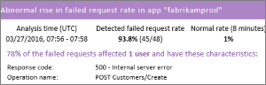

<properties 
    pageTitle="获取更多的见解应用程序 |Microsoft Azure" 
    description="之后开始使用应用程序的见解，这是您可以浏览功能的摘要。" 
    services="application-insights" 
    documentationCenter=".net"
    authors="alancameronwills" 
    manager="douge"/>

<tags 
    ms.service="application-insights" 
    ms.workload="tbd" 
    ms.tgt_pltfrm="ibiza" 
    ms.devlang="na" 
    ms.topic="article" 
    ms.date="10/27/2016" 
    ms.author="awills"/>

# <a name="more-telemetry-from-application-insights"></a>从应用程序的见解多个遥测

[添加到 ASP.NET 代码的应用程序理解](app-insights-asp-net.md)后，有几件事，怎样才能获得更多的遥测。 

## <a name="if-your-app-runs-on-your-iis-server-"></a>如果在您的 IIS 服务器上运行您的应用程序...

如果在控件中的 IIS 服务器上承载您的应用程序，则在服务器上安装应用程序理解状态监视器。 如果已经安装了它，您不需要执行任何操作。

1. 在每个 IIS web 服务器上，使用管理员凭据进行登录。
2. 下载并运行[状态监视器安装程序](http://go.microsoft.com/fwlink/?LinkId=506648)。
3. 在安装向导中，登录到 Microsoft Azure。

您不必执行任何其他操作，但可以确认，为您的应用程序启用监视。


（还可以使用状态监视器到[启用监视在运行时](app-insights-monitor-performance-live-website-now.md)，即使没有检测您在 Visual Studio 中的应用程序。）

### <a name="what-do-you-get"></a>您得到什么？

如果在服务器计算机上已安装状态监视器，您将获得一些额外的遥测︰

* 依赖项遥测 （SQL 调用和由您的应用程序的其余部分调用） 用于.NET 4.5 的应用程序。 （更高版本的.NET，状态监视器不需要依赖项遥测。） 
* 异常堆栈跟踪显示更多细节。
* 性能计数器。 在应用程序的见解，这些计数器将出现在服务器刀片式服务器。 


若要查看更多或更少的计数器，[编辑图表](app-insights-metrics-explorer.md)。 如果您希望性能计数器不在可用的集合，您可以[将其添加到由性能计数器模块收集一组](app-insights-performance-counters.md)。

## <a name="if-its-an-azure-web-app-"></a>如果它是 Azure 的 web 应用程序...

如果您的应用程序作为一个 Azure 的 web 应用程序运行，转到 Azure 控制面板应用程序或虚拟机，并打开刀片式服务器应用程序的见解。 

### <a name="what-do-you-get"></a>您得到什么？

* 异常堆栈跟踪显示更多细节。
* 依赖项遥测 （SQL 调用和由您的应用程序的其余部分调用） 用于.NET 4.5 的应用程序。 （更高版本的.NET，该扩展不需要依赖项遥测。） 


（还可以使用此方法来[启用性能监视在运行时](app-insights-monitor-performance-live-website-now.md)，即使没有检测您在 Visual Studio 中的应用程序。）

## <a name="client-side-monitoring"></a>客户端监视

您已安装 SDK 将遥测数据发送从您的应用程序的服务器 （后端）。 现在，您可以将客户端的监控。 它提供了您的用户、 会话、 页面视图和任何异常或崩溃发生在浏览器中的数据。 您还可以编写您自己的代码来跟踪您的用户如何使用您的应用程序，直至单击和键击的详细级别。

将应用程序理解 JavaScript 代码段添加到每个 web 页，以便从客户端浏览器获取遥测。

1. 在 Azure，打开您的应用程序的应用程序理解资源。
2. 打开入门教程，监视客户端，并复制该代码段。
3. 以使其显示在每个网页的头部通常你可以通过粘贴到母版版式页，则将其粘贴。


请注意，代码包含标识您的应用程序资源的检测项。

### <a name="what-do-you-get"></a>您得到什么？

* 您可以编写 JavaScript 来发送[自定义的 web 页的遥测](app-insights-api-custom-events-metrics.md)，跟踪单击按钮的示例。
* 在[分析](app-insights-analytics.md)数据中`pageViews`和 AJAX 数据在`dependencies`。 
* [客户端的性能和使用情况数据](app-insights-javascript.md)的浏览器刀片。


[了解有关跟踪 web 页的详细信息。](app-insights-web-track-usage.md)


## <a name="track-application-version"></a>跟踪应用程序版本

请确保`buildinfo.config`由 MSBuild 过程。 在.csproj 文件中，添加︰  

```XML

    <PropertyGroup>
      <GenerateBuildInfoConfigFile>true</GenerateBuildInfoConfigFile>    <IncludeServerNameInBuildInfo>true</IncludeServerNameInBuildInfo>
    </PropertyGroup> 
```

当它具有生成信息时，应用程序理解 web 模块自动向**应用程序版本**作为属性遥测的每一项。 允许您执行[诊断搜索](app-insights-diagnostic-search.md)或按版本筛选[研究指标](app-insights-metrics-explorer.md)。 

但是，请注意的内部版本号生成仅由 MS 生成，不是由开发人员在 Visual Studio 中生成。


## <a name="availability-web-tests"></a>可用性 web 测试

定期从世界各地发送您的 web 应用程序的 HTTP 请求。 如果响应速度较慢或不可靠，我们提醒您。

在您的应用程序的应用程序理解资源，请单击该可用性图块，可以添加、 编辑和查看 web 测试。

您可以添加多个测试运行在多个位置。


[了解更多信息](app-insights-monitor-web-app-availability.md)

## <a name="custom-telemetry-and-logging"></a>自定义遥测和日志记录

您添加到您的代码的应用程序的见解包提供了一个 API，您可以从应用程序调用。

* [生成您自己的事件和度量标准](app-insights-api-custom-events-metrics.md)，例如到业务事件计数或监视性能。
* 从 Log4Net、 NLog 或 System.Diagnostics.Trace[捕获日志跟踪](app-insights-asp-net-trace-logs.md)。
* [筛选器修改，或增加](app-insights-api-filtering-sampling.md)通过编写遥测处理器从您的应用程序发送的标准遥测数据。 


## <a name="powerful-analysis-and-presentation"></a>功能强大的分析和演示文稿

有许多方式可以浏览您的数据。 如果您最近刚刚开始使用应用程序的见解，请查看这些文章︰

||
|---|---
|[**诊断搜索为实例数据**](app-insights-visual-studio.md)<br/>如请求、 异常、 依赖项调用、 日志跟踪信息和网页视图的搜索和筛选事件。 在 Visual Studio 中，转到代码的堆栈跟踪。|
|[**聚合数据的度量标准浏览器**](app-insights-metrics-explorer.md)<br/>研究、 筛选和分段聚合的数据如率的请求、 故障和异常;响应时间、 页面加载时间。|
|[**仪表板**](app-insights-dashboards.md#dashboards)<br/>混搭数据从多个资源并与其他人共享。 很多组件的应用程序，和在团队房间连续显示。  |
|[**实时流指标**](app-insights-metrics-explorer.md#live-metrics-stream)<br/>当您部署新生成时，观看这些接近实时的性能指标，以确保一切都按预期方式工作。|
|[**分析**](app-insights-analytics.md)<br/>通过使用此功能强大的查询语言中回答有关您的应用程序的性能和使用情况的棘手问题。|
|[**自动和手动警报**](app-insights-alerts.md)<br/>自动警报适应应用程序的正常模式遥测和触发器时常用模式之外的东西。 此外可以在特定级别的自定义或标准指标设置警报。|

## <a name="data-management"></a>数据管理

|||
|---|---|
|[**连续的导出**](app-insights-export-telemetry.md)<br/>所有遥测都复制到存储，从而可以分析您自己的方式。|
|**数据访问 API**<br/>即将推出。|
|[**取样**](app-insights-sampling.md)<br/>减少的数据速率，可帮助您保持您的定价层的限度内。|