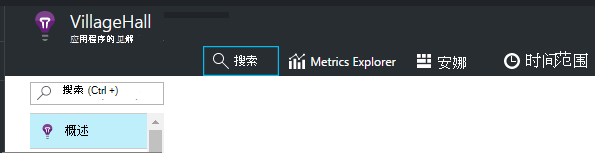
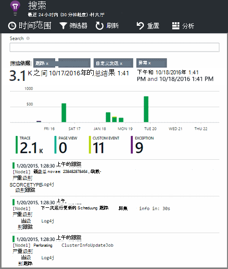

<properties 
    pageTitle="浏览应用程序的见解中.NET 跟踪日志" 
    description="搜索与跟踪、 NLog 或 Log4Net 生成的日志。" 
    services="application-insights" 
    documentationCenter=".net"
    authors="alancameronwills" 
    manager="douge"/>

<tags 
    ms.service="application-insights" 
    ms.workload="tbd" 
    ms.tgt_pltfrm="ibiza" 
    ms.devlang="na" 
    ms.topic="article" 
    ms.date="07/21/2016" 
    ms.author="awills"/>
 
# <a name="explore-net-trace-logs-in-application-insights"></a>浏览应用程序的见解中.NET 跟踪日志  

如果使用 NLog，log4Net 或 System.Diagnostics.Trace 诊断跟踪在 ASP.NET 应用程序，则可以让您的日志发送到[Visual Studio 应用程序理解][start]，您可以浏览和搜索它们。 您的日志将会与来自您的应用程序，以便您能够识别跟踪记录相关联的服务处理的每个用户请求，并将它们与其他事件和异常报表相关联的其他遥测数据合并。


> [AZURE.NOTE] 您需要日志捕获模块吗？ 它是有用的第三方记录器适配器，但如果您还未使用 NLog、 log4Net 或 System.Diagnostics.Trace，请考虑只需直接调用[应用程序的见解 TrackTrace()](app-insights-api-custom-events-metrics.md#track-trace) 。


## <a name="install-logging-on-your-app"></a>安装在您的应用程序登录

安装在您的项目中选择日志记录框架。 这应导致 app.config 或 web.config 中的条目。

如果您正在使用 System.Diagnostics.Trace，您需要将一个条目添加到 web.config:

```XML

    <configuration>
     <system.diagnostics>
       <trace autoflush="false" indentsize="4">
         <listeners>
           <add name="myListener" 
             type="System.Diagnostics.TextWriterTraceListener" 
             initializeData="TextWriterOutput.log" />
           <remove name="Default" />
         </listeners>
       </trace>
     </system.diagnostics>
   </configuration>
```

## <a name="configure-application-insights-to-collect-logs"></a>配置应用程序以收集日志的见解

**[向项目中添加应用程序见解](app-insights-asp-net.md)**如果还没有这样的。 您将看到选择包括日志收集器。

或右击解决方案资源管理器中的项目**配置应用程序的见解**。 选择**配置跟踪收集**选项。

*没有应用程序理解菜单或日志收集器选项？* 请尝试[进行故障排除](#troubleshooting)。


## <a name="manual-installation"></a>手动安装

如果您的项目类型不支持应用程序的见解安装程序 （例如 Windows 桌面项目），请使用此方法。 

1. 如果您计划使用 log4Net 或 NLog，则将其安装在您的项目。 
2. 在解决方案资源管理器中右击项目，选择**管理 NuGet 程序包**。
3. 搜索"应用程序信息"

    

4. 选择适当的包内的一种︰
  + Microsoft.ApplicationInsights.TraceListener （以捕获 System.Diagnostics.Trace 调用）
  + Microsoft.ApplicationInsights.NLogTarget
  + Microsoft.ApplicationInsights.Log4NetAppender

NuGet 程序包安装必需的程序集，并还修改 web.config 或 app.config。

## <a name="insert-diagnostic-log-calls"></a>插入诊断日志调用

如果您使用 System.Diagnostics.Trace，将是一个典型的调用︰

    System.Diagnostics.Trace.TraceWarning("Slow response - database01");

如果您希望使用 log4net 或 NLog:

    logger.Warn("Slow response - database01");


## <a name="using-the-trace-api-directly"></a>直接使用 API 的跟踪

您可以直接调用应用程序深入跟踪 API。 日志记录适配器使用此 API。 

例如︰

    var telemetry = new Microsoft.ApplicationInsights.TelemetryClient();
    telemetry.TrackTrace("Slow response - database01");

TrackTrace 的优点是您可以将相对较长的数据放在消息中。 例如，无法编码那里发送数据。 

此外，可以将严重性级别添加到您的邮件。 而且，像其他遥测，可以添加可用于帮助筛选器或搜索组不同的跟踪的属性值。 例如︰


    var telemetry = new Microsoft.ApplicationInsights.TelemetryClient();
    telemetry.TrackTrace("Slow database response",
                   SeverityLevel.Warning,
                   new Dictionary<string,string> { {"database", db.ID} });

这将使您在[搜索][diagnostic]，可以轻松地过滤掉特定严重性级别与特定数据库相关的所有消息。

## <a name="explore-your-logs"></a>浏览您的日志

运行您的应用程序，请在调试模式下或部署活动。

在您的应用程序概述刀片式服务器中[的应用程序理解门户][portal]，选择[搜索][diagnostic]。





您可以，例如︰

* 筛选日志跟踪信息，或具有特定属性的物料
* 检查详细信息中的特定项。
* 查找其他遥测与相同的用户请求 (即具有相同 OperationId) 
* 将此页的配置保存为收藏

> [AZURE.NOTE] **采样。** 如果您正在使用的 ASP.NET 版本 2.0.0-beta3 或更高版本应用程序的见解 SDK 应用程序发送大量的数据，自适应采样功能可能运行和发送只有您遥测的百分比。 [了解有关采样。](app-insights-sampling.md)

## <a name="next-steps"></a>下一步行动

[诊断故障和 ASP.NET 中的异常][exceptions]

[了解有关搜索][diagnostic]。


## <a name="troubleshooting"></a>故障排除

### <a name="how-do-i-do-this-for-java"></a>对于 Java，如何做这？

使用[Java 日志适配器](app-insights-java-trace-logs.md)。

### <a name="theres-no-application-insights-option-on-the-project-context-menu"></a>没有应用程序理解项目上下文菜单上的选项

* 请检查此开发计算机上安装了应用程序理解工具。 在 Visual Studio 菜单工具、 扩展和更新，查找应用程序理解工具。 如果它不在已安装选项卡，打开联机选项卡并进行安装。
* 这可能是项目的一种类型不支持应用程序理解工具。 使用[手动安装](#manual-installation)。

### <a name="no-log-adapter-option-in-the-configuration-tool"></a>在配置工具中没有日志适配器选项

* 您需要先安装日志记录框架。
* 如果您使用的 System.Diagnostics.Trace，请确保您[配置中它的`web.config`](https://msdn.microsoft.com/library/system.diagnostics.eventlogtracelistener.aspx)。
* 有您有最新版本的应用程序理解工具吗？ 在 Visual Studio**工具**菜单中，选择**扩展和更新**并打开**更新**选项卡。 如果有什么应用程序理解工具，请单击更新它。


### <a name="emptykey"></a>获取错误"检测键不能为空"

看起来您安装日志记录适配器 Nuget 程序包不安装应用程序的见解。

在解决方案资源管理器中，右击`ApplicationInsights.config`，然后选择**更新应用程序的见解**。 您将获得一个对话，邀请您登录到 Azure 并且必须要么创建应用程序建议的资源，或重新使用现有。 它能解决它。

### <a name="i-can-see-traces-in-diagnostic-search-but-not-the-other-events"></a>我可以看到在诊断搜索，但没有其他事件的跟踪

有时可能需要一段时间的所有事件和请求以获取管道通过。

### <a name="limits"></a>保留的数据量？

每秒钟从每个应用程序的事件达 500 个。 事件保留七天。

### <a name="im-not-seeing-some-of-the-log-entries-that-i-expect"></a>我看不到一些我所期望的日志条目

如果您正在使用的 ASP.NET 版本 2.0.0-beta3 或更高版本应用程序的见解 SDK 应用程序发送大量的数据，自适应采样功能可能运行和发送只有您遥测的百分比。 [了解有关采样。](app-insights-sampling.md)

## <a name="add"></a>下一步行动

* [设置的可用性和响应能力测试][availability]
* [故障排除][qna]


<!--Link references-->

[availability]: app-insights-monitor-web-app-availability.md
[diagnostic]: app-insights-diagnostic-search.md
[exceptions]: app-insights-asp-net-exceptions.md
[portal]: https://portal.azure.com/
[qna]: app-insights-troubleshoot-faq.md
[start]: app-insights-overview.md

 
