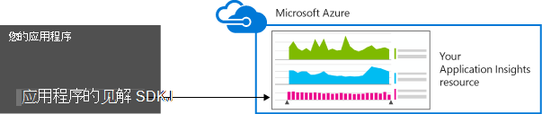
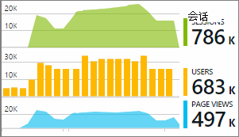

<properties 
    pageTitle="为 ASP.NET 应用程序的见解与设置 web 应用程序分析 |Microsoft Azure" 
    description="配置性能、 可用性和使用情况分析 ASP.NET 网站，承载内部或在 Azure 中。" 
    services="application-insights" 
    documentationCenter=".net"
    authors="NumberByColors" 
    manager="douge"/>

<tags 
    ms.service="application-insights" 
    ms.workload="tbd" 
    ms.tgt_pltfrm="ibiza" 
    ms.devlang="na" 
    ms.topic="get-started-article" 
    ms.date="10/13/2016" 
    ms.author="awills"/>


# <a name="set-up-application-insights-for-aspnet"></a>设置为 ASP.NET 应用程序的见解

[Visual Studio 应用程序理解](app-insights-overview.md)监控实时应用程序可帮助您[检测和诊断性能问题和异常](app-insights-detect-triage-diagnose.md)，并[了解如何使用您的应用程序](app-insights-overview-usage.md)。  它适用于承载的应用程序或云虚拟机，以及 Azure 的 web 应用程序内部的 IIS 服务器上的不同而不同。


## <a name="before-you-start"></a>在开始之前

你需要：

* Visual Studio 2013年更新 3 或更高版本。 以后会更好。
* 对[Microsoft Azure](http://azure.com)的订阅。 如果您的团队或组织有订阅了 Azure，所有者可以将您添加到它，使用您的[Microsoft 客户](http://live.com)。 

有了替代的文章来看，如果您有兴趣︰

* [在运行时检测 web 应用程序](app-insights-monitor-performance-live-website-now.md)
* [Azure 的云服务](app-insights-cloudservices.md)

## <a name="ide"></a>1.添加应用程序深入 SDK


### <a name="if-its-a-new-project"></a>如果它是一个新的项目...

确保应用程序的见解选择当您在 Visual Studio 中创建一个新项目。 


### <a name="-or-if-its-an-existing-project"></a>...，或者如果它是现有项目

右击解决方案资源管理器中的项目，然后选择**添加应用程序的见解遥测**或**配置应用程序的见解**。


* ASP.NET 核项目？ -[按照这些说明来修复几行代码](https://github.com/Microsoft/ApplicationInsights-aspnetcore/wiki/Getting-Started#add-application-insights-instrumentation-code-to-startupcs)。 


## <a name="run"></a>2.运行您的应用程序

F5 以运行应用程序并尝试一下︰ 打开不同的页面来生成某些遥测。

在 Visual Studio 中，您将看到已记录的事件数。 


## <a name="3-see-your-telemetry"></a>3.请参阅您的遥测。.

### <a name="-in-visual-studio"></a>在 Visual Studio 中...

在 Visual Studio 中打开应用程序信息窗口︰ 单击应用程序信息按钮，或右键单击解决方案资源管理器中的项目︰


此视图将显示在您的应用程序的服务器端生成的遥测。 试验了筛选器，然后单击任何事件的详细信息，请参阅。

[了解更多有关在 Visual Studio 中的应用程序理解工具](app-insights-visual-studio.md)。

<a name="monitor"></a> 
### <a name="-in-the-portal"></a>在门户中...

除非您选择*安装 SDK，*您还可以查看应用程序理解 web 门户的遥测数据。 

门户网站有多个图表、 分析工具和比 Visual Studio 的仪表板。 


在[Azure 门户](https://portal.azure.com/)打开您理解应用程序的资源。


门户上的遥测数据从您的应用程序的视图会打开︰

* 第一个遥测显示在[实时度量标准流](app-insights-metrics-explorer.md#live-metrics-stream)中。
* **搜索**(1) 中显示单个事件。 数据可能需要几分钟才能显示。 单击以查看其属性的任何事件。 
* 聚合度量值显示在图表 (2)。 它可能需要一分钟或两个用于数据以显示在此处。 单击任何图表打开刀片式服务器的更多详细信息。

[了解更多有关使用 Azure 门户中的应用程序理解](app-insights-dashboards.md)。

## <a name="4-publish-your-app"></a>4.将发布您的应用程序

将您的应用程序发布到您的 IIS 服务器或 Azure。 观看[实时度量标准流](app-insights-metrics-explorer.md#live-metrics-stream)以确保一切顺利。

您将看到您遥测构建应用程序的见解门户网站，在其中可以监控指标、 搜索您遥测和设置[仪表板](app-insights-dashboards.md)中。 此外可以使用功能强大的[分析查询语言](app-insights-analytics.md)使用情况和性能分析或查找特定的事件。 

此外可以继续分析与诊断搜索和[趋势](app-insights-visual-studio-trends.md)的工具在[Visual Studio](app-insights-visual-studio.md)中您遥测。

> [AZURE.NOTE] 如果您的应用程序发送足够的遥测从而达到[节流限制](app-insights-pricing.md#limits-summary)，自动[采样](app-insights-sampling.md)开关。 采样可以减少遥测发送从您的应用程序，同时保留用于诊断目的相关的数据的数量。


##<a name="land"></a>添加应用程序理解是怎么做？

应用程序的见解将遥测从您的应用程序发送到应用程序的见解门户网站 （它位于 Microsoft Azure）︰



因此，命令做了三件事︰

1. 向项目中添加应用程序理解 Web SDK NuGet 程序包。 若要在 Visual Studio 中看到它，用鼠标右键单击项目，然后选择管理 NuGet 程序包。
2. 在[Azure 门户](https://portal.azure.com/)中创建应用程序理解资源。 这是您看到您的数据。 它检索*检测键*标识的资源。
3. 在插入检测`ApplicationInsights.config`，以便 SDK 可发送到门户的遥测。

如果您希望，可以为[ASP.NET 4](app-insights-windows-services.md)或[ASP.NET 核心](https://github.com/Microsoft/ApplicationInsights-aspnetcore/wiki/Getting-Started)手动执行这些步骤。

### <a name="to-upgrade-to-future-sdk-versions"></a>若要升级到未来的 SDK 版本

若要升级到[新版本的 SDK](https://github.com/Microsoft/ApplicationInsights-dotnet-server/releases)，NuGet 程序包管理器重新打开，然后筛选已安装的软件包。 选择 Microsoft.ApplicationInsights.Web，然后选择升级。

如果您对 ApplicationInsights.config 所做的任何自定义，请升级，并随后将所做的更改合并到新版本之前保存一份。

## <a name="add-more-telemetry"></a>添加更多的遥测

### <a name="web-pages-and-single-page-apps"></a>Web 页和单页面应用程序

1. [JavaScript 代码段添加](app-insights-javascript.md)到您的 web 页以亮关于网页视图，加载时间、 浏览器异常，AJAX 调用的性能数据与浏览器和使用刀片式服务器用户和会话的计数。
2. [代码的自定义事件](app-insights-api-custom-events-metrics.md)的次数、 时间或测量用户操作。

### <a name="dependencies-exceptions-and-performance-counters"></a>依赖项、 异常和性能计数器

[安装状态监视器](app-insights-monitor-performance-live-website-now.md)上的服务器计算机，每个来获取有关您的应用程序的其他遥测。 这是您的获得︰

* [性能计数器](app-insights-performance-counters.md) - 
CPU、 内存、 磁盘和其他与您的应用程序的性能计数器。 
* [异常](app-insights-asp-net-exceptions.md)的一些例外情况的更多详细遥测数据。
* [依赖项](app-insights-asp-net-dependencies.md)的 REST API 或 SQL 服务的调用。 找出由外部组件的缓慢响应是否在您的应用程序导致的性能问题。 （如果在.NET 4.6 上运行您的应用程序，则无需状态监视器来获取此遥测）。

### <a name="diagnostic-code"></a>诊断代码

您有问题吗？ 如果您想要在您的应用程序，以帮助诊断其插入代码，您有几个选项︰

* [捕获日志跟踪](app-insights-asp-net-trace-logs.md)︰ 如果您已经在使用 Log4N、 NLog 或 System.Diagnostics.Trace 记录跟踪事件，则输出可以发送到应用程序的见解，以便将其与请求相关联，它搜索，并对其进行分析。 
* [自定义事件和指标](app-insights-api-custom-events-metrics.md)︰ 使用 TrackEvent() 和 TrackMetric() 在服务器或 web 页的代码。
* [与其他属性的标记遥测](app-insights-api-filtering-sampling.md#add-properties)

使用[搜索](app-insights-diagnostic-search.md)来查找和关联的特定事件和[分析](app-insights-analytics.md)执行更强大的查询功能。

## <a name="alerts"></a>警报

是第一个要知道您的应用程序是否有问题。 （不要等到用户告诉您 ！） 

* [创建 web 测试](app-insights-monitor-web-app-availability.md)，以确保您的站点在 web 上可见。
* [主动预防性诊断程序](app-insights-proactive-diagnostics.md)运行自动 （如果您的应用程序都有某些最少量的通信）。 您不必执行任何操作即可将其设置。 他们告诉您是否您的应用程序失败的请求不寻常速率。
* [设置警报，公制](app-insights-alerts.md)，警告您如果跃点数超过阈值。 您可以设置这些自定义指标您代码到您的应用程序。

默认情况下，通知是发给 Azure 的订阅的所有者。 


## <a name="version-and-release-tracking"></a>版本和发行版本跟踪

### <a name="track-application-version"></a>跟踪应用程序版本

请确保`buildinfo.config`由 MSBuild 过程。 在.csproj 文件中，添加︰  

```XML

    <PropertyGroup>
      <GenerateBuildInfoConfigFile>true</GenerateBuildInfoConfigFile>    <IncludeServerNameInBuildInfo>true</IncludeServerNameInBuildInfo>
    </PropertyGroup> 
```

当它具有生成信息时，应用程序理解 web 模块自动向**应用程序版本**作为属性遥测的每一项。 允许您执行[诊断搜索](app-insights-diagnostic-search.md)或按版本筛选[研究指标](app-insights-metrics-explorer.md)。 

但是，请注意的内部版本号生成仅由 MS 生成，不是由开发人员在 Visual Studio 中生成。

### <a name="release-annotations"></a>版本注释

如果您使用 Visual Studio 的团队服务，您可以[获取批注标记](app-insights-annotations.md)添加到您的图表中，只要发布新版本。


## <a name="next-steps"></a>下一步行动

| | 
|---|---
|**[使用应用程序在 Visual Studio 中的见解](app-insights-visual-studio.md)**<br/>调试与遥测，诊断搜索、 代码为钻取。|
|**[使用应用程序的见解门户](app-insights-dashboards.md)**<br/>仪表板，功能强大的诊断和分析工具，通知，您的应用程序和遥测实时的依赖关系图导出。 |
|**[添加更多数据](app-insights-asp-net-more.md)**<br/>监视使用情况、 可用性、 依赖项、 异常。 将跟踪日志记录框架的集成。 编写自定义的遥测。 | 


