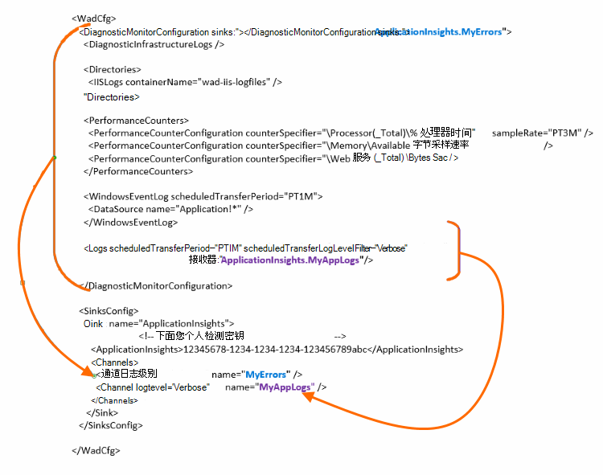

<properties
    pageTitle="将 Azure 诊断日志发送到应用程序的见解"
    description="配置发送到应用程序的见解门户 Azure 云服务诊断日志的详细信息。"
    services="application-insights"
    documentationCenter=".net"
    authors="sbtron"
    manager="douge"/>

<tags
    ms.service="application-insights"
    ms.workload="tbd"
    ms.tgt_pltfrm="ibiza"
    ms.devlang="na"
    ms.topic="article"
    ms.date="11/17/2015"
    ms.author="awills"/>

# <a name="configure-azure-diagnostic-logging-to-application-insights"></a>配置应用程序的见解到 Azure 诊断日志记录

当您设置一个云服务项目或 Microsoft Azure， [Azure 可以生成诊断日志](../vs-azure-tools-diagnostics-for-cloud-services-and-virtual-machines.md)中的虚拟机。 您可以让此发送到应用程序的见解，以便可以从发送应用程序中，由应用程序深入 SDK 的诊断和使用遥测以及对其进行分析。 Azure 的日志包括事件，如启动、 停止、 崩溃，以及性能计数器的应用程序的管理。 日志文件还包含 System.Diagnostics.Trace 到应用程序中调用。

本文介绍了诊断捕获详细的配置。

您需要安装 Visual Studio 在 Azure SDK 2.8。

## <a name="get-an-application-insights-resource"></a>获取应用程序信息资源

最佳体验、[添加应用程序深入 SDK 向云服务的应用程序的每个角色](app-insights-cloudservices.md)，或[到任何应用程序，您将运行在您的 VM 中](app-insights-overview.md)。 然后，可以发送诊断数据进行分析并显示相同的应用程序理解资源。

或者，如果您不想使用 SDK-例如，如果应用程序已处于活动-可以不仅仅是[创建新的应用程序理解资源](app-insights-create-new-resource.md)在 Azure 的门户。 作为应用程序类型选择**Azure 诊断**。


## <a name="send-azure-diagnostics-to-application-insights"></a>Azure 诊断发送到应用程序的见解

如果您无法更新您的应用程序的项目，然后在 Visual Studio 中选择每个角色、 选择其属性，并在配置选项卡上，选中 $**发送诊断程序对应用程序的见解**。

如果您的应用程序已经是实时的使用 Visual Studio 的服务器资源管理器或云服务资源管理器打开该应用程序的属性。 选择**发送诊断程序对应用程序的见解**。

在每种情况下您将被要求提供您创建的应用程序理解资源的详细信息。

[了解更多有关设置云服务应用程序的应用程序理解](app-insights-cloudservices.md)。

## <a name="configuring-the-azure-diagnostics-adapter"></a>配置 Azure 诊断适配器

只读文件上是否想要选择的日志，发送给应用程序的见解的组成部分。 默认情况下，一切都被发送，包括︰ Microsoft Azure 的事件;性能计数器;从应用程序到 System.Diagnostics.Trace 跟踪调用。

Azure 诊断存储到 Azure 存储表数据。 但是，也可以所有管道或见解应用于数据的一个子集时使用 Azure 诊断扩展 1.5 或更高版本在您的配置中配置"接收器"和"通道"。

### <a name="configure-application-insights-as-a-sink"></a>作为一个接收器配置应用程序的见解

当角色属性用于设置"将数据发送到应用程序的见解"时，Azure SDK （2.8 或更高版本） 中添加`<SinksConfig>`对角色的公用[Azure 诊断程序配置文件](https://msdn.microsoft.com/library/azure/dn782207.aspx)的元素。

`<SinksConfig>`定义其他接收器可以发送 Azure 诊断数据的位置。  例如`SinksConfig`如下所示︰

```xml

    <SinksConfig>
     <Sink name="ApplicationInsights">
      <ApplicationInsights>{Insert InstrumentationKey}</ApplicationInsights>
      <Channels>
        <Channel logLevel="Error" name="MyTopDiagData"  />
        <Channel logLevel="Verbose" name="MyLogData"  />
      </Channels>
     </Sink>
    </SinksConfig>

```

`ApplicationInsights`元素指定检测密钥，它识别 Azure 诊断数据将发送到该应用程序的见解资源。 您选择的资源，它会自动填充基于`APPINSIGHTS_INSTRUMENTATIONKEY`服务配置。 （如果您希望手动设置它，从获取密钥资源精要下拉列表。）

`Channels`定义将发送到接收器的数据。 该通道就像一个筛选器。 `loglevel`属性允许您指定通道将发送的日志级别。 可用的值为︰ `{Verbose, Information, Warning, Error, Critical}`。

### <a name="send-data-to-the-sink"></a>将数据发送到接收器

发送到应用程序理解的数据接收器通过添加 DiagnosticMonitorConfiguration 节点下的接收器属性。 将接收器元素添加到每个节点指定您希望从该节点和它发送给指定的接收器下的任何节点收集到的数据。

例如，通过 Azure SDK 创建的默认值是发送所有 Azure 的诊断数据︰

```xml

    <DiagnosticMonitorConfiguration overallQuotaInMB="4096" sinks="ApplicationInsights">
```

但是，如果您想要发送仅错误日志，接收器使用限定名称通道名称︰

```xml

    <DiagnosticMonitorConfiguration overallQuotaInMB="4096" sinks="ApplicationInsights.MyTopDiagdata">
```

请注意，我们正在使用的接收器，我们定义，与我们上面定义的通道名称的名称。

如果您只想将详细的应用程序日志发送到应用程序的见解，然后您将接收器将特性添加到`Logs`节点。

```xml

    <Logs scheduledTransferPeriod="PT1M" scheduledTransferLogLevelFilter="Verbose" sinks="ApplicationInsights.MyLogData"/>
```

您还可以在层次结构中的不同级别配置包含多个接收器。 在这种情况下指定层次结构的顶层的接收器作为全局设置，另一个在类似于全局设置重写单个元素元素充当指定。

下面是一个完整的示例将所有错误都发送到应用程序的见解的公用配置文件 (在指定`DiagnosticMonitorConfiguration`节点)，此外详细级别的应用程序日志记录 (在指定`Logs`节点)。

```xml

    <WadCfg>
     <DiagnosticMonitorConfiguration overallQuotaInMB="4096"
       sinks="ApplicationInsights.MyTopDiagData"> <!-- All info below sent to this channel -->
      <DiagnosticInfrastructureLogs />
      <PerformanceCounters>
        <PerformanceCounterConfiguration counterSpecifier="\Processor(_Total)\% Processor Time" sampleRate="PT3M" sinks="ApplicationInsights.MyLogData/>
        <PerformanceCounterConfiguration counterSpecifier="\Memory\Available MBytes" sampleRate="PT3M" />
        <PerformanceCounterConfiguration counterSpecifier="\Web Service(_Total)\Bytes Total/Sec" sampleRate="PT3M" />
      </PerformanceCounters>
      <WindowsEventLog scheduledTransferPeriod="PT1M">
        <DataSource name="Application!*" />
      </WindowsEventLog>
      <Logs scheduledTransferPeriod="PT1M" scheduledTransferLogLevelFilter="Verbose"
            sinks="ApplicationInsights.MyLogData"/>
       <!-- This specific info sent to this channel -->
     </DiagnosticMonitorConfiguration>

     <SinksConfig>
      <Sink name="ApplicationInsights">
        <ApplicationInsights>{Insert InstrumentationKey}</ApplicationInsights>
        <Channels>
          <Channel logLevel="Error" name="MyTopDiagData"  />
          <Channel logLevel="Verbose" name="MyLogData"  />
        </Channels>
      </Sink>
     </SinksConfig>
    </WadCfg>
```



有一些限制，要注意使用这一功能︰

* 通道只能处理日志类型和没有性能计数器。 如果您使用性能计数器元素指定一个通道，它将被忽略。
* 通道的日志级别不能超过 Azure 诊断所收集内容的日志级别。 例如︰ 不能收集应用程序日志中的日志元素的错误并尝试发送详细的日志传输到应用程序分析同步。 ScheduledTransferLogLevelFilter 属性始终必须收集相等或更多的日志，这些日志比想要发送到接收器。
* 对应用程序的见解无法发送任何 blob 数据收集由 Azure 诊断程序扩展。 例如任何指定目录节点下。 为故障转储实际故障转储仍将发送到 blob 存储，只生成的故障转储的通知将发送到应用程序的见解。

## <a name="related-topics"></a>相关的主题

* [监视应用程序的见解与 Azure 的云服务](app-insights-cloudservices.md)
* [使用 PowerShell 将 Azure 诊断发送到应用程序的见解](app-insights-powershell-azure-diagnostics.md)
* [Azure 诊断配置文件](https://msdn.microsoft.com/library/azure/dn782207.aspx)
