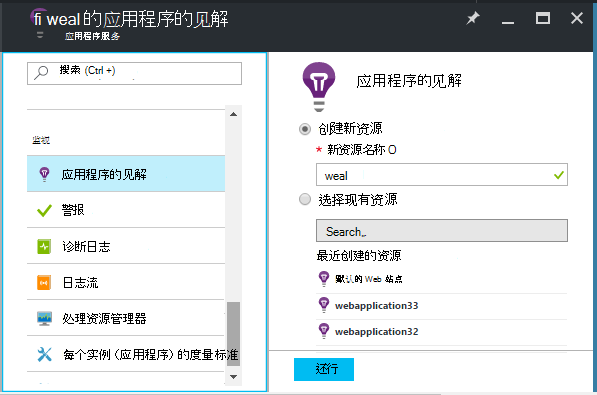
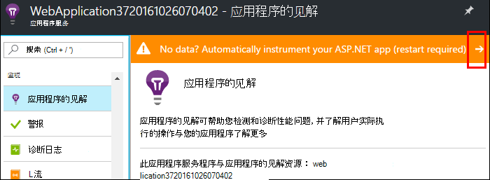
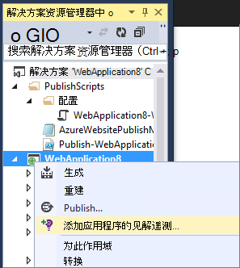
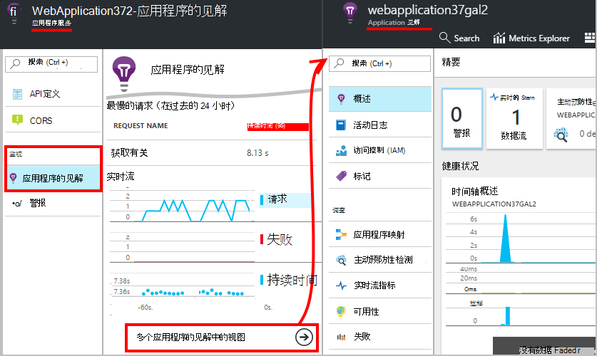
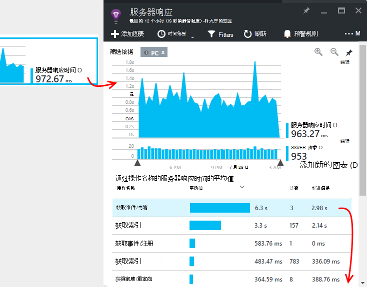
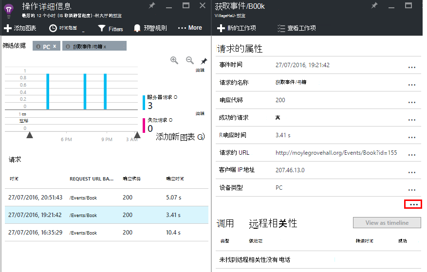

<properties
    pageTitle="Azure 的 web 应用程序性能监视 |Microsoft Azure"
    description="应用程序的性能监视 Azure 的 web 应用程序。 图表负载和响应时间、 相关性信息和性能设置警报。"
    services="application-insights"
    documentationCenter=".net"
    authors="alancameronwills"
    manager="douge"/>

<tags
    ms.service="azure-portal"
    ms.workload="na"
    ms.tgt_pltfrm="na"
    ms.devlang="na"
    ms.topic="article"
    ms.date="10/24/2016"
    ms.author="awills"/>

# Azure 的 web 应用程序性能监控

在[Azure 门户网站](https://portal.azure.com)中您可以设置对于您的[Azure 的 web 应用程序](../app-service-web/app-service-web-overview.md)的应用程序性能监控。 [Visual Studio 应用程序见解](app-insights-overview.md)会发送有关其活动的遥测到的见解应用程序服务，在进行存储和分析您的应用程序。 那里，指标的图表和搜索工具可用来帮助诊断问题，改进性能，并评估使用。

## 运行时或生成时间

您可以配置监视通过检测应用程序在两种方法之一︰

* **运行时**-您可以选择在您的 web 应用程序已实时监控扩展的性能。 它不需要重新生成或重新安装您的应用程序。 获取一组标准的监视响应时间、 成功率、 异常、 相关性等的包。 
 
* **构建时间**-您可以在您的应用程序开发过程中安装包。 此选项将更为丰富。 除了相同的标准软件包，您可以编写代码以自定义遥测或发送您自己的遥测。 您可以记录特定的活动或根据您的应用程序域的语义的记录事件。 

## 以应用程序理解运行时检测

如果您已经在 Azure 中运行 web 应用程序，您已经得到一些监视︰ 请求和错误率。 添加应用程序理解，以便获得更多，例如响应时间、 监控对依赖项的调用，智能检测和说服力的分析报告查询语言。 

1. 您的 web 应用程序的 Azure 控制面板中**选择应用程序的见解**。

    

 * 选择创建新的资源，除非您已经安装了此应用程序的应用程序理解资源通过另一个路由。

2. **检测您的 web 应用程序**后安装了应用程序的见解。 

    

3. **监视您的应用程序**。  [Expore 数据](#explore-the-data)。

以后，才可以生成和重新部署应用程序与应用程序的见解，如果需要。

*如何删除应用程序的见解，或切换到发送给另一个资源？*

* 在 Azure，打开 web 应用程序控制刀片，并在开发工具下打开**扩展**。 删除应用程序的见解扩展名。 然后下监视，选择应用程序的见解，并创建或选择所需的资源。

## 生成该应用程序与应用程序的见解

应用程序的见解可以通过为您的应用程序安装 SDK 提供更详细的遥测。 特别要说明的是，可以[编写自定义的遥测](../application-insights/app-insights-api-custom-events-metrics.md)，跟踪日志收集和获取详细的异常报告。

1. **在 Visual Studio 中**（2013年更新 2 或更高版本），向项目中添加应用程序深入 SDK。

    

    如果要求您登录，使用 Azure 帐户的凭据。

    此操作会产生两个效果︰

 1. 在 Azure，在其中存储、 分析和显示遥测中创建应用程序理解资源。
 2. 将应用程序的见解 NuGet 程序包添加到您的代码，然后将它发送遥测到 Azure 资源配置。

2. 通过在您的开发计算机 (F5) 运行应用程序**测试遥测**。

3. **应用程序发布**到 Azure 以通常的方式。 

*如何切换到发送到不同的应用程序理解资源？*

* 在 Visual Studio 中，用鼠标右键单击该项目，请选择**应用程序的见解 > 配置**，然后选择所需的资源。 您可以选择要创建新的资源。 重新生成和重新部署。

## 浏览数据

1. 上的 web 应用程序控制面板应用程序的见解刀片式服务器，请参阅生存指标，这些指标在第二个或其中的两个内显示请求和故障发生。 当您要重新发布您的应用程序可以立即看到任何问题时是非常有用的显示。

2. 通过单击到完整的应用程序理解资源。

    
    

    此外，还可以那里直接从 Azure 资源导航。

2. 通过任何图表，以获取更多详细信息请单击︰

    

    您可以[自定义标准刀片](../application-insights/app-insights-metrics-explorer.md)。

3. 通过单击以查看单个事件和它们的属性︰

    

    请注意"..."链接以打开的所有属性。

    您可以[自定义搜索](../application-insights/app-insights-diagnostic-search.md)。

对于您遥测功能更强大的搜索，请使用[分析查询语言](../application-insights/app-insights-analytics-tour.md)。

## 下一步行动

* [启用 Azure 诊断](app-insights-azure-diagnostics.md)要发送到应用程序的见解。
* [监视服务健康指标](../monitoring-and-diagnostics/insights-how-to-customize-monitoring.md)，以确保您的服务是可用的并且能够作出响应。
* [接收通知](../monitoring-and-diagnostics/insights-receive-alert-notifications.md)每当发生的操作事件或指标跨越阈值。
* 使用[应用程序的 JavaScript 应用程序和 web 页的见解](app-insights-web-track-usage.md)来获得访问网页的浏览器客户端遥测。
* [设置可用性 web 测试](app-insights-monitor-web-app-availability.md)您的站点故障时接收通知。
