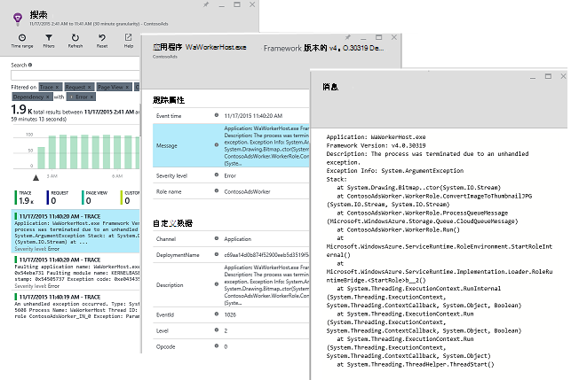
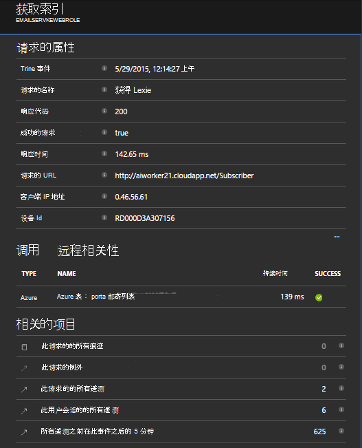
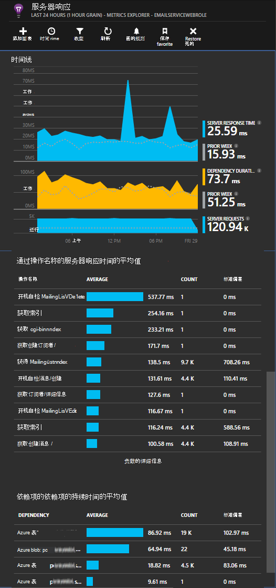

<properties
   pageTitle="Azure 的云服务的应用程序理解"
   description="监视应用程序的见解与有效您 web 和工作人员的角色"
   services="application-insights"
   documentationCenter=""
   authors="soubhagyadash"
   manager="douge"
   editor="alancameronwills"/>

<tags
   ms.service="application-insights"
   ms.devlang="na"
   ms.tgt_pltfrm="ibiza"
   ms.topic="article"
   ms.workload="tbd"
   ms.date="03/02/2016"
   ms.author="sdash"/>

# <a name="application-insights-for-azure-cloud-services"></a>Azure 的云服务的应用程序理解


*在预览是应用程序的见解*

[Microsoft Azure 云服务应用程序](https://azure.microsoft.com/services/cloud-services/)可以通过[Visual Studio 应用程序理解]监控[start]的可用性、 性能、 故障和使用率。 与处于放任状态获得关于性能和您的应用程序的有效性的反馈意见，您可以在每个开发周期中做出明智的选择，关于设计的方向。


您将需要与[Microsoft Azure](http://azure.com)的订阅。 使用 Microsoft 帐户，可能具有 Windows、 XBox Live，或其他 Microsoft 云服务的登录。 


#### <a name="sample-application-instrumented-with-application-insights"></a>检测应用程序的见解与示例应用程序

请看一下此[示例应用程序](https://github.com/Microsoft/ApplicationInsights-Home/tree/master/Samples/AzureEmailService)的应用程序的见解添加到云服务与承载 Azure 中的两个工作者角色。 

以下内容可以告诉您如何以相同的方式调整自己的云服务项目。

## <a name="create-an-application-insights-resource-for-each-role"></a>创建的每个角色的见解应用程序资源

应用程序的见解资源是将分析并显示您的遥测数据。  

1.  在[Azure 的门户网站][portal]，创建新的应用程序理解资源。 对于应用程序类型，选择 ASP.NET 应用程序。 

    

2.  采用检测密钥的副本。 您将需要此不久要配置 SDK。

    


它通常是[最适合用来创建单独的资源数据的每个 web 和辅助的角色](app-insights-separate-resources.md)。 

作为一种替代方法，可以从所有角色的数据发送到一个资源，但是设置一个[默认属性][ apidefaults] ，以便您可以筛选或分组中每个角色的结果。

## <a name="sdk"></a>每个项目中安装 SDK


1. 在 Visual Studio 中，编辑 NuGet 程序包的云应用程序项目。

    


2. 对于 web 角色，添加[对 Web 应用程序见解](http://www.nuget.org/packages/Microsoft.ApplicationInsights.Web)NuGet 程序包。 本 SDK 版本添加服务器上下文信息，如角色信息的模块。 辅助角色，使用[Windows 服务器的应用程序的见解](https://www.nuget.org/packages/Microsoft.ApplicationInsights.WindowsServer/)。

    


3. 配置 SDK 将数据发送到应用程序的见解资源。

    在文件中设置作为配置设置的检测项`ServiceConfiguration.Cloud.cscfg`。 （[代码示例](https://github.com/Microsoft/ApplicationInsights-Home/blob/master/Samples/AzureEmailService/AzureEmailService/ServiceConfiguration.Cloud.cscfg)）。
 
    ```XML
     <Role name="WorkerRoleA"> 
      <Setting name="APPINSIGHTS_INSTRUMENTATIONKEY" value="YOUR IKEY" /> 
     </Role>
    ```
 
    合适的启动函数中的配置设置中设置检测密钥︰

    ```C#
     TelemetryConfiguration.Active.InstrumentationKey = RoleEnvironment.GetConfigurationSettingValue("APPINSIGHTS_INSTRUMENTATIONKEY");
    ```

    请注意，名称相同`APPINSIGHTS_INSTRUMENTATIONKEY`配置的设置将被用作通过 Azure 诊断报告。 


    执行此操作的应用程序中每个角色。 请参阅示例︰
 
 * [Web 角色](https://github.com/Microsoft/ApplicationInsights-Home/blob/master/Samples/AzureEmailService/MvcWebRole/Global.asax.cs#L27)
 * [工作角色](https://github.com/Microsoft/ApplicationInsights-Home/blob/master/Samples/AzureEmailService/WorkerRoleA/WorkerRoleA.cs#L232)
 * [为 web 页](https://github.com/Microsoft/ApplicationInsights-Home/blob/master/Samples/AzureEmailService/MvcWebRole/Views/Shared/_Layout.cshtml#L13)   

4. 设置要始终复制到输出目录中的 ApplicationInsights.config 文件。 

    （在.config 文件中，您会看到消息询问您要放置的检测项。 但是，对云应用程序是更好地将其从.cscfg 文件中设置。 这可以确保正确地在门户中标识的角色。）


#### <a name="run-and-publish-the-app"></a>运行并发布应用程序

运行您的应用程序，并登录到 Azure。 打开的应用程序理解资源创建，并且您会看到出现在[搜索](app-insights-diagnostic-search.md)中的单个数据点和聚合[度量资源管理器](app-insights-metrics-explorer.md)中的数据。 

添加更多的遥测-请参阅下面的几节，然后发布您的应用程序获取实时诊断和使用情况的反馈。 


#### <a name="no-data"></a>没有数据？

* 打开[搜索][diagnostic]方块，查看单个事件。
* 使用该应用程序，以便它会生成一些遥测打开不同的页面。
* 等待几秒钟，然后单击刷新。
* 请参阅[疑难解答][qna]。


## <a name="more-telemetry"></a>更多的遥测

以下各节说明如何从您的应用程序的不同方面获得更多的遥测。


## <a name="track-requests-from-worker-roles"></a>从辅助角色的跟踪请求

在 web 角色请求模块自动收集有关 HTTP 请求的数据。 请参见有关如何重写默认集合行为的示例的[示例 MVCWebRole](https://github.com/Microsoft/ApplicationInsights-Home/tree/master/Samples/AzureEmailService/MvcWebRole) 。 

您可以通过 HTTP 请求相同的方式跟踪它们捕获对辅助角色的调用的性能。 在应用程序的见解，请求遥测类型测量进行计时，并且可以独立成功或失败的命名的服务器端工作的单位。 虽然 HTTP 请求会自动捕获通过 SDK，您可以插入您自己的代码来跟踪的辅助角色的请求。

请参阅检测报告请求的两个示例工作者角色︰ [WorkerRoleA](https://github.com/Microsoft/ApplicationInsights-Home/tree/master/Samples/AzureEmailService/WorkerRoleA)和[WorkerRoleB](https://github.com/Microsoft/ApplicationInsights-Home/tree/master/Samples/AzureEmailService/WorkerRoleB)

## <a name="azure-diagnostics"></a>Azure 的诊断

[Azure 诊断](../vs-azure-tools-diagnostics-for-cloud-services-and-virtual-machines.md)数据包括角色管理事件、 性能计数器和应用程序日志。 您可以这些发送到应用程序的见解，以便您可以看到它们与您遥测的其余部分一起轻松地诊断问题。

如果一个角色意外，失败或无法启动，azure 诊断程序特别有用。

1. 右键单击角色 （非项目 ！） 可打开其属性，然后选择**启用诊断**、**发送诊断程序对应用程序的见解**。

    

    **或如果您的应用程序是已经发布并正在运行**，打开服务器资源管理器或云资源管理器中，用鼠标右键单击您的应用程序，然后选择相同的选项。

3.  作为您其他遥测中选择相同的应用程序理解资源。

    如果需要，您可以设置不同的资源在不同的服务配置云 （本地） 有助于使开发数据与实时数据分开。

3. 也可以[排除一些 Azure 的诊断](app-insights-azure-diagnostics.md)要转发到应用程序的见解。 默认情况下所有内容。

### <a name="view-azure-diagnostic-events"></a>查看 Azure 的诊断事件

在哪里可以找到运行诊断程序︰

* 性能计数器将显示为自定义度量值。 
* Windows 事件日志将显示为跟踪和自定义事件。
* 应用程序日志、 ETW 日志和诊断程序基础结构的任何日志显示为跟踪。

若要查看的性能计数器和事件的计数，打开[测量数据资源管理器](app-insights-metrics-explorer.md)并添加新的图表︰


使用[搜索](app-insights-diagnostic-search.md)来搜索跨各种跟踪日志发送 Azure 诊断程序。 例如，如果您有 unhanded 的异常导致崩溃和回收的角色角色中，信息将显示在应用程序通道的 Windows 事件日志中。 可以使用搜索功能查看 Windows 事件日志错误，使您能够找到问题的根本原因的异常获取完整的堆栈跟踪。




## <a name="app-diagnostics"></a>应用程序诊断程序

Azure 诊断程序将自动包括您的应用程序将使用 System.Diagnostics.Trace 生成的日志条目。 

但如果您已经使用 Log4N 或 NLog 框架，还可以[捕获其日志跟踪][netlogs]。

[自定义事件和指标跟踪][api]在客户端或服务器，以了解有关应用程序的性能和使用情况。

## <a name="dependencies"></a>依赖项

应用程序的见解 SDK 可以报告您的应用程序可以对外部的依赖关系，如 REST api 和 SQL 服务器的调用。 这允许您查看是否慢响应或出现故障而导致特定的依赖项。

如果您的应用程序使用.NET framework 4.6 或更高版本，则不需要执行任何其他操作。 

否则，设置 web/辅助角色具有[应用程序理解代理程序](app-insights-monitor-performance-live-website-now.md)也称为"状态监视器"。

若要使用 web/工作人员角色的见解，应用程序代理︰

* 将[AppInsightsAgent](https://github.com/Microsoft/ApplicationInsights-Home/tree/master/Samples/AzureEmailService/WorkerRoleA/AppInsightsAgent)文件夹和这两个文件添加到 web/工作人员角色项目。 请务必设置它们的生成属性，以便它们总是复制到输出目录。 这些文件将安装代理。
* 作为显示在[下面](https://github.com/Microsoft/ApplicationInsights-Home/tree/master/Samples/AzureEmailService/AzureEmailService/ServiceDefinition.csdef#L18)的 CSDEF 文件添加任务启动。
* 注意︰*辅助角色*都需要三个环境变量作为显示[在此处](https://github.com/Microsoft/ApplicationInsights-Home/tree/master/Samples/AzureEmailService/AzureEmailService/ServiceDefinition.csdef#L44)。 这不是必需的 web 角色。

### <a name="dependency-reports"></a>互依关系报告

下面是您在应用程序的见解门户网站看到的内容的示例︰

* 请求自动关联和依赖关系的丰富诊断︰

    

* Web 角色，使用依赖项信息的性能︰

    

* 这是屏幕截图上的请求和辅助角色的相关性信息︰

    

## <a name="exceptions"></a>例外情况

如何从其他 web 应用程序类型收集未经处理的异常的信息，请参阅[监视应用程序的见解中的例外情况](app-insights-asp-net-exceptions.md)。

示例 web 角色有 MVC5 和 Web API 2 控制器。 用以下捕获未经处理的异常，从 2:

* [AiHandleErrorAttribute](https://github.com/Microsoft/ApplicationInsights-Home/blob/master/Samples/AzureEmailService/MvcWebRole/Telemetry/AiHandleErrorAttribute.cs)设置了[这里](https://github.com/Microsoft/ApplicationInsights-Home/blob/master/Samples/AzureEmailService/MvcWebRole/App_Start/FilterConfig.cs#L12)的 MVC5 控制器
* [AiWebApiExceptionLogger](https://github.com/Microsoft/ApplicationInsights-Home/blob/master/Samples/AzureEmailService/MvcWebRole/Telemetry/AiWebApiExceptionLogger.cs)设置了[以下](https://github.com/Microsoft/ApplicationInsights-Home/blob/master/Samples/AzureEmailService/MvcWebRole/App_Start/WebApiConfig.cs#L25)Web API 2 控制器

对于辅助角色，有两种方式，能够跟踪例外日期。

* TrackException(ex)
* 如果您添加了应用程序深入跟踪侦听器 NuGet 程序包，可以使用 System.Diagnostics.Trace 来记录异常。 [代码示例。](https://github.com/Microsoft/ApplicationInsights-Home/blob/master/Samples/AzureEmailService/WorkerRoleA/WorkerRoleA.cs#L107)

## <a name="performance-counters"></a>性能计数器

默认情况下收集以下计数器︰

    * \Process(??APP_WIN32_PROC??)\%处理器时间
    * \Memory\Available 字节
    * \.NET CLR Exceptions(??APP_CLR_PROC??)\#的 Exceps 引发 / 秒
    * \Process （确定。APP_WIN32_PROC 字段)\Private 字节
    * \Process （确定。APP_WIN32_PROC 字段)\IO 数据的字节数/秒
    * \Processor(_Total)\%处理器时间

此外，以下还为收集 web 角色︰

    * \ASP.NET 应用程序 （确定。APP_W3SVC_PROC 字段)\Requests/Sec    
    * \ASP.NET 应用程序 （确定。APP_W3SVC_PROC 字段)\Request 执行时间
    * \ASP.NET 应用程序 （确定。APP_W3SVC_PROC 字段)应用程序队列中的 \Requests

可以为显示[在此处](https://github.com/Microsoft/ApplicationInsights-Home/blob/master/Samples/AzureEmailService/WorkerRoleA/ApplicationInsights.config#L14)指定附加的自定义资源或其他 windows 性能计数器

  

## <a name="correlated-telemetry-for-worker-roles"></a>辅助角色相关遥测数据

它是什么导致了失败或高延迟请求，您可以看到丰富的诊断经验。 使用 web 角色，SDK 自动设置相关遥测之间的关联性。 为辅助的角色，可以使用自定义的遥测初始值设定项设置为实现此目标的所有遥测常见 Operation.Id 上下文属性。 这将允许您查看是否延迟/故障问题引起由于依赖项或代码，一眼 ！ 

下面是如何︰

* 将到调用上下文的关联 Id 设置为显示[在此处](https://github.com/Microsoft/ApplicationInsights-Home/blob/master/Samples/AzureEmailService/WorkerRoleA/WorkerRoleA.cs#L36)。 在这种情况下，我们正在使用请求 ID 作为相关性 id
* 添加自定义的 TelemetryInitializer 实现，程序会将 Operation.Id 设置为上面设置都会。 此处显示︰ [ItemCorrelationTelemetryInitializer](https://github.com/Microsoft/ApplicationInsights-Home/blob/master/Samples/AzureEmailService/WorkerRoleA/Telemetry/ItemCorrelationTelemetryInitializer.cs#L13)
* 添加自定义的遥测初始值设定项。 您可以这样做或代码中的 ApplicationInsights.config 文件，作为显示在[下面](https://github.com/Microsoft/ApplicationInsights-Home/blob/master/Samples/AzureEmailService/WorkerRoleA/WorkerRoleA.cs#L233)

就是这样！ 门户体验已经连接上以帮助您查看所有相关的遥测一眼︰


## <a name="client-telemetry"></a>客户端遥测

[向 web 页添加 JavaScript SDK] [client]以获取基于浏览器的页面视图数、 页面加载时间、 脚本异常的遥测并使您可以在页脚本中编写自定义的遥测。

## <a name="availability-tests"></a>可用性测试

[设置 web 测试][availability]以确保应用程序始终能够实时和快速响应。


## <a name="example"></a>示例

[此示例](https://github.com/Microsoft/ApplicationInsights-Home/tree/master/Samples/AzureEmailService)监视具有 web 角色和两个辅助角色的服务。

## <a name="exception-method-not-found-on-running-in-azure-cloud-services"></a>"找不到方法"异常在 Azure 云服务运行

未生成.NET 4.6 吗？ 4.6 不自动支持 Azure 云服务的角色中。 在运行您的应用程序之前，[安装在每个角色的 4.6](../cloud-services/cloud-services-dotnet-install-dotnet.md) 。

## <a name="related-topics"></a>相关的主题

* [配置发送到应用程序的见解的 Azure 诊断](app-insights-azure-diagnostics.md)
* [使用 PowerShell 将 Azure 诊断发送到应用程序的见解](app-insights-powershell-azure-diagnostics.md)


[api]: app-insights-api-custom-events-metrics.md
[apidefaults]: app-insights-api-custom-events-metrics.md#default-properties
[apidynamicikey]: app-insights-separate-resources.md#dynamic-ikey
[availability]: app-insights-monitor-web-app-availability.md
[azure]: app-insights-azure.md
[client]: app-insights-javascript.md
[diagnostic]: app-insights-diagnostic-search.md
[netlogs]: app-insights-asp-net-trace-logs.md
[portal]: http://portal.azure.com/
[qna]: app-insights-troubleshoot-faq.md
[redfield]: app-insights-monitor-performance-live-website-now.md
[start]: app-insights-overview.md 
