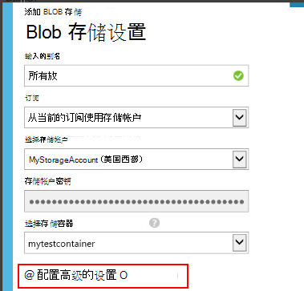

<properties 
    pageTitle="演练︰ 从应用程序的见解到 SQL 数据库导出遥测" 
    description="连续应用程序理解数据导出到 SQL 使用流分析。" 
    services="application-insights" 
    documentationCenter=""
    authors="noamben" 
    manager="douge"/>

<tags 
    ms.service="application-insights" 
    ms.workload="tbd" 
    ms.tgt_pltfrm="ibiza" 
    ms.devlang="na" 
    ms.topic="article" 
    ms.date="03/06/2015" 
    ms.author="awills"/>
 
# <a name="walkthrough-export-to-sql-from-application-insights-using-stream-analytics"></a>演练︰ 从中导出到 SQL 应用程序使用流分析的真知灼见

本文介绍如何从[Visual Studio 应用程序理解]移动遥测数据[start]到通过[连续导出]SQL Azure 数据库[export]和[Azure 流分析](https://azure.microsoft.com/services/stream-analytics/)。 

连续导出到 Azure 存储移动遥测数据以 JSON 格式。 我们将分析使用 Azure 流分析的 JSON 对象并在数据库表中创建行。

（通常，连续导出是做您的应用程序发送到应用程序的见解的遥测数据的分析的方法。 您无法修改此代码示例使用的导出的遥测数据，如聚合数据的其他事情。）

我们首先假设您已经有您想要监视该应用的程序。


在此示例中，我们将使用页面视图数据，但同一模式，可以方便地扩展到其他数据类型的自定义事件和异常等。 


## <a name="add-application-insights-to-your-application"></a>向应用程序添加应用程序的见解


入门︰

1. [设置应用程序为您的 web 页的见解](app-insights-javascript.md)。 

    （在此示例中，我们将重点处理页面视图数据从客户端浏览器，但您还可以设置应用程序的服务器端的[Java](app-insights-java-get-started.md)或[ASP.NET](app-insights-asp-net.md)应用程序和处理请求、 依赖项和其他服务器遥测的见解）


5. 发布您的应用程序，并观察出现在您的应用程序理解资源的遥测数据。


## <a name="create-storage-in-azure"></a>在 Azure 创建存储

连续出口始终将数据输出到 Azure 存储帐户，所以您需要首先创建存储区。

1. 在[Azure 门户]中订阅创建存储帐户[portal]。

    

2. 创建容器

    

3. 复制存储访问键

    您将需要它即将设置的输入流分析服务。

    

## <a name="start-continuous-export-to-azure-storage"></a>开始连续导出到 Azure 存储

1. 在 Azure 的门户中，浏览到您为您的应用程序创建的应用程序理解资源。

    

2. 创建的连续输出。

    


    选择您在前面创建的存储帐户︰

    
    
    设置您想要查看的事件类型︰

    


3. 让积累一些数据。 休息一下，让人们使用您的应用程序一段时间。 遥测会，您将看到[公制的资源管理器](app-insights-metrics-explorer.md)中的统计图表和[诊断搜索](app-insights-diagnostic-search.md)中的单个事件。 

    同时，将数据导出到您的存储。 

4. 检查导出数据，或者在门户-选择**浏览**，选择您的存储帐户，然后再**容器**-或在 Visual Studio 中。 在 Visual Studio 中，选择**查看 / 云资源管理器**，并打开 Azure / 存储。 (如果您没有此菜单选项，您需要安装 Azure SDK︰ 打开新建项目对话框，并打开 C# / 云 /.net 获取 Microsoft Azure SDK。)

    

    记下从应用程序名称和检测密钥派生的路径名的公共部分。 

事件会写入到 blob 以 JSON 格式的文件。 每个文件可以包含一个或多个事件。 因此我们想要读取事件数据，筛选出我们想要的字段。 所有类型的数据，我们可以做的事，但今天我们的计划是使用流分析将数据移到 SQL 数据库。 它将使易于运行大量有趣的查询。

## <a name="create-an-azure-sql-database"></a>创建 SQL Azure 数据库

再一次从[Azure 门户]中订购[portal]，创建数据库 (和新的服务器，除非您已经有了一个) 对其将写入的数据。


请确保数据库服务器允许访问 Azure 服务︰


## <a name="create-a-table-in-azure-sql-db"></a>在 Azure SQL 数据库中创建表

连接到与您首选的管理工具上一节中创建的数据库。 在本演练中，我们将使用[SQL Server 管理工具](https://msdn.microsoft.com/ms174173.aspx)(SSMS)。


创建一个新查询，然后执行以下的 T SQL:

```SQL

CREATE TABLE [dbo].[PageViewsTable](
    [pageName] [nvarchar](max) NOT NULL,
    [viewCount] [int] NOT NULL,
    [url] [nvarchar](max) NULL,
    [urlDataPort] [int] NULL,
    [urlDataprotocol] [nvarchar](50) NULL,
    [urlDataHost] [nvarchar](50) NULL,
    [urlDataBase] [nvarchar](50) NULL,
    [urlDataHashTag] [nvarchar](max) NULL,
    [eventTime] [datetime] NOT NULL,
    [isSynthetic] [nvarchar](50) NULL,
    [deviceId] [nvarchar](50) NULL,
    [deviceType] [nvarchar](50) NULL,
    [os] [nvarchar](50) NULL,
    [osVersion] [nvarchar](50) NULL,
    [locale] [nvarchar](50) NULL,
    [userAgent] [nvarchar](max) NULL,
    [browser] [nvarchar](50) NULL,
    [browserVersion] [nvarchar](50) NULL,
    [screenResolution] [nvarchar](50) NULL,
    [sessionId] [nvarchar](max) NULL,
    [sessionIsFirst] [nvarchar](50) NULL,
    [clientIp] [nvarchar](50) NULL,
    [continent] [nvarchar](50) NULL,
    [country] [nvarchar](50) NULL,
    [province] [nvarchar](50) NULL,
    [city] [nvarchar](50) NULL
)

CREATE CLUSTERED INDEX [pvTblIdx] ON [dbo].[PageViewsTable]
(
    [eventTime] ASC
)WITH (PAD_INDEX = OFF, STATISTICS_NORECOMPUTE = OFF, SORT_IN_TEMPDB = OFF, DROP_EXISTING = OFF, ONLINE = OFF, ALLOW_ROW_LOCKS = ON, ALLOW_PAGE_LOCKS = ON)

```


在此示例中，我们将使用网页视图中的数据。 要查看可用的其他数据，请检查您的 JSON 输出，并请参阅[导出数据模型](app-insights-export-data-model.md)。

## <a name="create-an-azure-stream-analytics-instance"></a>创建 Azure 流分析实例

从[经典的 Azure 门户](https://manage.windowsazure.com/)，选择 Azure 流分析服务，并创建新的流分析作业︰


创建新作业时，展开其详细信息︰


#### <a name="set-blob-location"></a>设置斑点位置

将其设置为使您连续导出 blob 中的输入︰


现在，您将从您的存储帐户，前面提到需要为主的访问键。 此设置为存储帐户密码。



#### <a name="set-path-prefix-pattern"></a>设置路径的前缀模式 


确保将日期格式设置为**YYYY MM DD** ，（包括**短划线**）。

该路径的前缀模式指定流分析如何存储中找到的输入的文件。 您需要将其设置为对应于连续导出将数据的存储。 将其设置如下︰

    webapplication27_12345678123412341234123456789abcdef0/PageViews/{date}/{time}

在此示例中︰

* `webapplication27`是该应用程序的见解资源，**所有小写字母**的名称。 
* `1234...`为检测密钥的应用程序理解资源**用划线删除**。 
* `PageViews`是的我们想要分析的数据的类型。 可用的类型取决于在连续导出设置的筛选器。 检查以查看其他可用类型的导出的数据，请参阅[导出数据模型](app-insights-export-data-model.md)。
* `/{date}/{time}`一种模式编写按其原义。

若要获取名称和 iKey 的应用程序理解资源，精要打开其概述页中，或打开设置。

#### <a name="finish-initial-setup"></a>完成初始设置

确认的序列化格式︰


关闭该向导，并等待安装程序以完成。

>[AZURE.TIP] 示例函数用于检查设置输入的路径正确。 如果该操作失败︰ 检查在所选的示例时间范围的存储数据。 编辑输入的定义和检查设置存储帐户、 路径前缀和格式正确的日期。

## <a name="set-query"></a>一组查询

打开查询节︰


替换为默认查询︰

```SQL

    SELECT flat.ArrayValue.name as pageName
    , flat.ArrayValue.count as viewCount
    , flat.ArrayValue.url as url
    , flat.ArrayValue.urlData.port as urlDataPort
    , flat.ArrayValue.urlData.protocol as urlDataprotocol
    , flat.ArrayValue.urlData.host as urlDataHost
    , flat.ArrayValue.urlData.base as urlDataBase
    , flat.ArrayValue.urlData.hashTag as urlDataHashTag
      ,A.context.data.eventTime as eventTime
      ,A.context.data.isSynthetic as isSynthetic
      ,A.context.device.id as deviceId
      ,A.context.device.type as deviceType
      ,A.context.device.os as os
      ,A.context.device.osVersion as osVersion
      ,A.context.device.locale as locale
      ,A.context.device.userAgent as userAgent
      ,A.context.device.browser as browser
      ,A.context.device.browserVersion as browserVersion
      ,A.context.device.screenResolution.value as screenResolution
      ,A.context.session.id as sessionId
      ,A.context.session.isFirst as sessionIsFirst
      ,A.context.location.clientip as clientIp
      ,A.context.location.continent as continent
      ,A.context.location.country as country
      ,A.context.location.province as province
      ,A.context.location.city as city
    INTO
      AIOutput
    FROM AIinput A
    CROSS APPLY GetElements(A.[view]) as flat


```

注意到第一的几个属性是特定于页面视图数据。 导出的其他遥测类型将具有不同的属性。 请参阅[详细的数据模型引用的属性类型和值。](app-insights-export-data-model.md)

## <a name="set-up-output-to-database"></a>设置输出到数据库

选择 SQL 作为输出。


指定的 SQL 数据库。


关闭向导并等待输出设置通知。

## <a name="start-processing"></a>开始处理

从操作栏中启动该作业︰


您可以选择是否要开始处理从现在或以前开始时使用的数据的数据。 后者是很有用的如果您已经连续导出已运行了一段。


几分钟后，返回到 SQL Server 管理工具和观看中流动的数据。 例如，使用类似下面的查询︰

    SELECT TOP 100 *
    FROM [dbo].[PageViewsTable]


## <a name="related-articles"></a>相关的文章

* [将导出到 SQL 使用辅助角色](app-insights-code-sample-export-telemetry-sql-database.md)
* [将导出到 PowerBI 使用流分析](app-insights-export-power-bi.md)
* [详细的数据模型的属性类型和属性值的引用。](app-insights-export-data-model.md)
* [应用程序的见解中的连续输出](app-insights-export-telemetry.md)
* [应用程序的见解](https://azure.microsoft.com/services/application-insights/)

<!--Link references-->

[diagnostic]: app-insights-diagnostic-search.md
[export]: app-insights-export-telemetry.md
[metrics]: app-insights-metrics-explorer.md
[portal]: http://portal.azure.com/
[start]: app-insights-overview.md

 