<properties 
    pageTitle="代码示例︰ 分析应用程序的见解从导出的数据" 
    description="使用连续的导出功能代码遥测中应用程序建议的分析。 将数据保存到 SQL。" 
    services="application-insights" 
    documentationCenter=""
    authors="mazharmicrosoft" 
    manager="douge"/>

<tags 
    ms.service="application-insights" 
    ms.workload="tbd" 
    ms.tgt_pltfrm="ibiza" 
    ms.devlang="na" 
    ms.topic="article" 
    ms.date="01/05/2016" 
    ms.author="awills"/>
 
# 代码示例︰ 分析应用程序的见解从导出的数据

本文介绍如何处理 JSON 数据从应用程序的见解。 举一个例子，我们将编写代码以从[Visual Studio 应用程序理解]移动遥测数据[start]到通过[连续导出]SQL Azure 数据库[export]。 （也可获得此[使用流分析](app-insights-code-sample-export-sql-stream-analytics.md)，但我们这样做的目标是向您显示的某些代码）。 

连续出口进入您遥测 Azure 存储以 JSON 格式，因此，我们将编写一些代码来解析 JSON 对象并在数据库表中创建行。

一般地说，连续导出是做您的应用程序发送到应用程序的见解的遥测数据的分析方法。 您可以采用此代码示例导出遥测与其他事情。

我们首先假设您已经有您想要监视该应用的程序。

## 添加应用程序深入 SDK

监视应用程序，您[将添加一个应用程序的见解 SDK] [start]为您的应用程序。 有不同的 Sdk 和帮助器工具为不同的平台、 Ide 和语言。 您可以监视 web 页、 Java 或 ASP.NET web 服务器和移动设备的几种类型。 所有 Sdk 将遥测都发送到[应用程序理解门户网站][portal]，可在其中使用我们功能强大的分析和诊断工具，并将数据导出到存储。

入门︰

1. 获取[在 Microsoft Azure 中的帐户](https://azure.microsoft.com/pricing/)。
2. 在[Azure 的门户网站][portal]，添加新的应用程序理解资源对您的应用程序︰

    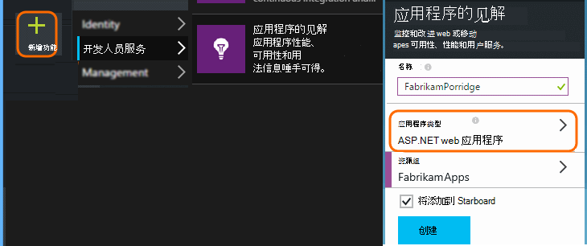

    （您的应用程序类型和订阅可能会不同。
3. 打开查找如何设置对您的应用程序类型的 SDK 快速入门。

    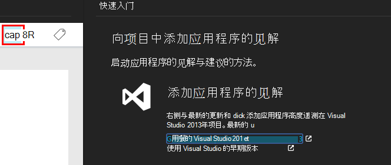

    如果未列出您的应用程序的类型，看一看[入门][start]页。

4. 在此示例中，我们正在监视 web 应用程序，因此我们可以使用 Visual Studio 在 Azure 的工具来安装 SDK。 我们告诉它我们的见解应用程序资源的名称︰

    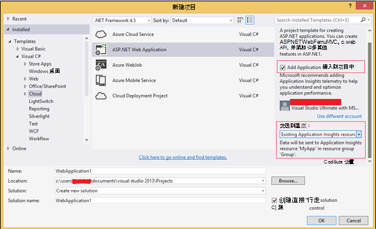

## 在 Azure 创建存储

以 JSON 格式的 Azure 存储帐户，则始终导出数据从应用程序的见解。 它是从该存储您的代码将读取的数据。

1. 在[Azure 门户网站]订阅中创建"经典"的存储帐户[portal]。

    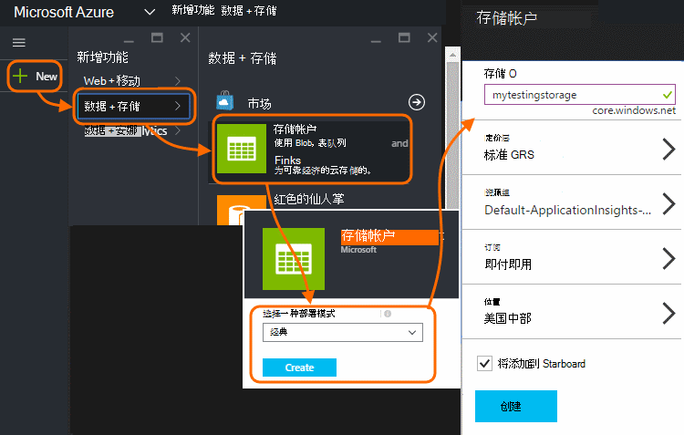

2. 创建容器

    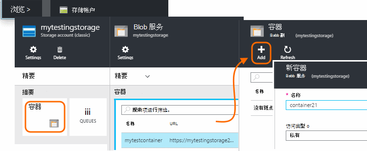

## 开始连续导出到 Azure 存储

1. 在 Azure 的门户中，浏览到您为您的应用程序创建的应用程序理解资源。

    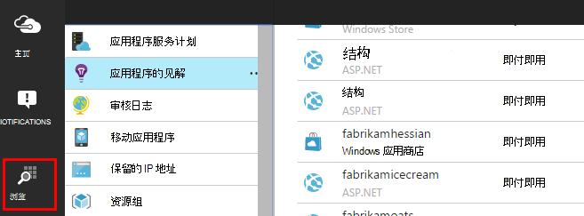

2. 创建的连续输出。

    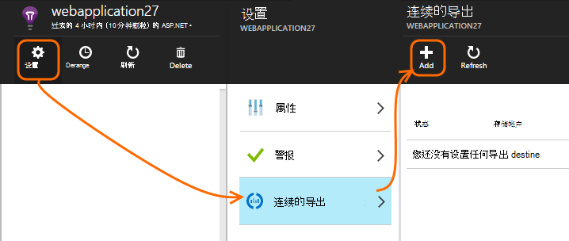

    选择您在前面创建的存储帐户︰

    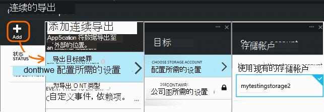
    
    设置您想要查看的事件类型︰

    

3. 让积累一些数据。 休息一下，让人们使用您的应用程序一段时间。 遥测会，您将看到[公制的资源管理器](app-insights-metrics-explorer.md)中的统计图表和[诊断搜索](app-insights-diagnostic-search.md)中的单个事件。 

    同时，将数据导出到您的存储。 

4. 检查导出的数据。 在 Visual Studio 中，选择**查看 / 云资源管理器**，并打开 Azure / 存储。 (如果您没有此菜单选项，您需要安装 Azure SDK︰ 打开新建项目对话框，并打开 C# / 云 /.net 获取 Microsoft Azure SDK。)

    

    记下从应用程序名称和检测密钥派生的路径名的公共部分。 

事件会写入到 blob 以 JSON 格式的文件。 每个文件可以包含一个或多个事件。 因此我们想要读取事件数据，筛选出我们想要的字段。 所有类型的数据，我们可以做的事，但今天我们的计划是编写一些代码来将数据移到 SQL 数据库。 它将使易于运行大量有趣的查询。

## 创建 SQL Azure 数据库

对于本示例，我们将编写代码以将数据推送到数据库中。

再一次从[Azure 门户]中订购[portal]，创建数据库 (和新的服务器，除非您已经有了一个) 对其将写入的数据。

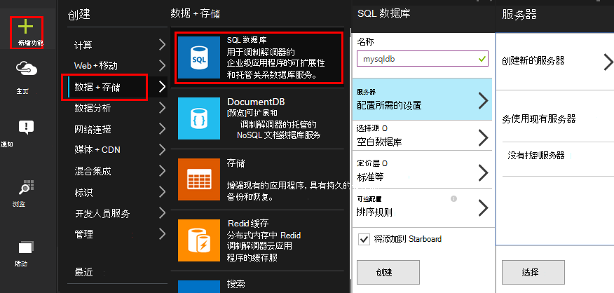

请确保数据库服务器允许访问 Azure 服务︰

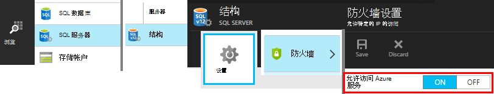

## 创建辅助角色 

现在终于我们可以编写[一些代码](https://sesitai.codeplex.com/)来分析导出的 blob，json 格式并在数据库中创建记录。 由于导出存储和数据库都在 Azure 中，我们将 Azure 辅助角色中运行的代码。

此代码会自动提取任何属性都在 JSON 中存在。 属性的说明，请参阅[导出数据模型](app-insights-export-data-model.md)。

#### 创建辅助角色项目

在 Visual Studio 中，创建用于辅助角色的新项目︰

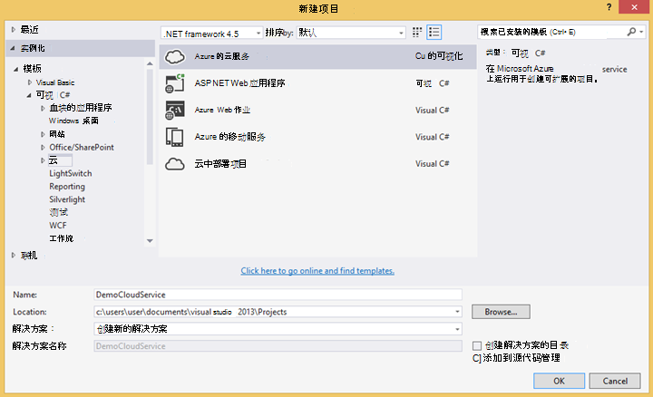

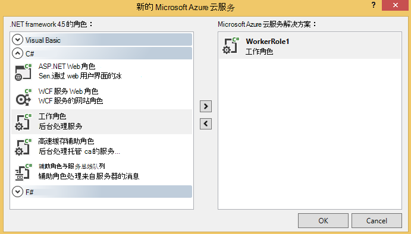

#### 连接到存储帐户

在 Azure，获取您的存储帐户连接字符串︰

在 Visual Studio 中，存储帐户连接字符串配置的员工的角色设置︰

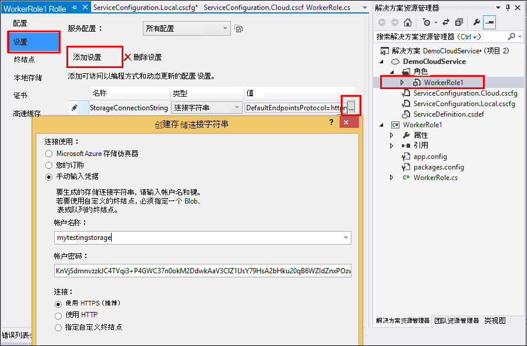

#### 软件包

在解决方案资源管理器中，右击辅助角色的项目，然后选择管理 NuGet 程序包。
搜索并安装这些软件包︰ 

 * EntityFramework 6.1.2 或更高版本-我们将使用此生成动态的数据库表架构基于该 blob json 格式的内容。
 * JsonFx-我们将使用此拼合到 C# 类属性的 JSON。

使用此工具可从单个 JSON 文档生成 C# 类。 它需要稍加改动像拼合 JSON 数组到一个 C# 属性中启用单个列的数据库表 (ex。 urlData_port) 

 * [JSON C# 类生成器](http://jsonclassgenerator.codeplex.com/)

## 代码 

您可以将此代码放在`WorkerRole.cs`。

#### 导入

    using Microsoft.WindowsAzure.Storage;

    using Microsoft.WindowsAzure.Storage.Blob;

#### 检索存储连接字符串

    private static string GetConnectionString()
    {
      return Microsoft.WindowsAzure.CloudConfigurationManager.GetSetting("StorageConnectionString");
    }

#### 定期运行该工作人员

替换现有的运行的方法，并选择您喜欢的间隔。 它应该至少一小时，因为导出功能在一小时内完成一个 JSON 对象。

    public override void Run()
    {
      Trace.TraceInformation("WorkerRole1 is running");

      while (true)
      {
        Trace.WriteLine("Sleeping", "Information");

        Thread.Sleep(86400000); //86400000=24 hours //1 hour=3600000
                
        Trace.WriteLine("Awake", "Information");

        ImportBlobtoDB();
      }
    }

#### 为表行插入每个 JSON 对象

    public void ImportBlobtoDB()
    {
      try
      {
        CloudStorageAccount account = CloudStorageAccount.Parse(GetConnectionString());

        var blobClient = account.CreateCloudBlobClient();
        var container = blobClient.GetContainerReference(FilterContainer);

        foreach (CloudBlobDirectory directory in container.ListBlobs())//Parent directory
        {
          foreach (CloudBlobDirectory subDirectory in directory.ListBlobs())//PageViewPerformance
          {
            foreach (CloudBlobDirectory dir in subDirectory.ListBlobs())//2015-01-31
            {
              foreach (CloudBlobDirectory subdir in dir.ListBlobs())//22
              {
                foreach (IListBlobItem item in subdir.ListBlobs())//3IAwm6u3-0.blob
                {
                  itemname = item.Uri.ToString();
                  ParseEachBlob(container, item);
                  AuditBlob(container, directory, subDirectory, dir, subdir, item);
                } //item loop
              } //subdir loop
            } //dir loop
          } //subDirectory loop
        } //directory loop
      }
      catch (Exception ex)
      {
        //handle exception
      }
    }

#### 分析每个 blob

    private void ParseEachBlob(CloudBlobContainer container, IListBlobItem item)
    {
      try
      {
        var blob = container.GetBlockBlobReference(item.Parent.Prefix + item.Uri.Segments.Last());
    
        string json;
    
        using (var memoryStream = new MemoryStream())
        {
          blob.DownloadToStream(memoryStream);
          json = System.Text.Encoding.UTF8.GetString(memoryStream.ToArray());
    
          IEnumerable<string> entities = json.Split('\n').Where(s => !string.IsNullOrWhiteSpace(s));
    
          recCount = entities.Count();
          failureCount = 0; //resetting failure count
    
          foreach (var entity in entities)
          {
            var reader = new JsonFx.Json.JsonReader();
            dynamic output = reader.Read(entity);
    
            Dictionary<string, object> dict = new Dictionary<string, object>();
    
            GenerateDictionary((System.Dynamic.ExpandoObject)output, dict, "");
    
            switch (FilterType)
            {
              case "PageViewPerformance":
    
              if (dict.ContainsKey("clientPerformance"))
                {
                  GenerateDictionary(((System.Dynamic.ExpandoObject[])dict["clientPerformance"])[0], dict, "");
                }
    
              if (dict.ContainsKey("context_custom_dimensions"))
              {
                if (dict["context_custom_dimensions"].GetType() == typeof(System.Dynamic.ExpandoObject[]))
                {
                  GenerateDictionary(((System.Dynamic.ExpandoObject[])dict["context_custom_dimensions"])[0], dict, "");
                }
              }
    
            PageViewPerformance objPageViewPerformance = (PageViewPerformance)GetObject(dict);
    
            try
            {
              using (var db = new TelemetryContext())
              {
                db.PageViewPerformanceContext.Add(objPageViewPerformance);
                db.SaveChanges();
              }
            }
            catch (Exception ex)
            {
              failureCount++;
            }
            break;
    
            default:
            break;
          }
        }
      }
    }
    catch (Exception ex)
    {
      //handle exception 
    }
    }

#### 对于每个 JSON 文档准备字典

    private void GenerateDictionary(System.Dynamic.ExpandoObject output, Dictionary<string, object> dict, string parent)
        {
            try
            {
                foreach (var v in output)
                {
                    string key = parent + v.Key;
                    object o = v.Value;

                    if (o.GetType() == typeof(System.Dynamic.ExpandoObject))
                    {
                        GenerateDictionary((System.Dynamic.ExpandoObject)o, dict, key + "_");
                    }
                    else
                    {
                        if (!dict.ContainsKey(key))
                        {
                            dict.Add(key, o);
                        }
                    }
                }
            }
            catch (Exception ex)
            {
            //handle exception 
            }
        }

#### 将 JSON 文档转换为 C# 类遥测对象属性

     public object GetObject(IDictionary<string, object> d)
        {
            PropertyInfo[] props = null;
            object res = null;

            try
            {
                switch (FilterType)
                {
                    case "PageViewPerformance":

                        props = typeof(PageViewPerformance).GetProperties();
                        res = Activator.CreateInstance<PageViewPerformance>();
                        break;

                    default:
                        break;
                }

                for (int i = 0; i < props.Length; i++)
                {
                    if (props[i].CanWrite && d.ContainsKey(props[i].Name))
                    {
                        props[i].SetValue(res, d[props[i].Name], null);
                    }
                }
            }
            catch (Exception ex)
            {
            //handle exception 
            }

            return res;
        }

#### PageViewPerformance 从 JSON 文档生成的类文件

    public class PageViewPerformance
    {
        [DatabaseGenerated(DatabaseGeneratedOption.Identity)]
        public Guid Id { get; set; }

        public string url { get; set; }

        public int urlData_port { get; set; }

        public string urlData_protocol { get; set; }

        public string urlData_host { get; set; }

        public string urlData_base { get; set; }

        public string urlData_hashTag { get; set; }

        public double total_value { get; set; }

        public double networkConnection_value { get; set; }

        public double sendRequest_value { get; set; }

        public double receiveRequest_value { get; set; }

        public double clientProcess_value { get; set; }

        public string name { get; set; }

        public string internal_data_id { get; set; }

        public string internal_data_documentVersion { get; set; }

        public DateTime? context_data_eventTime { get; set; }

        public string context_device_id { get; set; }

        public string context_device_type { get; set; }

        public string context_device_os { get; set; }

        public string context_device_osVersion { get; set; }

        public string context_device_locale { get; set; }

        public string context_device_userAgent { get; set; }

        public string context_device_browser { get; set; }

        public string context_device_browserVersion { get; set; }

        public string context_device_screenResolution_value { get; set; }

        public string context_user_anonId { get; set; }

        public string context_user_anonAcquisitionDate { get; set; }

        public string context_user_authAcquisitionDate { get; set; }

        public string context_user_accountAcquisitionDate { get; set; }

        public string context_session_id { get; set; }

        public bool context_session_isFirst { get; set; }

        public string context_operation_id { get; set; }

        public double context_location_point_lat { get; set; }

        public double context_location_point_lon { get; set; }

        public string context_location_clientip { get; set; }

        public string context_location_continent { get; set; }

        public string context_location_country { get; set; }

        public string context_location_province { get; set; }

        public string context_location_city { get; set; }
    }

#### DBcontext 由实体框架 SQL 交互

    public class TelemetryContext : DbContext
    {
        public DbSet<PageViewPerformance> PageViewPerformanceContext { get; set; }
        public TelemetryContext()
            : base("name=TelemetryContext")
        {
        }
    }

添加 DB 连接字符串名称`TelemetryContext`在`app.config`。

## 架构 （仅供参考）

这是用于将生成表的架构。

> [AZURE.NOTE] 您不需要运行此脚本。 Json 格式的属性确定表中的列。

    CREATE TABLE [dbo].[PageViewPerformances](
    [Id] [uniqueidentifier] NOT NULL,
    [url] [nvarchar](max) NULL,
    [urlData_port] [int] NOT NULL,
    [urlData_protocol] [nvarchar](max) NULL,
    [urlData_host] [nvarchar](max) NULL,
    [urlData_base] [nvarchar](max) NULL,
    [urlData_hashTag] [nvarchar](max) NULL,
    [total_value] [float] NOT NULL,
    [networkConnection_value] [float] NOT NULL,
    [sendRequest_value] [float] NOT NULL,
    [receiveRequest_value] [float] NOT NULL,
    [clientProcess_value] [float] NOT NULL,
    [name] [nvarchar](max) NULL,
    [User] [nvarchar](max) NULL,
    [internal_data_id] [nvarchar](max) NULL,
    [internal_data_documentVersion] [nvarchar](max) NULL,
    [context_data_eventTime] [datetime] NULL,
    [context_device_id] [nvarchar](max) NULL,
    [context_device_type] [nvarchar](max) NULL,
    [context_device_os] [nvarchar](max) NULL,
    [context_device_osVersion] [nvarchar](max) NULL,
    [context_device_locale] [nvarchar](max) NULL,
    [context_device_userAgent] [nvarchar](max) NULL,
    [context_device_browser] [nvarchar](max) NULL,
    [context_device_browserVersion] [nvarchar](max) NULL,
    [context_device_screenResolution_value] [nvarchar](max) NULL,
    [context_user_anonId] [nvarchar](max) NULL,
    [context_user_anonAcquisitionDate] [nvarchar](max) NULL,
    [context_user_authAcquisitionDate] [nvarchar](max) NULL,
    [context_user_accountAcquisitionDate] [nvarchar](max) NULL,
    [context_session_id] [nvarchar](max) NULL,
    [context_session_isFirst] [bit] NOT NULL,
    [context_operation_id] [nvarchar](max) NULL,
    [context_location_point_lat] [float] NOT NULL,
    [context_location_point_lon] [float] NOT NULL,
    [context_location_clientip] [nvarchar](max) NULL,
    [context_location_continent] [nvarchar](max) NULL,
    [context_location_country] [nvarchar](max) NULL,
    [context_location_province] [nvarchar](max) NULL,
    [context_location_city] [nvarchar](max) NULL,
    CONSTRAINT [PK_dbo.PageViewPerformances] PRIMARY KEY CLUSTERED 
    (
     [Id] ASC
    )WITH (PAD_INDEX = OFF, STATISTICS_NORECOMPUTE = OFF, IGNORE_DUP_KEY = OFF, ALLOW_ROW_LOCKS = ON, ALLOW_PAGE_LOCKS = ON) ON [PRIMARY]
    ) ON [PRIMARY] TEXTIMAGE_ON [PRIMARY]

    GO

    ALTER TABLE [dbo].[PageViewPerformances] ADD  DEFAULT (newsequentialid()) FOR [Id]
    GO

若要在操作中，[下载](https://sesitai.codeplex.com/)完成的工作代码，此示例，请参阅更改`app.config`设置并发布到 Azure 的辅助角色。

## 相关的文章

* [将导出到 SQL 使用辅助角色](app-insights-code-sample-export-telemetry-sql-database.md)
* [应用程序的见解中的连续输出](app-insights-export-telemetry.md)
* [应用程序的见解](https://azure.microsoft.com/services/application-insights/)
* [导出数据模型](app-insights-export-data-model.md)
* [更多示例和演练](app-insights-code-samples.md)

<!--Link references-->

[diagnostic]: app-insights-diagnostic-search.md
[export]: app-insights-export-telemetry.md
[metrics]: app-insights-metrics-explorer.md
[portal]: http://portal.azure.com/
[start]: app-insights-overview.md

 
