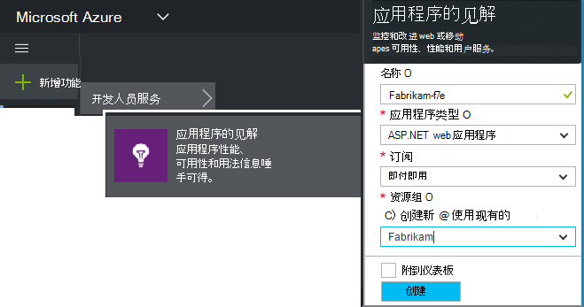
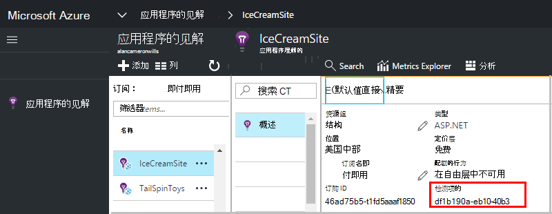

<properties 
    pageTitle="创建新的应用程序理解资源 |Microsoft Azure" 
    description="设置为新的实时应用程序监控应用程序的见解。 基于 web 的方法。" 
    services="application-insights" 
    documentationCenter=""
    authors="alancameronwills" 
    manager="douge"/>

<tags 
    ms.service="application-insights" 
    ms.workload="tbd" 
    ms.tgt_pltfrm="ibiza" 
    ms.devlang="na" 
    ms.topic="article" 
    ms.date="08/26/2016" 
    ms.author="awills"/>

# 创建应用程序的见解资源

Visual Studio 应用程序理解 Microsoft Azure*资源*中显示有关您的应用程序数据。 创建新的资源[设置应用程序的见解来监视的新的应用程序]的一部分因此是[start]。 在许多情况下，可以通过 IDE 中，自动完成这，这就是它是可用的推荐的方式。 但在某些情况下，您创建一个资源手动。

创建资源之后，可以获取其检测密钥并使用，配置 SDK 应用程序中。 将遥测发送到资源。

## 注册到 Microsoft Azure

如果您手头没有[Microsoft 帐户，请立即注册](http://live.com)。 （如果您使用如 Outlook.com、 OneDrive、 Windows Phone 或 XBox Live 服务，您已经使用 Microsoft 帐户。）

您还需要对[Microsoft Azure](http://azure.com)的订阅。 如果您的团队或组织有订阅了 Azure，所有者可以将您添加到它，使用您的 Windows Live id。

或者，您可以创建一个新订阅。 免费帐户，您可以尝试 Azure 中的所有内容。 在试用期到期后，您可能会发现使用付费订阅合适，因为您将不会收取免费服务。 

当有访问订阅，登录到应用程序的见解在[http://portal.azure.com](https://portal.azure.com)，并使用登录到您的 Live ID。

## 创建应用程序的见解资源
  

在[portal.azure.com](https://portal.azure.com)中，添加应用程序理解的资源︰

* **应用程序类型**将影响您所看到的概述刀片和[公制的资源管理器]中可用的属性[metrics]。 如果您看不到您的应用程序类型，选择 ASP.NET。
* **资源组**是方便管理属性如下所示的访问控制。 如果您已经创建其他 Azure 的资源，您可以选择将此新资源放在同一个组。
* **订阅**是 Azure 您的付款帐户。
* **位置**是，我们在其中保存您的数据。 目前无法更改它。
* **添加到 startboard**将所需的资源的快速访问拼贴放在 Azure 主页。 建议。

创建您的应用程序后，将打开新的刀片。 这是将有关您的应用程序看到的性能和使用情况数据。 

要获取回它接下来的时间登录到 Azure，看开始板 （主屏幕） 上的应用程序的快速启动平铺。 或单击浏览进行查找。

## 复制检测密钥

检测关键字标识了您所创建的资源。 您将需要它来给 SDK。

## 在您的应用程序安装 SDK

在您的应用程序安装 SDK 应用程序理解。 这一步很大程度取决于您的应用程序的类型。 

检测项用于配置[应用程序中安装的 SDK][start]。

SDK 包含标准模块，而无需编写任何代码发送遥测。 若要跟踪用户操作或诊断问题的更多细节，[使用 API] [api]发送您自己的遥测。

## 请参阅遥测数据

关闭快速入门刀片式服务器返回到您应用程序刀片在 Azure 的门户。

单击以查看[诊断搜索]搜索瓷砖[diagnostic]，将出现第一个事件。 

如果您期待更多的数据，请单击刷新后几秒钟。

## 自动创建资源

您可以编写一个[PowerShell 脚本](app-insights-powershell-script-create-resource.md)来自动创建的资源。

## 下一步行动

* [创建仪表板](app-insights-dashboards.md)
* [诊断搜索](app-insights-diagnostic-search.md)
* [研究指标](app-insights-metrics-explorer.md)
* [编写分析查询](app-insights-analytics.md)

<!--Link references-->

[api]: app-insights-api-custom-events-metrics.md
[diagnostic]: app-insights-diagnostic-search.md
[metrics]: app-insights-metrics-explorer.md
[start]: app-insights-overview.md

 