<properties
    pageTitle="仪表板和在应用程序的见解门户导航 |Microsoft Azure"
    description="创建密钥的 APM 图表和查询的视图。"
    services="application-insights"
    documentationCenter=""
    authors="alancameronwills"
    manager="douge"/>

<tags
    ms.service="application-insights"
    ms.workload="tbd"
    ms.tgt_pltfrm="ibiza"
    ms.devlang="multiple"
    ms.topic="article" 
    ms.date="10/18/2016"
    ms.author="awills"/>

# 导航和应用程序的见解门户的仪表板

[设置应用程序在您的项目的见解](app-insights-overview.md)后，有关您的应用程序的性能和使用情况的遥测数据将出现在[Azure 的门户](https://portal.azure.com)项目的应用程序理解资源中。

## 查找您遥测

登录到[Azure 的门户](https://portal.azure.com)和导航到您为您的应用程序创建的应用程序理解资源。

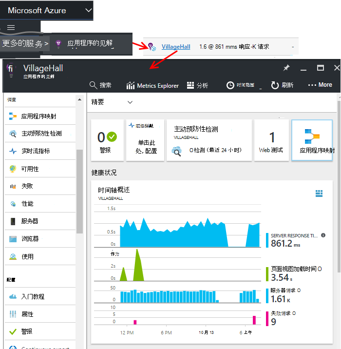

您的应用程序概述刀片 （页） 显示您的应用程序的关键诊断指标的摘要和网关的门户网站的其他功能。

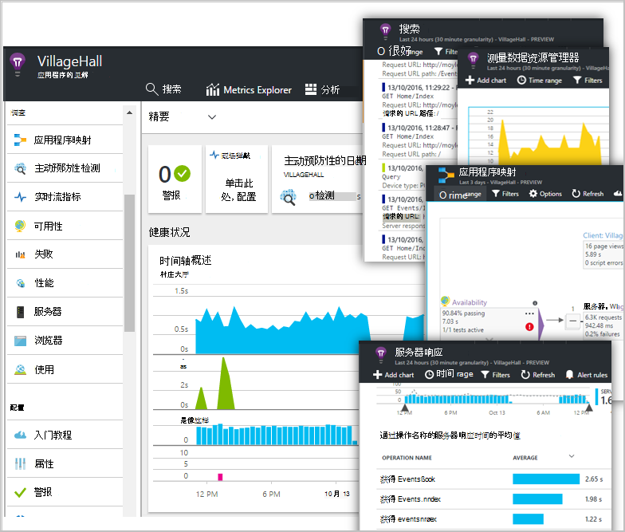

可以自定义任何其他图表并将其固定到仪表板。 这种方式，可以同时返回主要图从不同的应用程序。

## 仪表板

在您登录到[Microsoft Azure 门户](https://portal.azure.com)后，您看到的第一件事是仪表板。 这里您可以将组合在一起的图表的最重要跨所有 Azure 资源，包括从[Visual Studio 应用程序理解](app-insights-overview.md)的遥测。
 

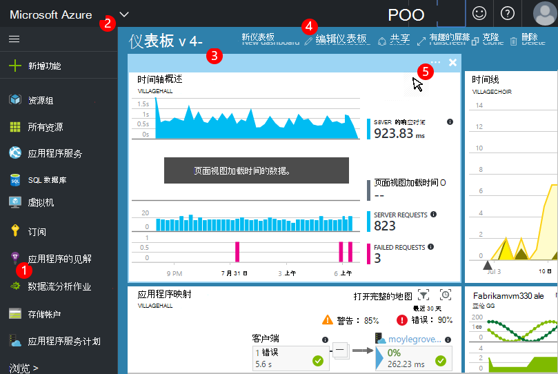

1. **定位到特定的资源**，如您的应用程序在应用程序的见解︰ 使用左侧的栏。
2. **返回到当前的仪表板**，或切换到其他最新视图︰ 使用左上角的下拉列表菜单。
3. **开关面板**︰ 在面板标题中使用下拉列表菜单
4. **创建、 编辑和共享仪表板**的仪表板工具栏中。
5. **编辑仪表板**︰ 将鼠标悬停在图块，然后使用其顶栏移动、 自定义，或将其删除。

## 向面板中添加

当您正在查看的刀片或特别有意义的图表集时，您可以锁定到仪表板，它的一个副本。 您会发现它那里返回的下一次。

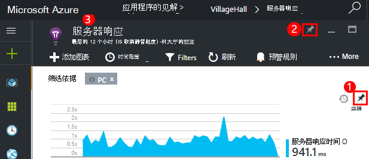

1. 对仪表板针图。 一份图表显示在仪表板上。
2. 固定到仪表板整个刀片式服务器-在仪表盘上显示为您可以通过单击一个图块。
3. 单击左上的角以返回到当前的仪表板。 然后可以使用下拉列表菜单以返回到当前视图。

请注意图分为拼贴︰ 拼贴可以包含多个图表。 您锁定到仪表板的整个平铺。

### 分析中锁定任何查询

您还可以访问[共享](#share-dashboards-with-your-team)的仪表板[针分析](app-insights-analytics-using.md#pin-to-dashboard)图表。 这允许您添加的任何任意查询旁边的标准指标的图表。 （没有这项功能的费用。）

## 调整仪表板上的图块

操控板上的一张牌后，可以对它进行调整。

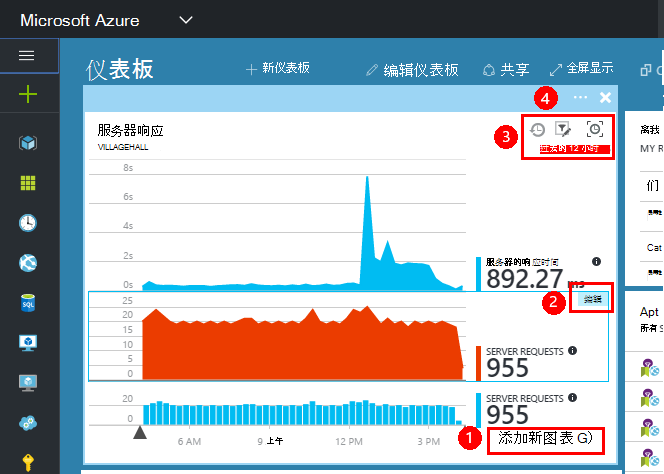

1. 该图块中添加图表。 
2. 设置度量、 维度分组依据和图表样式 （表、 关系图）。
3. 拖过图表放大;单击撤消按钮以重置时间跨度;该图块上的图表设置筛选器属性。
4. 设置平铺标题。

拼贴固定从公制的资源管理器刀片服务器有更多比拼贴从概述刀片固定的编辑选项。

对于固定的原始拼贴不受您的编辑结果。

## 仪表板之间切换

您可以保存多个仪表板和它们之间进行切换。 当您将图表或刀片式服务器时，它们会添加到当前仪表板。

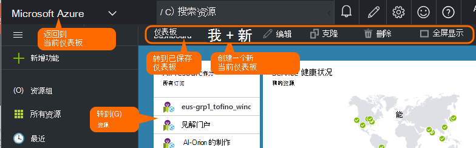

例如，可能有一个仪表板，在团队的房间，而另一台常规开发中显示全屏幕。

在仪表板上刀片式服务器显示为一张牌︰ 单击以转到刀片式服务器。 图表复制的图表中的原始位置。

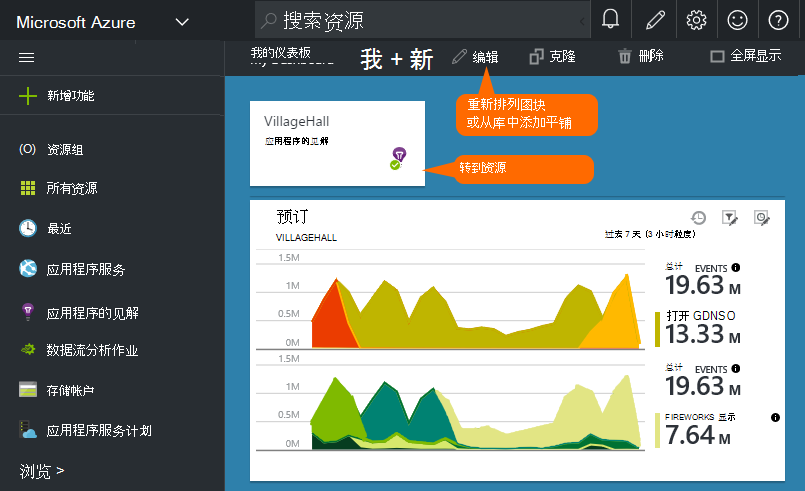

## 共享仪表板

当您创建一个仪表板时，您可以与其他用户共享。

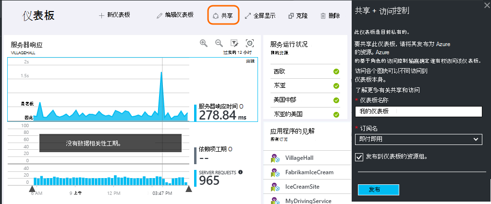

了解[角色和访问控制](app-insights-resources-roles-access-control.md)。

## 应用程序导航

概述刀片式服务器是您的应用程序有关的详细信息的网关。

* **任何图表或平铺**-单击任一平铺或图表以查看关于它所显示的更多详细信息。

### 概述刀片式服务器按钮

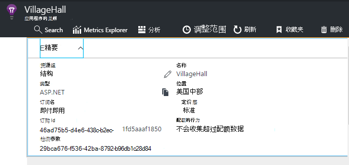

* [**测量数据资源管理器**](app-insights-metrics-explorer.md)-创建您自己的性能和使用情况的图表。
* [**搜索**](app-insights-diagnostic-search.md)-调查请求，例外情况之外，如事件的特定实例或记录的跟踪。
* [**分析**](app-insights-analytics.md)-对您遥测功能强大的查询。
* **时间范围**-调整刀片式服务器上的所有图表所都显示的范围。
* **删除**-删除此应用程序的应用程序理解资源。 此外，您应从应用程序代码中删除应用程序的见解软件包或编辑在您的应用程序直接到不同的应用程序理解资源遥测[检测键](app-insights-create-new-resource.md#copy-the-instrumentation-key)。

### 基本选项卡

* [检测项](app-insights-create-new-resource.md#copy-the-instrumentation-key)— 标识此应用程序资源。 
* 定价-使功能可用，并且已设置的音量上限。

### 应用程序导航栏

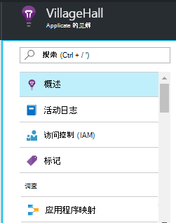

* **概述**-返回到应用程序概述刀片式服务器。
* **活动日志**的警报和 Azure 的管理事件。
* [**访问控制**](app-insights-resources-roles-access-control.md)— 为工作组成员和其他用户提供访问权限。
* [**标记**](../resource-group-using-tags.md)-使用标记组与其他应用程序。

调查

* [**应用程序映射**](app-insights-app-map.md)的活动图显示应用程序，组件派生自的相关性信息。
* [**主动预防性诊断**](app-insights-proactive-diagnostics.md)的审查最近的性能警报。
* [**实时流**](app-insights-metrics-explorer.md#live-stream)的一个固定组即时指标，适合于在部署新生成或调试。
* [**的可用性 Web 测试 /**](app-insights-monitor-web-app-availability.md) -将常规请求发送到 web 应用程序从周围 world.* 
* [**故障、 性能**](app-insights-web-monitor-performance.md)的异常、 故障率和响应时间对您的应用程序的请求，并从您的应用程序[依赖关系](app-insights-asp-net-dependencies.md)的请求。
* [**性能**](app-insights-web-monitor-performance.md)--响应时间、 响应时间依赖关系。 
* [服务器](app-insights-web-monitor-performance.md)的性能计数器。 可如果您[安装状态监视器](app-insights-monitor-performance-live-website-now.md)。

* **浏览器**的页面视图和 AJAX 性能。 可如果您[检测您的 web 页](app-insights-javascript.md)。
* 计算**使用**的页面视图、 用户和会话。 可如果您[检测您的 web 页](app-insights-javascript.md)。

配置

* **入门**-内联教程。
* **属性**-检测键、 订阅和资源 id。
* [预警](app-insights-alerts.md)-规格配置警报。
* [连续将导出](app-insights-export-telemetry.md)的配置导出到 Azure 存储的遥测。
* [性能测试](app-insights-monitor-web-app-availability.md#performance-tests)的设置在您网站上的综合负载。
* [配额和定价](app-insights-pricing.md)和[摄取取样](app-insights-sampling.md)。
* **API 访问**-创建[发布注释](app-insights-annotations.md)以及数据访问 API。
* [**工作项**](app-insights-diagnostic-search.md#create-work-item)的连接，以便检查遥测时，可以创建 bug 跟踪系统的工作。

设置

* [**锁定**](..\resource-group-lock-resources.md)的锁定 Azure 的资源
* [**自动化脚本**](app-insights-powershell.md)-导出 Azure 资源的定义，以便您可以使用它作为一个模板来创建新的资源。

支持

* **支持请求**-需要付费的订阅。 请参阅[获得帮助](app-insights-get-dev-support.md)。

## 下一步是什么？

||
|---|---
|[测量数据资源管理器](app-insights-metrics-explorer.md) 筛选器和段指标|
|[诊断搜索](app-insights-diagnostic-search.md) 查找和检查相关的事件的事件并创建的 bug |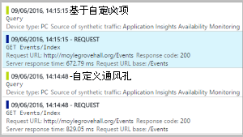
|[分析](app-insights-analytics.md) 功能强大的查询语言| 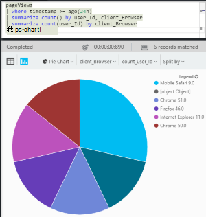

