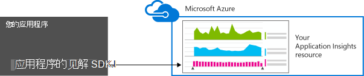
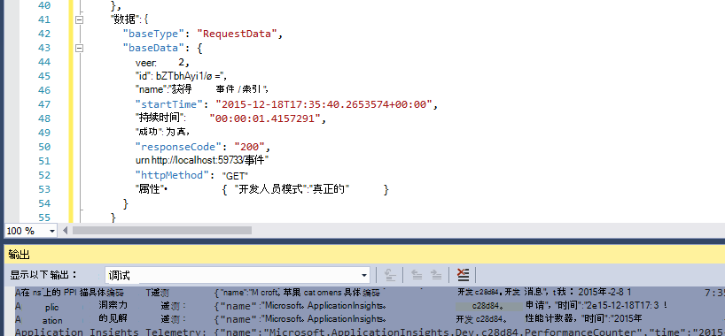
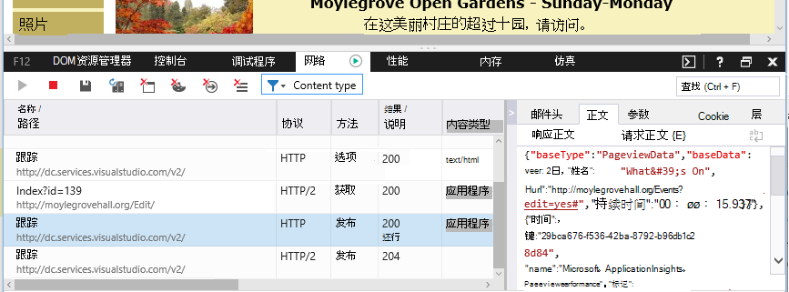

<properties 
    pageTitle="数据保留和存储在应用程序的见解" 
    description="保留和隐私策略声明" 
    services="application-insights" 
    documentationCenter=""
    authors="alancameronwills" 
    manager="douge"/>

<tags 
    ms.service="application-insights" 
    ms.workload="tbd" 
    ms.tgt_pltfrm="ibiza" 
    ms.devlang="na" 
    ms.topic="article" 
    ms.date="05/17/2016" 
    ms.author="awills"/>

# 数据收集、 保留和存储在应用程序的见解 

*在预览是应用程序的见解。*

当您安装[Visual Studio 应用程序理解][ start] SDK 应用程序中的，它将发送有关您的应用程序的遥测到云。 当然，负责开发人员想要知道准确发送的数据、 数据，会发生什么情况以及如何，他们可以保留对它的控制。 特别是，无法发送敏感数据，其中存储和安全程度是它是吗？ 

首先，简短的回答︰

* 运行"现成"的标准遥测模块不太可能向服务发送敏感数据。 遥测被关心负载、 性能和使用情况指标、 异常报告和其他诊断数据。 在诊断报告中显示的主用户数据的 Url;但是，您的应用程序在任何情况下不应将敏感数据放入 URL 中的纯文本。
* 您可以编写代码来发送其他自定义遥测，以帮助您进行诊断和监视的使用情况。 （此扩展性是一项强大功能的应用程序的见解）。它是有可能，错误地编写此代码，以使其包括个人和其他敏感数据。 如果您的应用程序处理此类数据，您应该对编写的所有代码应用强审核流程。
* 在开发和测试您的应用程序，可以很容易地检查由 SDK 要发送的内容。 这些数据显示在 IDE 和浏览器的调试输出窗口。 
* 将数据保存在[Microsoft Azure](http://azure.com)服务器位于美国。 （但您的应用程序可以运行任意位置）。Azure 具有[非常强的安全处理和满足范围广泛的法规遵从性标准](https://azure.microsoft.com/support/trust-center/)。 只有您和您指定的团队可以访问的数据。 Microsoft 员工可以限制对访问它只在特定情况下与您的知识。 它被加密传输过程中但不在服务器中。

本文的其余部分为基础进行阐述更详细地对这些问题的答案。 它旨在为自包含的以便可显示给同事不是直属团队的一部分。

## 应用程序的见解是什么？

[Visual Studio 应用程序理解][start]是服务可帮助您的 Microsoft 提供改进的性能和实时应用程序的可用性。 它会监视您的应用程序运行，测试过程中和之后已经发布或部署它的所有时间。 应用程序的见解创建图表和表，告诉你，例如，就大多数用户一天中的什么时间、 如何快速响应的应用程序是和程度由它所依赖的任何外部服务。 如果有故障、 故障或性能问题，您可以搜索中诊断原因的详细信息的遥测数据。 然后该服务将向您发送电子邮件的可用性和性能的应用程序中的任何更改时。

为了实现此功能，在您的应用程序，则该命令将其代码的一部分安装 SDK 应用程序的见解。 当运行您的应用程序时，SDK 监视其运行，并向应用程序理解服务发送遥测。 这是由[Microsoft Azure](http://azure.com)的云服务。 （但见解应用程序适用于任何应用程序，而不仅仅是承载在 Azure）。

该应用程序的见解服务存储和分析遥测。 若要查看搜索的存储遥测数据的分析，到 Azure 帐户登录，并为您的应用程序打开应用程序理解资源。 与您团队的其他成员或指定 Azure 的订阅服务器，还可以共享数据的访问。

您可以导出从应用程序深入服务，例如数据库或外部工具的数据。 每个工具提供从服务中获取的特殊键。 如有必要，可以吊销密钥。 

见解 Sdk 应用程序是可用于一系列应用程序类型︰ web 服务承载在自己 J2EE 或 ASP.NET 的服务器，或在 Azure;web 客户机-也就是说，在 web 页中运行的代码桌面应用程序和服务;例如，Windows Phone、 iOS 和 Android 设备应用程序。 它们都将遥测发送到相同的服务。

## 它收集哪些数据？

### 收集的数据是如何了？

有三种数据源︰

* SDK，您与您的应用程序集成[在开发过程中](app-insights-asp-net.md)，也可以[在运行时](app-insights-monitor-performance-live-website-now.md)。 有不同的应用程序类型的不同 Sdk。 此外，还有[网页的 SDK](app-insights-javascript.md)，这将加载到最终用户的浏览器和页。

 * 每个 SDK 包含多个[模块](app-insights-configuration-with-applicationinsights-config.md)，它们使用不同的技术来收集不同类型的遥测。
 * 如果您在开发过程中安装 SDK，您可以使用其 API 发送自己遥测，除了标准的模块。 此自定义遥测可以包括任何您想要发送的数据。
* 在某些 web 服务器，还有代理与应用程序一起运行和发送有关 CPU、 内存和网络使用量的遥测。 例如，Azure Vm、 Docker 主机和[J2EE 服务器](app-insights-java-agent.md)可以具有此类代理。
* [可用性测试](app-insights-monitor-web-app-availability.md)是在固定时间间隔将请求发送到您的 web 应用程序的进程运行 microsoft。 结果发送到应用程序的见解服务。

### 收集哪些类型的数据？

主要类别有︰

* [Web 服务器遥测](app-insights-asp-net.md)的 HTTP 请求。  Uri，用于处理请求、 响应代码、 客户端 IP 地址的时间。 会话 id。
* [Web 页](app-insights-javascript.md)的页上，用户和会话的计数。 页面加载时间。 例外情况。 Ajax 调用。
* 性能计数器-内存、 CPU、 IO，网络空间使用量。
* 客户端和服务器上下文的操作系统、 语言环境、 设备类型、 浏览器、 屏幕分辨率。
* [异常](app-insights-asp-net-exceptions.md)和崩溃的**堆栈转储**，生成 id 的 CPU 类型。 
* [依赖项](app-insights-asp-net-dependencies.md)-对外部服务，如在剩下，SQL，AJAX 调用。 URI 或连接字符串、 持续时间、 成功、 命令。
* [可用性测试](app-insights-monitor-web-app-availability.md)的持续时间的测试和步骤、 响应。
* [跟踪日志](app-insights-search-diagnostic-logs.md)和[自定义遥测](app-insights-api-custom-events-metrics.md) - **您的代码到您的日志或遥测的任何内容**。

[更多详细信息](#data-sent-by-application-insights)。

## 如何验证正在收集什么？

如果您正在开发使用 Visual Studio 应用程序，请在调试模式下 (F5) 运行应用程序。 遥测显示在输出窗口中。 据此，可以将其复制和其格式设置为 JSON 用于简单的检查。 

在诊断程序窗口还有更容易阅读。

打开网页，浏览器的调试窗口。

### 可以编写代码来筛选遥测发送之前？

这可以通过编写[遥测处理器插件](app-insights-api-filtering-sampling.md)。

## 数据保留多长时间？ 

原始数据点 （即，您可以检查在诊断搜索的项） 的保存 7 天。 如果您需要保留更长一些的数据，可以使用[连续的导出](app-insights-export-telemetry.md)将其复制到存储帐户。

聚合的数据 （即计数、 求平均值和度量资源管理器中看到的其他统计数据） 会保留在一丝一毫的 1 分钟为 30 天，然后 1 小时或 1 天 （具体取决于类型） 至少 90 天。

## 哪些人可以访问数据？

数据都是可见的如果有公司帐户，您的团队成员。 

它可以导出您和您的团队成员并无法复制到其他位置和传递给其他人。

#### Microsoft 与我的应用程序发送到应用程序理解的信息做什么？

Microsoft 只是为了向您提供该服务使用的数据。

## 数据保存在什么位置？ 

* 在美国。 

#### 可它存储在其他地方，例如在欧洲吗？ 

* 不是在现在。 

#### 这是否意味着我的应用程序必须寄宿在美国？

* 不。 您的应用程序可以运行任何地方在您自己的内部主机或云。

## 如何安全是我的数据？  

应用程序的见解是 Azure 服务在预览。 而在预览我们正在朝保护您的数据每[Azure 安全、 隐私和法规遵从性的白皮书](http://go.microsoft.com/fwlink/?linkid=392408)中介绍的策略。

数据存储在 Microsoft Azure 服务器中。 对于 Azure 门户中的客户、 帐户限制所述[Azure 安全、 隐私和法规遵从性文档](http://go.microsoft.com/fwlink/?linkid=392408)。 对于 Visual Studio 团队服务门户中的客户、 应用[Visual Studio 团队服务数据保护](http://download.microsoft.com/download/8/E/E/8EE6A61C-44C2-4F81-B870-A267F1DF978C/MicrosoftVisualStudioOnlineDataProtection.pdf)文档。 

仅限访问由 Microsoft 人员数据。 我们访问您的数据仅与您的权限，它是否支持您的应用程序理解使用需要。 

在我们所有的客户应用程序 （如数据速率和平均大小的跟踪） 的聚合中的数据用于提高应用程序的见解。

#### 其他人的遥测可能干扰我的应用程序理解数据？

他们无法使用检测键，可以在将 web 页的代码中找到其他遥测发送到您的帐户。 有足够的额外数据，度量标准将不能正确描述应用程序的性能和使用情况。

如果您与其他项目共享的代码，请记住删除检测项。

## 加密的数据 

不能在目前的服务器。

所有数据都加密其数据中心之间移动。

#### 在从应用程序到应用程序的见解服务器传输加密的数据？

是的我们可以使用 https 从几乎所有的 Sdk，包括 web 服务器、 设备和 HTTPS 网页将数据发送到门户网站。 唯一的例外是来自普通 HTTP web 页发送的数据。 

## 个人可识别信息

#### 无法发送到应用程序的见解的个人可识别信息 (PII)？ 

是，它是可能的。 

作为一般性指导原则︰

* 大多数标准遥测 （即，无需编写任何代码您发送遥测） 不包括显式的 PII。 但是，有可能识别用户，通过推理中的事件的集合。
* 异常和跟踪消息可能包含 PII
* 自定义遥测-也就是说，如 TrackEvent 所写在代码中使用的 API 或日志跟踪调用-可包含您选择的任何数据。

本文档末尾的表包含收集到的数据的更详细的说明。

#### 我负责遵守法律和法规与 PII 有关吗？

是的。 它是您有责任确保收集和使用数据的符合法律和法规，并与 Microsoft Online Services 的条款。

有关您的应用程序收集的数据和使用数据的方式，应适当地通知客户。

#### 我的用户可以打开关闭应用程序的见解？

不直接。 我们不提供您的用户可以运行要关闭应用程序的见解的开关。

但是，可以在应用程序中实现此类功能。 所有 Sdk 都包括关闭遥测集合 API 设置。 

#### 我的应用程序无意中收集敏感信息。 可以应用的见解清理此数据的操作，因此它不能保留？

应用程序的见解不筛选或删除您的数据。 应该适当地管理数据，并避免将此类数据发送给应用程序的见解。

## 发送应用程序理解的数据

Sdk 平台之间各不相同，有一些您可以安装的组件。 (请参阅[应用程序理解的入门][start]。)每个组件发送不同的数据。

#### 在不同的情况下发送的数据的类

您的操作  | （请参见下表） 收集的数据类
---|---
[为.NET web 项目添加应用程序深入 SDK][greenbrown] | ServerContext 这方面的推断 性能计数器 请求 **例外情况** 会话 用户
[在 IIS 上安装状态监视器][redfield]|依赖项 ServerContext 这方面的推断 性能计数器
[将见解 SDK 应用程序添加到 Java 的 web 应用程序][java]|ServerContext 这方面的推断 请求 会话 用户
[向 web 页添加 JavaScript SDK][client]|ClientContext  这方面的推断 页面 ClientPerf Ajax
[定义默认属性][apiproperties]|所有的标准和自定义事件的**属性**
[调用 TrackMetric][api]|数字值 **属性**
[调用跟踪 *][api]|事件名称 **属性**
[调用 TrackException][api]|**例外情况** 堆栈转储 **属性**
SDK 无法收集数据。 例如︰   -无法访问性能计数器  -遥测初始值设定项中的例外 | SDK 诊断
 

对于[其他平台 Sdk][platforms]，请参阅其文档。

#### 收集到的数据的类

收集的数据类 | 包括 （不是一个详尽的列表） 
---|---
**属性**|**任何数据-由您的代码**
DeviceContext |Id、 IP、 区域设置，设备型号、 网络、 网络类型、 OEM 名称、 角色实例、 角色名称、 设备类型的屏幕分辨率
ClientContext |操作系统、 语言环境、 语言、 网络、 窗口的分辨率
会话 | 会话 id
ServerContext |计算机名称、 区域设置，操作系统、 设备、 用户会话、 用户上下文、 操作 
这方面的推断 |从时间戳、 操作系统、 浏览器的 IP 地址的地理位置
指标 | 指标名称和值
事件 | 事件的名称和值
PageViews | URL 和页面名称或屏幕名称
客户端性能 | URL 中的页名称、 浏览器加载时
Ajax | HTTP 服务器从网页上调用
请求 |URL，持续的时间、 响应代码
依赖项|类型 （HTTP、 SQL），连接字符串或 URI，同步/异步、 持续时间、 成功、 （与状态监视器） 的 SQL 语句
**例外情况** | 类型、**消息**、 调用堆栈、 源文件和行号、 线程 id
系统崩溃 | 进程 id、 父进程 id、 崩溃线程 id;应用程序修补程序，识别，生成; 异常类型、 地址、 原因;经过模糊处理的符号和寄存器、 开始和结束的二进制地址、 二进制文件名称和路径，cpu 类型
跟踪 | **消息**和严重性等级
性能计数器 | 处理器时间、 可用内存、 请求速率、 异常率、 进程的专用字节、 IO 率、 请求持续时间中，请求队列长度
可用性 | Web 测试响应代码，每个测试步骤、 测试的名称、 时间戳、 成功、 响应时间、 测试位置的持续时间
SDK 诊断 | 跟踪消息或异常 

您可以[关闭一些通过编辑 ApplicationInsights.config 的数据][config]

## 贷方

本产品包含创建的 MaxMind，可以从[http://www.maxmind.com](http://www.maxmind.com)的 GeoLite2 数据。

## 视频

#### 介绍

> [AZURE.VIDEO application-insights-introduction]

#### 入门

> [AZURE.VIDEO getting-started-with-application-insights]

<!--Link references-->

[api]: app-insights-api-custom-events-metrics.md
[apiproperties]: app-insights-api-custom-events-metrics.md#properties
[client]: app-insights-javascript.md
[config]: app-insights-configuration-with-applicationinsights-config.md
[greenbrown]: app-insights-asp-net.md
[java]: app-insights-java-get-started.md
[platforms]: app-insights-platforms.md
[pricing]: http://azure.microsoft.com/pricing/details/application-insights/
[redfield]: app-insights-monitor-performance-live-website-now.md
[start]: app-insights-overview.md

 