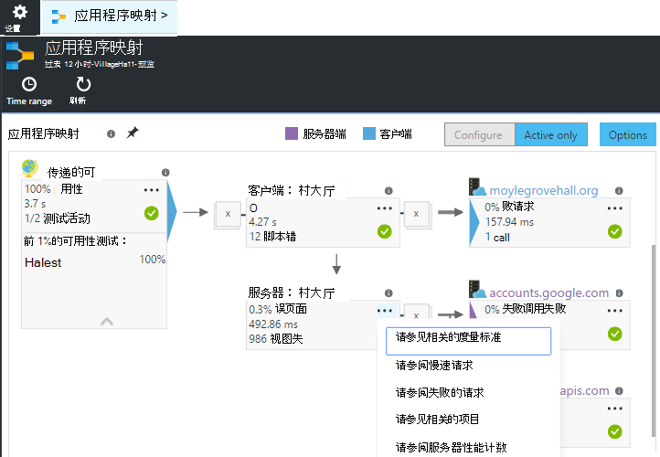
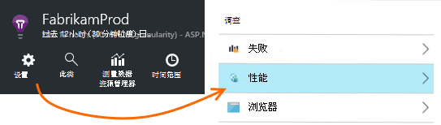
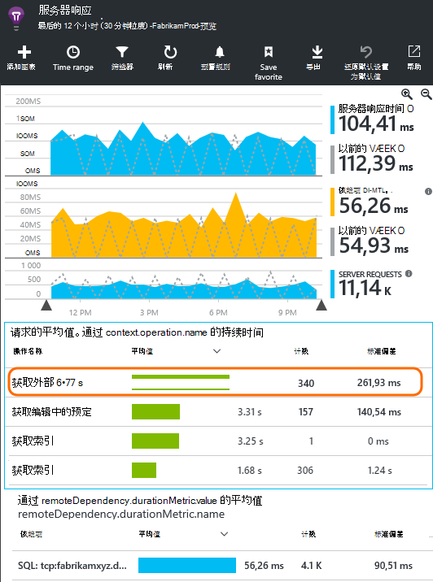
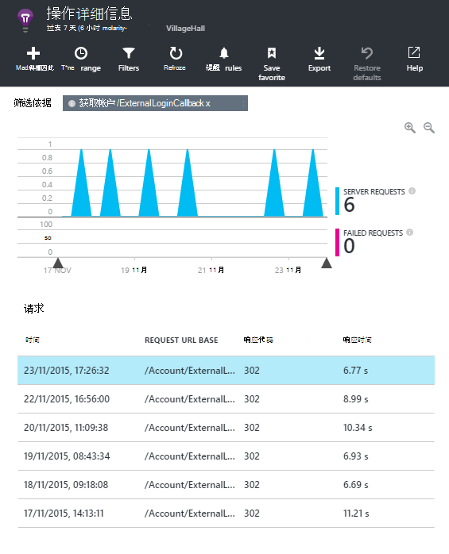
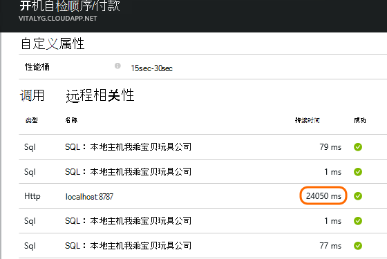
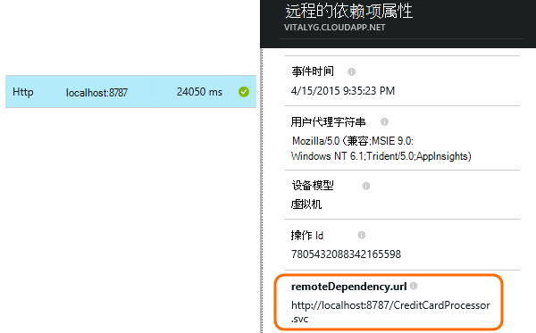
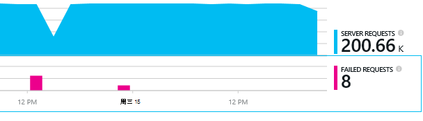
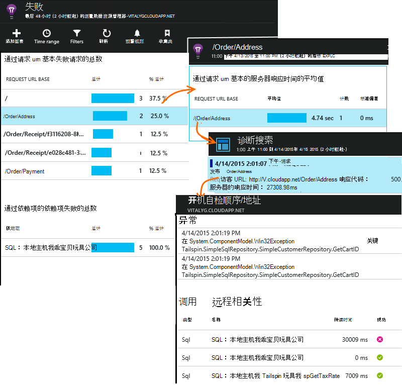

<properties 
    pageTitle="诊断问题的应用程序的见解中的依赖项" 
    description="查找故障和相关性所致的性能降低" 
    services="application-insights" 
    documentationCenter=""
    authors="alancameronwills" 
    manager="douge"/>

<tags 
    ms.service="application-insights" 
    ms.workload="tbd" 
    ms.tgt_pltfrm="ibiza" 
    ms.devlang="na" 
    ms.topic="article" 
    ms.date="05/12/2016" 
    ms.author="awills"/>
 
# <a name="diagnosing-issues-with-dependencies-in-application-insights"></a>诊断问题的应用程序的见解中的依赖项


*相关性*是由您的应用程序调用一个外部组件。 它通常是使用 HTTP，或数据库或文件系统调用的服务。 或在您的 web 页的脚本，它可回发给服务器的 AJAX 调用。 在 Visual Studio 应用程序的见解，可以轻松查看您的应用程序的依赖项的等待多长时间和频率的依赖项调用将失败。

## <a name="where-you-can-use-it"></a>您可以使用

开箱即用监视依赖项是当前可用于︰

* ASP.NET web 应用程序和 IIS 服务器上或在 Azure 上运行的服务
* [Java 的 web 应用程序](app-insights-java-agent.md)
* [Web 页](https://azure.microsoft.com/blog/ajax-collection-in-application-insights/)

对于其他类型，例如设备的应用程序，您可以编写监视器使用[TrackDependency API](app-insights-api-custom-events-metrics.md#track-dependency)。

全新的相关性监视器当前报告对这些类型的依赖项的调用︰

* ASP.NET
 * SQL 数据库
 * ASP.NET web 和使用基于 HTTP 绑定的 WCF 服务
 * 本地或远程 HTTP 调用
 * Azure DocumentDb、 表、 blob 存储和队列
* Java
 * 通过[JDBC](http://docs.oracle.com/javase/7/docs/technotes/guides/jdbc/)驱动程序，例如 MySQL、 SQL Server，PostgreSQL 或 SQLite 数据库调用。
* Web 页
 * [AJAX 调用](app-insights-javascript.md)

同样，您可以编写您自己的 SDK 调用来监视其他依赖项。

## <a name="to-set-up-dependency-monitoring"></a>若要设置依赖项的监视

安装相应代理的主机服务器。

平台 | 安装
---|---
IIS 服务器 | 无论是[安装状态监视器服务器上](app-insights-monitor-performance-live-website-now.md)或正在[升级到 4.6 或更高版本的.NET 框架应用程序](http://go.microsoft.com/fwlink/?LinkId=528259)，安装[应用程序深入 SDK](app-insights-asp-net.md)应用程序中。
Azure 的 Web 应用程序 | [应用程序的见解扩展](app-insights-azure-web-apps.md)
Java 的 web 服务器 | [Java 的 web 应用程序](app-insights-java-agent.md)
Web 页 | [JavaScript 监视器](app-insights-javascript.md)（网页监控之外没有其他设置）
Azure 的云服务 |  [使用启动任务](app-insights-cloudservices.md#dependencies)或[安装.NET framework 4.6 +](../cloud-services/cloud-services-dotnet-install-dotnet.md)  

状态监视器的 IIS 服务器不需要您重新生成应用程序的见解 sdk 的源项目。 

## <a name="application-map"></a>应用程序映射

应用程序映射作为视觉辅助手段发现您应用程序的组件之间的依赖关系。 



从在框中，您可以导航到相关的依赖项和其他图表。

单击 [x] 的小折叠子树。

针的映射到[仪表板](app-insights-dashboards.md)，它将会完全有效。

[了解更多](app-insights-app-map.md)。

## <a name="diagnosis"></a>诊断依赖项中的 web 服务器的性能问题

要评估您的服务器在请求的性能︰



向下滚动到请求的网格看︰



最上面的一个时间很长。 让我们看一下能否找到出其中所用的时间。

单击以查看单个请求事件的行︰




单击任何长时间运行的实例对其进行进一步检查。

> [AZURE.NOTE] 下滚动一点选择一个实例。 在管道中的延迟可能意味着顶部实例的数据不完整。

向下滚动到与此请求相关的远程相关性调用︰



它就像大部分时间处理此请求所用的本地服务调用。 

选择该行以获取更多信息︰




详细信息包括足够的信息来诊断问题。


## <a name="failures"></a>失败

如果失败的请求，请单击图表。



通过查找远程相关性对失败的请求类型和请求实例，请单击。





## <a name="custom-dependency-tracking"></a>自定义依赖项跟踪

标准的依赖项跟踪模块可自动发现外部依赖项，如数据库和 REST Api。 但是，您可能希望某些其他组件相同的方式来处理。 

您可以编写代码来发送相关性信息，使用相同的[TrackDependency API](app-insights-api-custom-events-metrics.md#track-dependency)使用的标准模块。

例如，如果您的代码与您没有自己编写的程序集生成时，可能时间所有调用它，了解它对响应时间作出何种贡献。 若要使此应用程序的见解中的依赖关系图表中显示的数据，将其使用发送`TrackDependency`。

```C#

            var success = false;
            var startTime = DateTime.UtcNow;
            var timer = System.Diagnostics.Stopwatch.StartNew();
            try
            {
                success = dependency.Call();
            }
            finally
            {
                timer.Stop();
                telemetry.TrackDependency("myDependency", "myCall", startTime, timer.Elapsed, success);
            }
```

如果您想要关闭标准依赖项跟踪模块，在[ApplicationInsights.config](app-insights-configuration-with-applicationinsights-config.md)中删除对 DependencyTrackingTelemetryModule 的引用。


## <a name="ajax"></a>Ajax

请参阅[Web 页](app-insights-javascript.md)。


 