<properties
    pageTitle="检测、 会审、 诊断"
    description="分析故障检测和诊断您的应用程序中的性能问题"
    authors="alancameronwills"
    services="application-insights"
    documentationCenter=""
    manager="douge"/>

<tags
    ms.service="application-insights"
    ms.workload="tbd"
    ms.tgt_pltfrm="ibiza"
    ms.devlang="na"
    ms.topic="article" 
    ms.date="11/06/2015"
    ms.author="awills"/>

# 检测、 会审和诊断与应用程序的见解

*在预览是应用程序的见解。*

应用程序的见解有助于您了解您的应用程序的执行方式和活动时使用。 并且如果有问题，还可以让您了解它，可帮助您评估的影响，并帮助确定原因。

下面是从团队开发 web 应用程序的帐户︰

* *"几天前，我们部署了次要的修补程序。我们没有运行全面测试流程，但遗憾的是有一些意外的更改合并到负载，导致前端和后端之间的不兼容性。立即，surged 的服务器异常，激发我们的警报，并已意识到这一情况。走在应用程序的见解门户上单击几下，我们有了足够的信息，从异常调用堆栈，以缩小问题范围。我们立即回滚和有限的损失。应用程序的见解已 devops 的这一部分中循环非常简单并且切实可行。"*

我们来看一个典型的 web 开发团队如何使用应用程序的见解来监视性能。 我们将采用在 Fabrikam 银行开发的网上银行系统 (OBS) 团队。

小组将在一个类似这样的循环︰

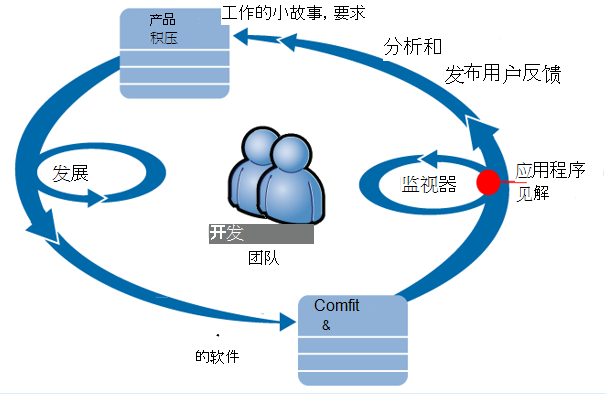

送入其开发积压 （任务列表） 的要求。 他们以短工作冲刺，经常交付可用软件的改进和扩展现有应用程序的窗体中的通常。 实时应用程序经常使用新功能更新。 活动时，团队将监视其性能和使用情况的应用程序理解帮助。 这种分析进回其开发积压。

该团队使用应用程序的见解来监视实时 web 应用程序紧密︰
* 性能。 他们希望了解如何响应时间随请求计数;多少正在使用 CPU、 网络、 磁盘和其他资源;和瓶颈所在之处。
* 失败。 如果出现异常或失败的请求，或如果性能计数器超出其舒适的范围，工作组需要迅速知道，以便他们可以执行的操作。
* 用法。 发布新功能时，团队想知道到何种程度上使用它，以及用户是否有任何与它的困难。

我们将重点反馈周期的部分︰

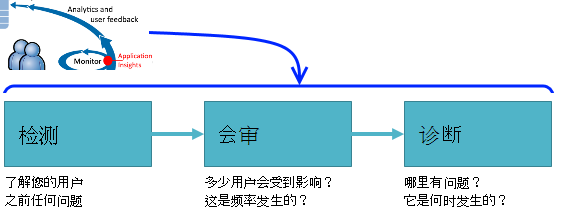

## 检测低可用性

Marcela Markova 是 OBS 团队，资深的开发人员，并承担领导角色在监视联机性能。 她将多个[web 测试]设置[availability]:

* 该应用程序的主登录页的单个 URL 测试 http://fabrikambank.com/onlinebanking/。 她设置标准的 HTTP 代码 200 和文本欢迎 ！。 如果这个测试失败，就会有严重问题的网络或服务器或可能的部署问题。 （或人更改了欢迎 ！ 在页而不让她知道消息。）

* 深入了解多步测试，登录并获取当前的帐户列表，检查每一页上的几个关键细节。 此测试验证帐户数据库的链接工作。 她使用一个虚构的客户 id︰ 少量维护用于测试目的。

具有这些设置的测试，Marcela 是相信团队可以快速确定关于任何中断。  

为 web 测试图上的红点显示故障︰

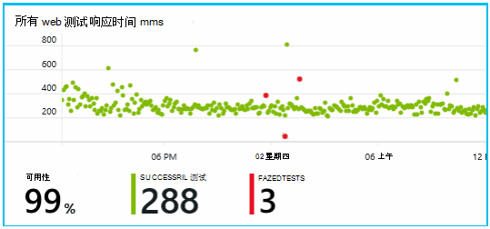

但更重要的是，有关任何失败的通知将通过电子邮件发送给开发团队。 以这种方式，他们知道有关它之前几乎所有的客户。

## 显示器的性能指标

应用程序理解的概述页上没有显示各种[关键指标]的图表[perf]。

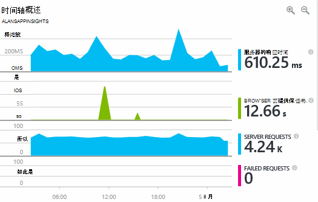

浏览器页面加载时间是直接从网页发送遥测从派生的。 服务器的响应时间、 服务器请求计数和计数失败的请求 web 服务器中的所有度量，并从这里发送到应用程序的见解。

Marcela 是稍微关心在服务器响应图中，当服务器收到 HTTP 请求时从用户的浏览器，并返回响应时显示之间的平均时间。 根据系统负荷变化并非罕见在该图表中的变体。 但在这种情况下，似乎在计数中的请求，和大小型升高之间的相关性中的响应时间将增加。 它可能表示系统只运转极限状态。 

她打开服务器图表︰

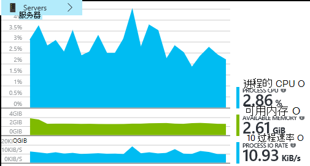

似乎那里资源限制，没有迹象也许服务器响应图中的碰撞都只是一个巧合。

## 警报

不过，她希望在响应时间上留意。 如果他们转得太高，她希望立即了解它。

因此她设置[警报][metrics]，对响应时间大于典型阈值。 这使她信心，她就知道关于它，如果响应速度太慢。

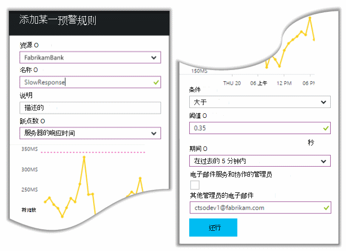

警报可以设置上各种各样的其他指标。 例如，可以接收电子邮件如果异常计数变为高，或者可用的内存不足，或如果在客户端请求中有高峰。

## 主动预防性诊断的警报

第二天，电子邮件警报 does 来自应用程序的见解。 但当她打开它时，她发现没有她设置响应时间警报。 相反，它可以告诉她已能在失败的请求-即返回了失败代码 500 或更多的请求。

失败的请求会用户遇到错误-通常后面的代码中引发的异常。 也许，他们看到一条消息，说"很抱歉我们无法更新您的详细信息，稍后再试"，或在绝对 embarrassing 坏的情况下，在用户的屏幕上，由 web 服务器堆栈转储。

此警报是奇怪，因为她看上, 一次的失败的请求数是低水平 50。 少量的故障是出现在繁忙的服务器。 

它也是她的奇怪的因为她没有配置此警报。 事实上，预防性诊断程序附带了自动应用程序的见解。 它会自动调整到您的应用程序常见的故障模式和"获取使用到"失败在特定页上，或在高负载时，或链接到其他指标。 只有上面就会上升，它会引发警报。

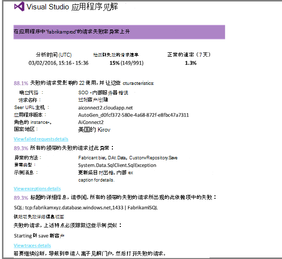

这是一个非常有用的电子邮件。 只是，它不会引发警报;它太做了大量的诊断和诊断工作。

它显示多少客户受影响，哪个 web 页或操作。 Marcela 可以决定她是否需要让整个团队消防演练，为处理这是否可以忽略直到下一周。

电子邮件还显示特定异常发生，并且-甚至是有趣的失败是与失败对特定数据库相关联的详细信息。 这解释了为什么故障突然出现即使 Marcela 的团队最近未部署任何更新。 

她执行 ping 操作的数据库团队的领导者。 是的它们释放的热修补程序在过去的半小时;并且，或许有可能次要架构更改...

因此问题是出在固定，即使之前研究日志，和它产生的 15 分钟内到达。 但是，Marcela 单击链接以打开应用程序的见解。 打开直接继续失败的请求，而且她可以看到失败的数据库调用关联的依赖项的调用列表中。 

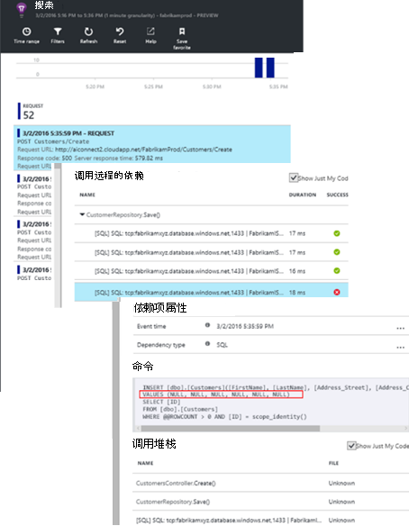

## 异常检测

与少量的安装程序，[例外情况](app-insights-asp-net-exceptions.md)被报告给应用程序的见解自动。 它们还可捕获明确通过对[TrackException()](app-insights-api-custom-events-metrics.md#track-exception)的调用插入代码︰  

    var telemetry = new TelemetryClient();
    ...
    try
    { ...
    }
    catch (Exception ex)
    {
       // Set up some properties:
       var properties = new Dictionary <string, string>
         {{"Game", currentGame.Name}};

       var measurements = new Dictionary <string, double>
         {{"Users", currentGame.Users.Count}};

       // Send the exception telemetry:
       telemetry.TrackException(ex, properties, measurements);
    }

Fabrikam 银行团队已发展始终发送异常，遥测的做法，除非有明显的恢复。  

事实上，他们的战略是比这更多︰ 他们发送遥测在每种情况下，客户对于在什么他们想要做，是否或不对应的代码中的异常沮丧。 例如，如果外部间银行转帐系统返回一些操作原因 （客户无过错）"不能完成此项交易"的消息然后他们跟踪该事件。

    var successCode = AttemptTransfer(transferAmount, ...);
    if (successCode < 0)
    {
       var properties = new Dictionary <string, string>
            {{ "Code", returnCode, ... }};
       var measurements = new Dictionary <string, double>
         {{"Value", transferAmount}};
       telemetry.TrackEvent("transfer failed", properties, measurements);
    }

TrackException 用于报告异常，因为它会发送一份堆栈;TrackEvent 用于报告的其他事件。 您可以将附加的任何属性都可能有助于诊断。

异常和事件显示在[诊断搜索][diagnostic]刀片式服务器。 您可以深入到他们的其他属性，请参阅和堆栈跟踪。

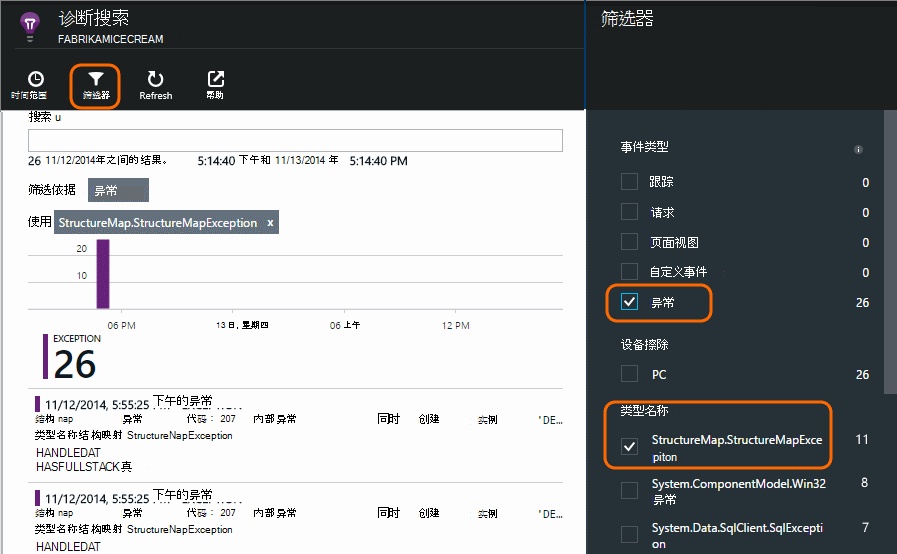

## 监视用户活动

响应时间一致地好后，有几个例外情况，开发团队可以考虑如何提高用户的体验，以及如何鼓励更多用户能够实现所需的目标。

例如，通过 web 站点的典型用户历程有清晰的漏斗︰ 很多客户看的速率的不同类型的贷款;其中一些填写报价单窗体中;和的那些人获得报价，少数继续操作并取消贷款。

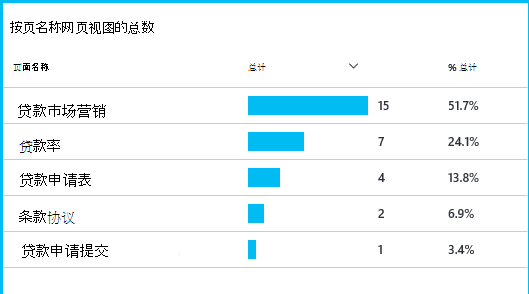

通过考虑客户的最大号的减弱，业务可以计算出如何通过获得更多的用户，到漏斗的底部。 在某些情况下可能有用户体验 (UX) 失败-例如，下一步按钮很难找到，或说明不明显。 更可能有更大业务理由放向外︰ 借贷率也许是太高。

任何原因，数据可帮助团队计算出用户在做什么。 可以插入详细跟踪调用计算出更多详细信息。 可以使用 TrackEvent() 来计算任何用户的操作，如还清贷款的巨大成就为单独的按钮单击的具体细节。

团队习惯于让有关用户活动的信息。 如今，每当他们设计的新功能，他们计算出如何获取有关其用法的反馈。 他们设计跟踪调用从一开始的功能。 他们使用反馈来提高每个开发周期中的功能。

## 主动预防性监控  

Marcela 不只终日等待通知。 每次重新部署之后不久, 她将对[响应时间][perf]的总体图和最慢的请求，以及异常计数表。  

她可以评估每个部署中，对性能的影响通常将其最后一个每周进行比较。 如果突然的 worsening，她将与相关开发人员引发的。

## 会审

-评估的严重性和范围问题-会审后检测的第一步。 应该我们动员小组在午夜？ 或可以它离开直到积压工作中的下一个方便差距？ 有在会审中的一些关键问题。

发生多少？ 概述刀片式服务器上的图表提供某些角度来看问题。 例如，Fabrikam 应用程序生成四个 web 测试警报一夜。 在上午看图表，团队可以看到没有确实有些红色的点，就好像仍然大部分测试是绿色。 钻孔到可用性图表，很明显所有这些间歇性的问题已从一个测试位置。 这显然是影响只有一个路由器，网络问题，并很有可能会自行清除。  

与此相反，异常计数或响应时间的关系图中生动且稳定上升显然是死机有关的内容。

有用的诊断方法是尝试它自己。 如果您遇到相同的问题，您知道它是真实的。

用户的哪些部分会受到影响？ 要获得一个粗略的答案，请将故障率除以会话数。

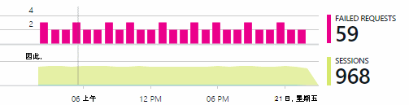

在响应较慢问题，将每一页的使用频率与慢响应请求的表进行比较。

如何重要的是被禁止的方案？ 如果这是阻止特定用户情景的功能问题，是否有关系得多？ 如果客户无法支付其账单，这是严重的;如果他们不能更改其屏幕颜色首选项，或许它可以一直等待。 事件或异常的详细信息或标识慢速网页，告诉您的客户有问题。

## 诊断

诊断并不是调试完全相同。 开始跟踪通过代码之前，您应该大致了解原因，何时、 何地出现问题。

**它是何时发生的？** 事件和指标图表提供的历史视图便于将效果与可能的原因相关联。 如果响应时间或异常率有间歇性的高峰期，看看请求计数︰ 如果它达到峰值同时，那么它看起来像一个资源问题。 您需要分配更多的 CPU 或内存吗？ 或者是它不能管理负载的相关性？

**它是我们？**  如果有突然放中的特定类型 — 例如客户希望帐户对帐单的性能有可能可能是请求的外部的子系统，而不是请求的 web 应用程序。 在测量数据资源管理器，选择依赖项故障率和相关性工期率和比较一段过去几小时或几天您检测到的问题与它们的历史记录。 如果有会将更改关联起来，外部子系统可能怪。  

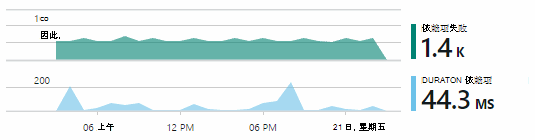

一些慢依赖性问题是地理问题。 Fabrikam 银行使用 Azure 的虚拟机，并且发现，它们有无意中定位其 web 服务器和帐户服务器在不同的国家/地区。 极大改进通过迁移带来的其中之一。

**我们做什么？** 如果该问题似乎不是一个依赖项，并且如果它并不总是存在，它可能由最近的更改。 提供公制和事件图表的历史观点容易与部署关联的任何突然更改。 它可减少搜索的问题。

**这是怎么回事？** 一些问题很少发生，并且很难跟踪通过离线测试。 我们可以做的全部操作是尝试实时发生时捕获 bug。 您可以检查异常报表中的堆栈转储。 此外，您可以编写跟踪调用使用您喜爱的日志记录框架或 TrackTrace() 或 TrackEvent()。  

Fabrikam 存在间歇性问题间帐户转移，但只与某些科目类型。 要更好地理解发生了什么，他们 TrackTrace() 调用插入到代码中，将科目类型为属性附加到每个调用中的关键问题。 这样做更容易筛选出那些在诊断搜索跟踪。 他们还跟踪调用附加属性和度量值作为参数值。

## 处理它

一旦已经诊断出问题，可以使一个计划来修复它。 您可能需要回滚最近的更改，或者也许可以只是继续操作，并修复它。 完成此修复程序后，应用程序的见解将告诉您是否成功。  

Fabrikam 银行的开发团队需要更结构化的方法性能测量比从前到之前使用这些应用程序的见解。

* 在具体措施方面的性能目标应用程序的见解概述页中设置它们。

* 他们设计的性能度量值到应用程序中从一开始，如测量数据，测量用户进度，通过 funnels。  

## 使用

应用程序的见解也可用来了解用户执行操作的应用程序。 后平稳运行，团队希望知道哪些功能是最常用的用户喜欢或有困难，并隔多久他们回来。 这将有助于它们排定他们即将进行的工作。 并且他们可以规划来测量每个功能的成功作为开发周期的一部分。 [阅读更多][usage]。

## 您的应用程序

这是一个团队使用应用程序不只是要解决个人问题，而是提高其开发生命周期的见解。 我希望它让您了解应用程序的见解如何帮助您改进您自己应用程序的性能的一些想法。

## 视频

[AZURE.VIDEO performance-monitoring-application-insights]

<!--Link references-->

[api]: app-insights-api-custom-events-metrics.md
[availability]: app-insights-monitor-web-app-availability.md
[diagnostic]: app-insights-diagnostic-search.md
[metrics]: app-insights-metrics-explorer.md
[perf]: app-insights-web-monitor-performance.md
[usage]: app-insights-web-track-usage.md
 
