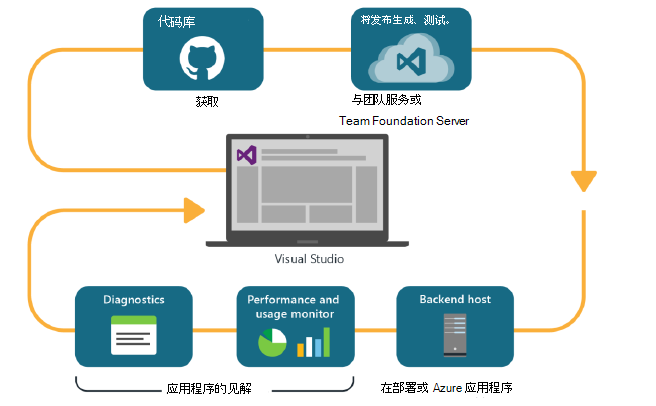
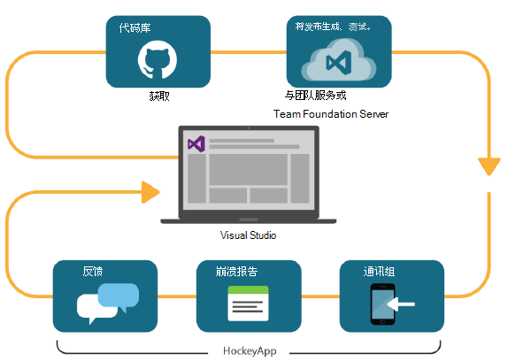

<properties
    pageTitle="开发人员分析"
    description="使用 Visual Studio、 应用程序的见解和 HockeyApp DevOps"
    authors="alancameronwills"
    services="application-insights"
    documentationCenter=""
    manager="douge"/>

<tags
    ms.service="application-insights"
    ms.workload="tbd"
    ms.tgt_pltfrm="ibiza"
    ms.devlang="na"
    ms.topic="article" 
    ms.date="05/18/2016"
    ms.author="awills"/>

# 与应用程序的见解和 HockeyApp 的开发人员分析

*在预览是应用程序的见解。*

许多项目运行快速[DevOps](https://en.wikipedia.org/wiki/DevOps)周期。 生成并发布他们的应用程序，获取有关如何执行和用户执行的操作，反馈和再使用这些知识来计划下一步开发周期。 

若要监视使用情况和性能，务必具备了遥测从实时应用程序，以及从用户自己的反馈。 

许多系统由多个组件︰ 一个 web 服务、 后端处理器或数据存储和运行在用户的浏览器中或以电话或其他设备中的应用程序的客户端软件。 从这些不同的组件遥测不得不合起来。

某些版本限制了分发给指定的测试;我们有还组织 flighting （受限制的访问群体的新增功能的测试），和一个 |B 测试 （并行测试的其他 UI）。

管理分布和集成监视通过多个客户端和服务器组件并不是一项重要任务。 此过程将应用程序的体系结构的一个基本部分︰ 我们不能创建这种类而无需迭代开发周期和监视工具很好的系统。

在本文中，我们将看 devOps 周期监视方面如何适应过程的其他部分。 

如果您想要看一看一个具体的例子，还有[有趣的案例研究](http://aka.ms/mydrivingdocs)具有多个客户端和服务器组件。

## DevOps 周期

Visual Studio 和开发分析工具提供完全集成的 devOps 的体验。 例如，此处是典型的 web 应用程序 （它可以是 Java，Node.js 或 ASP.NET） 周期︰

* 开发人员签入到代码库中，或将合并到主分支。 存储库是 Git 在此图中，但它同样可能是[Team Foundation 版本控制](https://www.visualstudio.com/docs/tfvc/overview)。
* 所做的更改会触发一个构建和单元测试。 在[Visual Studio 的团队服务或其内部伙伴，Team Foundation Server](https://www.visualstudio.com/docs/vsts-tfs-overview)可以生成服务。 
* 成功生成和单元测试可以[触发自动部署](https://www.visualstudio.com/docs/release/author-release-definition/more-release-definition)。 Web 应用程序主机可以是您自己的 web 服务器或 Microsoft Azure。 
* 从实时应用程序的遥测被发送到[应用程序的见解](app-insights-overview.md)，同时从服务器和[客户端浏览器](app-insights-javascript.md)。 那里，您可以分析应用程序和使用模式的性能。 功能强大的[搜索工具](app-insights-analytics.md)帮助您诊断问题。 [警告](app-insights-alerts.md)确保一旦它出现知道有关的问题。 
* 下一步开发周期被告知的实时遥测数据的分析。

### 设备与桌面应用程序

有关设备和桌面应用程序，分发周期中的部分是稍有不同，因为我们不只上传到一个或两个服务器。 相反，成功的生成和单元测试可以[触发上传到 HockeyApp](https://support.hockeyapp.net/kb/third-party-bug-trackers-services-and-webhooks/how-to-use-hockeyapp-with-visual-studio-team-services-vsts-or-team-foundation-server-tfs)。 HockeyApp 监督分发到您的团队的测试用户 （或一般公众，如果您愿意）。 

HockeyApp 还将收集的性能和使用情况数据，表单中︰

* 逐字的用户反馈屏幕抓图
* 崩溃报告
* 自定义编码您的遥测。

再一次完成 devOps 周期为您制定未来发展计划，根据所获得的反馈信息。

## 设置开发人员分析

对于每个应用程序-移动组件或 web 或桌面 — 步骤基本上是相同的。 对于许多类型的应用程序，Visual Studio 自动执行这些步骤中的一部分。

1. 向您的应用程序中添加相应的 SDK。 用于设备的应用程序，它是 HockeyApp，并就对 web 服务应用程序的见解。 每个有多个变量用于不同平台。 （它也是可以使用任一 SDK 的桌面应用程序，建议 HockeyApp 也是如此。）
2. 应用程序的见解或 HockeyApp 门户，具体取决于您使用的 SDK 中注册您的应用程序。 这是您将您的实时应用程序中看到分析。 可以检测键或 ID，您可以将其配置到您的应用程序，使 SDK 知道发送其遥测的位置。
3. 添加自定义代码 （如果需要） 来记录事件或指标，以帮助您进行诊断或分析性能和使用情况。 没有大量的监控内置的因此您不需要在您的第一个周期这。
3. 用于设备的应用程序︰
 * 将调试版本上传到 HockeyApp。 从这里您可以将它分发给测试用户的团队中。 只要您上载后续生成，团队将会收到通知。
 * 当您设置您连续时生成服务，创建插件的步骤用于将上传到 HockeyApp 的发布定义。

### 分析和 HockeyApp 遥测的导出

您可以调查 HockeyApp 自定义并记录使用分析和连续导出功能的应用程序的见解通过[一座桥梁设置](app-insights-hockeyapp-bridge-app.md)遥测。

## 下一步行动
 
以下是不同类型的应用程序的详细的说明︰

* [ASP.NET web 应用程序](app-insights-asp-net.md) 
* [Java 的 web 应用程序](app-insights-java-get-started.md)
* [Node.js web 应用程序](https://github.com/Microsoft/ApplicationInsights-node.js)
* [iOS 应用程序](https://support.hockeyapp.net/kb/client-integration-ios-mac-os-x-tvos/hockeyapp-for-ios)
* [Mac OS X 应用程序](https://support.hockeyapp.net/kb/client-integration-ios-mac-os-x-tvos/hockeyapp-for-mac-os-x)
* [Android 应用程序](https://support.hockeyapp.net/kb/client-integration-android/hockeyapp-for-android-sdk)
* [通用的 Windows 应用程序](https://support.hockeyapp.net/kb/client-integration-windows-and-windows-phone/how-to-create-an-app-for-uwp)
* [Windows Phone 8 和 8.1 应用程序](https://support.hockeyapp.net/kb/client-integration-windows-and-windows-phone/hockeyapp-for-windows-phone-silverlight-apps-80-and-81)
* [Windows Presentation Foundation 应用程序](https://support.hockeyapp.net/kb/client-integration-windows-and-windows-phone/hockeyapp-for-windows-wpf-apps)

