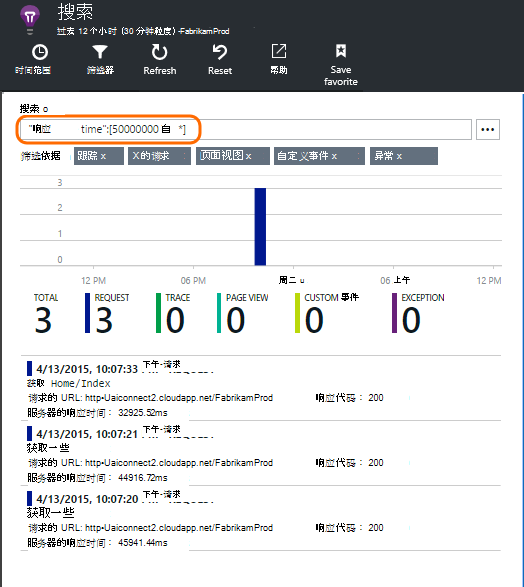

<properties 
    pageTitle="使用诊断搜索 |Microsoft Azure" 
    description="搜索和筛选请求的单个事件日志跟踪。" 
    services="application-insights" 
    documentationCenter=""
    authors="alancameronwills" 
    manager="douge"/>

<tags 
    ms.service="application-insights" 
    ms.workload="tbd" 
    ms.tgt_pltfrm="ibiza" 
    ms.devlang="na" 
    ms.topic="article" 
    ms.date="06/09/2016" 
    ms.author="awills"/>
 
# 在应用程序的见解使用诊断搜索

诊断的搜索是一种功能的[应用程序理解][start]用于查找和浏览各个遥测项，例如页面视图、 异常，或 web 请求。 然后您可以查看日志跟踪和已编码的事件。

## 在其中看到诊断搜索？

### 在 Azure 门户

您可以显式打开诊断搜索︰

而且还会打开时单击完一些图表和网格项。 在这种情况下，预先设置其筛选器进行重点放在所选的项的类型。 

例如，如果您的应用程序是 web 服务，概述刀片式服务器显示请求量的图表。 请单击，然后到更详细的图表，获取与显示多少请求所做的每个 URL 的列表。 单击任一行，并获得该 URL 的各个请求列表︰

主体的诊断搜索列出了遥测项目-服务器请求的页面视图、 自定义事件的代码，等等。 在列表的顶部是摘要图表显示一段时间的事件计数。

事件通常显示在诊断搜索公制的资源管理器中出现之前。 虽然刀片式服务器刷新本身的时间间隔，您可以单击刷新，如果您正在等待特定事件。

### 在 Visual Studio 中

在 Visual Studio 中打开搜索窗口︰

搜索窗口具有相同的功能作为 web 门户︰

## 取样

如果您的应用程序生成了大量遥测 (并且您正在使用 ASP.NET SDK 版本 2.0.0-beta3 或更高版本)，自适应采样模块会自动减少量由发送仅代表事件的一部分发送到门户网站。 但是，与同一个请求相关的事件将选择或取消选择作为一个组中，以便您可以找到相关事件之间。 

[关于采样](app-insights-sampling.md)。

## 检查各项

选择任何遥测项以查看键字段和相关的项目。 如果您想要查看完整的字段集，请单击"..."。 

若要查找字段的完整集，使用普通字符串 （不带通配符）。 遥测的类型取决于可用的字段。

## 创建工作项

从遥测中的任何项目的详细信息，可以在 Visual Studio 的团队服务创建一个 bug。 

第一次执行此操作，您需要配置您的团队服务帐户和项目的链接。

(也可以转到配置刀片式服务器从设置 > 的工作项。)

## 筛选事件类型

打开刀片式服务器筛选器并选择您想要查看的事件类型。 （如果以后，您想要还原的打开刀片式服务器的筛选器，请单击重置。）

事件类型包括︰

* **跟踪**-其中包括 TrackTrace、 log4Net、 NLog 和 System.Diagnostic.Trace 的调用的诊断日志。
* **请求**的服务器应用程序，包括页面、 脚本、 图像、 样式文件和数据接收到的 HTTP 请求。 这些事件用来概述图表创建的请求和响应。
* **页面视图模式下**的 web 客户端，发送的遥测用来创建页面查看报告。 
* **自定义事件**-如果您到[影像]的顺序插入对 TrackEvent() 的调用[track]，您可以在此处搜索它们。
* **异常**的服务器上，和那些通过使用 TrackException() 记录未捕获的异常。

## 对属性值筛选

您可以筛选其属性的值的事件。 可用的属性取决于您选择的事件类型。 

例如，挑选出具有特定响应代码的请求。

选择某个特定的属性没有值具有相同的效果与选择所有值;它将关闭对该属性进行筛选。

### 缩小搜索范围

请注意右边的筛选器值的计数显示在当前筛选设置中会有多少处。 

在此示例中，它已清除`Reports/Employees`请求中大部分 500 错误的结果︰

另外如果希望，还看到其他的事件都发生在这段时间，您可以检查**包含未定义的属性的事件**。

## 删除 bot 和 web 测试通讯

使用**真实或综合通信**的筛选和检查**真实**。

您还可以筛选源**的合成流量**。

## 检查单个事件

添加到筛选器请求名称集然后可以检查该事件的个别事件。

对于请求事件详细信息显示在处理请求时出现的异常。

单击要查看其详细信息，包括堆栈跟踪的异常。

## 查找具有相同属性的事件

查找所有具有相同的属性值的项目︰

## 跃点计数值进行搜索

获取所有请求的响应时间 > 5 条。  在计时周期表示时间︰ 10000 计时周期 = 1 毫秒。

## 搜索数据

您可以搜索条件中的任何属性值。 这是特别有用如果您已经编写了[自定义事件][track]属性值。 

您可能希望设置一个时间范围内，为在较短范围内的搜索速度更快。 

搜索条件，不是子字符串。 术语是字母数字字符串，如包括某些标点。 和 _。 例如︰

术语|由*不*匹配|但这些匹配
---|---|---
HomeController.About|有关 家庭|h\*有关 家庭\*
IsLocal|本地 是 \*本地|交换机间链路\* islocal i\*l\*
新的延迟|w d|新增功能 延迟 n\* AND d\*

以下是可以使用的搜索表达式︰

示例查询 | 效果 
---|---
速度慢|查找其字段包含术语的日期范围中的所有事件"都慢速"
数据库字段|符合 database01，databaseAB... ? 不允许一个搜索项开头。
数据库 * |与数据库、 database01、 databaseNNNN  * 不允许使用的搜索词开头
苹果和香蕉|查找包含两个条款的事件。 使用 capital"以及"未"和"。
苹果或香蕉 苹果香蕉|查找包含任一条件的事件。 使用"OR"，不"。 < /br/ > 短窗体。
苹果不是香蕉 苹果的香蕉|查找包含一个术语，但不是在其他的事件。 缩写形式。
应用程序 * 和香蕉-(grape pear)|逻辑运算符和括号。
"指标": 0 至 500 "指标": 500 到 * | 查找包含指定的值范围内测量的事件。

## 保存搜索

设置所需的所有筛选器后，可以将搜索另存为收藏。 如果您工作中组织的帐户，可以选择是否要将其与其他团队成员共享。

请参阅搜索，**请转到概述刀片式服务器**并打开收藏夹:

如果您保存具有相对的时间范围，重新打开刀片式服务器有最新的数据。 如果使用绝对的时间范围内保存，您看到的相同的数据每次。

## 将多个遥测发送到应用程序的见解

除了发送的见解 SDK 应用程序的全新的遥测数据，您可以︰

* 捕获日志跟踪从[.NET]中您最喜欢的日志记录框架[netlogs]或[Java][javalogs]。 这意味着可以搜索日志跟踪，并将它们与页面视图、 异常和其他事件相关联。 
* [编写代码][track]发送自定义事件、 页面视图和异常。 

[了解如何将日志和自定义遥测发送到应用程序的见解][trace]。

## 问与答

### 保留的数据量？

每秒钟从每个应用程序的事件达 500 个。 事件保留七天。

### 如何看到在我的服务器请求中发送的数据？

我们不自动日志发送数据，但您可以使用[TrackTrace 或日志调用][trace]。 将发布数据放入消息参数。 不能对邮件筛选的方式可以属性，但大小限制是更长的时间。

## 下一步行动

* [将日志和自定义遥测发送到应用程序的见解][trace]
* [设置的可用性和响应能力测试][availability]
* [故障排除][qna]

<!--Link references-->

[availability]: app-insights-monitor-web-app-availability.md
[javalogs]: app-insights-java-trace-logs.md
[netlogs]: app-insights-asp-net-trace-logs.md
[qna]: app-insights-troubleshoot-faq.md
[start]: app-insights-overview.md
[trace]: app-insights-search-diagnostic-logs.md
[track]: app-insights-api-custom-events-metrics.md

 