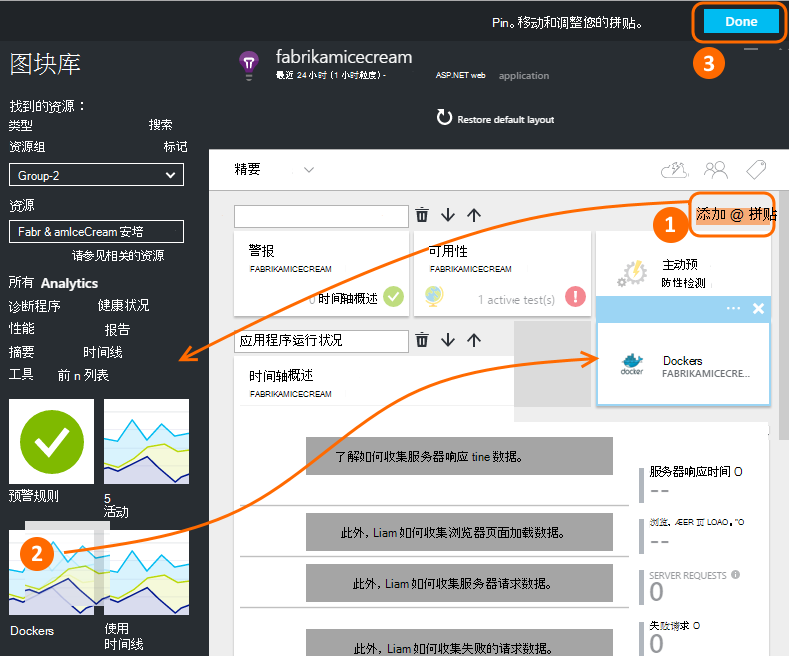

<properties 
    pageTitle="监视在应用程序的见解 Docker 应用程序" 
    description="Docker 性能计数器、 事件和异常可以从容器化应用遥测以及显示在应用程序理解。" 
    services="application-insights" 
    documentationCenter=""
    authors="alancameronwills" 
    manager="douge"/>

<tags 
    ms.service="application-insights" 
    ms.workload="tbd" 
    ms.tgt_pltfrm="ibiza" 
    ms.devlang="na" 
    ms.topic="article" 
    ms.date="12/01/2015" 
    ms.author="awills"/>
 
# <a name="monitor-docker-applications-in-application-insights"></a>监视在应用程序的见解 Docker 应用程序

生命周期事件和性能计数器从[Docker](https://www.docker.com/)容器可以在图表中表示在应用程序的见解。 在您的主机，在容器中安装的[应用程序理解](app-insights-overview.md)图像和主机，以及其他图像，它将显示性能计数器。

与 Docker 分发您的应用程序在完成与所有依赖项轻量级容器中。 他们将在运行 Docker 引擎任何宿主计算机上运行。

Docker 主机上运行[应用程序的见解图像](https://hub.docker.com/r/microsoft/applicationinsights/)时，您将获得这些好处︰

* 有关运行的所有容器的生命周期遥测的主机上启动、 停止和等。
* 所有容器的性能计数器。 CPU、 内存、 网络使用情况等。
* 如果[安装应用程序的见解 SDK](app-insights-java-live.md)中的容器，这些应用程序的所有遥测中运行的应用程序必须确定容器和主机计算机的其他属性。 举例来说，如果您有多个主机中运行的应用程序的实例，您很容易可以筛选由主机您应用遥测。


## <a name="set-up-your-application-insights-resource"></a>设置应用程序信息资源

1. 登录到[Microsoft Azure 门户](https://azure.com)和打开的应用程序理解资源，您的应用程序;或[创建一个新](app-insights-create-new-resource.md)。 

    *应使用哪些资源？* 如果您在您的主机运行的应用程序由其他人开发的然后将需要创建[新的应用程序理解资源](app-insights-create-new-resource.md)。 这是在其中查看并分析遥测。 （选择其他应用程序类型）。

    但是，如果您是开发人员的应用程序，然后我们希望[深入 SDK 应用程序添加](app-insights-java-live.md)到每个。 如果他们是真正的所有组件的单个业务应用程序，然后将它们发送到一个资源时，遥测配置，您将使用同一资源显示 Docker 生命周期和性能数据。 

    第三种情况是您开发的应用程序，大多数，但使用不同的资源来显示其遥测。 在这种情况下，您也许还想创建单独的资源 Docker 数据。 

2.  添加 Docker 平铺︰ 选择**添加平铺**、 从库中拖 Docker 拼贴，然后单击**完成**。 

    


3. 单击**精要**下拉列表并复制的检测项。 您将用它来告诉发送其遥测的位置的 SDK。


    

保持该浏览器窗口方便，您将回到它很快就来看看您的遥测。


## <a name="run-the-application-insights-monitor-on-your-host"></a>在您的主机上运行应用程序的见解监视器
 
现在，您已经在某处显示遥测，您可以设置容器化的应用程序将收集并将其发送。

1.  连接到 Docker 主机。 
2.  到此命令，编辑检测键，然后运行它︰
 
    ```

    docker run -v /var/run/docker.sock:/docker.sock -d microsoft/applicationinsights ikey=000000-1111-2222-3333-444444444
    ```

只有一个应用程序理解图像，则需要每个 Docker 主机。 如果您的应用程序部署在多个 Docker 主机上，然后重复每个主机上的命令。

## <a name="update-your-app"></a>更新您的应用程序

如果您的应用程序[的 Java 应用程序的见解 SDK](app-insights-java-get-started.md)检测，将下行添加到 ApplicationInsights.xml 文件中您的项目，在`<TelemetryInitializers>`元素︰

```xml

    <Add type="com.microsoft.applicationinsights.extensibility.initializer.docker.DockerContextInitializer"/> 
```

这为从您的应用程序发送的每个遥测项目添加 Docker 如容器和主机 id 的信息。

## <a name="view-your-telemetry"></a>查看您遥测

回到在 Azure 的门户应用程序理解资源。

通过 Docker 拼贴，请单击。

尤其是如果有 Docker 引擎上运行的其他容器，您将很快看到 Docker app，从传入的数据。


以下是一些您可以在视图。

### <a name="perf-counters-by-host-activity-by-image"></a>由主机，活动由图像的性能计数器


单击更多详细信息的任何主机或映像名称。


若要自定义的视图，请单击任何图表，网格标题，或使用添加图表。 

[了解更多关于标准的浏览器](app-insights-metrics-explorer.md)。

### <a name="docker-container-events"></a>Docker 容器事件


要查看单独的事件，请单击[搜索](app-insights-diagnostic-search.md)。 搜索和筛选器以查找所需的事件。 单击以获取更多详细信息的任何事件。
 
### <a name="exceptions-by-container-name"></a>通过容器名称的异常
 


### <a name="docker-context-added-to-app-telemetry"></a>添加到应用程序遥测 docker 上下文

从分析使用 AI SDK，丰富 Docker 上下文的应用程序发送的请求遥测︰


处理器时间和可用内存性能计数器，丰富了按 Docker 容器名称进行分组︰


## <a name="q--a"></a>问与答

*什么应用程序见解发出我我无法从 Docker？*

* 详细的性能计数器的容器和图像的分解。
* 集成在一个仪表板中的容器和应用程序数据。
* 为进一步分析到数据库、 双电源或其他仪表板中[导出遥测](app-insights-export-telemetry.md)。

*如何从应用程序自身中获取遥测？*

* 安装应用程序深入 SDK 应用程序中。 了解如何为︰ [Java web 应用程序](app-insights-java-get-started.md)、 [Windows web 应用程序](app-insights-asp-net.md)。
