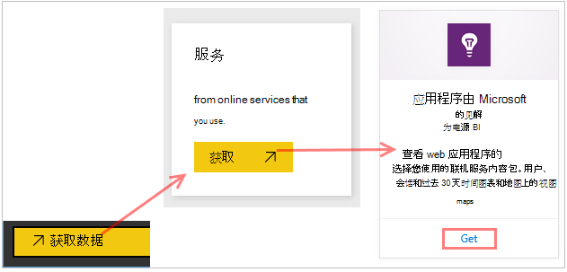
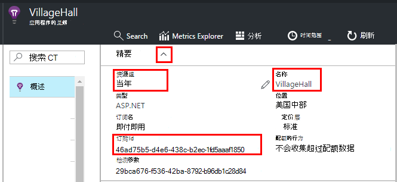
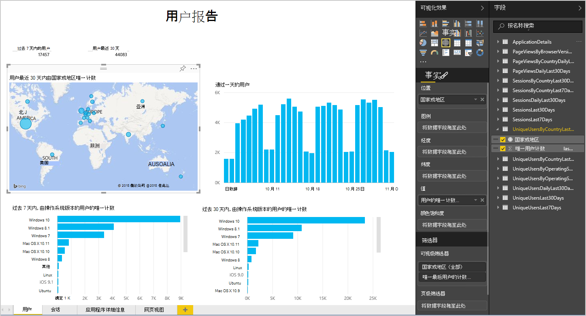
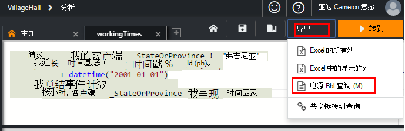
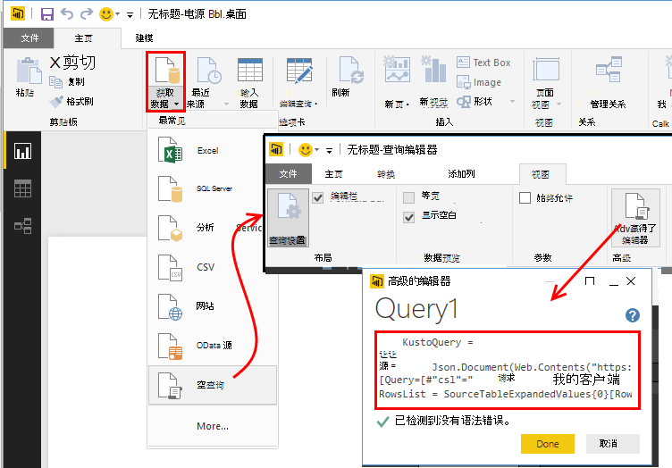
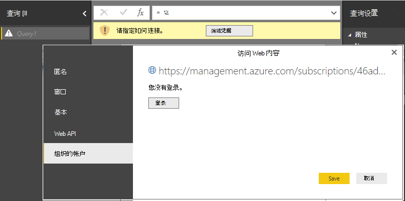
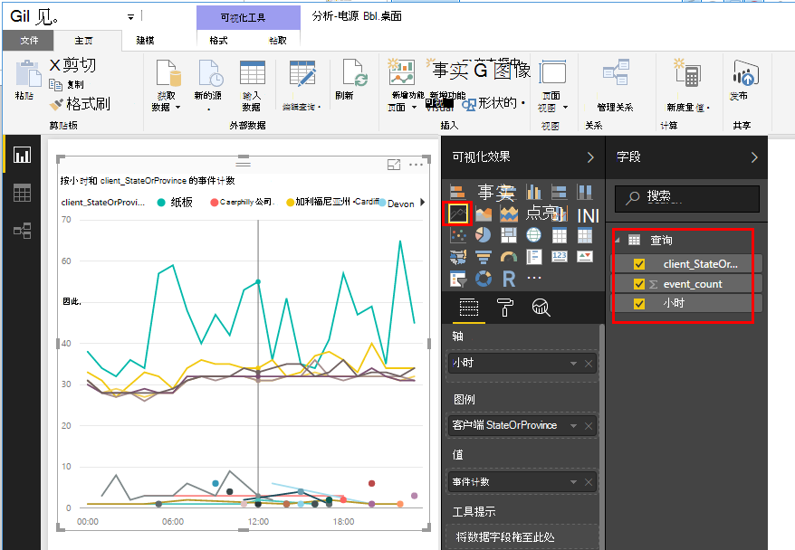
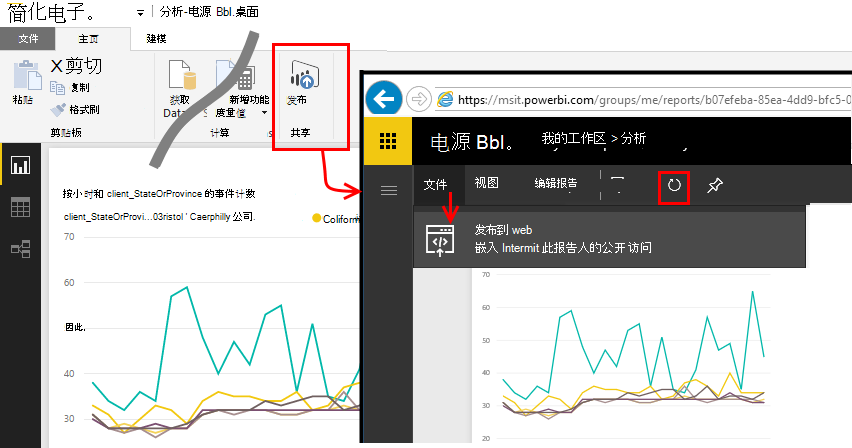

<properties 
    pageTitle="从应用程序的见解将导出到电源 BI |Microsoft Azure" 
    description="分析查询可以显示在电源 BI。" 
    services="application-insights" 
    documentationCenter=""
    authors="noamben" 
    manager="douge"/>

<tags 
    ms.service="application-insights" 
    ms.workload="tbd" 
    ms.tgt_pltfrm="ibiza" 
    ms.devlang="na" 
    ms.topic="article" 
    ms.date="10/18/2016" 
    ms.author="awills"/>

# 从应用程序的见解送电源 BI

[电源 BI](http://www.powerbi.com/)的一套业务分析工具，可帮助您分析数据并分享见解。 丰富的仪表板是每个设备上的可用。 您可以组合来自多个来源，包括从[Visual Studio 应用程序深入](app-insights-overview.md)分析查询数据。

有应用程序的见解将数据导出到电源 BI 的三种建议的方法。 您可以分别或一起使用它们。

* [**双电源适配器**](#power-pi-adapter)-从您的应用程序设置的遥测完成仪表板。 预定义的图表集，但您可以从任何其他来源添加您自己的查询。
* [**导出分析查询**](#export-analytics-queries)的编写任何想使用分析，并将其导出到电源双向查询。 您可以在仪表板和其他数据上放置此查询。
* [**连续导出和流分析**](app-insights-export-stream-analytics.md)-这需要设置更多的工作。 如果您想使您的数据保持很长一段，它非常有用。 否则，建议使用其他方法。

## 双电源适配器

此方法会为您创建遥测完成仪表的板。 初始数据集预定义的但您可以给它添加更多数据。

### 获取适配器

1. 登录到[电源 BI](https://app.powerbi.com/)。
2. 打开**获取数据**、**服务**、**应用程序的见解**

    

3. 提供应用程序理解资源的详细信息。

    

4. 等待一分钟或两个要导入的数据。

    

您可以编辑仪表板，与那些其他的来源，以及分析查询合并应用程序的见解。 没有可视化效果库中，您可以获得更多的图表，，每个图表必须可以设置参数。

后初始导入中，仪表板和报告继续每天更新。 您可以控制数据集上的刷新计划。

## 导出分析查询

此路由允许您编写，任何分析查询，然后将它导出到电源 BI 仪表板。 （您可以添加到仪表板创建的适配器。

### 一次︰ 安装电源双桌面

要导入的见解应用程序查询，您可以使用电源 BI 的桌面版本。 但是，然后您可以将其发布到 web 或工作电源双云区。 

安装[电源双桌面](https://powerbi.microsoft.com/en-us/desktop/)。

### 导出分析查询

1. [打开分析和编写查询](app-insights-analytics-tour.md)。
2. 测试并优化查询，直到结果满意为止。
3. 在**导出**菜单中，选择**电源 BI (M)**。 保存该文本文件。

    
4. 电源双桌面中选择**获取数据、 空查询**，然后在查询编辑器中，在**视图**下选中**高级查询编辑器**。

    将导出的 M 语言脚本粘贴到高级查询编辑器。

    

5. 您可能必须提供凭据，以允许访问 Azure 的电源 BI。 使用组织帐户使用 Microsoft 帐户进行登录。

    

6. 选择您的查询可视化项并选择 x 轴、 y 轴和分段维度字段。

    

7. 将报表发布到工作电源双云区。 据此，可以将同步的版本嵌入到其他 web 页。

    
 
8. 按时间间隔，手动刷新报表或设置在选项页上的定时刷新。

## 关于取样

如果您的应用程序发送大量的数据，自适应采样功能可能运行和发送只有您遥测的百分比。 这同样适用如果 SDK 中，或摄取上手动设置采样。 [了解有关采样。](app-insights-sampling.md)
 

## 下一步行动

* [电源 BI-学习](http://www.powerbi.com/learning/)
* [分析教程](app-insights-analytics-tour.md)
