<properties 
    pageTitle="使用流分析来处理应用程序的见解从导出的数据 |Microsoft Azure" 
    description="流分析可以不断变换、 筛选和路由的数据从应用程序的见解。" 
    services="application-insights" 
    documentationCenter=""
    authors="noamben" 
    manager="douge"/>

<tags 
    ms.service="application-insights" 
    ms.workload="tbd" 
    ms.tgt_pltfrm="ibiza" 
    ms.devlang="na" 
    ms.topic="article" 
    ms.date="10/18/2016" 
    ms.author="awills"/>

# <a name="use-stream-analytics-to-process-exported-data-from-application-insights"></a>使用流分析来处理应用程序的见解从导出的数据

[Azure 流分析](https://azure.microsoft.com/services/stream-analytics/)是处理[应用程序的见解从导出的](app-insights-export-telemetry.md)数据的理想工具。 流分析可以从各种源中提取数据。 它可以转换和筛选数据，然后将其发送给多个接收器。

在此示例中，我们将创建适配器，将数据从应用程序的见解，重命名并处理其中的一些字段，也到电源双管道它。

> [AZURE.WARNING] 有多更好、 更方便[建议显示电源 BI 应用程序理解数据的方法](app-insights-export-power-bi.md)。 此处所示的路径只是一个示例来说明如何处理导出的数据。

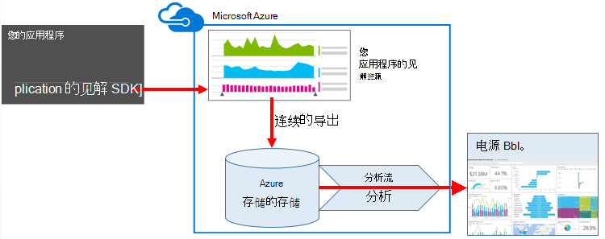


## <a name="create-storage-in-azure"></a>在 Azure 创建存储

连续出口始终将数据输出到 Azure 存储帐户，所以您需要首先创建存储区。

1.  在[Azure 门户网站](https://portal.azure.com)订阅中创建"经典"的存储帐户。

    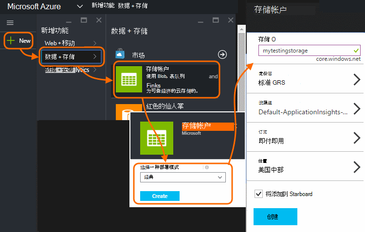

2. 创建容器

    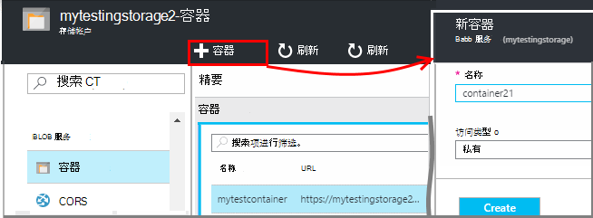

3. 复制存储访问键

    您将需要它即将设置的输入流分析服务。

    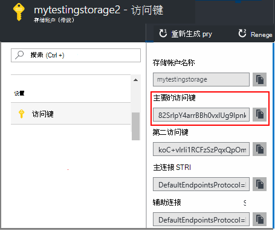

## <a name="start-continuous-export-to-azure-storage"></a>开始连续导出到 Azure 存储

[连续导出](app-insights-export-telemetry.md)将数据从应用程序深入 Azure 存储移动。

1. 在 Azure 的门户中，浏览到您为您的应用程序创建的应用程序理解资源。

    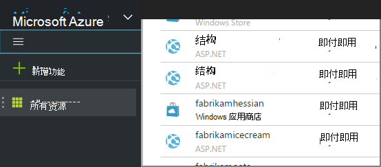

2. 创建的连续输出。

    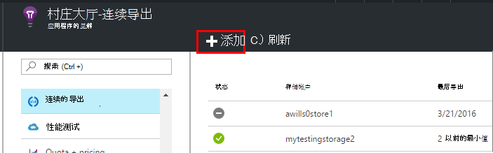


    选择您在前面创建的存储帐户︰

    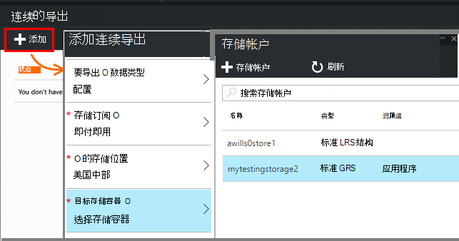
    
    设置您想要查看的事件类型︰

    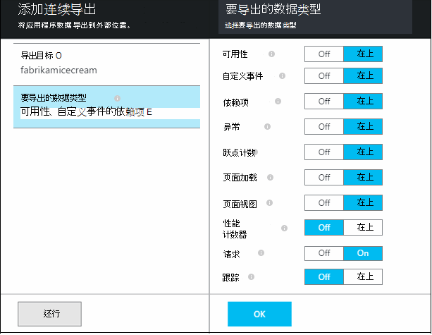

3. 让积累一些数据。 休息一下，让人们使用您的应用程序一段时间。 遥测会，您将看到[公制的资源管理器](app-insights-metrics-explorer.md)中的统计图表和[诊断搜索](app-insights-diagnostic-search.md)中的单个事件。 

    同时，将数据导出到您的存储。 

4. 检查导出的数据。 在 Visual Studio 中，选择**查看 / 云资源管理器**，并打开 Azure / 存储。 (如果您没有此菜单选项，您需要安装 Azure SDK︰ 打开新建项目对话框，并打开 C# / 云 /.net 获取 Microsoft Azure SDK。)

    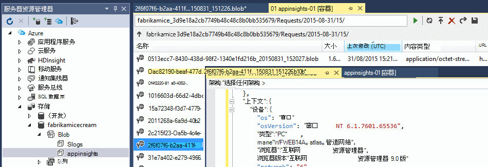

    记下从应用程序名称和检测密钥派生的路径名的公共部分。 

事件会写入到 blob 以 JSON 格式的文件。 每个文件可以包含一个或多个事件。 因此我们想要读取事件数据，筛选出我们想要的字段。 所有类型的数据，我们可以做的事，但今天我们的计划是使用流分析管道到电源 BI 数据。

## <a name="create-an-azure-stream-analytics-instance"></a>创建 Azure 流分析实例

从[经典的 Azure 门户](https://manage.windowsazure.com/)，选择 Azure 流分析服务，并创建新的流分析作业︰


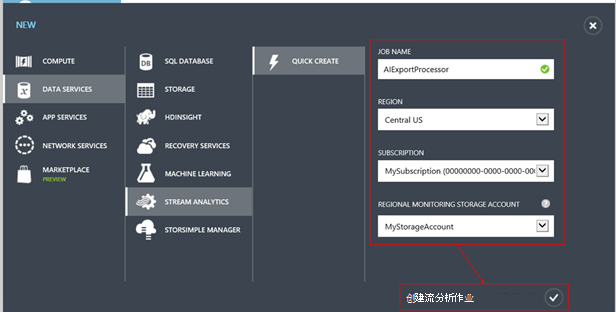

创建新作业时，展开其详细信息︰

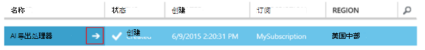


### <a name="set-blob-location"></a>设置斑点位置

将其设置为使您连续导出 blob 中的输入︰

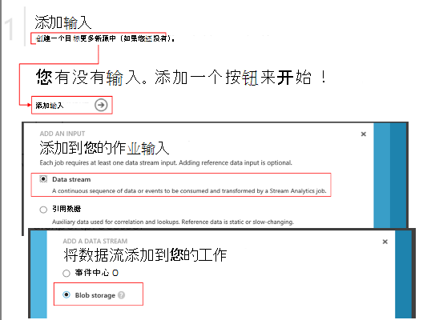

现在，您将从您的存储帐户，前面提到需要为主的访问键。 此设置为存储帐户密码。

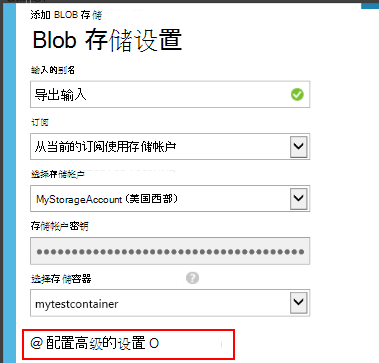

### <a name="set-path-prefix-pattern"></a>设置路径的前缀模式 

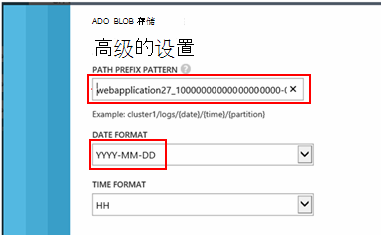


**请务必设置日期格式 YYYY MM DD 到 （包括短划线）。**

该路径的前缀模式指定从何处流分析的存储区中查找的输入的文件。 您需要将其设置为对应于连续导出将数据的存储。 将其设置如下︰

    webapplication27_12345678123412341234123456789abcdef0/PageViews/{date}/{time}

在此示例中︰

* `webapplication27`是应用程序的见解资源**全部小写**的名称。
* `1234...`检测至关重要的见解应用程序资源，**省略虚线**。 
* `PageViews`是您想要分析的数据的类型。 可用的类型取决于在连续导出设置的筛选器。 检查以查看其他可用类型的导出的数据，请参阅[导出数据模型](app-insights-export-data-model.md)。
* `/{date}/{time}`一种模式编写按其原义。

> [AZURE.NOTE] 检查以确保确保路径正确的存储。

### <a name="finish-initial-setup"></a>完成初始设置

确认的序列化格式︰

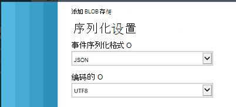

关闭该向导，并等待安装程序以完成。

> [AZURE.TIP] 使用的示例命令下载一些数据。 将其作为测试样本来调试您的查询。

## <a name="set-the-output"></a>将输出设置

现在选择的作业，并将输出设置。

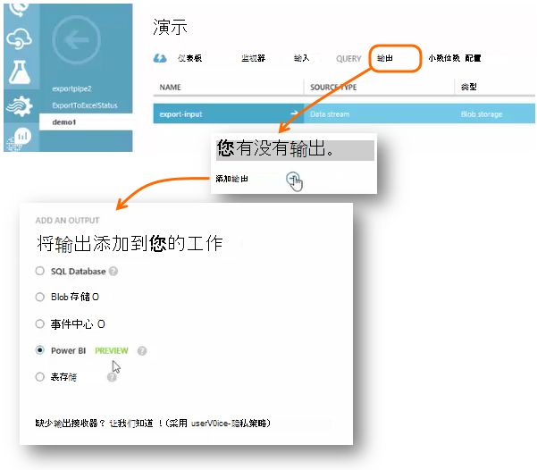

提供您的**工作或学校的帐户**授权访问电源双资源的流分析。 然后发明的输出，以及目标电源 BI 数据集和表的名称。

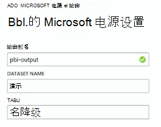

## <a name="set-the-query"></a>将查询设置

查询管理从输入到输出的转换。

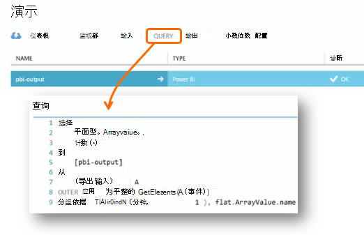


测试函数用于检查您获得正确的输出。 为它指定从输入页面所用的示例数据。 

### <a name="query-to-display-counts-of-events"></a>要显示的事件计数查询

粘贴此查询︰

```SQL

    SELECT
      flat.ArrayValue.name,
      count(*)
    INTO
      [pbi-output]
    FROM
      [export-input] A
    OUTER APPLY GetElements(A.[event]) as flat
    GROUP BY TumblingWindow(minute, 1), flat.ArrayValue.name
```

* 导出输入是我们赋予输入流的别名
* pbi 输出是我们定义的输出别名
* 我们将使用[外部应用 GetElements](https://msdn.microsoft.com/library/azure/dn706229.aspx) ，因为事件名称使用了嵌套的 JSON arrray。 然后选择将选取事件名称，以及使用该名称在该时间段的实例数的计数。 [Group By](https://msdn.microsoft.com/library/azure/dn835023.aspx)子句的元素分组到 1 分钟的时间段。


### <a name="query-to-display-metric-values"></a>显示度量值的查询


```SQL

    SELECT
      A.context.data.eventtime,
      avg(CASE WHEN flat.arrayvalue.myMetric.value IS NULL THEN 0 ELSE  flat.arrayvalue.myMetric.value END) as myValue
    INTO
      [pbi-output]
    FROM
      [export-input] A
    OUTER APPLY GetElements(A.context.custom.metrics) as flat
    GROUP BY TumblingWindow(minute, 1), A.context.data.eventtime

``` 

* 此查询钻取到获取事件时间和度量值的度量遥测数据。 度量值是在一个数组中，所以我们使用外部应用 GetElements 模式来提取行。 "myMetric"在这种情况下是度量的名称。 

### <a name="query-to-include-values-of-dimension-properties"></a>查询包含的维度属性值

```SQL

    WITH flat AS (
    SELECT
      MySource.context.data.eventTime as eventTime,
      InstanceId = MyDimension.ArrayValue.InstanceId.value,
      BusinessUnitId = MyDimension.ArrayValue.BusinessUnitId.value
    FROM MySource
    OUTER APPLY GetArrayElements(MySource.context.custom.dimensions) MyDimension
    )
    SELECT
     eventTime,
     InstanceId,
     BusinessUnitId
    INTO AIOutput
    FROM flat

```

* 此查询包含的维度属性，而不取决于特定的维度被固定在维数组索引处的值。

## <a name="run-the-job"></a>运行作业

在过去，若要启动的作业，可以选择一个日期。 

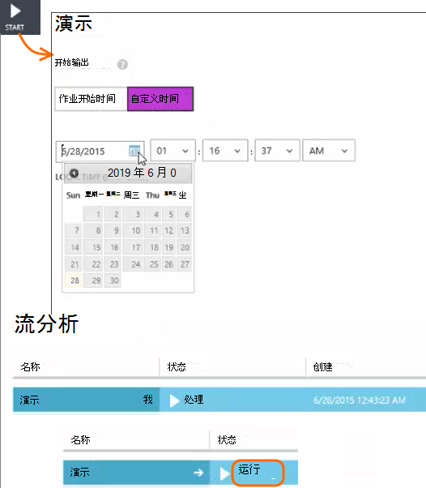

等待，直到该作业运行。

## <a name="see-results-in-power-bi"></a>在电源 BI 查看结果

> [AZURE.WARNING] 有多更好、 更方便[建议显示电源 BI 应用程序理解数据的方法](app-insights-export-power-bi.md)。 此处所示的路径只是一个示例来说明如何处理导出的数据。

打开电源 BI 与您的工作或学校的帐户，并选择数据集和表定义为流分析作业的输出。

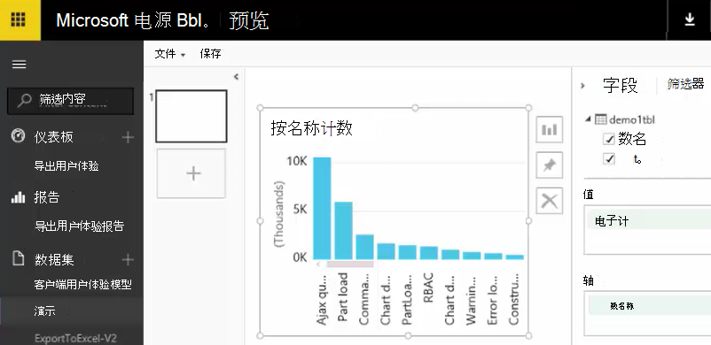

现在您可以使用此报表中的数据集和[双电源](https://powerbi.microsoft.com)的仪表板。


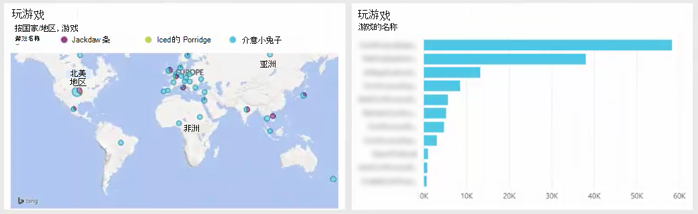


## <a name="no-data"></a>没有数据？

* 请检查该[设置的日期格式](#set-path-prefix-pattern)正确为 YYYY-月-日 （包括短划线）。


## <a name="video"></a>视频

Noam Ben Zeev 演示如何处理使用流分析导出的数据。

> [AZURE.VIDEO export-to-power-bi-from-application-insights]

## <a name="next-steps"></a>下一步行动

* [连续的导出](app-insights-export-telemetry.md)
* [详细的数据模型的属性类型和属性值的引用。](app-insights-export-data-model.md)
* [应用程序的见解](app-insights-overview.md)
* [更多示例和演练](app-insights-code-samples.md)
 
