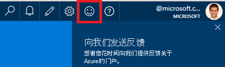
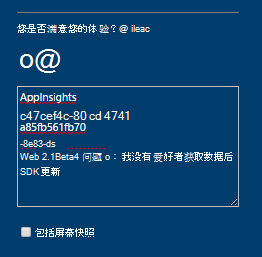
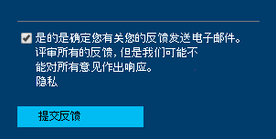

<properties 
    pageTitle="如何获取技术支持的见解应用程序开发团队从 |Microsoft Azure" 
    description="如果您有需要特殊支持的见解应用程序开发团队的用例，这是如何提交的详细信息以获得支持。" 
    services="application-insights" 
    documentationCenter=""
    authors="alexbulankou" 
    manager="douge"/>
 
<tags 
    ms.service="application-insights" 
    ms.workload="tbd" 
    ms.tgt_pltfrm="ibiza" 
    ms.devlang="na" 
    ms.topic="article" 
    ms.date="06/01/2016" 
    ms.author="albulank"/>
    
# <a name="how-to-get-technical-support-from-application-insights-development-team"></a>如何从应用程序深入开发团队获取技术支持
    
当[Visual Studio 应用程序建议](app-insights-overview.md)的技术问题，以下是您获得帮助的选项︰

## <a name="1-check-the-documents"></a>1.检查文档

* 丢失的数据？ 检查︰[采样](app-insights-sampling.md)，[配额和限制](app-insights-pricing.md)。
* 故障排除︰ [ASP.NET](app-insights-troubleshoot-faq.md) | [Java](app-insights-java-troubleshoot.md)

## <a name="2-search-the-forums"></a>2.搜索论坛

* [MSDN 论坛](https://social.msdn.microsoft.com/Forums/vstudio/home?forum=ApplicationInsights)
* [StackOverflow](http://stackoverflow.com/questions/tagged/ms-application-insights)

## <a name="3-azure-support-plan"></a>3.azure 支持计划？

还有一些情况下您想开发人员来调查您的特定情况。 

如果您有[支持计划与 Microsoft Azure](https://azure.microsoft.com/support/plans/)可以[打开支持票](https://portal.azure.com/?#blade/Microsoft_Azure_Support/HelpAndSupportBlade)。

## <a name="4-contact-the-application-insights-team"></a>4.请联系应用程序理解团队

如果您没有支持计划，我们的开发团队是高兴地为应用程序理解客户提供最佳支持，因为我们准备公开发行里程碑。 我们正在推出**一个新的支持选项**︰ 可以通过提交反馈表单在 Azure 的门户网站上描述您对我们的情况和开发人员对应用程序的见解团队联系人备份可帮助解决您的问题。


1. 在[应用程序的见解门户](https://portal.azure.com)中，请单击右上角处的笑脸︰  

       

2. 注释框中请确保作为第一行指定**AppInsights** ，则包括以下信息︰   

    ```

    AppInsights   
    ikey: <instrumentation key>   
    sdk: <SDK that you are using, including name and version>  
    issue: <please describe the problem you are having>

    ```   

       

3. 检查"是的它是确定您发送电子邮件"。 

      

工程上的应用程序理解团队将很快获得与您联系。 因为我们都在尽力执行提供此服务，可以在此时给出没有正式 SLA。


