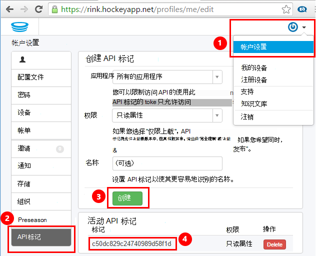
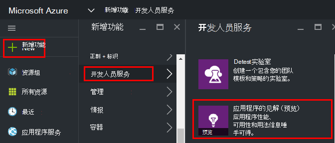
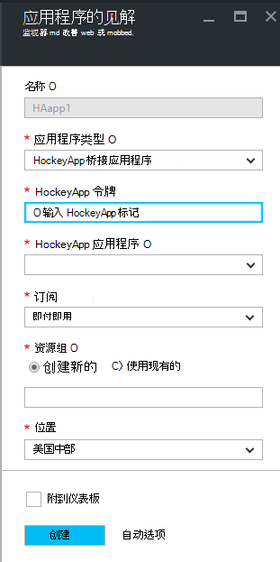
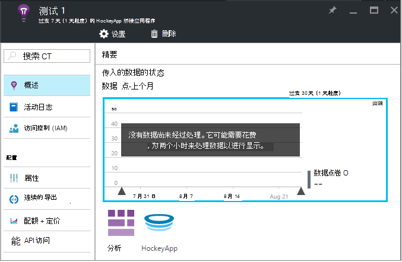
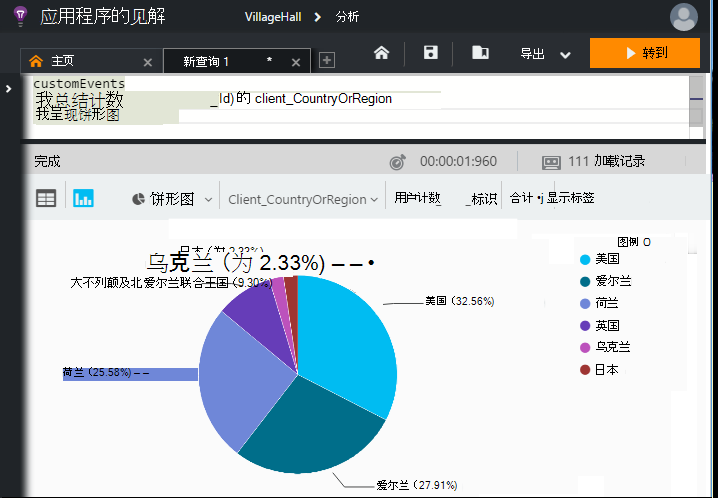

<properties 
    pageTitle="浏览应用程序的见解中的 HockeyApp 数据 |Microsoft Azure" 
    description="分析使用情况和性能的 Azure 应用程序与应用程序的见解。" 
    services="application-insights" 
    documentationCenter="windows"
    authors="alancameronwills" 
    manager="douge"/>

<tags 
    ms.service="application-insights" 
    ms.workload="tbd" 
    ms.tgt_pltfrm="ibiza" 
    ms.devlang="na" 
    ms.topic="article" 
    ms.date="08/25/2016" 
    ms.author="awills"/>

#  浏览应用程序的见解中的 HockeyApp 数据

[HockeyApp](https://azure.microsoft.com/services/hockeyapp/)是用于监视实时桌面和移动应用程序的推荐的平台。 从 HockeyApp，可以发送自定义和跟踪遥测监控使用情况并协助诊断 （除了得到的故障数据）。 可以使用[Visual Studio 应用程序理解](app-insights-overview.md)的强大[分析](app-insights-analytics.md)功能查询遥测此流。 此外，您可以[导出自定义和跟踪遥测](app-insights-export-telemetry.md)。 若要启用这些功能，您设置中继 HockeyApp 数据与应用程序理解的桥梁。

## HockeyApp 桥接应用程序

HockeyApp 桥接应用程序为核心功能，它使您能够通过分析访问应用程序的见解中的 HockeyApp 数据和连续的导出功能。 HockeyApp HockeyApp 桥接应用程序在创建之后收集的任何数据都可以利用这些功能。 让我们了解如何设置这些桥接应用程序之一。

在 HockeyApp，打开帐户设置[API 标记](https://rink.hockeyapp.net/manage/auth_tokens)。 创建一个新标记或重用现有。 最小权限要求"只读"。 需要一份 API 标记。

打开 Microsoft Azure 门户并[创建应用程序的见解资源](app-insights-create-new-resource.md)。 设置为"HockeyApp 桥接应用程序"的应用程序类型︰

不需要设置一个名称-这将自动设置从 HockeyApp 名。

HockeyApp 桥接字段显示。 

输入您在前面提到的 HockeyApp 标记。 此操作将填充与所有的 HockeyApp 应用程序的"应用程序 HockeyApp"下拉菜单。 选择的一个您要使用，并填写其余字段。 

打开新的资源。 

请注意数据需要一段时间才能开始流动。

就是这样！ 从此以后 HockeyApp 检测应用程序中收集的所有数据现在也都是可供您的应用程序理解的分析和连续导出功能。

让我们简要回顾每个现在为您提供这些功能。

## 分析

分析是一种功能强大的工具，用于特殊查询数据，使您可以诊断和分析您的遥测和快速地发现根本原因和模式。

* [了解更多关于分析](app-insights-analytics-tour.md)
* [简介视频](https://channel9.msdn.com/events/Build/2016/T666)
* [高级视频的概念](https://channel9.msdn.com/Events/Build/2016/P591)

## 连续的导出

连续导出允许您将数据导出到 Azure Blob 存储容器。 这是非常有用，如果您需要保留数据的时间比目前所提供的应用程序理解的保持期。 可以将数据保存在 blob 存储，其处理为 SQL 数据库或您首选的数据仓库解决方案。

[了解更多关于连续导出](app-insights-export-telemetry.md)

## 下一步行动

* [应用于数据分析](app-insights-analytics-tour.md)

