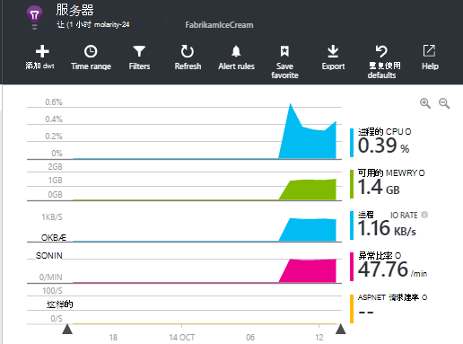

<properties 
    pageTitle="如何实现...见解应用程序 |Microsoft Azure" 
    description="在应用程序的见解中的常见问题。" 
    services="application-insights" 
    documentationCenter=""
    authors="alancameronwills" 
    manager="douge"/>

<tags 
    ms.service="application-insights" 
    ms.workload="tbd" 
    ms.tgt_pltfrm="ibiza" 
    ms.devlang="na" 
    ms.topic="article" 
    ms.date="02/05/2016" 
    ms.author="awills"/>

# <a name="how-do-i--in-application-insights"></a>如何...在应用程序的见解？

## <a name="get-an-email-when-"></a>收到电子邮件时...

### <a name="email-if-my-site-goes-down"></a>如果我的网站出现故障的电子邮件

设置[可用性 web 测试](app-insights-monitor-web-app-availability.md)。

### <a name="email-if-my-site-is-overloaded"></a>如果我的网站被重载的电子邮件

对**服务器响应时间**设置[警报](app-insights-alerts.md)。 1 至 2 秒之间的阈值应工作。


通过返回失败代码中您的应用程序还可能显示压力的迹象。 **失败的请求**上设置警报。

如果您希望在**服务器异常**上设置警报，您可能需要做[一些额外的设置](app-insights-asp-net-exceptions.md)以查看数据。

### <a name="email-on-exceptions"></a>通过电子邮件发送的异常

1. [设置监视异常](app-insights-asp-net-exceptions.md)
2. 在异常计数度量[设置警报](app-insights-alerts.md)


### <a name="email-on-an-event-in-my-app"></a>通过电子邮件发送我的应用程序中的事件

让我们假设您想要在特定事件发生时收到电子邮件。 应用程序的见解不该设施直接提供，但它可以[发送预警指标超过阈值时](app-insights-alerts.md)。 

警报可以设置上[自定义指标](app-insights-api-custom-events-metrics.md#track-metric)，但不自定义事件。 编写一些代码来增加一个指标，在事件发生时︰

    telemetry.TrackMetric("Alarm", 10);

或︰

    var measurements = new Dictionary<string,double>();
    measurements ["Alarm"] = 10;
    telemetry.TrackEvent("status", null, measurements);

通知有两种状态，因为您需要发送的低值时考虑该通知以结束了︰

    telemetry.TrackMetric("Alarm", 0.5);

在[公制的资源管理器](app-insights-metrics-explorer.md)请参见闹钟创建的图表︰


现在设置规格，短时间内超过中间值时触发警报︰


将平均周期设置为最小。 

当指标超过或低于阈值，您将收到电子邮件。

应考虑一些事项︰

* 通知有两种状态 （"警告"和"正常运行"）。 仅当接收到一个指标被评估状态。
* 仅当状态更改时发送一封电子邮件。 这就是为什么您必须发送两高和低价值指标。 
* 要评估警报，平均值采取接收值的前面一段。 出现这种情况每次接收到一个指标，以便于您设置的时期更加频繁地发送电子邮件。
* 同时在"警报"和"状态良好"上发送电子邮件，因为您可能需要考虑重新思考作为两种状态条件您一劳永逸的活动。 例如，而不是"作业已完成"的事件，有一个"作业正在进行中的"状态，在开始和结束的作业从哪里获得的电子邮件。

### <a name="set-up-alerts-automatically"></a>自动设置警报

[使用 PowerShell 创建新警报](app-insights-alerts.md#set-alerts-by-using-powershell)

## <a name="use-powershell-to-manage-application-insights"></a>使用 PowerShell 来管理应用程序的见解

* [创建新资源](app-insights-powershell-script-create-resource.md)
* [创建新警报](app-insights-alerts.md#set-alerts-by-using-powershell)

## <a name="application-versions-and-stamps"></a>应用程序版本和图章

### <a name="separate-the-results-from-dev-test-and-prod"></a>结果分开开发、 测试和生产

* 对于不同的 environmnents，设置不同的 ikeys
* 对于不同的图章 （适用于开发人员，测试，生产） 标记的遥测数据具有不同的属性值

[了解更多信息](app-insights-separate-resources.md)
 

### <a name="filter-on-build-number"></a>筛选内部版本号

当您的应用程序的新版本发布时，您需要能够分开不同版本的遥测。

可以设置应用程序版本属性，以便您可以筛选[搜索](app-insights-diagnostic-search.md)和[公制的资源管理器中](app-insights-metrics-explorer.md)的结果。 


有几种不同方法的应用程序版本属性设置。

* 直接设置︰

    `telemetryClient.Context.Component.Version = typeof(MyProject.MyClass).Assembly.GetName().Version;`

* 在[遥测初始值设定项](app-insights-api-custom-events-metrics.md#telemetry-initializers)以确保始终如一地设置了所有 TelemetryClient 实例中换行，该行。

* [ASP.NET]设置的版本`BuildInfo.config`。 从 BuildLabel 节点的版本将选取的 web 模块。 将此文件包含在项目中，请记住，若要在解决方案资源管理器中设置的始终复制属性。

    ```XML

    <?xml version="1.0" encoding="utf-8"?>
    <DeploymentEvent xmlns:xsi="http://www.w3.org/2001/XMLSchema-instance" xmlns:xsd="http://www.w3.org/2001/XMLSchema" xmlns="http://schemas.microsoft.com/VisualStudio/DeploymentEvent/2013/06">
      <ProjectName>AppVersionExpt</ProjectName>
      <Build type="MSBuild">
        <MSBuild>
          <BuildLabel kind="label">1.0.0.2</BuildLabel>
        </MSBuild>
      </Build>
    </DeploymentEvent>

    ```
* [ASP.NET]在 MSBuild 自动生成 BuildInfo.config。 为此，.csproj 文件中添加几行︰

    ```XML

    <PropertyGroup>
      <GenerateBuildInfoConfigFile>true</GenerateBuildInfoConfigFile>    <IncludeServerNameInBuildInfo>true</IncludeServerNameInBuildInfo>
    </PropertyGroup> 
    ```

    这将生成一个名为*yourProjectName*的文件。BuildInfo.config。 发布过程将它重命名为 BuildInfo.config。

    当使用 Visual Studio 生成，生成标签包含占位符 (AutoGen_...)。 但是，当使用 MSBuild 生成，它填入正确的版本号。

    若要允许 MSBuild 生成版本号，设置类似的版本`1.0.*`在 AssemblyReference.cs

## <a name="monitor-backend-servers-and-desktop-apps"></a>监视后端服务器和桌面应用程序

[使用 Windows 服务器 SDK 模块](app-insights-windows-desktop.md)。


## <a name="visualize-data"></a>可视化数据

#### <a name="dashboard-with-metrics-from-multiple-apps"></a>仪表板指标从多个应用程序使用

* 在[度量资源管理器](app-insights-metrics-explorer.md)中自定义图表并将其保存为收藏。 将其锁定到 Azure 的仪表板。


#### <a name="dashboard-with-data-from-other-sources-and-application-insights"></a>仪表板使用来自其他源或应用程序理解的数据

* [导出到电源双向遥测](app-insights-export-power-bi.md)。 

或

* 使用 SharePoint 作为您的仪表板，在 SharePoint web 部件中显示的数据。 [使用连续的导出和流分析导出到 SQL](app-insights-code-sample-export-sql-stream-analytics.md)。  使用 PowerView 来检查数据库，并为 PowerView 创建 SharePoint web 部件。


<a name="search-specific-users"></a>
### <a name="filter-out-anonymous-or-authenticated-users"></a>筛选出匿名或已通过身份验证的用户

如果您的用户登录，则可以设置[经过身份验证的用户 id](app-insights-api-custom-events-metrics.md#authenticated-users)。 （它不会自动发生。） 

然后，您可以︰

* 搜索特定的用户 id


* 匿名或经过身份验证的用户的筛选指标


## <a name="modify-property-names-or-values"></a>修改属性名或值

创建[筛选器](app-insights-api-filtering-sampling.md#filtering)。 这允许您修改或从您的应用程序发送到应用程序的见解之前筛选遥测。

## <a name="list-specific-users-and-their-usage"></a>列出特定的用户和它们的用法

如果您只需要[为特定用户的搜索](#search-specific-users)，您可以设置[经过身份验证的用户 id](app-insights-api-custom-events-metrics.md#authenticated-users)。

如果希望使用例如哪些页数据的用户的列表看起来在或频率进行登录，有两个选项︰

* [设置经过身份验证的用户 id](app-insights-api-custom-events-metrics.md#authenticated-users)、[导出到数据库](app-insights-code-sample-export-sql-stream-analytics.md)和使用适当工具来分析存在您的用户数据。
* 如果您有只有较少的用户，将发送自定义事件或指标，感兴趣的数据用作度量值或事件的名称，并将用户 id 设置为属性。 要分析网页视图，请更换标准 JavaScript trackPageView 调用。 分析服务器端遥测，用于遥测初始值设定项将用户 id 添加到所有服务器遥测。 然后可以筛选和段指标和搜索的用户 id。


## <a name="reduce-traffic-from-my-app-to-application-insights"></a>减少通信从我的应用程序到应用程序的见解

* 在[ApplicationInsights.config](app-insights-configuration-with-applicationinsights-config.md)中，禁用所有模块不需要这种性能计数器收集器。
* 在 SDK 中使用[采样和筛选](app-insights-api-filtering-sampling.md)。
* 在 web 页中，来限制报告的每个页面视图模式下的 Ajax 调用的次数。 后脚本代码段中`instrumentationKey:...`，插入︰ `,maxAjaxCallsPerView:3` （或适当的数目）。
* 如果您使用的[TrackMetric](app-insights-api-custom-events-metrics.md#track-metric)，请发送结果之前计算成批的度量值的聚合。 没有为所提供的 TrackMetric() 的重载。


了解有关[定价和配额](app-insights-pricing.md)的详细信息。

## <a name="disable-telemetry"></a>禁用遥测

对**动态停止和启动**收集和遥测从服务器传输︰

```

    using  Microsoft.ApplicationInsights.Extensibility;

    TelemetryConfiguration.Active.DisableTelemetry = true;
```


**禁用所选的标准收集器**-例如，性能计数器、 HTTP 请求或依赖项的删除或注释掉[ApplicationInsights.config](app-insights-api-custom-events-metrics.md)中的相关行。 要做到这一点，例如，如果您想要发送您自己的 TrackRequest 数据。


## <a name="view-system-performance-counters"></a>查看系统性能计数器

您可以测量数据资源管理器中显示的指标之间是一组系统性能计数器。 没有标题为**服务器**显示其中几个预定义的刀片式服务器。



### <a name="if-you-see-no-performance-counter-data"></a>如果您看不到性能计数器数据

* **IIS 服务器**在您自己的计算机或虚拟机上。 [安装状态监视器](app-insights-monitor-performance-live-website-now.md)。 
* **Azure 网站**-我们尚不支持性能计数器。 有几个指标可以作为标准 Azure 网站控制面板的一部分。
* **Unix 服务器** - [collectd 安装](app-insights-java-collectd.md)

### <a name="to-display-more-performance-counters"></a>若要显示多个性能计数器

* 首先，[添加一个新图表](app-insights-metrics-explorer.md)，如果在基本设置计数器，请参阅我们提供。
* 如果没有，则[添加的计数器集收集的性能计数器模块](app-insights-performance-counters.md)。


