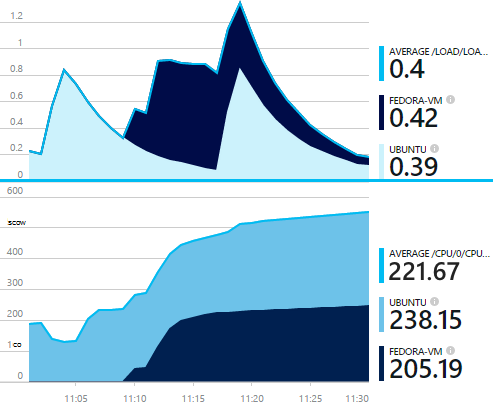
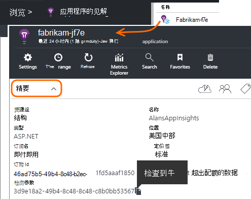
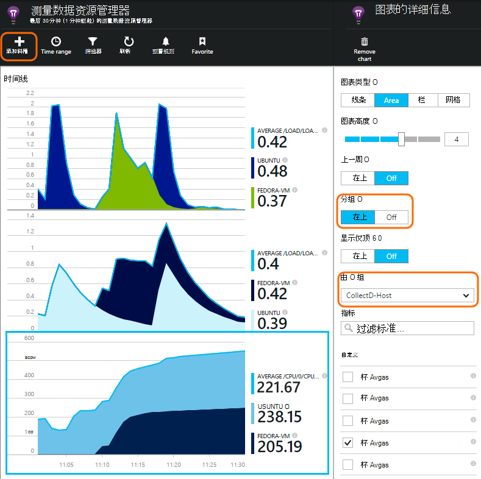

<properties 
    pageTitle="collectd︰ 在 Unix 应用程序的见解中的 Java 的性能统计" 
    description="扩展的网站 Java 插件 CollectD 监视的应用程序的见解" 
    services="application-insights" 
    documentationCenter="java"
    authors="alancameronwills" 
    manager="douge"/>

<tags 
    ms.service="application-insights" 
    ms.workload="tbd" 
    ms.tgt_pltfrm="ibiza" 
    ms.devlang="na" 
    ms.topic="article" 
    ms.date="08/24/2016" 
    ms.author="awills"/>
 
# <a name="collectd-unix-performance-metrics-in-application-insights"></a>collectd: Unix 应用程序的见解中的性能指标

*在预览是应用程序的见解。*

若要了解 Unix 系统性能度量值在[应用程序的见解](app-insights-overview.md)，安装[collectd](http://collectd.org/)，以及插件的应用程序理解。 这一开放源代码解决方案收集各种系统和网络统计信息。

通常您将使用 collectd，如果您已经[检测 Java web 服务应用程序的见解与][java]。 它为您提供更多的数据，可帮助您提高您的应用程序性能或诊断问题。 



## <a name="get-your-instrumentation-key"></a>获取密钥，检测

在[Microsoft Azure 门户](https://portal.azure.com)中，打开要显示的数据[应用程序的见解](app-insights-overview.md)资源。 （或[创建新的资源](app-insights-create-new-resource.md)）。

采用检测密钥，它标识该资源的副本。




## <a name="install-collectd-and-the-plug-in"></a>安装 collectd 和插件

Unix 服务器上︰

1. 安装[collectd](http://collectd.org/)版本含有 5.4.0 或更高版本。
2. 下载该[应用程序的见解 collectd 编写器插件](https://aka.ms/aijavasdk)。 记下版本号。
3. 复制该插件 JAR 到`/usr/share/collectd/java`。
3. 编辑`/etc/collectd/collectd.conf`:
 * 确保已启用该[Java 插件](https://collectd.org/wiki/index.php/Plugin:Java)。
 * 更新为 java.class.path JVMArg，以包括以下 JAR。 更新以匹配您所下载的版本号︰
  * `/usr/share/collectd/java/applicationinsights-collectd-1.0.5.jar`
 * 添加此代码段，使用检测从所需的资源的键︰

```

     LoadPlugin "com.microsoft.applicationinsights.collectd.ApplicationInsightsWriter"
     <Plugin ApplicationInsightsWriter>
        InstrumentationKey "Your key"
     </Plugin>
```

下面是一个示例配置文件的一部分︰

    ...
    # collectd plugins
    LoadPlugin cpu
    LoadPlugin disk
    LoadPlugin load
    ...

    # Enable Java Plugin
    LoadPlugin "java"

    # Configure Java Plugin
    <Plugin "java">
      JVMArg "-verbose:jni"
      JVMArg "-Djava.class.path=/usr/share/collectd/java/applicationinsights-collectd-1.0.5.jar:/usr/share/collectd/java/collectd-api.jar"

      # Enabling Application Insights plugin
      LoadPlugin "com.microsoft.applicationinsights.collectd.ApplicationInsightsWriter"
                
      # Configuring Application Insights plugin
      <Plugin ApplicationInsightsWriter>
        InstrumentationKey "12345678-1234-1234-1234-123456781234"
      </Plugin>

      # Other plugin configurations ...
      ...
    </Plugin>
.   ...

配置其他[collectd 插件](https://collectd.org/wiki/index.php/Table_of_Plugins)，它可以从不同的来源收集的各种数据。

请 collectd 根据其[手动](https://collectd.org/wiki/index.php/First_steps)重新启动。

## <a name="view-the-data-in-application-insights"></a>查看应用程序的见解中的数据

在您的应用程序理解资源打开[测量数据资源管理器和添加图表][metrics]，选择您想要查看从自定义类别的指标。



默认情况下，从中收集度量标准的所有主机计算机之间聚合的度量标准。 若要查看图表细节刀片式服务器中的每台主机，指标，打开分组，然后选择按 CollectD 主机进行分组。


## <a name="to-exclude-upload-of-specific-statistics"></a>要排除特定的统计信息上传

默认情况下，该应用程序的见解插件发送读取插件的所有已启用 collectd 所收集的所有数据。 

要排除特定的插件或数据源的数据︰

* 编辑配置文件。 
* 在`<Plugin ApplicationInsightsWriter>`，添加指令行如下︰

指令 | 效果
---|---
`Exclude disk` | 排除所有数据收集的`disk`插件
`Exclude disk:read,write` | 排除源名为`read`，`write`从`disk`插件。

新行使用单独的指令。


## <a name="problems"></a>有问题吗？

*我看不到门户网站中的数据*

* 打开[搜索][diagnostic]若要查看原始事件是否均已到达。 有时，它们长在测量数据资源管理器中显示了。
* 您可能需要[设置为输出数据的防火墙例外](app-insights-ip-addresses.md)
* 在中启用跟踪应用程序的见解插件。 添加以下行内的`<Plugin ApplicationInsightsWriter>`:
 *  `SDKLogger true`
* 打开终端，启动 collectd 在详细模式中，若要查看其报告的任何问题︰
 * `sudo collectd -f`


<!--Link references-->

[api]: app-insights-api-custom-events-metrics.md
[apiexceptions]: app-insights-api-custom-events-metrics.md#track-exception
[availability]: app-insights-monitor-web-app-availability.md
[diagnostic]: app-insights-diagnostic-search.md
[eclipse]: app-insights-java-eclipse.md
[java]: app-insights-java-get-started.md
[javalogs]: app-insights-java-trace-logs.md
[metrics]: app-insights-metrics-explorer.md
[usage]: app-insights-web-track-usage.md

 
