<properties 
    pageTitle="开始使用应用程序与在 Eclipse 中的 Java 的见解" 
    description="使用 Eclipse 插件添加性能和使用监控到网站 Java 应用程序的见解" 
    services="application-insights" 
    documentationCenter="java"
    authors="alancameronwills" 
    manager="douge"/>

<tags 
    ms.service="application-insights" 
    ms.workload="tbd" 
    ms.tgt_pltfrm="ibiza" 
    ms.devlang="na" 
    ms.topic="article" 
    ms.date="03/02/2016" 
    ms.author="awills"/>
 
# 开始使用应用程序与在 Eclipse 中的 Java 的见解

应用程序深入 SDK 将遥测发送从 Java web 应用程序，以便能够分析使用情况和性能。 Eclipse 插件的应用程序的见解会自动安装 SDK 项目中，以便摆脱框遥测中，再加上一个 API，可以用于编写自定义的遥测。   

## 系统必备组件

目前该插件 Maven 项目和在 Eclipse 中的动态 Web 项目的工作。 ([为其他类型的 Java 项目添加应用程序理解][java]。)

您将需要︰

* Oracle 1.6 或更高版本的 JRE
* 对[Microsoft Azure](https://azure.microsoft.com/)的订阅。 （您无法启动[免费试用版](https://azure.microsoft.com/pricing/free-trial/)。）
* [Java EE 开发 eclipse IDE](http://www.eclipse.org/downloads/)，靛蓝色或更高版本。
* Windows 7 或更高版本，或者 Windows Server 2008 或更高版本

## 在 Eclipse （一次） 上安装 SDK

您只需要做这一次，每台计算机。 此步骤安装工具包，然后添加到每个动态 Web 项目的 SDK。

1. 在 Eclipse 中，单击安装新软件的帮助。

    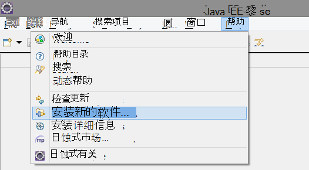

2. 在 http://dl.windowsazure.com/eclipse，在 Azure Toolkit 下是 SDK。 
3. 取消选中**联系所有更新站点...**

    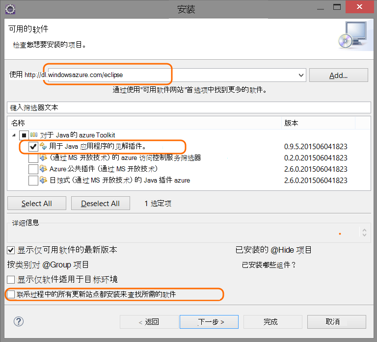

按照每个 Java 项目的剩余步骤。

## 在 Azure 中创建的应用程序理解资源

1. 登录到[Azure 的门户](https://portal.azure.com)。
2. 创建新的应用程序理解资源。  

    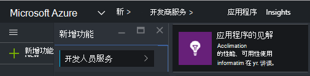  
3. 设置为 Java web 应用程序的应用程序类型。  

    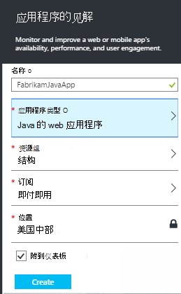  
4. 找到新资源的检测项。 您将需要粘贴到您的代码项目很快。  

    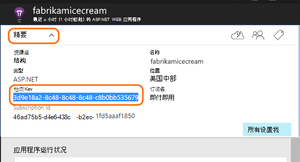  

## 向项目中添加应用程序的见解

1. 从 Java web 项目的上下文菜单中添加应用程序的见解。

    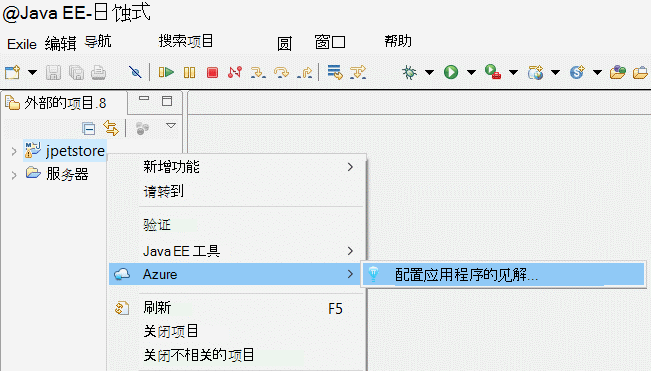

2. 粘贴你从 Azure 门户的检测项。

    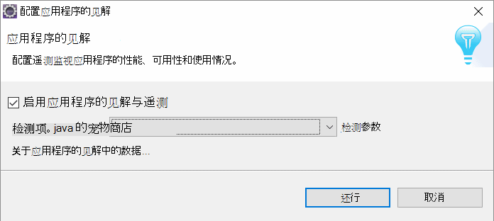

密钥和遥测的每一项发送，告诉应用程序理解，以便将其显示在所需的资源。

## 运行应用程序并查看规格

运行您的应用程序。

返回到 Microsoft Azure 中您应用程序的见解的资源。

HTTP 请求的数据将出现在概述刀片式服务器。 （如果没有，请稍候片刻，然后单击刷新。）

 

单击通过任何图表以查看更详细的指标。 

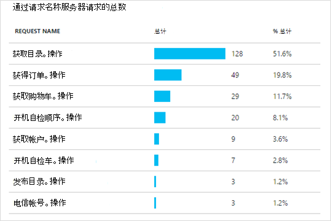

[了解有关指标。][metrics]

 

然后，查看请求的属性时，您可以看到请求和例外情况等与之相关联的遥测事件。
 
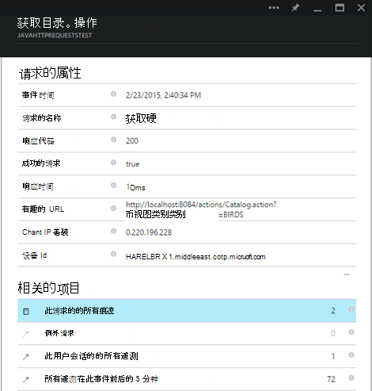

## 客户端的遥测

从快速启动刀片式服务器，请单击获取代码来监视 web 页︰ 

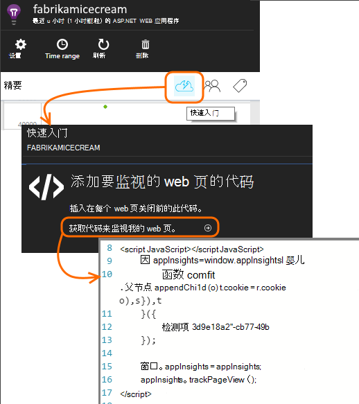

将代码段插入 HTML 文件的头部。

#### 查看客户端数据

打开更新的 web 页，并使用它们。 等待一分钟或两个，然后返回到应用程序的见解，并打开使用刀片式服务器。 （从概述刀片式服务器，向下滚动并单击用法）

页面视图、 用户和会话指标将出现在使用刀片式服务器上︰

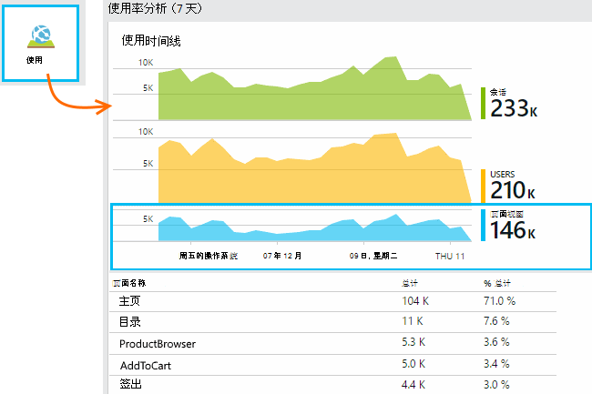

[了解更多有关设置客户端的遥测。][usage]

## 发布您的应用程序

现在，您的应用程序发布到服务器时，允许的人们使用它，并监视遥测显示在门户网站。

* 请确保您的防火墙允许应用程序发送遥测与这些端口︰

 * dc.services.visualstudio.com:443
 * dc.services.visualstudio.com:80
 * f5.services.visualstudio.com:443
 * f5.services.visualstudio.com:80

* 在 Windows 服务器上安装︰

 * [Microsoft Visual C++ 可再发行组件](http://www.microsoft.com/download/details.aspx?id=40784)

    （这使性能计数器）。

## 异常和请求失败

自动收集未经处理的异常︰

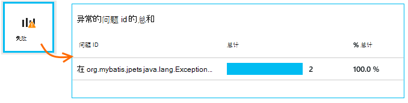

要收集的其他异常数据，您有两个选项︰

* [插入对 TrackException 您的代码中调用](app-insights-api-custom-events-metrics.md#track-exception)。 
* [安装 Java 代理服务器上](app-insights-java-agent.md)。 指定要监视的方法。

## 监视方法调用和外部依赖项

[安装 Java 代理](app-insights-java-agent.md)日志指定的内部方法和调用 JDBC，通过建立与计时数据。

## 性能计数器

在您概述刀片，向下滚动并单击**服务器**拼贴。 您将看到一系列的性能计数器。

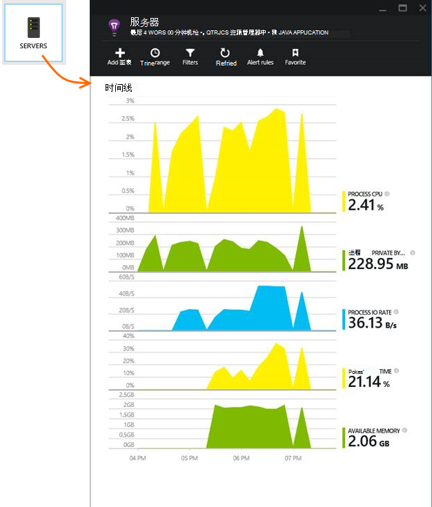

### 自定义性能计数器集合

要禁用一组标准的性能计数器的集合，请添加下面的 ApplicationInsights.xml 文件的根节点下面的代码︰

    <PerformanceCounters>
       <UseBuiltIn>False</UseBuiltIn>
    </PerformanceCounters>

### 收集性能计数器

您可以指定要收集的其他性能计数器。

#### JMX 计数器 （公开的 Java 虚拟机）

    <PerformanceCounters>
      <Jmx>
        <Add objectName="java.lang:type=ClassLoading" attribute="TotalLoadedClassCount" displayName="Loaded Class Count"/>
        <Add objectName="java.lang:type=Memory" attribute="HeapMemoryUsage.used" displayName="Heap Memory Usage-used" type="composite"/>
      </Jmx>
    </PerformanceCounters>

*   `displayName`--应用程序理解门户显示的名称。
*   `objectName`– 在 JMX 对象名称。
*   `attribute`– 要获取的 JMX 对象名称该属性
*   `type`（可选）-JMX 对象的属性的类型︰
 *  默认值︰ 简单类型如 int 或 long 类型的值。
 *  `composite`︰ 性能计数器数据是 Attribute.Data 的格式
 *  `tabular`︰ 性能计数器数据是表行的格式

#### Windows 性能计数器

每个[Windows 性能计数器](https://msdn.microsoft.com/library/windows/desktop/aa373083.aspx)（以同样的方式，该字段是类的成员） 是一个类别的成员。 类别可以是全局的或可有编号或命名实例。

    <PerformanceCounters>
      <Windows>
        <Add displayName="Process User Time" categoryName="Process" counterName="%User Time" instanceName="__SELF__" />
        <Add displayName="Bytes Printed per Second" categoryName="Print Queue" counterName="Bytes Printed/sec" instanceName="Fax" />
      </Windows>
    </PerformanceCounters>

*   显示名称--应用程序理解门户网站中显示的名称。
*   类别名称 – 此性能计数器关联的性能计数器类别 （性能对象）。
*   取代 – 性能计数器的名称。
*   实例名称 – 名称性能计数器类别实例中，则为空字符串 ("")，如果该类别包含单个实例。 如果类别名称过程，并且您可能会希望收集性能计数器是从当前 JVM 进程上运行您的应用程序，指定`"__SELF__"`。

性能计数器将显示[测量数据资源管理器]中的自定义指标为[metrics]。

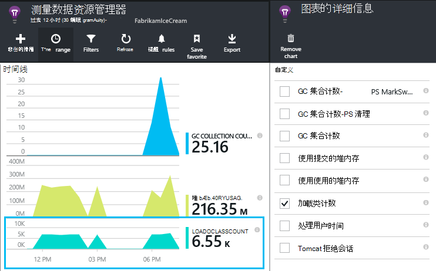

### Unix 的性能计数器

* [安装与该应用程序的见解插件 collectd](app-insights-java-collectd.md)以获取各种系统和网络数据。

## 可用性 web 测试

应用程序的见解可以测试您的网站是向上的复选和响应以及定期。 [若要设置][availability]，向下滚动，请单击可用性。

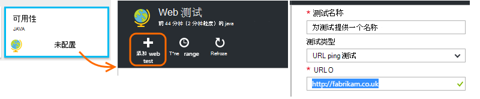

如果您的网站出现故障，您将获得的响应时间，再加上电子邮件通知。

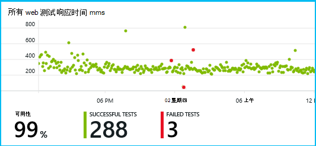

[了解可用性 web 测试。][availability] 

## 诊断日志

如果您使用的 Logback 或 Log4J （1.2 版或 2.0 版） 进行跟踪，您可以跟踪日志自动发送到应用程序您可以在这里浏览和搜索他们的见解。

[了解更多有关诊断日志][javalogs]

## 自定义遥测 

在 Java web 应用程序来了解用户用它做什么，或以帮助诊断问题中插入几行代码。 

您可以在 JavaScript 网页和服务器端 Java 中插入代码。

[了解有关自定义遥测][track]

## 下一步行动

#### 检测和诊断问题

* [添加 web 客户端遥测][usage]从 web 客户端获取性能遥测。
* [设置 web 测试][availability]以确保应用程序始终能够实时和快速响应。
* [搜索事件和日志][diagnostic]来帮助诊断问题。
* [捕获 Log4J 或 Logback 跟踪][javalogs]

#### 跟踪使用情况

* [添加 web 客户端遥测][usage]于监视器页面视图和基本用户指标。
* [自定义事件和指标跟踪][track]以了解有关您的应用程序如何使用的在客户端和服务器。

<!--Link references-->

[availability]: app-insights-monitor-web-app-availability.md
[diagnostic]: app-insights-diagnostic-search.md
[java]: app-insights-java-get-started.md
[javalogs]: app-insights-java-trace-logs.md
[metrics]: app-insights-metrics-explorer.md
[track]: app-insights-api-custom-events-metrics.md
[usage]: app-insights-web-track-usage.md

 