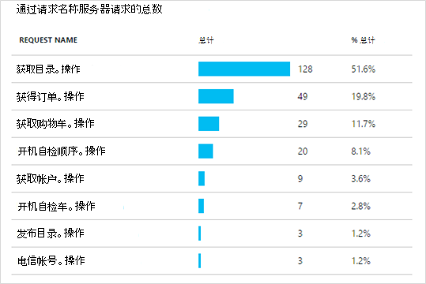
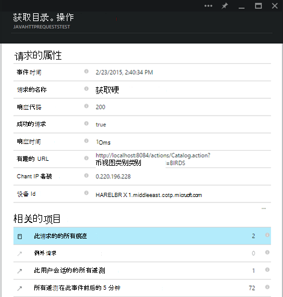
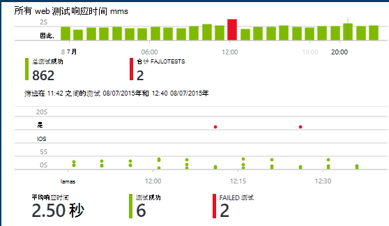

<properties
    pageTitle="应用程序的见解与 Java web 应用程序分析 |Microsoft Azure"
    description="监视性能和使用情况的网站 Java 应用程序的见解。 "
    services="application-insights"
    documentationCenter="java"
    authors="alancameronwills"
    manager="douge"/>

<tags
    ms.service="application-insights"
    ms.workload="tbd"
    ms.tgt_pltfrm="ibiza"
    ms.devlang="na"
    ms.topic="get-started-article"
    ms.date="08/17/2016"
    ms.author="awills"/>

# 在 Java web 项目中开始使用应用程序的见解

*在预览是应用程序的见解。*

[AZURE.INCLUDE [app-insights-selector-get-started](../../includes/app-insights-selector-get-started.md)]

[应用程序的见解](https://azure.microsoft.com/services/application-insights/)是可扩展的分析服务，帮助您了解性能和实时应用程序的使用情况。 用于[检测和诊断性能问题和异常](app-insights-detect-triage-diagnose.md)，并[编写代码][api]来跟踪用户与您的应用程序的执行。

应用程序的见解支持 Linux、 Unix 或 Windows 上运行的 Java 应用程序。

你需要：

* Oracle JRE 1.6 或更高版本，或者祖鲁 JRE 1.6 或更高版本
* 对[Microsoft Azure](https://azure.microsoft.com/)的订阅。 （您无法启动[免费试用版](https://azure.microsoft.com/pricing/free-trial/)。）

*如果您有已实时 web 应用程序，您可以添加[运行时在 web 服务器上的 SDK](app-insights-java-live.md)遵循替代过程。该替代方案可避免重新生成代码，但不能获得可以编写代码来跟踪用户活动。*

## 1.获得应用程序的见解检测密钥

1. 登录到[Microsoft Azure 门户](https://portal.azure.com)。
2. 创建一个应用程序的见解资源。 设置为 Java web 应用程序的应用程序类型。

    
4. 找到新资源的检测项。 您将需要将此密钥粘贴到代码项目很快。

    

## 2.向项目中添加 Java 应用程序的见解 SDK

*选择适当的方式为您的项目。*

#### 如果您使用 Eclipse Maven 或动态 Web 项目...

使用[应用程序的 Java 插件的见解 SDK][eclipse]。

#### 如果您正在使用 Maven...

如果您的项目已经设置为使用 Maven，合并 pom.xml 文件与下面的代码。

然后，刷新以获取下载的二进制文件的项目依赖项。

    <repositories>
       <repository>
          <id>central</id>
          <name>Central</name>
          <url>http://repo1.maven.org/maven2</url>
       </repository>
    </repositories>

    <dependencies>
      <dependency>
        <groupId>com.microsoft.azure</groupId>
        <artifactId>applicationinsights-web</artifactId>
        <!-- or applicationinsights-core for bare API -->
        <version>[1.0,)</version>
      </dependency>
    </dependencies>

* *生成或校验和验证错误？* 请尝试使用一个特定的版本，如︰ `<version>1.0.n</version>`。 在[SDK 发行说明](https://github.com/Microsoft/ApplicationInsights-Java#release-notes)中或在我们[Maven 项目](http://search.maven.org/#search%7Cga%7C1%7Capplicationinsights)，您会发现最新的版本。
* *需要为新的 SDK 更新？* 刷新项目的依赖项。

#### 如果您使用的 Gradle...

如果您的项目已设置要用于生成 Gradle，合并以下代码到您的 build.gradle 文件。

然后刷新以获取下载的二进制文件的项目依赖项。

    repositories {
      mavenCentral()
    }

    dependencies {
      compile group: 'com.microsoft.azure', name: 'applicationinsights-web', version: '1.+'
      // or applicationinsights-core for bare API
    }

* *生成或校验和校验错误？请尝试使用一个特定的版本，如︰* `version:'1.0.n'`。 *您可以找到最新版本的[SDK 发行说明](https://github.com/Microsoft/ApplicationInsights-Java#release-notes)中。*
* *若要更新到了新的 SDK*
 * 刷新项目的依赖项。

#### 否则为...

手动添加 SDK:

1. 下载[应用程序的 Java SDK 见解](https://aka.ms/aijavasdk)。
2. 从 zip 文件解压二进制文件并将它们添加到您的项目。

### 问题...

* *之间的关系是什么`-core`，`-web`在 zip 中的组件？*

 * `applicationinsights-core`为您提供裸机的 API。 您总是需要该组件。
 * `applicationinsights-web`为您提供跟踪 HTTP 请求和响应时间的衡量标准。 如果您不希望自动收集此遥测，则可以省略此组件。 例如，如果您要编写您自己。

* *当我们发布的更改更新 SDK*
 * 下载最新[的 Java 应用程序的见解 SDK](https://aka.ms/qqkaq6)并替换旧电池。
 * 在[SDK 发行说明](https://github.com/Microsoft/ApplicationInsights-Java#release-notes)中介绍的更改。

## 3.添加一个应用程序的见解的.xml 文件

将 ApplicationInsights.xml 添加到资源文件夹在您的项目中，或者确保它被添加到项目的类路径部署。 在其中复制下面的 XML。

用来代替你从 Azure 门户的检测项。

    <?xml version="1.0" encoding="utf-8"?>
    <ApplicationInsights xmlns="http://schemas.microsoft.com/ApplicationInsights/2013/Settings" schemaVersion="2014-05-30">

      <!-- The key from the portal: -->

      <InstrumentationKey>** Your instrumentation key **</InstrumentationKey>

      <!-- HTTP request component (not required for bare API) -->

      <TelemetryModules>
        <Add type="com.microsoft.applicationinsights.web.extensibility.modules.WebRequestTrackingTelemetryModule"/>
        <Add type="com.microsoft.applicationinsights.web.extensibility.modules.WebSessionTrackingTelemetryModule"/>
        <Add type="com.microsoft.applicationinsights.web.extensibility.modules.WebUserTrackingTelemetryModule"/>
      </TelemetryModules>

      <!-- Events correlation (not required for bare API) -->
      <!-- These initializers add context data to each event -->

      <TelemetryInitializers>
        <Add   type="com.microsoft.applicationinsights.web.extensibility.initializers.WebOperationIdTelemetryInitializer"/>
        <Add type="com.microsoft.applicationinsights.web.extensibility.initializers.WebOperationNameTelemetryInitializer"/>
        <Add type="com.microsoft.applicationinsights.web.extensibility.initializers.WebSessionTelemetryInitializer"/>
        <Add type="com.microsoft.applicationinsights.web.extensibility.initializers.WebUserTelemetryInitializer"/>
        <Add type="com.microsoft.applicationinsights.web.extensibility.initializers.WebUserAgentTelemetryInitializer"/>

      </TelemetryInitializers>
    </ApplicationInsights>

* 检测项遥测的每一项一起发送并告诉应用程序理解，以便将其显示在所需的资源。
* HTTP 请求组件是可选的。 它自动发送到门户的遥测有关请求和响应时间。
* 事件关联是 HTTP 请求组件的补充。 它将标识符分配给服务器，接收的每个请求，并将此标识符作为属性添加到遥测的每一项，作为 Operation.Id 的属性。 它使您可以关联[诊断搜索]中设置筛选器与每个请求关联的遥测数据[diagnostic]。
* 从 Azure 门户作为系统属性动态传递应用程序的见解密钥 (-DAPPLICATION_INSIGHTS_IKEY = your_ikey)。 如果不没有定义任何属性，它检查在 Azure 应用程序设置的环境变量 (APPLICATION_INSIGHTS_IKEY)。 如果未定义两个属性，属性可以从 ApplicationInsights.xml 使用默认值 InstrumentationKey。 此系列可帮助您管理针对不同环境不同 InstrumentationKeys 动态。

### 设置检测项的其他方式

按此顺序键查找应用程序深入 SDK:

1. 系统属性:-DAPPLICATION_INSIGHTS_IKEY = your_ikey
2. 环境变量︰ APPLICATION_INSIGHTS_IKEY
3. 配置文件︰ ApplicationInsights.xml

您也可以[将其在代码中设置](app-insights-api-custom-events-metrics.md#ikey)︰

    telemetryClient.InstrumentationKey = "...";

## 4.添加 HTTP 筛选器

最后一个配置步骤允许登录每个 web 请求的 HTTP 请求组件。 （不需要如果您只需要裸机 API。）

查找并打开 web.xml 文件在您的项目中，合并的节点下的 web 应用程序，您的应用程序筛选器的配置位置下面的代码。

若要获得最准确的结果，应该在所有其他筛选器之前映射筛选器。

    <filter>
      <filter-name>ApplicationInsightsWebFilter</filter-name>
      <filter-class>
        com.microsoft.applicationinsights.web.internal.WebRequestTrackingFilter
      </filter-class>
    </filter>
    <filter-mapping>
       <filter-name>ApplicationInsightsWebFilter</filter-name>
       <url-pattern>/*</url-pattern>
    </filter-mapping>

#### 如果您使用的弹簧 Web MVC 3.1 或更高版本

编辑这些元素可以包含应用程序的见解的程序包︰

    <context:component-scan base-package=" com.springapp.mvc, com.microsoft.applicationinsights.web.spring"/>

    <mvc:interceptors>
        <mvc:interceptor>
            <mvc:mapping path="/**"/>
            <bean class="com.microsoft.applicationinsights.web.spring.RequestNameHandlerInterceptorAdapter" />
        </mvc:interceptor>
    </mvc:interceptors>

#### 如果您正在使用 Struts 2

将此项添加到 Struts 配置文件 （通常命名为 struts.xml 或 struts default.xml）︰

     <interceptors>
       <interceptor name="ApplicationInsightsRequestNameInterceptor" class="com.microsoft.applicationinsights.web.struts.RequestNameInterceptor" />
     </interceptors>
     <default-interceptor-ref name="ApplicationInsightsRequestNameInterceptor" />

（如果您具有定义默认堆栈中的拦截器，拦截器可以简单地添加到该堆栈。）

## 5.运行您的应用程序

在调试模式下运行它在您的开发计算机上，或者发布到您的服务器。

## 6.在应用程序的见解中查看您的遥测

返回到[Microsoft Azure 门户](https://portal.azure.com)中所需应用程序的见解的资源。

HTTP 请求的数据将出现在概述刀片式服务器。 （如果没有，请稍候片刻，然后单击刷新。）

[了解有关指标。][metrics]

单击通过任何图表以查看更多详细的聚合的度量。

> 应用程序的见解认为 MVC 应用程序的 HTTP 请求的格式是︰ `VERB controller/action`。 例如， `GET Home/Product/f9anuh81`， `GET Home/Product/2dffwrf5` ，`GET Home/Product/sdf96vws`分为`GET Home/Product`。 这种分组使意义聚合的请求，如请求数量和请求的平均执行时间。

### 实例数据 

单击以查看各个实例的特定请求类型。 

两种类型的数据将显示在应用程序的见解︰ 聚合数据，存储并显示为平均值、 计数以及总和;和实例数据的 HTTP 请求、 异常、 页面视图或自定义事件的具体报告。

查看请求的属性时，您可以看到请求和例外情况等与之相关联的遥测事件。

### 分析︰ 功能强大的查询语言

随着积累更多的数据，您可以运行查询对数据进行聚合和查找单个实例。 [分析]()是一种功能强大的工具，同时了解性能和使用情况，并用于诊断目的。

## 7.在该服务器上安装您的应用程序

现在，您的应用程序发布到服务器时，允许的人们使用它，并监视遥测显示在门户网站。

* 请确保您的防火墙允许应用程序发送遥测与这些端口︰

 * dc.services.visualstudio.com:443
 * f5.services.visualstudio.com:443

* 在 Windows 服务器上安装︰

 * [Microsoft Visual C++ 可再发行组件](http://www.microsoft.com/download/details.aspx?id=40784)

    （此组件，启用性能计数器）。

## 异常和请求失败

自动收集未经处理的异常︰

要收集的其他异常数据，您有两个选项︰

* [在代码中插入调用 trackException()][apiexceptions]。 
* [安装 Java 代理服务器上](app-insights-java-agent.md)。 指定要监视的方法。

## 监视方法调用和外部依赖项

[安装 Java 代理](app-insights-java-agent.md)日志指定的内部方法和调用 JDBC，通过建立与计时数据。

## 性能计数器

打开**设置**，**服务器**，以查看范围的性能计数器。

### 自定义性能计数器集合

要禁用一组标准的性能计数器的集合，请添加下面的 ApplicationInsights.xml 文件的根节点下面的代码︰

    <PerformanceCounters>
       <UseBuiltIn>False</UseBuiltIn>
    </PerformanceCounters>

### 收集性能计数器

您可以指定要收集的其他性能计数器。

#### JMX 计数器 （公开的 Java 虚拟机）

    <PerformanceCounters>
      <Jmx>
        <Add objectName="java.lang:type=ClassLoading" attribute="TotalLoadedClassCount" displayName="Loaded Class Count"/>
        <Add objectName="java.lang:type=Memory" attribute="HeapMemoryUsage.used" displayName="Heap Memory Usage-used" type="composite"/>
      </Jmx>
    </PerformanceCounters>

*   `displayName`--应用程序理解门户显示的名称。
*   `objectName`– 在 JMX 对象名称。
*   `attribute`– 要获取的 JMX 对象名称该属性
*   `type`（可选）-JMX 对象的属性的类型︰
 *  默认值︰ 简单类型如 int 或 long 类型的值。
 *  `composite`︰ 性能计数器数据是 Attribute.Data 的格式
 *  `tabular`︰ 性能计数器数据是表行的格式

#### Windows 性能计数器

每个[Windows 性能计数器](https://msdn.microsoft.com/library/windows/desktop/aa373083.aspx)（以同样的方式，该字段是类的成员） 是一个类别的成员。 类别可以是全局的或可有编号或命名实例。

    <PerformanceCounters>
      <Windows>
        <Add displayName="Process User Time" categoryName="Process" counterName="%User Time" instanceName="__SELF__" />
        <Add displayName="Bytes Printed per Second" categoryName="Print Queue" counterName="Bytes Printed/sec" instanceName="Fax" />
      </Windows>
    </PerformanceCounters>

*   显示名称--应用程序理解门户网站中显示的名称。
*   类别名称 – 此性能计数器关联的性能计数器类别 （性能对象）。
*   取代 – 性能计数器的名称。
*   实例名称 – 名称性能计数器类别实例中，则为空字符串 ("")，如果该类别包含单个实例。 如果类别名称过程，并且您可能会希望收集性能计数器是从当前 JVM 进程上运行您的应用程序，指定`"__SELF__"`。

性能计数器将显示[测量数据资源管理器]中的自定义指标为[metrics]。

### Unix 的性能计数器

* [安装与该应用程序的见解插件 collectd](app-insights-java-collectd.md)以获取各种系统和网络数据。

## 获取用户和会话数据

好的您从您的 web 服务器发送遥测。 现在若要获得完整的 360 度视图的应用程序，您可以添加多个监视︰

* [向 web 页添加遥测][usage]到监视器页面视图和用户的指标。
* [设置 web 测试][availability]以确保应用程序始终能够实时和快速响应。

## 捕获日志跟踪

从 Log4J，Logback 或其他日志记录框架，您可以使用切片和切块日志应用程序的见解。 可以将日志与 HTTP 请求和其他遥测相关联。 [了解如何][javalogs]。

## 发送您自己的遥测

现在，您已安装 SDK，可以使用 API 来发送自己的遥测。

* [自定义事件和指标跟踪][api]以了解执行与应用程序的用户。
* [搜索事件和日志][diagnostic]来帮助诊断问题。

## 可用性 web 测试

应用程序的见解可以测试您的网站是向上的复选和响应以及定期。 [若要设置][availability]，单击 Web 测试。

如果您的网站出现故障，您将获得的响应时间，再加上电子邮件通知。

[了解可用性 web 测试。][availability] 

## 问题？ 有问题吗？

[Java 的疑难解答](app-insights-java-troubleshoot.md)

## 下一步行动

有关详细信息，请参见[Java 开发人员中心](/develop/java/)。

<!--Link references-->

[api]: app-insights-api-custom-events-metrics.md
[apiexceptions]: app-insights-api-custom-events-metrics.md#track-exception
[availability]: app-insights-monitor-web-app-availability.md
[diagnostic]: app-insights-diagnostic-search.md
[eclipse]: app-insights-java-eclipse.md
[javalogs]: app-insights-java-trace-logs.md
[metrics]: app-insights-metrics-explorer.md
[usage]: app-insights-web-track-usage.md
