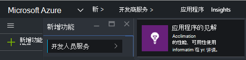
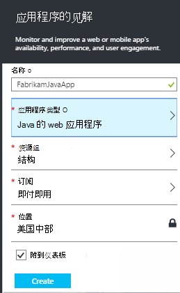
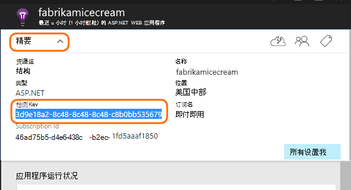
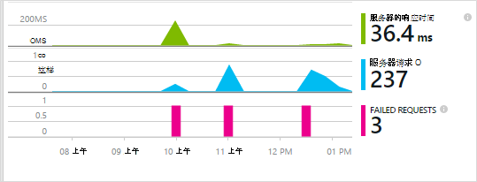
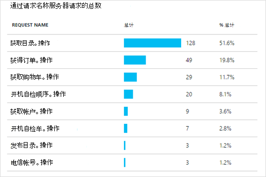
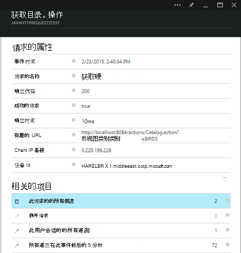

<properties 
    pageTitle="已有的 Java web 应用程序的应用程序见解生存" 
    description="开始监视的 web 应用程序已在服务器上运行" 
    services="application-insights" 
    documentationCenter="java"
    authors="alancameronwills" 
    manager="douge"/>

<tags 
    ms.service="application-insights" 
    ms.workload="tbd" 
    ms.tgt_pltfrm="ibiza" 
    ms.devlang="na" 
    ms.topic="article" 
    ms.date="08/24/2016" 
    ms.author="awills"/>
 
# 已有的 Java web 应用程序的应用程序见解生存

*在预览是应用程序的见解。*

如果您有已在 J2EE 服务器运行的 web 应用程序，您可以启动监视它与[应用程序的见解](app-insights-overview.md)而无需更改代码或重新编译您的项目。 使用此选项，您可以获取有关 HTTP 请求发送到您的服务器，未经处理的异常，并且性能计数器信息。

您将需要对[Microsoft Azure](https://azure.com)的订阅。

> [AZURE.NOTE] 在此页上的步骤向您的 web 应用程序在运行时的 SDK。 此运行时检测是如果不想更新或重新生成源代码时非常有用。 但是，如果可以我们建议您[添加源代码 SDK](app-insights-java-get-started.md)相反。 它使您可以更多的选项，如编写代码来跟踪用户活动。

## 1.获得应用程序的见解检测密钥

1. 登录到[Microsoft Azure 门户](https://portal.azure.com)
2. 创建新的应用程序理解资源

    
3. 设置为 Java web 应用程序的应用程序类型。

    
4. 找到新资源的检测项。 您将需要将此密钥粘贴到代码项目很快。

    

## 2.下载 SDK

1. 下载[应用程序的 Java SDK 见解](https://aka.ms/aijavasdk)。 
2. 在服务器上，SDK 内容解压至从中加载您的项目二进制文件的目录。 如果您正在使用 Tomcat，该目录通常是在下`webapps\<your_app_name>\WEB-INF\lib`

## 3.添加应用程序理解 xml 文件

在添加了 SDK 文件夹中创建 ApplicationInsights.xml。 将添加到下面的 XML。

用来代替你从 Azure 门户的检测项。

    <?xml version="1.0" encoding="utf-8"?>
    <ApplicationInsights xmlns="http://schemas.microsoft.com/ApplicationInsights/2013/Settings" schemaVersion="2014-05-30">

      <!-- The key from the portal: -->

      <InstrumentationKey>** Your instrumentation key **</InstrumentationKey>

      <!-- HTTP request component (not required for bare API) -->

      <TelemetryModules>
        <Add type="com.microsoft.applicationinsights.web.extensibility.modules.WebRequestTrackingTelemetryModule"/>
        <Add type="com.microsoft.applicationinsights.web.extensibility.modules.WebSessionTrackingTelemetryModule"/>
        <Add type="com.microsoft.applicationinsights.web.extensibility.modules.WebUserTrackingTelemetryModule"/>
      </TelemetryModules>

      <!-- Events correlation (not required for bare API) -->
      <!-- These initializers add context data to each event -->

      <TelemetryInitializers>
        <Add   type="com.microsoft.applicationinsights.web.extensibility.initializers.WebOperationIdTelemetryInitializer"/>
        <Add type="com.microsoft.applicationinsights.web.extensibility.initializers.WebOperationNameTelemetryInitializer"/>
        <Add type="com.microsoft.applicationinsights.web.extensibility.initializers.WebSessionTelemetryInitializer"/>
        <Add type="com.microsoft.applicationinsights.web.extensibility.initializers.WebUserTelemetryInitializer"/>
        <Add type="com.microsoft.applicationinsights.web.extensibility.initializers.WebUserAgentTelemetryInitializer"/>

      </TelemetryInitializers>
    </ApplicationInsights>

* 检测项遥测的每一项一起发送并告诉应用程序理解，以便将其显示在所需的资源。
* HTTP 请求组件是可选的。 它自动发送到门户的遥测有关请求和响应时间。
* 事件关联是 HTTP 请求组件的补充。 它将标识符分配给服务器，接收的每个请求，并将此标识符作为属性添加到遥测的每一项，作为 Operation.Id 的属性。 它允许您通过[诊断搜索](app-insights-diagnostic-search.md)中设置筛选器与每个请求关联的遥测数据关联起来。

## 4.添加 HTTP 筛选器

查找并打开 web.xml 文件在您的项目中，合并代码的 web 应用程序节点，您的应用程序筛选器的配置位置下面的代码段。

若要获得最准确的结果，应该在所有其他筛选器之前映射筛选器。

    <filter>
      <filter-name>ApplicationInsightsWebFilter</filter-name>
      <filter-class>
        com.microsoft.applicationinsights.web.internal.WebRequestTrackingFilter
      </filter-class>
    </filter>
    <filter-mapping>
       <filter-name>ApplicationInsightsWebFilter</filter-name>
       <url-pattern>/*</url-pattern>
    </filter-mapping>

## 5.请检查防火墙例外

您可能需要[设置例外情况发送传出的数据](app-insights-ip-addresses.md)。

## 6.重新启动您的 web 应用程序

## 7.在应用程序的见解中查看您的遥测

返回到[Microsoft Azure 门户](https://portal.azure.com)中所需应用程序的见解的资源。

有关 HTTP 请求的遥测显示概述刀片式服务器电源。 （如果没有，请稍候片刻，然后单击刷新。）

 

单击通过任何图表以查看更详细的指标。 

 

然后，查看请求的属性时，您可以看到请求和例外情况等与之相关联的遥测事件。
 

[了解有关指标。](app-insights-metrics-explorer.md)

## 下一步行动

* 对监视器页面视图和用户指标[向网页添加遥测](app-insights-web-track-usage.md)。
* [设置 web 测试](app-insights-monitor-web-app-availability.md)以确保应用程序始终能够实时和快速响应。
* [捕获日志跟踪](app-insights-java-trace-logs.md)
* [搜索事件和日志](app-insights-diagnostic-search.md)来帮助诊断问题。

 
