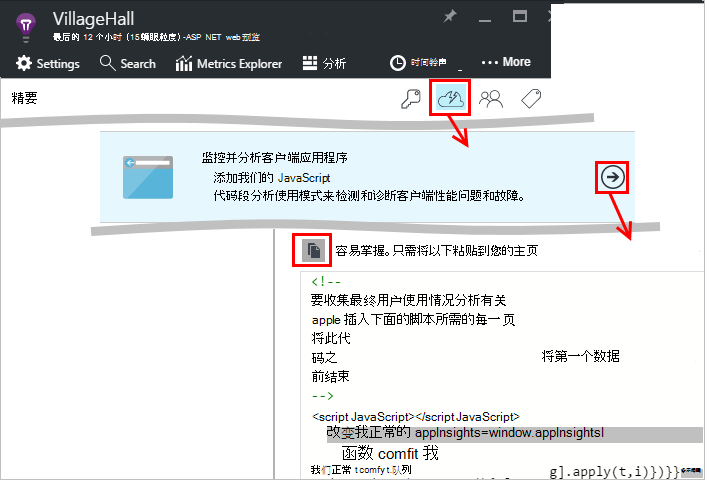

<properties
    pageTitle="JavaScript 的应用程序理解 web 应用程序 |Microsoft Azure"
    description="获取页面视图和会话计数，web 客户端数据，并跟踪使用模式。 在 JavaScript 网页中检测到异常和性能问题。"
    services="application-insights"
    documentationCenter=""
    authors="alancameronwills"
    manager="douge"/>

<tags
    ms.service="application-insights"
    ms.workload="tbd"
    ms.tgt_pltfrm="ibiza"
    ms.devlang="na"
    ms.topic="get-started-article"
    ms.date="08/15/2016"
    ms.author="awills"/>

# 应用程序的 web 页的见解

[AZURE.INCLUDE [app-insights-selector-get-started-dotnet](../../includes/app-insights-selector-get-started-dotnet.md)]

找出有关的性能和使用您的 web 页或应用程序。 如果网页脚本中添加 Visual Studio 应用程序见解，则会执行时间的网页加载和 AJAX 调用、 计数以及浏览器异常和 AJAX 故障，以及用户和会话计数的详细信息。 所有这些可以通过页、 客户端操作系统和浏览器版本、 地理位置和其他维度进行细分。 也可以设置警报失败计数或页面加载速度慢。

您可以使用应用程序的见解与任何 web 页-您只需添加一小段 JavaScript。 如果[Java](app-insights-java-get-started.md)或[ASP.NET](app-insights-asp-net.md)web 服务，您可以集成来自您的服务器和客户端的遥测。

您需要订阅[Microsoft Azure](https://azure.com)。 如果您的团队可以组织订阅，提出要向其添加 Microsoft 帐户的所有者。 没有可用的定价层，因此开发和小规模使用不能收取任何费用。

## 为您的 web 页设置应用程序的见解

首先，需要添加到您的网页应用程序的见解？ 您可能已经这样做。 如果您选择要添加到您在 Visual Studio 中的新建项目对话框中的 web 应用程序的应用程序的见解，然后添加该脚本。 在这种情况下，您不需要做任何更多。

否则，您需要添加代码段您的 web 页，如下所示。

### 打开应用程序理解资源

应用程序的见解资源是其中显示有关页的性能和使用情况的数据。 

登录到[Azure 的门户](https://portal.azure.com)。

如果您已经设置了监视您的应用程序的服务器端，您已经拥有资源︰

如果您没有，请创建它︰

*已经问题吗？* [有关创建资源的详细信息](app-insights-create-new-resource.md)。

### 将该 SDK 脚本添加到您的应用程序或 web 页

在快速启动获取 web 页的脚本︰

之前插入脚本`</head>`想要跟踪的每一页的标记。 如果您的网站具有一个主页，您可以将脚本放那里。 例如︰

* 在 ASP.NET MVC 项目中，您可以将其放在`View\Shared\_Layout.cshtml`
* 在 SharePoint 网站，在控制面板中打开[网站设置 / 母版页](app-insights-sharepoint.md)。

脚本中包含将数据传递到您的应用程序理解资源的检测项。 

（[更深入解释脚本](http://apmtips.com/blog/2015/03/18/javascript-snippet-explained/)）

*（如果您正在使用一个已知 web 页的框架，寻找的见解应用程序适配器。例如，将[AngularJS 模块](http://ngmodules.org/modules/angular-appinsights)。)*

## 详细的配置

有几个[参数](https://github.com/Microsoft/ApplicationInsights-JS/blob/master/API-reference.md#config)可以设置，但在大多数情况下，不应需要。 例如，可以禁用或限制报告的每个页面视图 （减少通信量） Ajax 调用的次数。 或者，您可以设置调试模式具有遥测移动迅速通过管道而不会被分批处理。

要设置这些参数，请查找下面一行代码段中，在和其后添加多个以逗号分隔的项︰

    })({
      instrumentationKey: "..."
      // Insert here
    });

[可用的参数](https://github.com/Microsoft/ApplicationInsights-JS/blob/master/API-reference.md#config)包括︰

    // Send telemetry immediately without batching.
    // Remember to remove this when no longer required, as it
    // can affect browser performance.
    enableDebug: boolean,

    // Don't log browser exceptions.
    disableExceptionTracking: boolean,

    // Don't log ajax calls.
    disableAjaxTracking: boolean,

    // Limit number of Ajax calls logged, to reduce traffic.
    maxAjaxCallsPerView: 10, // default is 500

    // Time page load up to execution of first trackPageView().
    overridePageViewDuration: boolean,

    // Set these dynamically for an authenticated user.
    appUserId: string,
    accountId: string,

## 运行您的应用程序

运行您的 web 应用程序，使用它一段时间才能生成遥测，并等待几秒钟。 可以使用您的开发计算机上的**F5**键运行，或将其发布并使用户可以跟它一起玩。

如果您想要检查 web 应用程序发送到应用程序的见解的遥测数据，使用浏览器的调试工具 (**F12**在浏览器中很多)。 数据被发送到 dc.services.visualstudio.com。

## 浏览您的浏览器性能数据

打开浏览器刀片，以显示从用户的浏览器的聚合的性能数据。

*还没有数据？单击**刷新**在页面的顶部。仍然没有？请参阅[疑难解答](app-insights-troubleshoot-faq.md)。*

浏览器刀片是预设筛选器和图表选择一个[度量标准浏览器刀片](app-insights-metrics-explorer.md)。 如果您需要，并将结果保存为收藏，可以编辑时间范围、 筛选器和图表配置。 单击**还原为默认值**以返回到原始的刀片配置。

## 页面加载性能

在顶部是分段的图表的页面加载时间。 图表的总高度表示加载和显示从您的应用程序页在用户的浏览器中的平均时间。 时间被指从浏览器发送的初始 HTTP 请求之前已处理的事件，包括布局和运行脚本的所有同步负载时。 它不包括异步任务，如加载 AJAX 调用的 web 部件。

图表[由 W3C 定义的标准定时](http://www.w3.org/TR/navigation-timing/#processing-model)到段总页面加载时间。 

请注意，*网络连接*时间通常低于预期的那样，因为它是通过从浏览器到服务器的所有请求的平均。 许多单个请求具有连接时间为 0，因为已存在到服务器的活动连接。

### 降低加载吗？

慢速网页加载是您的用户不满意的一个主要来源。 如果图表表明慢速网页加载，可以很容易地进行一些诊断研究。

图表显示在您的应用程序中的所有页加载时的平均值。 若要查看该问题仅限于特定的页，查看进一步关闭刀片式服务器，网格细分的页面的 URL 的位置︰

请注意页面视图数和标准偏差。 如果页计数是很低，然后问题不影响用户得多。 高标准偏差 （相当于本身的平均值） 表示了很大变化，每个值之间。

**一个 URL 和一个页面视图上进行放大。** 单击任何页名称，查看浏览器图表筛选仅对该 URL; 刀片然后在页面视图模式下的实例。

单击`...`为该事件属性的完整列表或检查的 Ajax 调用和相关的事件。 如果它们是同步，Ajax 调用速度缓慢影响整个页面加载时间。 相关的事件包括服务器请求相同的 URL （如果在您的 web 服务器上设置了应用程序的见解）。

**随着时间的推移页性能。** 后在浏览器刀片，按钮会变为页面视图加载时间网格线图以确定是否在特定的时间出现高峰期︰

**其他尺寸进行细分。** 也许您的网页要慢要加载特定的浏览器、 操作系统，客户端或用户所在地？ 添加新的图表和试验**组的**维度。

## AJAX 性能

请确保在 web 页中的任何 AJAX 调用表现良好。 它们通常用于以异步方式填充页面的部分。 虽然可能会立即加载整个页面，您的用户无法如人意在空白 web 部件，两眼望着等待数据显示在它们。

AJAX 调用从您的网页浏览器刀片上所示为依赖项。

有上部的刀片式服务器中的摘要图表︰

和较低的详细的网格︰

单击任意行的特定详细信息。

> [AZURE.NOTE] 如果您删除刀片式服务器上的浏览器筛选，服务器和 AJAX 依赖项包含在这些图表中。 单击还原默认值重新配置筛选器。

**深入查看失败的 Ajax 调用**向下滚动到依赖项故障网格中，然后单击若要查看特定实例的行。

单击`...`的 Ajax 调用的完整遥测数据。

### 报告没有 Ajax 调用？

Ajax 调用包括从网页中的脚本进行任何 HTTP 调用。 如果您看不到这些报告，检查代码段不设置`disableAjaxTracking`或`maxAjaxCallsPerView`[参数](https://github.com/Microsoft/ApplicationInsights-JS/blob/master/API-reference.md#config)。

## 浏览器异常

在浏览器刀片式服务器，没有异常摘要图表和网格的异常类型进一步关闭刀片式服务器。

如果您看不到浏览器例外报告，检查代码段不设置`disableExceptionTracking`[参数](https://github.com/Microsoft/ApplicationInsights-JS/blob/master/API-reference.md#config)。

## 检查各个页面查看事件

通常页面视图遥测分析的应用程序的见解和查看仅累计报告，对所有用户的平均值。 但出于调试目的，您还可以查看单个页面查看事件。

在搜索诊断刀片式服务器，到页视图中设置筛选器。

选择任何事件以查看更多详细信息。 在详细信息页中，单击"..."以查看更多详细信息。

> [AZURE.NOTE] 如果您使用[搜索](app-insights-diagnostic-search.md)，请注意，您需要匹配整个单词:"关于"和"糊涂"不匹配"关于"。

此外可以使用功能强大的[分析查询语言](app-insights-analytics-tour.md)来搜索页面视图。

### 页面视图属性

* **页面查看持续时间** 

 * 默认情况下，加载该页面，从客户端所花费的时间申请到满负载 （包括辅助文件，但不包括异步任务，例如，Ajax 调用）。 
 * 如果您设置`overridePageViewDuration`在[寻呼配置](#detailed-configuration)中，客户端之间的间隔请求执行的第一个`trackPageView`。 如果移动 trackPageView 从其正常位置的脚本初始化后，它将反映不同的值。
 * 如果`overridePageViewDuration`是集和持续时间中提供参数`trackPageView()`调用，则该参数值将改为使用。 

## 自定义页计数

默认情况下，页计数在每次新页加载到客户端浏览器时。  但是，您可能想要计算其他页面视图。 例如，页面可能会显示在选项卡的内容并且想要计算用户切换选项卡页。 或网页中的 JavaScript 代码可能会加载新的内容，而无需更改浏览器的 URL。

在相应的点在客户端代码中插入如下的 JavaScript 调用︰

    appInsights.trackPageView(myPageName);

页面名称可以包含相同的字符作为 URL，但任何后"#"或"？"将被忽略。

## 使用跟踪

要了解您的用户使用您的应用程序做的什么？

* [了解如何使用跟踪](app-insights-web-track-usage.md)
* [了解自定义事件和度量 API](app-insights-api-custom-events-metrics.md)。

#### 视频︰ 跟踪使用情况

> [AZURE.VIDEO tracking-usage-with-application-insights]

## 下一步行动

* [跟踪使用情况](app-insights-web-track-usage.md)
* [自定义事件和标准](app-insights-api-custom-events-metrics.md)
* [了解生成的度量值](app-insights-overview-usage.md)

