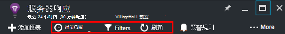
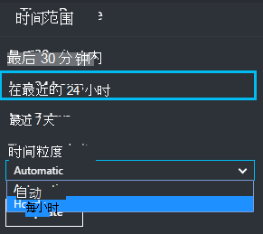

<properties 
    pageTitle="研究中应用程序建议的指标 |Microsoft Azure" 
    description="如何解释上度量资源管理器中，图表以及如何自定义跃点数的资源管理器刀片。" 
    services="application-insights" 
    documentationCenter=""
    authors="alancameronwills" 
    manager="douge"/>

<tags 
    ms.service="application-insights" 
    ms.workload="tbd" 
    ms.tgt_pltfrm="ibiza" 
    ms.devlang="na" 
    ms.topic="article" 
    ms.date="10/15/2016" 
    ms.author="awills"/>
 
# 研究中应用程序建议的指标

以[应用程序理解]的指标[start]的测量的值和从应用程序发送的遥测事件的计数。 它们帮助您检测性能问题并监视应用程序的使用方式的趋势。 没有了范围广泛的标准度量，并且您还可以创建您自己的自定义指标和事件。

指标和事件计数将显示在图表中的聚合值，如求和、 求平均值或计数。

下面是一个示例图表︰

有些图表分段︰ 任意点处的图表的总高度是显示的度量值的总和。 默认情况下的图例显示的最大数量。

虚线显示的度量值以前一周。

## 时间范围

您可以更改图表或任何刀片式服务器上的网格覆盖的时间范围。

如果期望尚未尚未出现一些数据，单击刷新。 图表进行自我刷新的时间间隔，但时间间隔很长的更大的时间范围。 在发布模式下，可能需要一段时间通过分析管道到图表上的数据。

若要缩放的图表部分，拖动它︰

单击撤消缩放按钮以将其还原。

## 粒度和点值

将鼠标悬停在此时显示的度量值的图表。

前一个采样时间间隔被聚合的度量值在特定的点。 

采样间隔或"粒度"显示在顶部的刀片式服务器。 

您可以调整时间范围刀片式服务器中的粒度︰

可用的粒度取决于您选择的时间范围。 显式的粒度是时间范围内的"自动"粒度的替代方法。 

## 测量数据资源管理器

若要查看更详细的相关的图表和网格概述刀片式服务器上的任何图表通过单击。 您可以编辑这些图表和网格可以专注于您感兴趣的细节。

或者，您可以只需单击概述刀片头测量数据资源管理器按钮。

例如，单击通过 web 应用程序的失败请求图表︰

## 数字的含义是什么？

在默认情况下侧的图例图表一段通常显示聚合的值。 如果您将鼠标悬停在图上，它在该位置显示的值。

每个数据点在图表上的是前一个采样时间间隔或"粒度"中收到的数据值的聚合。 粒度显示在顶部的刀片，并随图表的总体时间刻度。

可以以不同的方式聚合度量值︰ 

 * **总和**的采样间隔或图表的期间通过接收的所有数据点的值进行求和。
 * **平均**用除以间隔上接收到的数据点数目总和。
 * **唯一**计数可用于进行用户和客户的计数。 在采样间隔内，或在图表内，该图将显示在这段时间出现的不同用户的计数。

您可以更改聚合方法︰

当您创建新图表或当所有指标被取消都选择显示每个跃点计数的默认方法︰

## 编辑图表和网格

刀片式服务器添加新的图表︰

选择**编辑**一个现有的或新的图表上编辑它的显示︰

虽然有的组合在一起可以显示有关的限制，您可以在图表中，显示多个指标。 只要选择一个标准衡量的其他部分将被禁用。 

如果编码[自定义指标][track]为您的应用程序 （调用 TrackMetric 和 TrackEvent） 他们将在此处列出。

## 把数据分割

您可以拆分一个指标属性-例如，比较具有不同操作系统的客户端上的网页视图。 

选择一个图表或栅格、 分组交换机并选择分组依据的属性︰

> [AZURE.NOTE] 当您使用分组时，区域和条形图类型提供堆积的显示。 这是适合聚合方法所在之和。 但其中的聚合类型是平均值，选择行或网格显示类型。 

如果编码[自定义指标][track]为您的应用程序和它们包含的属性值，您可以在列表中选择属性。

为图表太小而无法分段的数据？ 调整窗体的高度︰

## 筛选数据

若要查看仅选定的一组属性值的指标︰

如果未选择任何特定属性的值，它等同于选择全部︰ 在该属性上没有任何筛选器。

请注意每个属性值旁边的事件计数。 选择一个属性的值时，会调整及其他属性值的计数。

筛选器应用到刀片式服务器上的所有图表。 如果希望不同的筛选器应用于不同的图表，请创建并保存不同的规格刀片。 如果需要，可以锁定图从不同的刀片服务器到仪表板，以便您可以看到它们与彼此一起。

### 删除 bot 和 web 测试通讯

使用**真实或综合通信**的筛选和检查**真实**。

您还可以筛选源**的合成流量**。

### 若要将属性添加到筛选器列表

若要筛选您自己选择的类别的遥测吗？ 例如，也许您可以划分为不同的类别，您的用户并且想把数据分割按这些类别。

[创建您自己的属性](app-insights-api-custom-events-metrics.md#properties)。 在[遥测初始值设定项](app-insights-api-custom-events-metrics.md#telemetry-initializers)以使其显示在所有遥测-包括由不同的 SDK 模块发送的标准遥测数据中设置它。

## 编辑图表类型

请注意，可以在栅格和图表之间切换︰

## 保存规格刀片

当您创建了一些图表时，请将它们保存为收藏。 如果您使用组织的帐户，可以选择是否与其他团队成员共享。

请参阅刀片式服务器，**请转到概述刀片式服务器**并打开收藏夹:

如果您选择了相对的时间范围内，保存时，将使用的最新统计数据更新刀片式服务器。 如果您选择了绝对时间范围内，每次它都将显示相同的数据。

## 重置刀片式服务器

如果您编辑一个叶片，但再想要回到原始保存集，只需单击重置。

## 为密切监视的实时度量标准流︰ 即时度量值

测量数据的实时流演示应用程序指标右在这非常的时刻，且接近实际时间滞后时间 1 秒。 正在发布新版本并且想要确保一切工作正常，或调查实时事件，这是非常有用。

与不同的测量数据资源管理器中，实时度量标准流显示一组固定的度量值。 数据保持不变只，只要它是在图表中，然后被丢弃。 

实时度量标准流是随应用程序深入 SDK 为 ASP.NET，2.1.0 版或更高版本。

## 设置警报

通知电子邮件的任何指标的异常值，添加通知。 您可以选择将电子邮件发送给帐户管理员或特定的电子邮件地址。

[了解更多有关通知][alerts]。

## 导出到 Excel 中

您可以导出到 Excel 文件规格，资源管理器中显示的指标数据。 导出的数据包含所有图表和表格在门户网站中看到的数据。 

每个图表或表格的数据导出到 Excel 文件中的独立工作表。

您看到导出的内容。 如果您想要更改导出的数据的范围，更改的时间范围内或筛选器。 对于表，如果显示**加载更多**的命令，则您可以单击它之前单击导出，让更多的数据导出。

*目前仅用于 Internet Explorer 和镶边导出的工作原理。我们正在增加对其他浏览器的支持。*

## 连续的导出

如果希望继续导出，以便您可以从外部处理数据，请考虑使用[连续导出](app-insights-export-telemetry.md)。

### 双电源

如果要变成更丰富的数据视图，您可以[将导出到电源 BI](http://blogs.msdn.com/b/powerbi/archive/2015/11/04/explore-your-application-insights-data-with-power-bi.aspx)。

## 分析

[分析](app-insights-analytics.md)是一种更为通用的方式来分析您使用功能强大的查询语言的遥测。 如果您想要合并计算指标，从结果或执行中 deph 勘探的应用程序的新性能，请使用它。 另一方面，使用标准浏览器，如果您希望自动刷新，图表上的仪表板和警报。

## 故障排除

*在图表上，看不到任何数据。*

* 筛选器应用到刀片式服务器上的所有图表。 请确保，而您要将重点放在一个图表上，未将不包括在另一台的所有数据的筛选器。 

    如果您想要在不同的图表上设置不同的筛选器，在不同的刀片，将其保存为单独的收藏夹。 如果需要，以便您可以看到它们与彼此一起可以将其锁定到仪表板。

* 如果图表按规格没有定义一个属性，然后将不会出现在图表上。 尝试清除分组依据，或选择不同的分组属性。
* 性能数据 (CPU、 IO 率等) 可用于 Java web 服务、 Windows 桌面应用程序、 [IIS web 应用程序和服务安装状态监视器](app-insights-monitor-performance-live-website-now.md)、 和[Azure 云服务](app-insights-azure.md)。 它不适用于 Azure 网站。

## 下一步行动

* [监视应用程序的见解与使用](app-insights-overview-usage.md)
* [使用诊断搜索](app-insights-diagnostic-search.md)

<!--Link references-->

[alerts]: app-insights-alerts.md
[start]: app-insights-overview.md
[track]: app-insights-api-custom-events-metrics.md

 