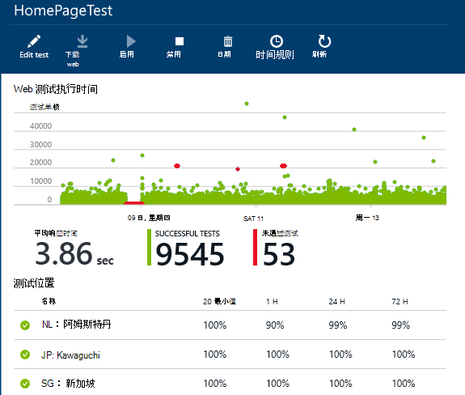
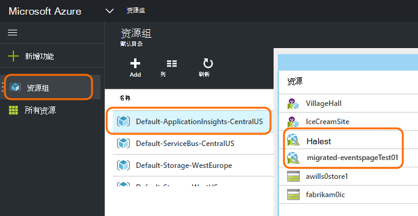
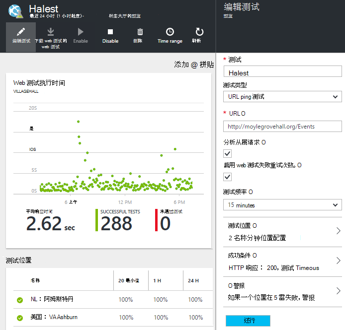

<properties 
    pageTitle="迁移到应用程序的可用性测试的见解的 Azure 的终结点" 
    description="迁移到应用程序的见解的经典 Azure 终结点监视测试可用性测试按 10 月 31，2016年。"
    services="application-insights" 
    documentationCenter=""
    authors="soubhagyadash" 
    manager="douge"/>

<tags 
    ms.service="application-insights" 
    ms.workload="tbd" 
    ms.tgt_pltfrm="ibiza" 
    ms.devlang="na" 
    ms.topic="article" 
    ms.date="07/25/2016" 
    ms.author="awills"/>
 
# 从 Azure 终结点监控到应用程序的可用性测试的见解

您是否使用[终结点监视](https://blogs.msdn.microsoft.com/mast/2013/03/03/windows-azure-portal-update-configure-web-endpoint-status-monitoring-preview/)的 Azure 应用程序？ 按*10 月 31，2016年*，我们将其替换新的和更强大的[可用性测试](app-insights-monitor-web-app-availability.md)。 我们已经创建了一些新的测试中，尽管它们禁用直到 2016，10 月 31。 

可以编辑新的测试，并自行开关如果希望。 可以找到它们[Azure 的门户网站](https://portal.azure.com)CentralUS-ApplicationInsights-默认资源组中。

## 可用性测试是什么？

可用性测试通过发送 HTTP 请求到它 （单个 ping 测试或 Visual Studio web 测试） 达 16 个的位置从全球是 Azure 的不断检查任何 web 站点或服务已启动且正在运行的功能。 

在[经典的 Azure 门户](https://manage.windowsazure.com)，这些测试被称为终结点监视。 更受限制范围内。 新的可用性测试是一个巨大的进步︰

* 最多 10 个 Visual Studio web 测试或 ping 测试每个应用程序的见解资源。 
* 全球范围内将测试请求发送到您的 web 应用程序的最多 16 个办事处。 测试成功条件更好地控制。 
* 任何 web 站点或服务的不只是 Azure 的 web 应用程序进行测试。
* 测试重试次数︰ 减少假阳性警报，由于暂时的网络问题。 
* Webhooks 可以接收 HTTP 发送警报通知。

阅读有关[以下可用性测试](app-insights-monitor-web-app-availability.md)详细信息。

可用性测试属于[Visual Studio 应用程序见解](app-insights-overview.md)，这是任何 web 应用程序的可扩展的分析服务。

## 因此我终结点遇到了什么测试？

* 我们已经复制终结点监视测试新的应用程序的见解可用性测试。
* 新的可用性测试当前已被禁用，并且仍在运行的旧终结点测试。
* 警报规则*已迁移*。 新的测试最初已设置与默认规则︰
 * 在 5 分钟内，多个位置报告故障时的触发器。
 * 为预订管理员发送电子邮件。

在[Azure 的门户网站](https://portal.azure.com)中，可以找到"默认-ApplicationInsights-CentralUS"资源组中已迁移的测试。 测试名称的前缀为"已迁移-"。 

## 我需要做什么？

* 如果我们以某种方式错过了迁移测试，新的可用性测试可以[轻松设置](app-insights-monitor-web-app-availability.md)。

### 选项 a︰ 请不要执行任何操作。 将它留给我们。

**在 10 月 31，2016，**我们将︰

* 禁用旧的终结点测试。
* 启用迁移的可用性测试。

### 选项 b︰ 您管理和/或启用新的测试。

* 查看并编辑新的可用性测试在新[Azure 的门户](https://portal.azure.com)。 
 * 查看触发器条件
 * 查看电子邮件收件人
* 启用新的测试
* 我们将禁用监视测试在 10 月 31，2016年传统终结点 

### 选项 c︰ 自愿出

如果您不想使用的可用性测试，您可以在[Azure 门户](https://portal.azure.com)中删除它们。 也是在通知电子邮件的底部取消订阅链接。

我们仍将删除在 10 月 31，2016年的旧终结点测试。 

## 如何编辑新的测试？

登录到[Azure 的门户网站](https://portal.azure.com)，然后查找已迁移的 web 测试︰ 

编辑和/或启用测试︰

## 为什么会出现这种情况呢？

更好的服务。 旧的端点服务时要小得多。 从 Azure VM 或 web 应用程序上的 3 地理位置的简单的 ping 命令测试可以提供两个 Url。 新测试可以运行来自多步 web 测试最多 16 的位置，并且可以指定最多 10 个测试一个应用程序。 您可以测试任何 URL-它并不一定是 Azure 站点。

新的测试 web 应用程序或您要测试的 VM 中单独配置。 

我们正在迁移的测试，以确保继续有使用新门户时对其进行控制。 

## 应用程序的见解是什么？

新的可用性测试是[Visual Studio 应用程序理解](app-insights-overview.md)的一部分。 这是一个[2 分钟的视频](http://go.microsoft.com/fwlink/?LinkID=733921)。

## 我要购买新的测试？

已迁移的测试设置的见解应用程序资源中默认可用计划中。 这样的多达 5 万个数据点的集合。 方便地包含测试将使用当前的数据量。 

当然，如果希望应用程序的见解和创建更多的可用性测试，或采用的性能监控和诊断功能的详细信息，您将生成更多的数据点。  但是，只会导致您可能击中的免费计划的配额。 除非您选择的标准或特优计划，将不会收到一份帐单。 

[了解更多关于应用程序的见解定价和配额监视](app-insights-pricing.md)。 

## 什么是和不迁移？

保留的旧终结点测试︰

* 端点 URL 以进行测试。
* 从该请求被发送的地理位置。
* 测试频率保持 5 分钟。
* 测试超时保持 30 秒钟。 

不迁移︰

* 警报触发规则。 我们已经设立一个位置在 5 分钟内报告故障时触发器的规则。
* 警报接收者。 通知电子邮件将发送到订阅的所有者和共同所有者。 

## 如何找到新的测试？

如果需要，您可以从立即编辑新测试中的任意。 登录到[Azure 门户](https://portal.azure.com)，打开**资源组**并选择**默认-ApplicationInsights-CentralUS**。 在该组中，您将发现新的 web 测试。 [关于新的可用性测试](app-insights-monitor-web-app-availability.md)。

请注意，将从该地址发送新的警报电子邮件︰ App 见解警报(ai-noreply@microsoft.com)

## 如果我不执行任何操作，？

选项 A 将应用。 我们将启用已迁移的测试，并如上所述设置默认通知规则。 您将需要添加任何自定义的警报规则，正如前面提到的收件人。 我们将禁用监视测试的旧式的终结点。 

## 其中对此提供反馈？ 

我们非常感谢您的反馈意见。 请[发送邮件至](mailto:vsai@microsoft.com)。 

