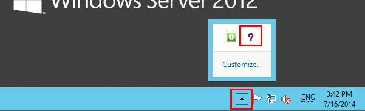

<properties
    pageTitle="诊断性能问题上正在运行的 IIS 网站 |Microsoft Azure"
    description="监视网站的性能而不重新部署它。 使用独立或与应用程序的见解 SDK 来获取依赖项遥测。"
    services="application-insights"
    documentationCenter=".net"
    authors="alancameronwills"
    manager="douge"/>

<tags
    ms.service="application-insights"
    ms.workload="tbd"
    ms.tgt_pltfrm="ibiza"
    ms.devlang="na"
    ms.topic="get-started-article"
    ms.date="10/24/2016"
    ms.author="awills"/>

# 检测 web 应用程序在运行时与应用程序的见解

*在预览是应用程序的见解。*

而无需修改或重新部署您的代码，可以检测与 Visual Studio 应用程序信息，实时的 web 应用程序。 在您的应用程序中承载由本地 IIS 服务器，您可以安装状态监视器;或者，如果它们是 Azure 的 web 应用程序，还是在 Azure 虚拟机中运行，则可以安装应用程序见解扩展。 （也有关于规范[生活 J2EE web 应用程序](app-insights-java-live.md)和[Azure 云服务](app-insights-cloudservices.md)的单独的文章。）

您有三个路由选择，以适用于.NET web 应用程序的应用程序的见解︰

* **生成时间︰**[添加应用程序深入 SDK][greenbrown]为您的 web 应用程序代码。 
* **运行时间︰**如下所述，而无需重新生成和重新部署代码检测您的 web 应用程序在服务器上。
* **同时︰**为 web 应用程序代码中，生成 SDK，并且还应用运行时扩展。 获得这两个选项的最佳产品。 

以下是您所获得的每个工艺路线的摘要︰

||生成时间|运行时间|
|---|---|---|
|请求和异常|是的|是的|
|[更详细的例外情况](app-insights-asp-net-exceptions.md)||是的|
|[依赖项诊断](app-insights-asp-net-dependencies.md)|在.NET 4.6 +|是的|
|[系统性能计数器](app-insights-performance-counters.md)||IIS 或 Azure 云服务，不 Azure 的 web 应用程序|
|[自定义遥测的 API][api]|是的||
|[跟踪日志集成](app-insights-asp-net-trace-logs.md)|是的||
|[页面视图和用户数据](app-insights-javascript.md)|是的||
|不需要重新生成代码|不||

## 在运行时检测您的 web 应用程序

您需要[Microsoft Azure](http://azure.com)订阅。

### 如果您的应用程序是 Azure 的 web 应用程序或云服务

* 在 Azure 应用程序的控件面板上选择应用程序的见解。 

    [了解更多](app-insights-azure.md)。

### 如果您的应用程序驻留在您的 IIS 服务器上

1. 在您的 IIS web 服务器上使用管理员凭据进行登录。
2. 下载并运行[状态监视器安装程序](http://go.microsoft.com/fwlink/?LinkId=506648)。
4. 在安装向导中，登录到 Microsoft Azure。

    

    *连接错误？请参阅[疑难解答](#troubleshooting)。*

5. 选择已安装的 web 应用程序或网站，您想要监视，然后配置您要应用的见解门户中查看结果的资源。

    

    通常情况下，选择要配置新的资源和[资源组][roles]。

    否则，请使用现有的资源，如果您已经设置了[web 测试][availability]您的网站或[web 客户端监视][client]。

6. 重新启动 IIS。

    

    您的 web 服务将暂时中断。

6. 请注意，ApplicationInsights.config 已插入您想要监视的 web 应用程序。

    

   也有对 web.config 的某些更改。

#### 想要 （重新） 稍后配置？

完成该向导后，可以重新配置该代理，只要您希望。 您还可以使用此如果您安装了代理，但没有初始设置的一些疑难。

## 查看性能遥测

登录到[Azure 的门户网站](https://portal.azure.com)，浏览应用程序的见解并打开您创建的资源。

打开性能刀片式服务器以查看请求、 响应时间、 依赖项和其他数据。

单击任何打开的更详细的视图的图表。

您可以[编辑、 重新排列，请保存](app-insights-metrics-explorer.md)，并固定在图表或整个刀片式服务器到[仪表板](app-insights-dashboards.md)。

## 依赖项

该相关性工期图表显示外部组件，例如数据库、 REST Api 或 Azure blob 存储从您的应用程序调用所花费的时间。

通过调用依赖项不同分段图表︰ 编辑图表打开分组，以及如何通过依赖项、 依赖项类型或依赖项性能再组合。

## 性能计数器 

（不适用于 Azure 的 web 应用程序。）在概述刀片式服务器，请参阅服务器性能计数器，如 CPU 使用量和内存使用情况的图表上，单击服务器。

如果您有多个服务器实例，您可能想要编辑图表按角色实例进行分组。

您可以[更改的 SDK 通过报告的性能计数器集](app-insights-configuration-with-applicationinsights-config.md#nuget-package-3)。 

## 例外情况

您可以深入了解特定异常 （从最近七天） 并获取堆栈跟踪和上下文数据。

## 取样

如果您正在使用的 ASP.NET 版本 2.0.0-beta3 或更高版本应用程序的见解 SDK 应用程序发送大量的数据，自适应采样功能可能运行和发送只有您遥测的百分比。 [了解有关采样。](app-insights-sampling.md)

## 故障排除

### 连接错误

您需要打开服务器的防火墙允许状态监视器工作中[传出的一些端口](app-insights-ip-addresses.md#outgoing-ports)。

### 没有遥测吗？

  * 使用您的站点，来生成某些数据。
  * 等待几分钟以使数据到达，然后单击**刷新**。
  * 打开诊断搜索 （搜索平铺） 若要查看单个事件。 聚合数据在图表中显示之前，事件往往在诊断搜索中可见。
  * 打开状态监视器，然后选择左侧窗格上的应用程序。 检查是否存在此应用程序的"配置通知"部分中的所有诊断消息︰

  

  * 请确保服务器防火墙允许在上面列出的端口上的传出通信。
  * 在服务器上，如果您看到一条有关"权限不足"消息，尝试以下方法︰
    * 在 IIS 管理器中，选择应用程序池，打开**高级设置**记录下**过程模型**的身份。
    * 在计算机管理控制面板中，将该标识添加性能监视器用户组。
  * 如果您有安装到服务器上的内容/SCOM，有些版本可能会发生冲突。 卸载 SCOM 和状态监视器中，然后重新安装最新版本。
  * 请参阅[疑难解答][qna]。

## 系统要求

应用程序的见解状态监视器服务器上的操作系统支持︰

- Windows Server 2008
- Windows Server 2008 R2
- Windows Server 2012
- Windows 服务器 2012 R2

使用新的 SP 和.NET Framework 4.0 和 4.5

在客户端 Windows 7，8 和 8.1，再次与.NET Framework 4.0 和 4.5

IIS 支持︰ IIS 7 7.5，8，8.5 （IIS 是必需的）

## 使用 PowerShell 自动化

您可以启动和停止监视您的 IIS 服务器上使用 PowerShell。

首次导入的应用程序理解的模块︰

`Import-Module 'C:\Program Files\Microsoft Application Insights\Status Monitor\PowerShell\Microsoft.Diagnostics.Agent.StatusMonitor.PowerShell.dll'`

了解哪些应用程序正在监控︰

`Get-ApplicationInsightsMonitoringStatus [-Name appName]`

* `-Name`（可选）Web 应用程序的名称。
* 显示在此 IIS 服务器监视状态的每个 web 应用程序 （或命名的应用程序） 应用程序理解。

* 返回`ApplicationInsightsApplication`为每个应用程序︰
 * `SdkState==EnabledAfterDeployment`︰ 应用程序监视，并已在状态监视器工具，或通过在运行时，检测`Start-ApplicationInsightsMonitoring`。
 * `SdkState==Disabled`︰ 应用程序将不会检测应用程序的见解的。 它永远不会被检测过，或者用状态监视器工具或运行时监视禁用`Stop-ApplicationInsightsMonitoring`。
 * `SdkState==EnabledByCodeInstrumentation`︰ 应用程序已添加到源代码的 SDK 通过检测。 不能更新或停止其 SDK。
 * `SdkVersion`用于监视此应用程序中显示的版本。
 * `LatestAvailableSdkVersion`NuGet 库显示当前可用的版本。 若要升级到此版本的应用程序，请使用`Update-ApplicationInsightsMonitoring`。

`Start-ApplicationInsightsMonitoring -Name appName -InstrumentationKey 00000000-000-000-000-0000000`

* `-Name`在 IIS 中的应用程序的名称
* `-InstrumentationKey`结果显示应用程序的见解资源 ikey。

* 此 cmdlet 只会影响应用程序将不已经被检测的即 SdkState = = NotInstrumented。

    该 cmdlet 不影响已检测，通过添加到代码中，SDK 生成时或在运行时通过此 cmdlet 上次使用的应用程序。

    用来检测应用程序的 SDK 版本是最近下载到该服务器的版本。

    若要下载最新版本，请使用更新 ApplicationInsightsVersion。

* 返回`ApplicationInsightsApplication`上成功。 如果该操作失败，它将跟踪记录到 stderr。

    
          Name                      : Default Web Site/WebApp1
          InstrumentationKey        : 00000000-0000-0000-0000-000000000000
          ProfilerState             : ApplicationInsights
          SdkState                  : EnabledAfterDeployment
          SdkVersion                : 1.2.1
          LatestAvailableSdkVersion : 1.2.3

`Stop-ApplicationInsightsMonitoring [-Name appName | -All]`

* `-Name`在 IIS 中的应用程序的名称
* `-All`停止监视此 IIS 服务器中的所有应用程序的`SdkState==EnabledAfterDeployment`

* 停止监视指定的应用程序，并删除检测。 它仅适用于被检测的应用程序在运行时使用状态监视工具或开始-ApplicationInsightsApplication。 (`SdkState==EnabledAfterDeployment`)

* 返回 ApplicationInsightsApplication。

`Update-ApplicationInsightsMonitoring -Name appName [-InstrumentationKey "0000000-0000-000-000-0000"`]

* `-Name`︰ 在 IIS 中 web 应用程序的名称。
* `-InstrumentationKey`（可选）。用于更改应用程序的遥测发送到该资源。
* 此 cmdlet:
 * 升级到版本的 SDK 命名应用程序最近下载到这台机器。 (只有`SdkState==EnabledAfterDeployment`)
 * 如果您提供检测键，命名的应用程序被重新配置使用该密钥发送到资源的遥测。 (如果`SdkState != Disabled`)

`Update-ApplicationInsightsVersion`

* 将最新的应用程序的见解 SDK 下载到服务器。

## 下一步行动

* [创建 web 测试][availability]来确保您的站点保持活动。
* [搜索事件和日志][diagnostic]来帮助诊断问题。
* [添加 web 客户端遥测][usage]来查看 web 页代码中的异常，并允许您插入跟踪调用。
* [将见解 SDK 应用程序添加到您的 web 服务代码][ greenbrown] ，以便您可以插入跟踪和日志在服务器代码中调用。

<!--Link references-->

[api]: app-insights-api-custom-events-metrics.md
[availability]: app-insights-monitor-web-app-availability.md
[client]: app-insights-javascript.md
[diagnostic]: app-insights-diagnostic-search.md
[greenbrown]: app-insights-asp-net.md
[qna]: app-insights-troubleshoot-faq.md
[roles]: app-insights-resources-roles-access-control.md
[usage]: app-insights-web-track-usage.md
