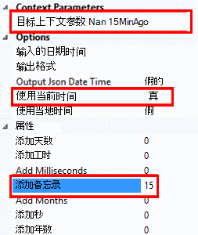

<properties
    pageTitle="监视的可用性和响应性的任何 web 站点 |Microsoft Azure"
    description="设置应用程序的见解中的 web 测试。 网站响应速度很慢，或变得不可用的情况下获得通知。"
    services="application-insights"
    documentationCenter=""
    authors="alancameronwills"
    manager="douge"/>

<tags
    ms.service="application-insights"
    ms.workload="tbd"
    ms.tgt_pltfrm="ibiza"
    ms.devlang="na"
    ms.topic="get-started-article"
    ms.date="09/07/2016"
    ms.author="awills"/>

# 监视的可用性和任何 web 站点的响应速度

您已经部署到任意服务器了您的 web 应用程序或 web 站点后，您可以设置 web 测试来监视其可用性和响应能力。 [Visual Studio 应用程序理解](app-insights-overview.md)从世界各地点将 web 请求发送到应用程序在固定的时间间隔。 如果您的应用程序不响应，或者响应速度很慢，它提醒您。

您可以设置可从公用的 internet 访问任何 HTTP 或 HTTPS 终结点的 web 测试。

有两种类型的 web 测试︰

* [URL ping 测试](#create)︰ 您可以在 Azure 门户创建一个简单的测试。
* [多步 web 测试](#multi-step-web-tests)︰ 在 Visual Studio 最终或企业 Visual Studio 中创建并上载到门户。

您可以创建最多 10 个 web 测试每个应用程序资源。

## 1.创建测试报告的资源

跳过此步骤，如果你们已经[设置应用程序的见解资源][start]为此应用程序，并且您想要查看处于同一位置的可用性报告。

注册到[Microsoft Azure](http://azure.com)、 转到[Azure 的门户网站](https://portal.azure.com)，并创建应用程序的见解资源。

单击以打开新资源概述刀片式服务器的**所有资源**。

## 2.创建一个 URL ping 测试

在您的应用程序理解资源，寻找可用性平铺。 单击该按钮以打开 Web 测试刀片式服务器应用程序，并添加一个 web 测试。

- **URL**必须是可见的公用互联网。 它可以包含查询字符串成本 / 收益分析; 因此，例如，您可以执行数据库有点。 如果 URL 重定向到可以解决，我们在其后最多 10 个重定向。
- **分析从属请求**︰ 图像、 脚本、 样式文件和页面的其他资源请求作为测试的一部分，记录的响应时包括这些时间。 如果不能为整个测试的超时时间内已成功下载所有这些资源，则测试失败。
- **启用重试次数**︰ 当测试失败时，重试后较短的间隔。 只有三个连续的尝试都失败，将报告失败。 然后在常规测试频率执行后续的测试。 重试暂停直到下一次成功。 在每个测试位置独立应用此规则。 （我们建议使用此设置。 平均约 80%的故障消失在重试。
- **测试频率**︰ 设置从每个测试位置测试的运行频率。 五分钟和五个测试位置的频率，您的站点进行测试平均每一分钟。
- **测试的位置**是从我们的服务器，将 web 请求发送到您的 URL 位置。 选择多个，以便您可以在您的网站中辨别问题，从网络问题。 您可以选择最多 16 个位置。

- **成功条件**︰

    **测试超时**︰ 减小此值，获得通知有关慢响应。 如果在此时间内未接收响应您的站点中，测试被视为失败。 如果您选择**分析从属请求**，然后所有图像、 样式文件，脚本和其他相关资源必须收到在该时间段内。

    **HTTP 响应**︰ 被视为为成功，则返回的状态代码。 200 是指示已返回正常的 web 页的代码。

    **匹配内容**︰ 一个字符串，如"欢迎 ！" 我们测试它发生的每个响应。 它必须是一个普通的字符串，如果不使用通配符。 别忘了，如果网页内容更改您可能需要对其进行更新。

- 默认情况下，如果故障中有三个位置 5 分钟内给您发送的**警报**。 在一个位置故障很可能是网络问题，并不是与您的站点的问题。 但可以更改阈值或多或少敏感，并且您还可以更改电子邮件应该发送给谁。

    您可以设置的警报时，将调用[webhook](../monitoring-and-diagnostics/insights-webhooks-alerts.md) 。 （但请注意，在目前情况下，查询参数不为属性传递到）。

### 测试多个 Url

添加更多测试。 示例中，为测试您的主页上，可以确保您的数据库正在运行的测试的搜索 URL。

## 3.请参阅您的 web 测试结果

1-2 分钟后，结果将显示在 Web 测试刀片式服务器。

单击任何栏在该时间段内的更详细视图的摘要图表上。

这些图表组合此应用程序的所有 web 测试的结果。

## 如果您看到失败

单击一个红点。

或者，向下滚动并单击小于 100%成功的测试，在此可以看到。

打开该测试的结果。

从多个位置成本 / 收益分析运行测试; 挑一个结果是小于 100%。

向下滚动到**失败的测试**和挑选的结果。

单击相应的结果，以评估其在门户中并查看失败的原因。

或者，可以下载该结果文件，并在 Visual Studio 中进行检查。

*看起来没有问题，但报告为失败呢？* 检查所有图像、 脚本、 样式表和页加载的任何其他文件。 如果其中的任何失败，测试报告为失败，即使在主 html 页面加载确定。

## 多步 web 测试

您可以监视涉及到一系列的 Url 方案。 例如，如果正监视一个销售网站，您可以测试，将项添加到购物车工作正确。

若要创建一个多步测试，您通过使用 Visual Studio，记录该方案，然后将记录上载到应用程序的见解。 应用程序的见解间隔重播该方案，并验证响应。

请注意，您不能使用编码在测试中的函数︰ 方案步骤必须包含为.webtest 文件中的脚本。

#### 1.记录方案

使用 Visual Studio 的企业或终极记录 web 会话。

1. 创建 web 性能测试项目。

    

2. 打开.webtest 文件，然后开始录制。

    

3. 是否要在您的测试中模拟用户操作︰ 打开您的网站，将产品添加到购物车，等等。 然后停止测试。

    

    不要让一个长的方案。 还有 100 步骤和 2 分钟的限制。

4. 编辑的测试︰
 - 添加验证，以检查收到的文本并响应代码。
 - 移除任何多余的交互。 您也可以删除图片或广告或跟踪站点的从属请求。

    请记住，您只能编辑测试脚本-您不能添加自定义代码或调用其他 web 测试。 在测试中不插入循环。 您可以使用标准的 web 测试插件。

5. 在 Visual Studio，以确保其有效运行的测试。

    Web 测试运行程序打开 web 浏览器并重复录制的操作。 请确保它按照预期方式运行。

    

#### 2.将 web 测试上载到应用程序的见解

1. 在应用程序的见解门户中，创建新的 web 测试。

    

2. 选择多步测试，并将上载的.webtest 文件。

    

    Ping 测试与相同的方式设置测试位置、 频率和预警参数。

与单 url 测试相同的方式查看您的测试结果和出现的任何故障。

失败的一个常见原因是测试运行时间太长。 它运行不超过两分钟。

不要忘记，一个页面的所有资源必须正确都加载的测试为取得成功，包括脚本、 样式表、 图像，等等。

请注意，必须在.webtest 文件中完全包含 web 测试︰ 不能在测试中使用编码的功能。

### 多步测试中插入时间和随机数字

假设您要测试一个从外部源中获取时间相关的数据，如股票的工具。 在记录 web 测试时，您必须使用特定的时间，但将其设置为参数的测试、 开始时间和结束时间。

在运行测试时，您想结束时间总是要出现的时间，并开始时间应是 15 分钟前。

Web 测试插件提供的方法进行参数化的时间。

1. 添加所需的每个变量参数值的 web 测试插件。 在 web 测试工具栏中，选择**添加 Web 测试插件**。

    

    在此示例中，我们使用两个日期时间插件。 一个实例是"前的 15 分钟"，另一个"现在"。

2. 打开的每个插件的属性。 为它指定一个名称，并将其设置为使用当前时间。 一种设置，添加分钟 =-15。

    

3. 在 web 测试参数、 使用 {{插件名称}} 引用的插件的名称。

    

现在，上载到门户的测试。 它在每个测试运行使用的动态值。

## 登录以处理

如果您的用户登录到您的应用程序，可以用于模拟登录，以便您可以测试页后面签入的各种选项。 使用的方法取决于该应用程序提供的安全类型。

在所有情况下，您应该只是为了测试应用程序中创建一个帐户。 如果可能，限制此测试帐户的权限，以便不影响实际用户的 web 测试的可能。

### 简单的用户名和密码

以通常的方式记录的 web 测试。 请先删除 cookie。

### SAML 验证

使用 SAML 插件可用于 web 测试。

### 客户端密码

如果您的应用程序涉及客户端密码的登录的路由，则使用该路由。 Azure 活动目录 (AAD) 是一种服务提供客户端密钥登录。 在 AAD，客户端密钥是应用程序键。

下面是使用的应用程序键的 Azure 的 web 应用程序的 web 测试示例︰

1. 从使用客户端密码 (AppKey) 的 AAD 获取令牌。
2. 从响应中提取载体的标记。
3. 调用 API 使用载体令牌在身份验证头。

请确保该 web 测试实际的客户端-即方面 AAD 的它自己的应用程序并使用它的客户机 Id + appkey。 测试您的服务也有其自己的应用程序中 AAD︰ 应用程序标识此应用程序的 URI 将反映在"资源"字段中的 web 测试。

### 开放的身份验证

开放的身份验证的示例使用 Microsoft 或 Google 帐户签名。 提供客户机的多个应用程序使用 OAuth 机密的替代方法，因此，您的第一个战术应该调查这种可能性。

如果您的测试必须在使用 OAuth 登录，常见的方法是︰

 * 使用 Fiddler 之类的工具来检查您的 web 浏览器，验证网站和您的应用程序之间的通信。
 * 执行两个或多个登录使用不同的计算机或浏览器中，或在长时间间隔 （以允许令牌过期）。
 * 通过比较不同的会话，标识传递回从身份验证的网站，注册后再传递到应用程序服务器的令牌。
 * 记录 web 测试使用 Visual Studio。
 * 参数化令牌，令牌身份验证器，返回时将该参数设置，并在该网站查询中使用它。
 （Visual Studio 尝试将参数化测试，但不会不正确地将参数化标记）。

## 编辑或禁用测试

打开单个测试进行编辑或将其禁用。

您可能想要在服务上执行维护时禁用 web 测试。

## 性能测试

您可以在您的网站上运行负载测试。 类似的可用性测试中，您可以从世界各地我们点发送简单请求或多个步骤的请求。 可用性测试中，与许多请求发送，模拟多个用户。

从概述刀片式服务器，打开**设置****性能测试**。 在创建测试时，您被邀请连接到或创建一个 Visual Studio 团队服务帐户。

测试完成后，将显示响应时间和成功率。

## 自动化

* [使用 PowerShell 脚本设置 web 测试](https://azure.microsoft.com/blog/creating-a-web-test-alert-programmatically-with-application-insights/)自动。
* 设置的警报时，将调用[webhook](../monitoring-and-diagnostics/insights-webhooks-alerts.md) 。

## 问题？ 有问题吗？

* *可以从我的 web 测试中调用的代码？*

    不。 该测试步骤必须是在.webtest 文件中。 并且您不能调用其他 web 测试或使用循环。 但是，您可能会发现有用的几个插件程序。

* *HTTPS 支持？*

    我们支持 TLS 1.1 和 TLS 1.2。

* *有"web 测试"和"可用性测试"之间的区别吗？*

    我们交替使用这两个术语。

* *我想在我们运行防火墙后面的内部服务器上使用的可用性测试。*

    配置防火墙以允许从[IP 地址的 web 测试的代理](app-insights-ip-addresses.md#availability)请求。

* *上传一个多步 web 测试失败*

    还有的大小限制为 300 k。

    循环不支持。

    不支持对其他 web 测试的引用。

    不支持的数据源。

* *我多步测试未完成*

    没有测试每 100 个请求的限制。

    测试已停止运行超过两分钟。

* *如何使用客户端证书运行测试？*

    我们不支持的很抱歉。

## 视频

> [AZURE.VIDEO monitoring-availability-with-application-insights]

## 下一步行动

[搜索诊断日志][diagnostic]

[故障排除][qna]

[Web 测试代理的 IP 地址](app-insights-ip-addresses.md)

<!--Link references-->

[azure-availability]: ../insights-create-web-tests.md
[diagnostic]: app-insights-diagnostic-search.md
[qna]: app-insights-troubleshoot-faq.md
[start]: app-insights-overview.md
