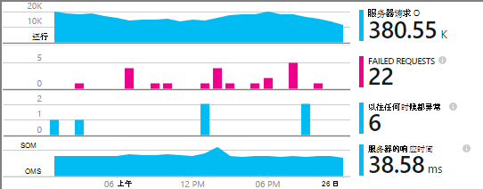

<properties
    pageTitle="添加应用程序深入 SDK 来监视您的 Node.js 应用程序 |Microsoft Azure"
    description="分析使用情况、 可用性和内部部署或 Microsoft Azure 应用程序理解的 web 应用程序的性能。"
    services="application-insights"
    documentationCenter=""
    authors="alancameronwills"
    manager="douge"/>

<tags
    ms.service="application-insights"
    ms.workload="tbd"
    ms.tgt_pltfrm="ibiza"
    ms.devlang="na"
    ms.topic="get-started-article"
    ms.date="08/30/2016"
    ms.author="awills"/>


# <a name="add-application-insights-sdk-to-monitor-your-nodejs-app"></a>添加应用程序深入 SDK 来监视您的 Node.js 应用程序

*在预览是应用程序的见解。*

[Visual Studio 应用程序理解](app-insights-overview.md)监控实时应用程序可帮助您[检测和诊断性能问题和异常](app-insights-detect-triage-diagnose.md)，并[了解如何使用您的应用程序](app-insights-overview-usage.md)。 它可用于内部部署的 IIS 服务器上或在 Azure Vm 上承载的应用程序，以及 Azure 的 web 应用程序。


该 SDK 提供了自动收集传入的 HTTP 请求率和响应、 性能计数器 （CPU、 内存、 RPS） 和未经处理的异常。 此外，您可以添加自定义调用跟踪依赖项、 衡量标准或其他事件。




#### <a name="before-you-start"></a>在开始之前

你需要：

* 2013 或更高版本的 Visual Studio。 以后会更好。
* 对[Microsoft Azure](http://azure.com)的订阅。 如果您的团队或组织有订阅了 Azure，所有者可以将您添加到它，使用您的[Microsoft 客户](http://live.com)。

## <a name="add"></a>创建应用程序的见解资源

登录到[Azure 的门户网站][portal]，并创建新的应用程序理解资源。 [资源][ roles] Azure 中是一种服务的一个实例。 此资源是将分析并向您显示从您的应用程序的遥测。


选择其他应用程序类型。 选择的应用程序类型设置默认内容资源刀片和属性[测量数据资源管理器]中可见[metrics]。

#### <a name="copy-the-instrumentation-key"></a>复制检测密钥

键标识的资源，并将它很快在中安装 SDK 后，可将数据定向到该资源。


## <a name="sdk"></a>在应用程序安装 SDK

```
npm install applicationinsights --save
```

## <a name="usage"></a>使用

这将启用请求监视、 跟踪、 未经处理的异常和系统性能监视 (CPU/内存/RPS)。

```javascript

var appInsights = require("applicationinsights");
appInsights.setup("<instrumentation_key>").start();
```

指令插入键也可以设置环境变量 APPINSIGHTS_INSTRUMENTATIONKEY 中。 如果这样做了，调用没有参数时需要`appInsights.setup()`或`appInsights.getClient()`。

您可以尝试 SDK 而不发送遥测︰ 将检测键设置为非空字符串。


## <a name="run"></a>运行您的项目

运行您的应用程序并尝试一下︰ 打开不同的页面来生成某些遥测。


## <a name="monitor"></a>查看您遥测

返回到[Azure 的门户网站](https://portal.azure.com)，并浏览到您的应用程序理解资源。


寻找概述页中的数据。 首先，您将看到一个或两个点。 例如︰


单击通过任何图表以查看更详细的指标。 [了解有关指标。][perf]

#### <a name="no-data"></a>没有数据？

* 使用该应用程序，以便它会生成一些遥测打开不同的页面。
* 打开[搜索](app-insights-diagnostic-search.md)方块，查看单个事件。 有时它需要事件有点时间，通过指标管道获得更长的时间。
* 等待几秒钟，然后单击**刷新**。 图表会定期刷新自己，但可以如果您等待某些数据显示手动刷新。
* 请参阅[疑难解答][qna]。

## <a name="publish-your-app"></a>发布您的应用程序

现在将应用程序部署到 IIS 或 Azure 并观察积累的数据。


#### <a name="no-data-after-you-publish-to-your-server"></a>在没有数据发布到您的服务器？

在您的服务器的防火墙打开这些端口用于出站通讯︰

+ `dc.services.visualstudio.com:443`
+ `f5.services.visualstudio.com:443`


#### <a name="trouble-on-your-build-server"></a>在生成服务器上的问题吗？

请参阅[故障排除该项](app-insights-asp-net-troubleshoot-no-data.md#NuGetBuild)。


## <a name="customized-usage"></a>定制的使用情况 

### <a name="disabling-auto-collection"></a>禁用自动集合

```javascript
import appInsights = require("applicationinsights");
appInsights.setup("<instrumentation_key>")
    .setAutoCollectRequests(false)
    .setAutoCollectPerformance(false)
    .setAutoCollectExceptions(false)
    // no telemetry will be sent until .start() is called
    .start();
```

### <a name="custom-monitoring"></a>自定义监视

```javascript
import appInsights = require("applicationinsights");
var client = appInsights.getClient();

client.trackEvent("custom event", {customProperty: "custom property value"});
client.trackException(new Error("handled exceptions can be logged with this method"));
client.trackMetric("custom metric", 3);
client.trackTrace("trace message");
```

[了解更多关于 API 的遥测数据](app-insights-api-custom-events-metrics.md)。

### <a name="using-multiple-instrumentation-keys"></a>使用多个检测密钥

```javascript
import appInsights = require("applicationinsights");

// configure auto-collection with one instrumentation key
appInsights.setup("<instrumentation_key>").start();

// get a client for another instrumentation key
var otherClient = appInsights.getClient("<other_instrumentation_key>");
otherClient.trackEvent("custom event");
```

## <a name="examples"></a>示例

### <a name="tracking-dependency"></a>跟踪依赖项

```javascript
import appInsights = require("applicationinsights");
var client = appInsights.getClient();

var startTime = Date.now();
// execute dependency call
var endTime = Date.now();

var elapsedTime = endTime - startTime;
var success = true;
client.trackDependency("dependency name", "command name", elapsedTime, success);
```


### <a name="manual-request-tracking-of-all-get-requests"></a>所有的手动请求跟踪"GET"请求

```javascript
var http = require("http");
var appInsights = require("applicationinsights");
appInsights.setup("<instrumentation_key>")
    .setAutoCollectRequests(false) // disable auto-collection of requests for this example
    .start();

// assign common properties to all telemetry sent from the default client
appInsights.client.commonProperties = {
    environment: process.env.SOME_ENV_VARIABLE
};

// track a system startup event
appInsights.client.trackEvent("server start");

// create server
var port = process.env.port || 1337
var server = http.createServer(function (req, res) {
    // track all "GET" requests
    if(req.method === "GET") {
        appInsights.client.trackRequest(req, res);
    }

    res.writeHead(200, { "Content-Type": "text/plain" });
    res.end("Hello World\n");
}).listen(port);

// track startup time of the server as a custom metric
var start = +new Date;
server.on("listening", () => {
    var end = +new Date;
    var duration = end - start;
    appInsights.client.trackMetric("StartupTime", duration);
});
```

## <a name="next-steps"></a>下一步行动

* [监视您的门户的遥测](app-insights-dashboards.md)
* [分析查询改写您遥测](app-insights-analytics-tour.md)


<!--Link references-->

[knowUsers]: app-insights-overview-usage.md
[metrics]: app-insights-metrics-explorer.md
[perf]: app-insights-web-monitor-performance.md
[portal]: http://portal.azure.com/
[qna]: app-insights-troubleshoot-faq.md
[roles]: app-insights-resources-roles-access-control.md
