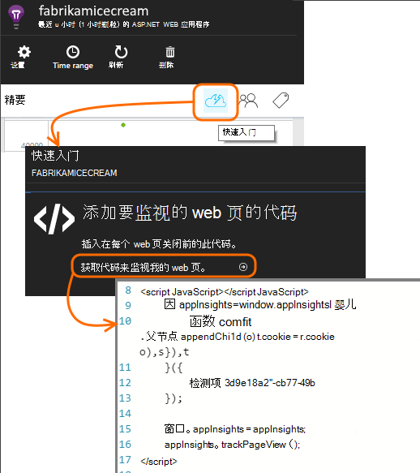

<properties
    pageTitle="使用率分析应用程序的见解与"
    description="使用率分析与应用程序理解的概述"
    services="application-insights"
    documentationCenter=""
    authors="alancameronwills"
    manager="douge"/>

<tags
    ms.service="application-insights"
    ms.workload="tbd"
    ms.tgt_pltfrm="ibiza"
    ms.devlang="multiple"
    ms.topic="article" 
    ms.date="04/08/2016"
    ms.author="awills"/>

# 使用率分析应用程序的见解与

知道人们如何使用您的应用程序允许您开发重点，最重要的方案，并深入了解他们发现更容易或更难实现的目标。

应用程序的见解可提供的清晰视图的应用程序的使用情况，有助于改善用户的体验，并满足您的业务目标。

应用程序的见解工作 （在 iOS 中，Android 和 Windows) 这两个独立的应用程序和 web 应用程序 （位于.NET 或 J2EE）。 

## 向项目中添加应用程序的见解

若要开始工作，获得与[Microsoft Azure](https://azure.com)免费的帐户。 （试用期到期后，您可以继续与服务的自由层。）

在[Azure 的门户](https://portal.azure.com)中，创建应用程序理解资源。 这是在您将看到有关您的应用程序使用情况和性能数据。

**如果您的应用程序为设备应用程序中，**请向项目中添加应用程序深入 SDK。 具体过程取决于您的[IDE 和平台](app-insights-platforms.md)。 用于 Windows 的应用程序，只需用鼠标右键单击在 Visual Studio 项目并选择"添加应用程序见解。"

**如果它是一个 web 应用程序中，**打开快速入门刀片和获取要添加到您的 web 页的代码段。 与本段重新发布它们。

此外可以对[ASP.NET](app-insights-asp-net.md)或[J2EE](app-insights-java-get-started.md)服务器代码以结合遥测从客户端和服务器应用程序的见解。

### 运行您的项目并查看第一个结果

在调试模式下运行您的项目，在几分钟内，然后转到[Azure 门户](https://portal.azure.com)并浏览到您的项目资源在应用程序的见解。

发布您的应用程序来获取更多的遥测和了解您的用户正在使用您的应用程序进行。

## 开箱即用的分析

单击网页视图拼贴来了用法详细信息，请参阅。

将鼠标悬停在上面关系图以查看在特定的点计数的空白部分。 否则，数字显示一段时间，如平均、 合计或计数的非重复用户的聚合值。

在 web 应用程序，用户使用 cookie 中计。 使用多个浏览器、 清除 cookie，或者使用隐私功能的人将被计算在内的几次。

Web 会话处于不活动状态 30 分钟后计。 当应用程序被挂起超过几秒钟计的电话或其他设备上的会话。

单击通过任何图表以查看更多详细信息。 例如︰

（本例中是从网站上，但图表看起来像是用于在设备运行的应用程序）。

与前一周，以观察事情是否变化进行比较︰

比较两个度量标准，例如用户和新用户︰

按属性如浏览器、 操作系统或城市的数据进行分组 （段）︰

## 页使用情况

单击网页视图平铺以获取您最常用页的细目分类︰

上面的例子中是从游戏网站。 从中我们可以立即看到:

* 在过去一周中，并不能提高使用率。 也许我们应该考虑搜索引擎优化？
* 许多较少人看到游戏页面，而不是主页。 为什么我们的主页上不吸引人玩游戏
* Crossword 是最受欢迎的游戏。 我们应该会优先考虑新的想法和那里改进。

## 自定义跟踪

让我们假设，而不是在单独的 web 页中实现每个游戏，决定对其进行重构到相同的单页面应用程序中，所有与大多数 web 页中的编码与 Javascript 功能。 这使用户可以快速切换之间一场比赛，另一台，或者甚至在一个页面上有几个游戏。

但您仍希望应用程序理解以便登录的次数每个游戏，以打开与相同的方式当在单独的 web 页上一样。 这很简单︰ 只需插入您要打开新的页面的记录的 JavaScript 遥测模块调用︰

    telemetryClient.trackPageView(game.Name);

## 自定义事件

您可以通过多种方式来了解您的应用程序的使用情况使用遥测。 但始终不想混淆了邮件，使用网页视图。 相反，使用自定义事件。 从设备的应用程序、 web 页或 web 服务器，可以向他们发送︰

(JavaScript)

    telemetryClient.trackEvent("GameEnd");

(C#)

    var tc = new Microsoft.ApplicationInsights.TelemetryClient();
    tc.TrackEvent("GameEnd");

(VB)

    Dim tc = New Microsoft.ApplicationInsights.TelemetryClient()
    tc.TrackEvent("GameEnd")

在概述刀片式服务器上列出了最常见的自定义事件。

单击要查看的事件总数的表头。 按各种属性，例如事件名称，可以细分图表︰

时间线的特别有用的功能是您可以将更改与其他指标和事件相关联。 例如，有时当播放更多的游戏，您会看到被放弃游戏也不断上升。 但放弃游戏中的上升过多，想要找出高负载是否导致用户会发现无法接受的问题。

## 深入到特定事件

若要更好地理解典型的会话会如何，可能要专注于特定的用户会话，其中包含特定类型的事件。

在此示例中，我们编写代码"NoGame"，如果在用户注销而不实际启动游戏，则调用一个自定义事件。 为什么用户会做的？ 也许如果我们深入到某些特定的事件，我们将得到一条线索。

从应用程序接收到的自定义事件概述刀片式服务器上的名称列出︰

单击通过自己感兴趣的事件并选择新的特定事件︰

让我们看一下所有的遥测数据为该特定的 NoGame 事件发生的会话。

没有无例外，因此并禁止该用户播放一些故障。

我们可以筛选出所有类型的网页视图以外的遥测此会话︰

然后，现在我们可以看到，此用户记录只是为了检查最新的成绩。 也许我们应该考虑开发容易地做到这一点的用户情景。 （和此特定情景中出现时，我们应实现报告自定义事件）。

## 筛选、 搜索和分类属性数据
您可以将任意标记和数字值附加到事件。

在客户端 JavaScript

    appInsights.trackEvent("WinGame",
        // String properties:
        {Game: currentGame.name, Difficulty: currentGame.difficulty},
        // Numeric measurements:
        {Score: currentGame.score, Opponents: currentGame.opponentCount}
    );

C# 在服务器上

    // Set up some properties:
    var properties = new Dictionary <string, string>
        {{"game", currentGame.Name}, {"difficulty", currentGame.Difficulty}};
    var measurements = new Dictionary <string, double>
        {{"Score", currentGame.Score}, {"Opponents", currentGame.OpponentCount}};

    // Send the event:
    telemetry.TrackEvent("WinGame", properties, measurements);

VB 在服务器

    ' Set up some properties:
    Dim properties = New Dictionary (Of String, String)
    properties.Add("game", currentGame.Name)
    properties.Add("difficulty", currentGame.Difficulty)

    Dim measurements = New Dictionary (Of String, Double)
    measurements.Add("Score", currentGame.Score)
    measurements.Add("Opponents", currentGame.OpponentCount)

    ' Send the event:
    telemetry.TrackEvent("WinGame", properties, measurements)

将属性附加到网页视图中，以相同的方式︰

在客户端 JavaScript

    appInsights.trackPageView("Win",
        {Game: currentGame.Name},
        {Score: currentGame.Score});

在诊断搜索中，通过单击事件的个别事件通过查看属性。

使用搜索字段来查看具有特定属性值的事件。

## A |B 测试

如果您不知道哪个特征的变量，该变量将会更成功，释放它们，让每个可访问其他用户。 衡量成功的每一个，然后再到统一的版本。

对于这种技术，将不同的标记附加到发送的每个版本的应用程序的所有遥测。 通过在活动 TelemetryContext 中定义属性，可以执行的。 这些默认属性将添加到每个遥测应用程序发送的消息-而不仅仅是您自定义的消息，但同样的标准遥测数据。

在应用程序的见解门户中，然后可以为筛选器和组 （段） 上的标记，以比较不同版本的数据。

C# 在服务器上

    using Microsoft.ApplicationInsights.DataContracts;

    var context = new TelemetryContext();
    context.Properties["Game"] = currentGame.Name;
    var telemetry = new TelemetryClient(context);
    // Now all telemetry will automatically be sent with the context property:
    telemetry.TrackEvent("WinGame");

VB 在服务器

    Dim context = New TelemetryContext
    context.Properties("Game") = currentGame.Name
    Dim telemetry = New TelemetryClient(context)
    ' Now all telemetry will automatically be sent with the context property:
    telemetry.TrackEvent("WinGame")

个别遥测可以重写默认值。

这样所有的新 TelemetryClients 自动使用您的上下文，您可以设置的通用的初始值设定项。

    // Telemetry initializer class
    public class MyTelemetryInitializer : ITelemetryInitializer
    {
        public void Initialize (ITelemetry telemetry)
        {
            telemetry.Properties["AppVersion"] = "v2.1";
        }
    }

在 Global.asax.cs 如应用程序初始值设定项︰

    protected void Application_Start()
    {
        // ...
        TelemetryConfiguration.Active.TelemetryInitializers
        .Add(new MyTelemetryInitializer());
    }

## 生成的度量值的了解

当您使用分析时，它将成为的组成部分开发周期的-不只是想要帮助解决问题。 以下是一些提示︰

* 确定应用程序的关键指标。 是否希望尽可能多的用户，尽可能还是更愿意使用少量非常满意的用户？ 若要最大限度地亲临或销售吗？
* 测量每个情景的计划。 草绘新用户情景或功能或更新现有的计划总是考虑将如何衡量成功的更改时。 在编码开始之前询问"什么效果将这对我们的衡量标准，是否它的工作原理吗？ 应该我们跟踪所有新活动？"
和当然，实时功能时，请确保查看分析并对结果进行操作。
* 关键指标与其他指标。 例如，如果添加收藏夹功能时，您想要知道频率用户添加收藏夹。 但它可能是更有趣，要知道频率会返回到收藏夹。 并且，最重要的是，不要使用收藏夹的客户最终购买更多的产品？
* 加那利测试。 设置使您可以将新的功能仅对某些用户可见的功能开关。 使用应用程序的见解来查看是否正在使用新的功能在您所提出的方法。 进行调整，然后将其释放更多的人。
* 请与您的用户 ！ 分析是不够的但维护良好的客户关系的补充。

## 了解更多信息

* [检测、 会审和诊断崩溃和您的应用程序中的性能问题](app-insights-detect-triage-diagnose.md)
* [在许多平台上开始使用应用程序的见解](app-insights-detect-triage-diagnose.md)

## 视频

> [AZURE.VIDEO usage-monitoring-application-insights]

 
