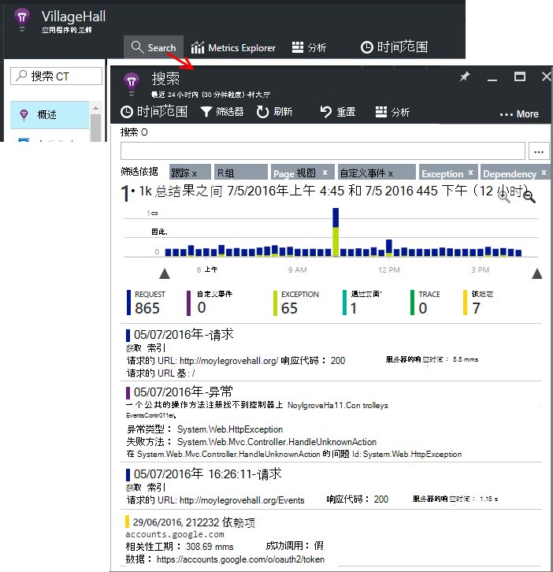

<properties 
    pageTitle="应用程序的见解教程 |Microsoft Azure" 
    description="跟踪使用情况和性能的实时 web 应用程序。  检测、 会审和诊断问题。 持续监控和改进与用户成功。" 
    services="application-insights" 
    documentationCenter=""
    authors="alancameronwills" 
    manager="douge"/>

<tags 
    ms.service="application-insights" 
    ms.workload="tbd" 
    ms.tgt_pltfrm="ibiza" 
    ms.devlang="na" 
    ms.topic="article" 
    ms.date="10/15/2016" 
    ms.author="awills"/>
 
# 应用程序的见解-简介

Visual Studio 应用程序理解是一个可扩展的分析服务，监视实时 web 应用程序。 用它可以检测和诊断性能问题，并了解用户实际执行的操作与您的应用程序。 它被面向开发人员，以帮助您不断改进的性能和可用性。 它适用于应用程序在多种包括.NET，Node.js 和 J2EE 平台，承载内部或在云中。 

[看一看简介动画](https://www.youtube.com/watch?v=fX2NtGrh-Y0)。

## 它是如何工作的？

在您的应用程序，安装小工具程序包和设置在 Microsoft Azure 门户应用程序理解资源。 检测监控您的应用程序，并将遥测数据发送到门户网站。 门户显示统计图表，并提供了功能强大的搜索工具，可帮助您诊断问题。

应用程序的见解都有几个[标准检测模块](app-insights-configuration-with-applicationinsights-config.md)收集不同类型的请求的响应时间、 异常和依赖项的调用等遥测。 您还可以[编写代码来发送自定义的遥测](app-insights-api-custom-events-metrics.md)门户。

### 什么是系统开销？

对您的应用程序性能的影响是非常小的。 将非阻挡式跟踪调用批处理并在单独的线程中发送。 

## 其作用是什么？

应用程序的见解旨在开发团队，以帮助您了解您的应用程序的执行方式和使用方式。 它提供了︰

遥测类型︰

* HTTP 请求率、 响应时间、 成功率。
* 依赖项 （HTTP 和 SQL） 调用率、 响应时间、 成功率。
* 从服务器和客户端的异常跟踪。
* 诊断日志跟踪。
* 将计算页面视图模式下，用户和会话的计数、 浏览器加载时间、 异常。
* AJAX 调用率、 响应时间和成功率。
* 服务器性能计数器。
* 自定义客户端和服务器的遥测。
* 通过客户端的位置、 浏览器版本、 操作系统版本、 服务器实例、 自定义尺寸，和更多的细分。
* 可用性测试

诊断和分析工具︰

* 智能和手动警报故障率和其他指标，并在可用性上。
* 一段时间的聚合度量值的图表。
* 诊断搜索请求、 异常、 自定义事件日志跟踪、 页面视图、 依赖项和 AJAX 的实例上调用。 
* 分析-对您遥测功能强大的查询语言
* 仪表板-撰写您需要监视您的所有应用程序组件的图表。

## 如何使用它？

### 监视器

在您的 web 应用程序，设置可用性 web 测试，安装应用程序的见解，并︰

* 设置仪表板，为您的团队房间要留意负载、 响应能力和相关性、 加载页时和 AJAX 调用的性能。 
* 了解哪些是速度最慢，大多数故障请求。
* 监视实时流当部署新的发行版，可以立即了解任何下降。

### 诊断

当您收到的警报或发现问题，请︰

* 将故障与异常，调用依赖项和跟踪相关联。
* 检查堆栈转储日志和跟踪日志。

### 评估

衡量每一项新功能，您部署的有效性。

* 计划，以衡量客户如何使用新的用户体验或业务功能。
* 插入代码，以便记录使用情况编写自定义的遥测。
* 每个开发周期基于遥测的硬证据。

## 入门

应用程序的见解是承载 Microsoft Azure 中的很多服务之一，遥测那里发送以进行分析和演示文稿。 因此，在执行任何其他操作之前，您需要订阅[Microsoft Azure](http://azure.com)。 它是免费注册，并可以选择的自由[定价层](https://azure.microsoft.com/pricing/details/application-insights/)的应用程序的见解。 如果您的组织已经有预订，他们无法向其添加 Microsoft 帐户。 

有几种方法来开始。 开始与准方法最适合您。 您可以稍后添加其他用户。

* **在运行时︰ 检测您服务器上的 web 应用程序。** 避免了对代码的任何更新。 您需要您的服务器管理员访问权限。
 * [**部署 IIS 或虚拟机上**](app-insights-monitor-performance-live-website-now.md)
 * [**Azure 的 web 应用程序或虚拟机**](app-insights-monitor-performance-live-website-now.md#if-your-app-runs-as-an-azure-web-app)
 * [**J2EE**](app-insights-java-live.md)
* **在开发时︰ 向代码中添加应用程序的见解。** 使您可以编写自定义的遥测仪器后端和桌面应用程序。
 * [Visual Studio](app-insights-asp-net.md) 2013年更新 2 或更高版本。
 * [日蚀式](app-insights-java-eclipse.md)或[其他工具](app-insights-java-get-started.md)中的 Java
 * [Node.js](app-insights-nodejs.md)
 * [其他平台](app-insights-platforms.md)
* 页面视图模式下，AJAX 和其他客户端的遥测中**[检测您的 web 页](app-insights-javascript.md)**。
* **[可用性测试](app-insights-monitor-web-app-availability.md)**的 ping 您的网站定期从我们的服务器。

> [AZURE.NOTE]  此时，您可能只想要赞扬并进行试验。 但是，如果您想要查看应用程序的见解可以执行哪些操作，请继续阅读...

## 研究指标

运行您的应用程序-在调试模式下，您的开发计算机上或通过部署到服务器或者-并使用它一段时间。 然后登录到[Azure 的门户](https://portal.azure.com)。

导航到您的应用程序的应用程序的见解概述刀片式服务器︰

概述可立即看到您的应用程序的执行方式。 您可以比较 （根据请求的速率） 的负载与时间您的应用程序太对请求做出响应。 如果在负载增加时的响应时间的高峰值过多，可能要分配更多资源，为您的应用程序。 如果它显示更多的失败的响应右后部署新生成，则可能需要回滚。

#### 获取更多详细信息

通过任何图表，才能得到一组详细的图表，单击。 例如，服务器的响应时间图表会导致显示请求率、 响应时间和响应时间的依赖关系 （也就是说，您的应用程序调用的服务） 的图表。  

依赖关系图表很有用，因为它可以帮助您了解数据库和您的应用程序使用的 REST Api 都很好，响应，还是会导致延迟。

#### 自定义图表

请尝试编辑这些图表之一。 例如，如果您的 web 应用程序运行在服务器实例的集合，您可以比较不同的服务器实例上的响应时间︰

1. 将鼠标悬停在该图表，然后单击编辑。
2. 选择一个指标。 多个指标可以显示一个图表，但只是在某些组合︰ 您可能必须先选择您想的要取消选择一个度量标准。
3. 使用 Group By 属性分类指标。 在此示例中，我们的不同响应时间显示不同的行。 

    请注意，您必须选择有效的属性度量，或者图表将不会显示任何数据。
4. 选择图表类型。 区域和条形图显示堆积的显示合适的聚合类型时 Sum。

[有关探索指标的详细信息](app-insights-metrics-explorer.md)。

## 搜索实例数据

若要调查问题，最好检查特定的事件实例。

单击完成指标图表与相关的筛选器和时间范围内搜索实例数据。 例如，单击服务器请求计数，若要查看单个请求的报告。 

或者您可以直接对实例数据中搜索概述页上︰

重点放在特定类型的事件和选择的属性值中使用筛选器︰

单击"..."以查看属性的完整列表，或者打开与同一请求相关联的其他事件。 在此示例中，失败的请求都有一个关联的异常报告︰

在此示例中，相关的异常-打开事件-和 （如果您使用 Visual Studio 的团队服务跟踪任务），您可以创建工作项。 
 

## 分析

[分析](app-insights-analytics.md)是一种更强大搜索和分析功能，在其中可以编写类似于 SQL 的查询通过遥测数据，或者以查找特定问题或编译统计信息。

打开教程窗口以查看并运行查询的示例数据，请通过或读取[教程演练](app-insights-analytics-tour.md)更长的时间。 智能感知将提示您的查询，您可以使用，并且没有一个[完整的语言参考](app-insights-analytics-reference.md)。 

查询通常开头遥测流如请求、 异常或依赖项的名称。 Pop 打开架构栏以查看可用的遥测流的列表的左侧。 查询是管线的[查询操作](app-insights-analytics-reference.md#queries-and-operators)，如`where`-布尔筛选器-或`project`-用于计算新的属性。 `summarize`[聚合实例](app-insights-analytics-tour.md#aggregate-groups-of-rows)，由函数定义时，对它们进行分组，然后将聚合函数应用于分组的数据。

结果可能会[呈现在表或各种类型的图表中](app-insights-analytics-tour.md#charting-the-results)。

## 自定义遥测

您只是通过安装应用程序的见解获得内置遥测，可以分析统计，成功率，和响应时间均适用的 web 请求到应用程序中和依赖项的即呼叫从您为 SQL，REST Api 的应用程序。 您还可以获得异常跟踪，并 （与您的服务器上的状态监视器） 系统性能计数器。 如果向网页添加客户端代码段，您获取页面视图计数，加载时间、 客户端例外和 AJAX 调用成功和响应率。 

分析所有此遥测可以告诉很多有关您的应用程序的性能和使用情况。 但有时，并不足够。 您可能想要监视队列的长度，以便您可以优化性能;计算销售和划分它们的位置;或者，在客户端中，找出经常用户单击特定按钮，以便您可以优化用户体验。

[应用见解 API](app-insights-api-custom-events-metrics.md)提供了调用`TrackEvent(name)`， `TrackMetric(name, value)` ，以便您可以发送您自己的自定义事件和衡量标准。 没有等效的客户端调用。

例如，如果您的 web 页是单页面游戏应用程序，可能在适当的位置，记录用户赢得或失去游戏时插入行︰

    
    appInsights.trackEvent("WinGame");
    ...
    appInsights.trackEvent("LoseGame");

然后我们可以图表自定义事件计数划分它们通过事件名称︰

### 日志跟踪

出于诊断目的，没有自定义事件`TrackTrace(message)`，可用于执行跟踪。 在的搜索和分析功能，可以搜索邮件，能超过事件名称的内容。 

如果您已经使用一个日志记录框架，如 Log4Net、 NLog、 Log4J 或 System.Diagnostic.Trace，这些跟踪调用可以捕获应用程序理解的和其他遥测旁边将出现。 Visual Studio 工具自动添加适当的 SDK 模块。

## 仪表板

许多应用程序由多个组件，例如 web 服务和一个或多个后端处理器。 每个组件将通过单独的应用程序理解资源监视。 如果在 Azure 上运行您的系统，您可能使用和监视-事件集线器和机器学习以及等服务。 

若要监视整个系统，可以从不同的应用程序中选择的最有意义的图表并将其固定到 Azure 的[仪表板](app-insights-dashboards.md)，使您能够关注整个系统不断。 

事实上，您可以创建多个仪表板-例如，团队房间为仪表板监视常规系统运行状况;设计仪表板的重点是使用不同的功能;单独的仪表板组件进行测试;等等等等。  

团队成员之间可以共享资源，类仪表板。

## 在 Visual Studio 中进行开发

如果您使用 Visual Studio 开发您的应用程序，您会发现构建的几个应用程序理解工具。 

### 诊断搜索

搜索窗口显示已记录的事件。 （如果您登录到 Azure 设置应用程序的见解时，您可以在门户网站中搜索相同的事件。）

自由文本搜索事件中的任何字段的工作方式。 例如，搜索页的 URL 的一部分或客户端城市; 如属性的值或在跟踪日志中的特定文字。

单击要查看其详细的属性的任何事件。

您还可以打开相关项选项卡来帮助诊断失败的请求或异常。

### 诊断中心

诊断中心 （Visual Studio 2015年或更高版本） 显示它生成的应用程序理解服务器遥测。 即使您选择只安装 SDK，而无需将其连接到 Azure 的门户网站中的资源，这有效。

### 例外情况

如果可以[设置监视异常](app-insights-asp-net-exceptions.md)，异常报表将显示在搜索窗口中。 

单击以获取堆栈跟踪的异常。 如果在 Visual Studio 中打开该应用程序的代码，您可以单击通过从堆栈跟踪到相关的代码行。

此外，在上述每个方法的代码镜头行，您将看到在过去的 24 小时记录的应用程序理解的例外情况次数。

### 本地监控

（从 Visual Studio 2015年更新 2）如果您还没有配置 SDK （以便在 ApplicationInsights.config 中没有没有检测键） 将遥测发送到应用程序的见解门户诊断程序窗口将显示从最新的调试会话的遥测。 

这是可取的如果已发布您的应用程序的早期版本。 您不希望从您的调试会话来从已发布的应用程序应用程序信息门户上遥测与混的遥测。

如果您有您想要调试发送遥测到门户网站之前某些[自定义遥测](app-insights-api-custom-events-metrics.md)，则也可以有用。

* *首先，我完全可以配置应用程序发送到门户的遥测的见解。但现在我想要查看仅在 Visual Studio 中的遥测数据。*

 * 在搜索窗口设置，就可以搜索本地诊断程序，即使您的应用程序发送到门户的遥测。
 * 若要停止正在发送到门户的遥测，注释掉行`<instrumentationkey>...`ApplicationInsights.config 中。 当您准备再次发送到门户的遥测时，请取消注释。

## 趋势

趋势的直观显示您的应用程序随着时间的推移的行为方式是在 Visual Studio 中的工具。 

从应用程序的见解工具栏按钮或见解搜索应用程序窗口中选择**探索遥测趋势**。 请选择一个入门的五种常见查询。 您可以分析不同数据集基于遥测类型、 时间范围以及其他属性。 

来发现数据中的异常，请选择"视图类型"下拉列表下的异常选项之一。 在窗口的底部的筛选选项使得容易关注您遥测的特定子集。

## 发布新的版本

### 实时流指标

测量数据的实时流演示应用程序指标右在这非常的时刻，且接近实际时间滞后时间 1 秒。 正在发布新版本并且想要确保一切工作正常，或调查实时事件，这是非常有用。

与不同的测量数据资源管理器中，实时度量标准流显示一组固定的度量值。 数据保持不变只，只要它是在图表中，然后被丢弃。 

### 注释

[版本注释](app-insights-annotations.md)标准图表上显示新生成的部署位置。 使用母版页可以方便地查看所做的更改是否有任何对您的应用程序性能的影响。 它们可以通过[Visual Studio 团队服务生成系统](https://www.visualstudio.com/en-us/get-started/build/build-your-app-vs)，自动创建，也可以[创建它们从 PowerShell](#create-annotations-from-powershell)。

版本注释是云生成的功能，然后松开 Visual Studio 团队服务的服务。 

## 警报

如果出现错误与您的应用程序，您需要立即了解它。 

应用程序的见解提供通过电子邮件传递的三种类型的警报。

### 主动预防性诊断程序 

[主动预防性诊断程序](app-insights-proactive-failure-diagnostics.md)自动设置-您无需对其进行配置。 提供您的站点有足够流量，您将获得一封电子邮件，如果是不寻常的一天或请求率一次失败的请求在不断上升。 该警报包含诊断信息。 

下面是一个示例的警报。 

第二种类型的主动检测发现故障和位置、 客户端操作系统或浏览器类型等因素之间的关联。

### 指标预警

您可以配置[度量标准的通知](app-insights-alerts.md)，告诉您当任何指标跨越段-如失败计数、 内存或页面视图阈值。

### 可用性

[可用性 web 测试](app-insights-monitor-web-app-availability.md)从我们在世界各地的不同位置的服务器请求发送至您的站点。 他们告诉您时您的站点是在 internet 上，不可用或响应很慢。 

## 导出

有几种方法，您可以从应用程序的见解门户遥测数据︰

* [连续导出](app-insights-export-telemetry.md)是理想的如果您想要保留您遥测超过标准的保留期的大部分。
* [规格](app-insights-metrics-explorer.md#export-to-excel)表、 搜索结果和[分析](app-insights-analytics.md)的结果可以全部导出到 Excel 电子表格。 
* 数据访问 REST API，可以用于搜索和提取数据，其中包括运行分析查询。 该 API 目前私有的预览中。 [关于加入预览](https://visualstudio.uservoice.com/forums/357324-application-insights/suggestions/4999529-make-data-accessible-via-apis-for-custom-processin)。
* 可以导出[到电源 BI 分析查询](app-insights-export-power-bi.md)的仪表板和电源 BI 可视化，可以自动刷新中查看结果。

 
## 数据管理

在某种程度上取决于您选择的定价方案的应用程序理解的使用情况有限制。 主要的限制是在︰

* 每一分钟的遥测速率
* 每月数据点计数
* 有关数据的保留期

[采样](app-insights-sampling.md)是一种降低成本和避免调节的机制。 它放弃您遥测，保持代表性样本的比例。 相关的项目 （如异常，并导致它们的请求） 保留，或者放弃在一起。 对于 ASP.NET 应用程序中，采样是自动和应用在应用程序中;否则，您可以将其设置应用于接收到门户网站。

## 下一步行动

在运行时用开始︰

* [IIS 服务器](app-insights-monitor-performance-live-website-now.md)
* [J2EE 服务器](app-insights-java-live.md)

在开发时开始︰

* [ASP.NET](app-insights-asp-net.md)
* [Java](app-insights-java-get-started.md)
* [Node.js](app-insights-nodejs.md)

## 支持和反馈

* 问题和事项︰
 * [故障排除][qna]
 * [MSDN 论坛](https://social.msdn.microsoft.com/Forums/vstudio/home?forum=ApplicationInsights)
 * [StackOverflow](http://stackoverflow.com/questions/tagged/ms-application-insights)
 * [获取开发人员支持](app-insights-get-dev-support.md)
* 您的建议︰
 * [UserVoice](https://visualstudio.uservoice.com/forums/357324)
* 博客︰
 * [应用程序的见解博客](https://azure.microsoft.com/blog/tag/application-insights)

## 视频

> [AZURE.VIDEO 218]

> [AZURE.VIDEO usage-monitoring-application-insights]

> [AZURE.VIDEO performance-monitoring-application-insights]

> [动画简介](https://www.youtube.com/watch?v=fX2NtGrh-Y0)

<!--Link references-->

[android]: https://github.com/Microsoft/ApplicationInsights-Android
[azure]: ../insights-perf-analytics.md
[client]: app-insights-javascript.md
[desktop]: app-insights-windows-desktop.md
[detect]: app-insights-detect-triage-diagnose.md
[greenbrown]: app-insights-asp-net.md
[ios]: https://github.com/Microsoft/ApplicationInsights-iOS
[java]: app-insights-java-get-started.md
[knowUsers]: app-insights-overview-usage.md
[platforms]: app-insights-platforms.md
[portal]: http://portal.azure.com/
[qna]: app-insights-troubleshoot-faq.md
[redfield]: app-insights-monitor-performance-live-website-now.md

 