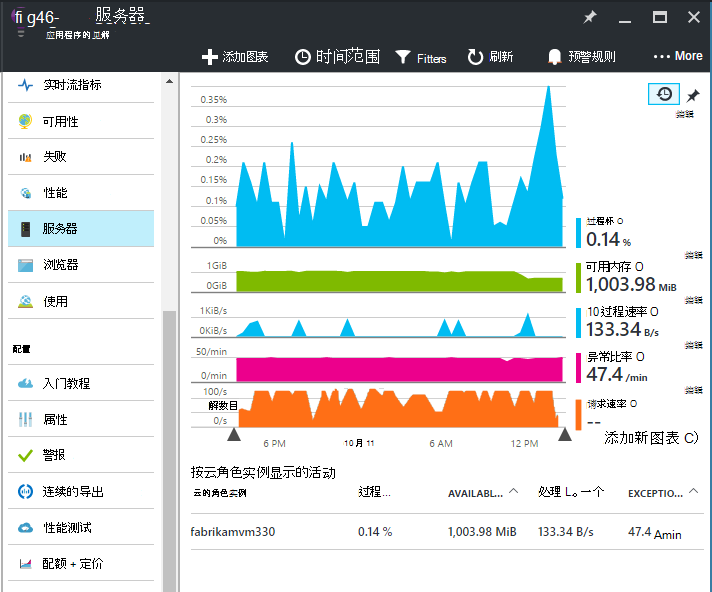
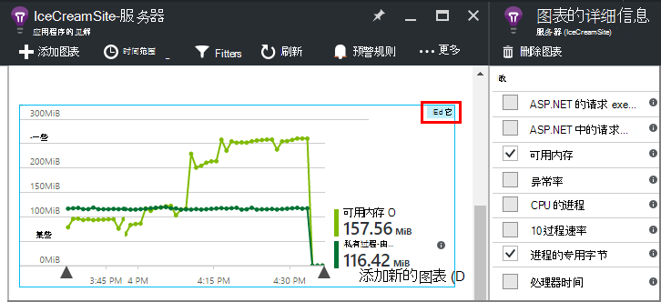
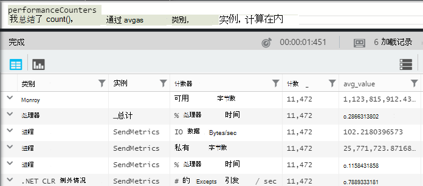
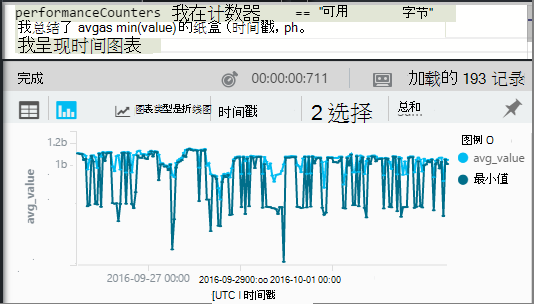
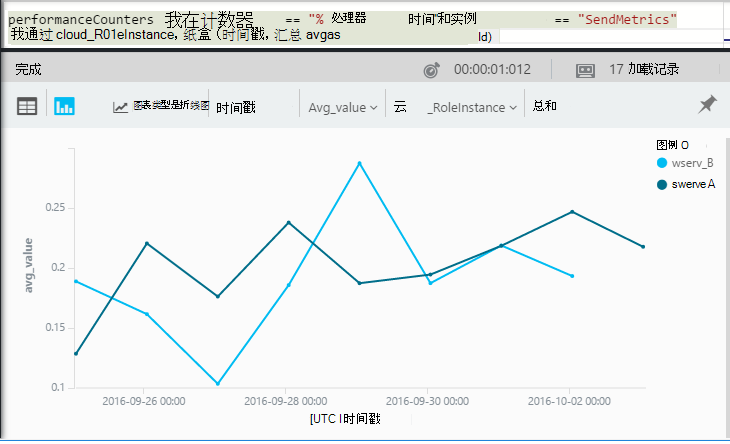

<properties 
    pageTitle="应用程序的见解中的性能计数器 |Microsoft Azure" 
    description="监视系统和应用程序的见解中的自定义.NET 性能计数器。" 
    services="application-insights" 
    documentationCenter=""
    authors="alancameronwills" 
    manager="douge"/>

<tags 
    ms.service="application-insights" 
    ms.workload="tbd" 
    ms.tgt_pltfrm="ibiza" 
    ms.devlang="na" 
    ms.topic="article" 
    ms.date="10/11/2016" 
    ms.author="awills"/>
 
# <a name="system-performance-counters-in-application-insights"></a>在应用程序的见解中的系统性能计数器


Windows 提供了各种各样的[性能计数器](http://www.codeproject.com/Articles/8590/An-Introduction-To-Performance-Counters)，如 CPU 使用量、 内存、 磁盘和网络使用率。 您还可以定义您自己。 [应用程序的见解](app-insights-overview.md)可以显示这些性能计数器在 IIS 下运行您的应用程序是否在内部主机或虚拟机，您对其具有管理访问权限。 图表表明实时应用程序中，可用的资源，可以帮助识别服务器实例之间的负载不平衡。

性能计数器将出现在服务器刀片式服务器，该服务器实例包含一个表的段。



（性能计数器不可用的 Azure Web 应用程序。 但您可以[发送到应用程序的见解的 Azure 诊断](app-insights-azure-diagnostics.md)。

## <a name="configure"></a>配置

如果应用程序状态监视器的见解不尚未安装在服务器计算机上，您需要安装它以查看性能计数器。

下载并运行[状态监视器安装程序](http://go.microsoft.com/fwlink/?LinkId=506648)在每个服务器实例上。 如果已经安装，您不必重新安装它。

* *我在开发过程[中我的应用程序的应用程序的见解 SDK 安装](app-insights-asp-net.md)。我仍然需要状态监视器吗？*

    是的状态监视器需要收集 ASP.NET web 应用程序的性能计数器。 您可能已经知道，状态监视器也可用到[的已经是实时监视 web 应用程序](app-insights-monitor-performance-live-website-now.md)，而在开发过程中安装的 SDK。


## <a name="view-counters"></a>查看计数器

服务器刀片式服务器显示一组默认的性能计数器。 

若要查看其他计数器，或者是编辑服务器刀片上, 图，或打开一个新的[测量数据资源管理器](app-insights-metrics-explorer.md)叶片，添加新的图表。 

编辑图表时，可用的计数器被列为指标。



要查看在一个地方所有您最有用的图表，请创建[仪表板](app-insights-dashboards.md)并将其固定至它。

## <a name="add-counters"></a>添加计数器

如果您希望性能计数器未显示在列表中的度量标准，这是因为应用程序深入 SDK 并不在您的 web 服务器中收集。 您可以配置它来做到这一点。

1. 找出哪些计数器中有您的服务器在服务器上使用此 PowerShell 命令︰

    `Get-Counter -ListSet *`

    (See [`Get-Counter`](https://technet.microsoft.com/library/hh849685.aspx).)

1. 打开 ApplicationInsights.config。

 * 如果在开发期间，添加到您的应用程序的应用程序的见解编辑 ApplicationInsights.config 在您的项目中，然后会重新将它部署到服务器。
 * 状态监视器用于检测 web 应用程序在运行时，如果在 IIS 中的应用程序的根目录中查找 ApplicationInsights.config。 在每个服务器实例中更新它。

2. 编辑收集器指令的性能︰

 ```XML

    <Add Type="Microsoft.ApplicationInsights.Extensibility.PerfCounterCollector.PerformanceCollectorModule, Microsoft.AI.PerfCounterCollector">
      <Counters>
        <Add PerformanceCounter="\Objects\Processes"/>
        <Add PerformanceCounter="\Sales(photo)\# Items Sold" ReportAs="Photo sales"/>
      </Counters>
    </Add>

```

您可以捕获标准计数器和那些已经实现自己。 `\Objects\Processes`是一种常用的计数器，适用于所有 Windows 系统。 `\Sales(photo)\# Items Sold`是一种可以在 web 服务中实现的自定义计数器。 

格式是`\Category(instance)\Counter"`，或没有实例的类别，仅`\Category\Counter`。

`ReportAs`对于不匹配的计数器名称是必需的`[a-zA-Z()/-_ \.]+`-，即它们包含在下面设置的字符︰ 字母、 倒圆角括号、 正斜杠、 连字符、 下划线、 空格，点。

如果您指定一个实例，它将作为维度"CounterInstanceName"报告度量的收集。

### <a name="collecting-performance-counters-in-code"></a>收集代码中的性能计数器

要收集的系统性能计数器，并将其发送到应用程序的见解，可以采用下面的代码段︰

    var perfCollectorModule = new PerformanceCollectorModule();
    perfCollectorModule.Counters.Add(new PerformanceCounterCollectionRequest(
      @"\.NET CLR Memory([replace-with-application-process-name])\# GC Handles", "GC Handles")));
    perfCollectorModule.Initialize(TelemetryConfiguration.Active);

或者，您可以执行相同的操作与您创建的自定义度量值︰

    var perfCollectorModule = new PerformanceCollectorModule();
    perfCollectorModule.Counters.Add(new PerformanceCounterCollectionRequest(
      @"\Sales(photo)\# Items Sold", "Photo sales"));
    perfCollectorModule.Initialize(TelemetryConfiguration.Active);

## <a name="performance-counters-in-analytics"></a>在分析性能计数器

您可以搜索并在[分析](app-insights-analytics.md)显示性能计数器报告。


**改**架构公开`category`，`counter`的名称，和`instance`的每个性能计数器名称。  在每个应用程序的遥测数据，您将看到该应用程序的计数器。 例如，若要查看哪些计数器是可用的︰ 



(此处实例是指性能计数器实例，不是角色或服务器计算机实例。 性能计数器实例名称通常段如处理器时间计数器的进程或应用程序的名称。）

若要在近期内获得的可用内存的图表︰ 




像其他遥测，**改**中也有一列`cloud_RoleInstance`，它指示您的应用程序正在其运行的主机服务器实例的标识。 例如，若要比较不同的计算机上应用程序的性能︰ 




## <a name="aspnet-and-application-insights-counts"></a>ASP.NET 和的见解应用程序计数

*异常指标异常率之间的区别是什么？*

* *异常率*为系统性能计数器。 CLR 对所有处理和未经处理的异常将抛出，并除以间隔的长度总计将采样间隔内进行计数。 应用程序的见解 SDK 收集此结果，并将其发送到门户网站。
* *异常*是由图表的采样间隔中的门户网站收到的 TrackException 报告计数。 它包括只已编写 TrackException 调用您的代码中并不包括所有[未处理的异常](app-insights-asp-net-exceptions.md)处理的异常。 

## <a name="alerts"></a>警报

像其他衡量标准，您可以[设置警报](app-insights-alerts.md)，警告您如果性能计数器会在指定的范围之外。 打开警报刀片式服务器，然后单击添加通知。


## <a name="next"></a>下一步行动

* [依赖项跟踪](app-insights-asp-net-dependencies.md)
* [跟踪异常](app-insights-asp-net-exceptions.md)