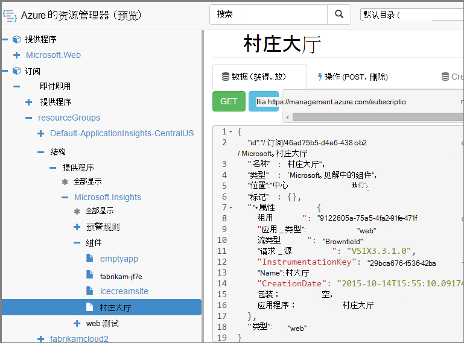

<properties 
    pageTitle="创建使用 PowerShell 的见解应用程序资源" 
    description="以编程方式创建应用程序的见解资源作为生成的一部分。" 
    services="application-insights" 
    documentationCenter=""
    authors="alancameronwills" 
    manager="douge"/>

<tags 
    ms.service="application-insights" 
    ms.workload="tbd" 
    ms.tgt_pltfrm="ibiza" 
    ms.devlang="na" 
    ms.topic="article" 
    ms.date="03/02/2016" 
    ms.author="awills"/>
 
# <a name="create-application-insights-resources-using-powershell"></a>创建使用 PowerShell 的见解应用程序资源

本文介绍了如何在 Azure 中自动创建[应用程序理解](app-insights-overview.md)资源。 您可能，例如，这样做作为生成过程的一部分。 基本的应用程序理解资源，以及可以创建[可用性 web 测试](app-insights-monitor-web-app-availability.md)，[设置警报](app-insights-alerts.md)，并创建其他 Azure 的资源。

创建这些资源的关键是 JSON [Azure 资源管理器](../powershell-azure-resource-manager.md)的模板。 简而言之，过程是︰ 下载的 JSON 定义的现有资源;参数化的某些值，例如名称;然后再运行该模板，每当您想要创建新的资源。 可以一起打包多个资源，来创建这些一体化-例如，可用性测试、 警报和连续导出存储与应用程序监视器。 有一些参数化，这里我们将介绍一些细微的部分。

## <a name="one-time-setup"></a>一次性设置

如果未使用 PowerShell Azure 订阅之前︰

想要运行脚本的计算机上安装的 Azure Powershell 模块︰

1. 安装[Microsoft Web 平台安装程序 (v5 或更高版本)](http://www.microsoft.com/web/downloads/platform.aspx)。
2. 使用它来安装 Microsoft Azure Powershell。

## <a name="copy-the-json-for-existing-resources"></a>复制现有资源为 JSON

1. 设置[应用程序的见解](app-insights-overview.md)为项目对您想要自动生成的一些类似。 如果您想，添加 web 测试和警报。
2. 创建一个新的.json 文件-我们叫它`template1.json`在此示例中。 将这些内容复制到其中︰


    ```JSON

        {
          "$schema": "https://schema.management.azure.com/schemas/2015-01-01/deploymentTemplate.json#",
          "contentVersion": "1.0.0.0",
          "parameters": {
            "appName": { "type": "string" },
            "webTestName": { "type": "string" },
            "url": { "type": "string" },
            "text": { "type" : "string" }
          },
          "variables": {
            "testName": "[concat(parameters('webTestName'), 
               '-', toLower(parameters('appName')))]"
            "alertRuleName": "[concat(parameters('webTestName'), 
               '-', toLower(parameters('appName')), 
               '-', subscription().subscriptionId)]"
          },
          "resources": [
            {
              // component JSON file contents
            },
            {
              //web test JSON file contents
            },
            {
              //alert rule JSON file contents
            }
 
            // Any other resources go here
          ]
        }
    
    ```

    此模板将设置一个可用性测试，除了主要的资源。


2. 打开[Azure 的资源管理器](https://resources.azure.com/)。 向下浏览到`subscriptions/resourceGroups/<your resource group>/providers/Microsoft.Insights/components`，对应用程序资源。 

    

    *组件*是用于显示应用程序的基本见解应用程序资源。 有单独的资源相关联的预警规则和可用性 web 测试。

3. 复制到相应位置中的组件的 JSON `template1.json`。
6. 删除这些属性︰
  * `id`
  * `InstrumentationKey`
  * `CreationDate`
4. 打开的 webtests 和 alertrules 部分，并将各个项的 JSON 复制到您的模板。 (从 webtests 或 alertrules 节点不复制︰ 进入下它们的项目。)

    每个 web 测试有关联的预警规则，因此您必须复制这两个。

    Web 测试应该在预警规则之前。

5. 为了满足架构，请在每个资源插入此行︰

    `"apiVersion": "2014-04-01",`

    (有关资源类型名称的大小写也报告架构`Microsoft.Insights/*`-但*不要*更改这些。)


## <a name="parameterize-the-template"></a>参数化模板

现在，您需要使用参数替换特定的名称。 对[参数化模板](../resource-group-authoring-templates.md)，您可以编写表达式中使用[的帮助程序函数集](../resource-group-template-functions.md)。 

不能将参数化字符串的只是一部分，因此，使用`concat()`以生成字符串。

这里是您将想要替换的示例。 有几个出现的每个替代。 您可能需要其他人在您的模板中。 这些示例使用模板的顶部的参数和变量，我们定义。

查找 | 替换为
---|---
`"hidden-link:/subscriptions/.../components/MyAppName"`| `"[concat('hidden-link:',`<br/>` resourceId('microsoft.insights/components',` <br/> ` parameters('appName')))]"`
`"/subscriptions/.../alertrules/myAlertName-myAppName-subsId",` | `"[resourceId('Microsoft.Insights/alertrules', variables('alertRuleName'))]",`
`"/subscriptions/.../webtests/myTestName-myAppName",` | `"[resourceId('Microsoft.Insights/webtests', parameters('webTestName'))]",`
`"myWebTest-myAppName"` | `"[variables(testName)]"'`
`"myTestName-myAppName-subsId"` | `"[variables('alertRuleName')]"`
`"myAppName"` | `"[parameters('appName')]"`
`"myappname"`（小写） | `"[toLower(parameters('appName'))]"`
`"<WebTest Name=\"myWebTest\" ...`<br/>` Url=\"http://fabrikam.com/home\" ...>"`|`[concat('<WebTest Name=\"',` <br/> `parameters('webTestName'),` <br/> `'\" ... Url=\"', parameters('Url'),` <br/> `'\"...>')]" `


## <a name="set-dependencies-between-the-resources"></a>设置资源之间的依赖关系

Azure 应该设置严格的顺序中的资源。 若要确保安装程序完成前开始下，添加依赖项行︰

* 在 web 资源进行测试︰

    `"dependsOn": ["[resourceId('Microsoft.Insights/components', parameters('appName'))]"],`

* 在警报的资源︰

    `"dependsOn": ["[resourceId('Microsoft.Insights/webtests', variables('testName'))]"],`

## <a name="create-application-insights-resources"></a>创建应用程序的见解资源

1. 在 PowerShell，注册到 Azure

    `Login-AzureRmAccount`

2. 运行如下命令︰

    ```PS

        New-AzureRmResourceGroupDeployment -ResourceGroupName Fabrikam `
               -templateFile .\template1.json `
               -appName myNewApp `
               -webTestName aWebTest `
               -Url http://myapp.com `
               -text "Welcome!"
               -siteName "MyAzureSite"

    ``` 

    * ResourceGroupName 是一组要用来创建新的资源。
    * -templateFile 必须早的自定义参数。
    * -应用程序名要创建的资源的名称。
    * -webTestName 创建的 web 测试的名称。
    * Url 的 web 应用程序的 url。
    * -出现在 web 页中的文本的字符串。
    * -网站名称-如果它是 Azure 网站使用


## <a name="define-metric-alerts"></a>定义度量的警报

没有[设置警报的 PowerShell 方法](app-insights-alerts.md#set-alerts-by-using-powershell)。


## <a name="an-example"></a>示例

下面是完整的组件、 web 测试和 web 测试通知我创建模板︰

``` JSON

{
  "$schema": "https://schema.management.azure.com/schemas/2015-01-01/deploymentTemplate.json#",
  "contentVersion": "1.0.0.0",
  "parameters": {
    "webTestName": { "type": "string" },
    "appName": { "type": "string" },
    "URL": { "type": "string" },
    "text": { "type" : "string" }
  },
  "variables": {
    "alertRuleName": "[concat(parameters('webTestName'), '-', toLower(parameters('appName')), '-', subscription().subscriptionId)]",
    "testName": "[concat(parameters('webTestName'), '-', toLower(parameters('appName')))]"
  },
  "resources": [
    {
      //"id": "[resourceId('Microsoft.Insights/components', parameters('appName'))]",
      "apiVersion": "2014-04-01",
      "kind": "web",
      "location": "Central US",
      "name": "[parameters('appName')]",
      "properties": {
        "TenantId": "9122605a-471fc50f8438",
        "Application_Type": "web",
        "Flow_Type": "Brownfield",
        "Request_Source": "VSIX3.3.1.0",
        "Name": "[parameters('appName')]",
        //"CreationDate": "2015-10-14T15:55:10.0917441+00:00",
        "PackageId": null,
        "ApplicationId": "[parameters('appName')]"
      },
      "tags": { },
      "type": "microsoft.insights/components"
    },
    {
      //"id": "[resourceId('Microsoft.Insights/webtests', variables('testName'))]",
      "name": "[variables('testName')]",
      "apiVersion": "2014-04-01",
      "type": "microsoft.insights/webtests",
      "location": "Central US",
      "tags": {
        "[concat('hidden-link:', resourceId('microsoft.insights/components', parameters('appName')))]": "Resource"
      },
      "properties": {
        "provisioningState": "Succeeded",
        "Name": "[parameters('webTestName')]",
        "Description": "",
        "Enabled": true,
        "Frequency": 900,
        "Timeout": 120,
        "Kind": "ping",
        "RetryEnabled": true,
        "Locations": [
          {
            "Id": "us-va-ash-azr"
          },
          {
            "Id": "emea-nl-ams-azr"
          },
          {
            "Id": "emea-gb-db3-azr"
          }
        ],
        "Configuration": {
          "WebTest": "[concat(
             '<WebTest   Name=\"', 
                parameters('webTestName'), 
              '\"  Id=\"32cfc791-aaad-4b50-9c8d-993c21beb218\"   Enabled=\"True\"         CssProjectStructure=\"\"    CssIteration=\"\"  Timeout=\"120\"  WorkItemIds=\"\"         xmlns=\"http://microsoft.com/schemas/VisualStudio/TeamTest/2010\"         Description=\"\"  CredentialUserName=\"\"  CredentialPassword=\"\"         PreAuthenticate=\"True\"  Proxy=\"default\"  StopOnError=\"False\"         RecordedResultFile=\"\"  ResultsLocale=\"\">  <Items>  <Request Method=\"GET\"         Guid=\"a6f2c90b-61bf-b28hh06gg969\"  Version=\"1.1\"  Url=\"', 
              parameters('Url'), 
              '\" ThinkTime=\"0\"  Timeout=\"300\" ParseDependentRequests=\"True\"         FollowRedirects=\"True\" RecordResult=\"True\" Cache=\"False\"         ResponseTimeGoal=\"0\"  Encoding=\"utf-8\"  ExpectedHttpStatusCode=\"200\"         ExpectedResponseUrl=\"\" ReportingName=\"\" IgnoreHttpStatusCode=\"False\" />        </Items>  <ValidationRules> <ValidationRule  Classname=\"Microsoft.VisualStudio.TestTools.WebTesting.Rules.ValidationRuleFindText, Microsoft.VisualStudio.QualityTools.WebTestFramework, Version=10.0.0.0, Culture=neutral, PublicKeyToken=b03f5f7f11d50a3a\" DisplayName=\"Find Text\"         Description=\"Verifies the existence of the specified text in the response.\"         Level=\"High\"  ExectuionOrder=\"BeforeDependents\">  <RuleParameters>        <RuleParameter Name=\"FindText\" Value=\"', 
              parameters('text'), 
              '\" />  <RuleParameter Name=\"IgnoreCase\" Value=\"False\" />  <RuleParameter Name=\"UseRegularExpression\" Value=\"False\" />  <RuleParameter Name=\"PassIfTextFound\" Value=\"True\" />  </RuleParameters> </ValidationRule>  </ValidationRules>  </WebTest>')]"
        },
        "SyntheticMonitorId": "[variables('testName')]"
      }
    },
    {
      //"id": "[resourceId('Microsoft.Insights/alertrules', variables('alertRuleName'))]",
      "name": "[variables('alertRuleName')]",
      "apiVersion": "2014-04-01",
      "type": "microsoft.insights/alertrules",
      "location": "East US",
      "dependsOn": [
        "[resourceId('Microsoft.Insights/components', parameters('appName'))]",
        "[resourceId('Microsoft.Insights/webtests', variables('testName'))]"
      ],
      "tags": {
        "[concat('hidden-link:', resourceId('Microsoft.Insights/components', parameters('appName')))]": "Resource",
        "[concat('hidden-link:', resourceId('Microsoft.Insights/webtests', variables('testName')))]": "Resource"
      },
      "properties": {
        "name": "[variables('alertRuleName')]",
        "description": "",
        "isEnabled": true,
        "condition": {
          "$type": "Microsoft.WindowsAzure.Management.Monitoring.Alerts.Models.LocationThresholdRuleCondition, Microsoft.WindowsAzure.Management.Mon.Client",
          "odata.type": "Microsoft.Azure.Management.Insights.Models.LocationThresholdRuleCondition",
          "dataSource": {
            "$type": "Microsoft.WindowsAzure.Management.Monitoring.Alerts.Models.RuleMetricDataSource, Microsoft.WindowsAzure.Management.Mon.Client",
            "odata.type": "Microsoft.Azure.Management.Insights.Models.RuleMetricDataSource",
            "resourceUri": "[resourceId('microsoft.insights/webtests', variables('testName'))]",
            "metricName": "GSMT_AvRaW"
          },
          "windowSize": "PT15M",
          "failedLocationCount": 2
        },
        "action": {
          "$type": "Microsoft.WindowsAzure.Management.Monitoring.Alerts.Models.RuleEmailAction, Microsoft.WindowsAzure.Management.Mon.Client",
          "odata.type": "Microsoft.Azure.Management.Insights.Models.RuleEmailAction",
          "sendToServiceOwners": true,
          "customEmails": [ ]
        },
        "provisioningState": "Succeeded",
        "actions": [ ]
      }

    }
  ]
}

```

## <a name="see-also"></a>请参见

自动化的其他文章︰

* [创建应用程序的见解资源](app-insights-powershell-script-create-resource.md)-不使用模板的快速方法。
* [设置通知](app-insights-powershell-alerts.md)
* [创建 web 测试](https://azure.microsoft.com/blog/creating-a-web-test-alert-programmatically-with-application-insights/)
* [Azure 诊断发送到应用程序的见解](app-insights-powershell-azure-diagnostics.md)
* [创建版本注释](https://github.com/Microsoft/ApplicationInsights-Home/blob/master/API/CreateReleaseAnnotation.ps1)
