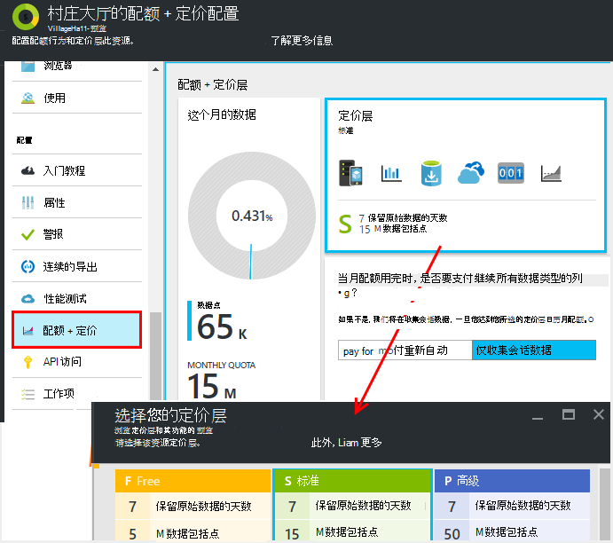
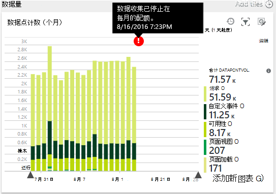
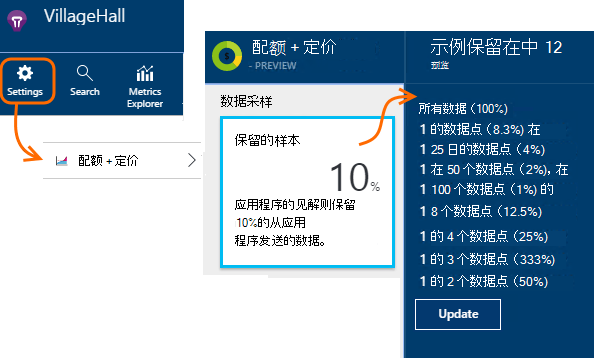
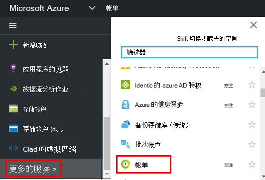

<properties 
    pageTitle="为应用程序的见解管理定价和配额 |Microsoft Azure" 
    description="选择您需要管理遥测卷的价格计划" 
    services="application-insights" 
    documentationCenter=""
    authors="alancameronwills" 
    manager="douge"/>

<tags 
    ms.service="application-insights" 
    ms.workload="tbd" 
    ms.tgt_pltfrm="ibiza" 
    ms.devlang="na" 
    ms.topic="article" 
    ms.date="10/13/2016" 
    ms.author="awills"/>

# 为应用程序的见解管理定价和配额

*在预览是应用程序的见解。*

[定价][ pricing] [Visual Studio 应用程序理解]的[start]基于每个应用程序的数据量。 没有实质性自由层使获得的大多数功能有一些限制。

每个应用程序的见解资源作为独立的服务，收取和分配给您的订阅到 Azure 清单。

[请参阅定价方案][pricing]。

## 查看您的应用程序理解资源配额和价格计划

可以打开配额 + 定价刀片式服务器从您的应用程序资源的设置。

将影响您选择的定价方案︰

* [每月的配额](#monthly-quota)的遥测可以分析每个月的量。
* [数据速率](#data-rate)的数据从您的应用程序可以处理的最大速率。
* [连续导出](#continuous-export)-是否可以将数据导出到其他工具和服务。

为每个应用程序的见解资源分别设置这些限制。

### 优质的免费试用

当您首次创建新的应用程序理解资源时，它开始免费的层中。

在任何时候，您可以切换到 30 天免费特优试用版。 这使您可以特优层的好处。 30 天后，它会自动回复到任何分层此前在-除非您明确选择了另一层。 选择您想试用期间任何时候的层，但仍将获得免费试用 30 天期间结束之前。

## 每月的配额

* 在每个日历月，您的应用程序可以发送到指定数量的见解应用于遥测。 目前自由定价层的配额是 5 万个数据点，每个月，和大大的详细信息的其他方案;您可以购买更多，如果不达到配额。  请参阅[定价方案]的[pricing]的实际数字。 
* 配额取决于您选择的定价层。
* 从每月的第一天的午夜 UTC 计配额。
* 数据点图表显示多少配额已使用了这个月。
* 配额以*的数据点。* 单个数据点是一种跟踪方法，调用是否显式调用，在代码中，或者通过一个标准的遥测模块。 它可以具有多个附加的属性和度量值。
* 由生成的数据点︰
 * [SDK 模块](app-insights-configuration-with-applicationinsights-config.md)自动收集数据，例如报告请求或崩溃，或来测量性能。
 * [API](app-insights-api-custom-events-metrics.md)`Track...`编写了，这样的调用`TrackEvent`或`trackPageView`。
 * 您已设置的[可用性 web 测试](app-insights-monitor-web-app-availability.md)。
* 在调试时您可以看到从您在 Visual Studio 的输出窗口中的应用程序正在发送的数据点。 客户端事件可以看到通过打开您的浏览器中的网络选项卡的调试窗格中 (通常为 F12)。
* 配额中未计入*会话数据*。 这包括用户、 会话、 环境和设备数据的计数。
* 如果您希望通过检查来计算数据点上，可以在多个位置找到它们︰
 * 您看到的每一项在[诊断搜索](app-insights-diagnostic-search.md)，其中包括 HTTP 请求、 异常、 日志跟踪、 页面视图、 依赖项事件和自定义事件。
 * 如性能计数器[度量](app-insights-metrics-explorer.md)每个原始量化指标。 （看图的点是通常聚合多个原始数据点。）
 * 每个 web 可用性图表上的点也是几个数据点的聚合。
* 您还可以在调试过程中检查源的单个数据点︰
 * 如果您在 Visual Studio 中调试模式下运行您的应用程序，在输出窗口中记录的数据点。 
 * 若要查看客户端的数据点，打开浏览器的调试窗格 (通常是 F12)，打开网络选项卡。
* 数据速率可能会 （默认） 降低通过[自适应采样](app-insights-sampling.md)。 这意味着，作为您的应用程序增加使用，遥测率将不会增加尽可能多所料。

### 超出数量

如果您的应用程序发送个以上的每月配额，您可以︰

* 支付的其他数据。 请参阅[定价方案]的[pricing]的详细信息。 您可以选择此选项提前。 此选项在中不可用自由定价层。
* 升级您的定价层。
* 不执行任何操作。 会话数据将继续记录，但在诊断搜索或测量数据资源管理器中将不会显示其他数据。

## 正在发送多少数据？

图表底部的定价刀片式服务器显示应用程序的数据点卷，分组数据点类型。 （您还可以创建此图表中度量资源管理器。）

图表的详细信息，请单击或拖动鼠标跨越它，时间范围的详细信息，请单击 （+）。

该图表显示到达应用程序深入服务，在[采样](app-insights-sampling.md)后的数据量。

如果数据量达到每月配额，批注将出现在图表上。

## 数据速率

除了每月的配额中，数据速率上有限制的限制。 对于自由[定价层][pricing]限制 200 点/秒的平均 5 分钟以上的数据，并且为它付费层 500/s 平均超过 1 分钟。 

有三个存储桶分别被计入︰

* [TrackTrace 调用](app-insights-api-custom-events-metrics.md#track-trace)和[捕获日志](app-insights-asp-net-trace-logs.md)
* [例外](app-insights-api-custom-events-metrics.md#track-exception)，50 点/秒的限制。
* 所有其他遥测 （页面视图、 会话、 请求、 依赖项、 指标、 自定义事件、 web 测试结果）。

*如果我的应用程序超过了每秒速率会怎么样？*

* 您的应用程序发送的数据量被评估每一分钟。 如果它超过分钟内平均每秒速率时，服务器会拒绝一些请求。 SDK 缓冲数据，然后尝试重新发送，在几分钟内扩散的电涌。 如果您的应用程序以一致的方式发送上述限制速率的数据，某些数据将被丢弃。 （ASP.NET、 Java 和 JavaScript Sdk 尝试以这种方式重新发送; 其他 Sdk 可能只需拖放控制数据）。

如果限制出现时，您将看到警告，这发生的通知。

*如何知道我的应用程序正在发送多少数据点？*

* 打开设置/配额和定价以查看的数据量图表。
* 或在测量数据资源管理器，添加一个新图表并选择作为其度量的**数据点卷**。 开关的分组，并按**数据类型**分组。

## 为了减少数据速率

如果您遇到的限制限制，下面是您可以执行以下操作︰

* 使用[采样](app-insights-sampling.md)。 这项技术可以减少数据速率无扭曲度量标准，且无中断中搜索相关项之间导航的能力。
* 在每个页面视图模式下或开关设置为 off Ajax 报告[限制可报告的 Ajax 调用的次数](app-insights-javascript.md#detailed-configuration)。
* 关闭不需要通过[编辑 ApplicationInsights.config](app-insights-configuration-with-applicationinsights-config.md)收集模块。 例如，您可能决定性能计数器或互依关系数据是 inessential。
* 预聚合的度量值。 如果您已将对 TrackMetric 的调用放在您的应用程序，您可以减少通信使用重载接受您计算的平均值和标准偏差的测量的一批。 或者，您可以使用[预聚合的包](https://www.myget.org/gallery/applicationinsights-sdk-labs)。 

## 取样

[采样](app-insights-sampling.md)是降低的遥测被发送到您的应用程序，同时仍然保留期间诊断搜索，查找相关的事件的能力，并仍然保留正确的事件计数的率的方法。 

采样是降低费用，并保持每月限额的有效方法。 这样，例如，当使用搜索，可以找到与特定异常相关的请求，采样算法保留遥测，相关的的项目。 该算法还保留正确计数，以便您可以看到请求速率、 异常的速度和其他计数度量资源管理器中的正确值。

有几种形式的采样。

* [自适应采样](app-insights-sampling.md)是遥测的 ASP.NET SDK，自动调整为您的应用程序发送量的默认值。 它自动在运行 SDK 中 web 应用程序，以便在网络上的遥测通信将减少。 
* *摄取取样*是在其中遥测从您的应用程序输入的应用程序理解服务点工作的一种。 但并不影响从您的应用程序发送的遥测的卷，但它可减少由服务保留的卷。 可用于减少由从浏览器和其他 Sdk 的遥测的配额。

若要设置接收采样，设置配额 + 定价刀片式服务器控件︰

> [AZURE.WARNING] 在保留示例图块上显示的值指示只摄取抽样的设置的值。 它不能显示运行在应用程序中的 SDK 的取样速率。 
> 
> 如果已具有被传入遥测采样率 SDK，则不会应用摄取采样。
 
以发现实际采样率无论应用的场合，使用此[分析查询](app-insights-analytics.md)︰

    requests | where timestamp > ago(1d)
  	| summarize 100/avg(itemCount) by bin(timestamp, 1h) 
  	| render areachart 

在每个保留记录，`itemCount`指示它所表示的原始记录数等于 1 + 以前放弃的记录数。 

## 查看您的订阅到 Azure 清单

应用程序的见解费用将添加到 Azure 账单。 您可以查看详细信息您 Azure 的计费部分的 Azure 的门户或在[Azure 计费门户](https://account.windowsazure.com/Subscriptions)来结帐。 

## 名称限制

1.  200 的唯一指标名称和应用程序的 200 唯一属性名称的最大值。 测量范围包括 TrackMetric，以及测量值在其他数据类型，例如事件通过发送数据。  [度量值和属性名称][api]是全局每一指令插入密钥。
2.  [属性][apiproperties]可用于筛选和分组依据只有时它们具有小于 100 个唯一值的每个属性。 唯一值的数目超过 100 后，仍然可以搜索该属性，但不会再将用于筛选器或分组依据。
3.  如请求名称和页面 URL 的标准属性被限制为每周 1000年唯一值。 在 1000年个唯一值之后, 其他值标记为"其他值"。 原始值仍可用于全文搜索和筛选。

如果您发现您的应用程序超出这些限制，考虑拆分不同检测键-也就是说，[创建新的应用程序理解资源](app-insights-create-new-resource.md)之间数据并发送给新的检测项的某些数据。 您可能会发现结果结构更好。 可以使用[仪表板](app-insights-dashboards.md#dashboards)来让在同一个屏幕上，不同的规格，这样这种方法不会限制您要比较不同的指标的能力。 

## 限值摘要

[AZURE.INCLUDE [application-insights-limits](../../includes/application-insights-limits.md)]

<!--Link references-->

[api]: app-insights-api-custom-events-metrics.md
[apiproperties]: app-insights-api-custom-events-metrics.md#properties
[start]: app-insights-overview.md
[pricing]: http://azure.microsoft.com/pricing/details/application-insights/

 