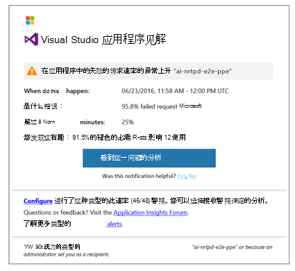
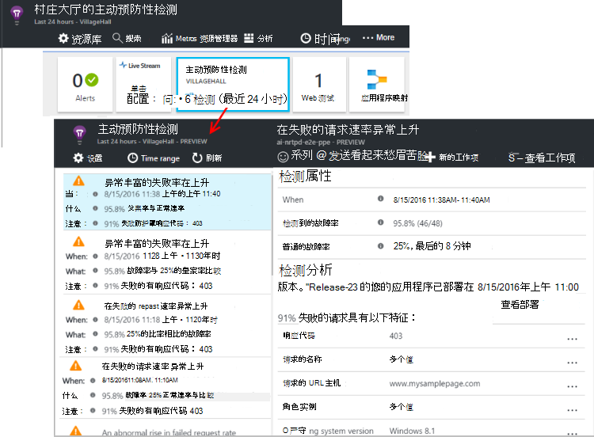

<properties 
    pageTitle="主动预防性诊断中应用的见解 |Microsoft Azure" 
    description="应用程序见解执行自动应用遥测的深入的分析和潜在问题的警告。" 
    services="application-insights" 
    documentationCenter="windows"
    authors="rakefetj" 
    manager="douge"/>

<tags 
    ms.service="application-insights" 
    ms.workload="tbd" 
    ms.tgt_pltfrm="ibiza" 
    ms.devlang="na" 
    ms.topic="article" 
    ms.date="08/15/2016" 
    ms.author="awills"/>

#  主动预防性诊断中应用的见解

 主动预防性诊断自动警告您的 web 应用程序中的潜在性能问题。 它将执行您的应用程序发送到[Visual Studio 应用程序理解](app-insights-overview.md)的遥测数据的智能分析。 如果没有故障率突然上升或在客户端或服务器性能异常模式，您将收到预警。 此功能需要任何配置。 它的工作如果您的应用程序发送足够遥测。

从电子邮件收到，和主动预防性检测刀片式服务器，您可以访问主动检测警报。

## 查看您的主动预防性检测

可以发现在两个方面的检测︰

* **您收到的电子邮件**应用程序的见解。 下面是一个典型的例子︰

    

    单击大按钮以打开在门户中的更多详细信息。

* 您的应用程序概述刀片式服务器上**的主动预防性检测平铺**显示最近收到的通知的数量。 单击方块查看最近的通知列表。

选择要查看其详细信息报警。

## 检测到什么样的问题？

有三种检测︰

* [主动预防性故障率诊断](app-insights-proactive-failure-diagnostics.md)。 我们使用机器学习设置为您的应用程序失败的请求的预期的速度关联负载和其他因素。 如果故障率超出预期的信封时，我们会发送警报。
* [主动预防性性能诊断](app-insights-proactive-performance-diagnostics.md)。 我们搜索的异常模式中的响应时间和故障率每一天。 我们将这些问题的属性，如位置、 浏览器和客户端操作系统、 服务器实例和当天的时间。
* [Azure 的云服务](https://azure.microsoft.com/blog/proactive-notifications-on-cloud-service-issues-with-azure-diagnostics-and-application-insights/)。 如果您的应用程序承载于 Azure 云服务和角色实例已启动故障、 频繁地回收，或运行时崩溃，您会收到警报。

（每个通知中的帮助链接转到相关的文章。）

## 下一步行动

这些诊断工具可以帮助您检查的遥测数据从您的应用程序︰

* [公制的资源管理器](app-insights-metrics-explorer.md)
* [搜索浏览器](app-insights-diagnostic-search.md)
* [分析-功能强大的查询语言](app-insights-analytics-tour.md)

主动预防性诊断程序是完全自动的。 但是，您可能想要设置一些更多的通知呢？

* [手动配置跃点数的警报](app-insights-alerts.md)
* [可用性 web 测试](app-insights-monitor-web-app-availability.md) 

