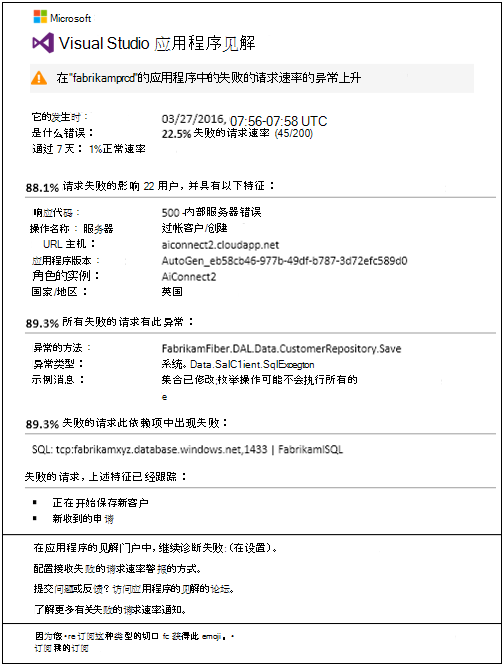
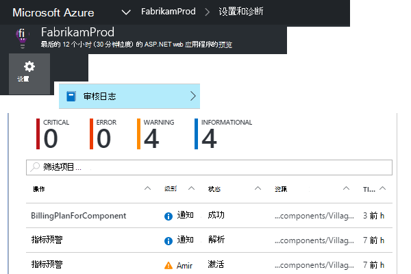

<properties 
    pageTitle="主动预防性故障率诊断中应用的见解 |Microsoft Azure" 
    description="不寻常的失败到您的 web 应用程序请求的速率变化向您发出警报，并提供诊断分析。 不需要配置。" 
    services="application-insights" 
    documentationCenter=""
    authors="yorac" 
    manager="douge"/>

<tags 
    ms.service="application-insights" 
    ms.workload="tbd" 
    ms.tgt_pltfrm="ibiza" 
    ms.devlang="na" 
    ms.topic="article" 
    ms.date="10/12/2016" 
    ms.author="awills"/>
 
# 主动预防性故障率诊断

[Visual Studio 应用程序理解](app-insights-overview.md)自动通知您实时如果您的 web 应用程序遇到了异常的失败率在上升。 检测到不寻常上升中的报告为失败的 HTTP 请求的速率。 这些通常是那些响应代码在 400 和 500-范围。 为了有助于会审和诊断该问题，请在通知中提供了失败的请求和相关的遥测的特性分析。 也有链接到应用程序的见解门户，以便进一步诊断。 该功能需要没有设置或配置，它使用机器学习算法来预测正常失败率。

此功能适用于 Java 和 ASP.NET 在云中，或在您自己的服务器上承载的 web 应用。 它还可用于任何应用程序生成请求遥测-例如，如果您有一个辅助角色，调用[TrackRequest()](app-insights-api-custom-events-metrics.md#track-request)。 

之后设置[应用程序为您的项目的见解](app-insights-overview.md)，并提供您的应用程序生成的遥测，主动预防性故障诊断程序采用某些最少 24 小时接通并可以发送通知之前了解您的应用程序的正常行为。

下面是一个示例的警报。 

> [AZURE.NOTE] 默认情况下，您将获得比此示例短格式邮件。 但是，您可以[切换为此详细的格式](#configure-alerts)。

请注意，该对话框告诉您︰

* 失败率与正常应用程序的行为。
* 多少用户会受到影响--这样您多少知道再也不用担心。
* 与故障特征图案。 在此示例中，没有特定的响应、 请求名称 （操作） 和应用程序版本。 它立即告诉您在哪里开始在代码中查找。 其他可能性可能是特定的浏览器或客户端操作系统。
* 似乎是与已失败的请求相关联的异常、 日志跟踪信息与依赖项失败 （数据库或其他外部组件）。
* 直接指向相关搜索中应用程序建议的遥测数据。

## 主动预防性警报的好处

普通[指标的通知](app-insights-alerts.md)会告诉您可能有问题。 但主动预防性故障诊断程序开始诊断为您执行分析，否则您将不得不亲自做了大量工作。 得到结果整齐地封装，从而帮助您快速获得问题的根源。

## 它的工作原理

近实时主动诊断显示器遥测接收到从您的应用程序，并特别失败的请求速率。 此统计数据进行计数的请求为其`Successful request`属性为 false。 默认情况下， `Successful request== (resultCode < 400)` （除非您已写入[筛选器](app-insights-api-filtering-sampling.md#filtering)的自定义代码或生成您自己的[TrackRequest](app-insights-api-custom-events-metrics.md#track-request)调用）。 

您的应用程序性能具有典型的行为模式。 一些请求将会更容易出现故障比其他人;和整体的故障率会随着负载的增加而增加。 主动预防性故障诊断使用机器学习来发现这些异常。 

根据遥测进入从您的 web 应用程序的应用程序的见解，主动预防性故障诊断过去几天看到的模式比较当前的行为。 如果以前性能 by comparison with 观察到异常的故障率在上升，触发分析。

分析被触发时，服务会对要尝试识别的数值表征故障模式失败请求执行群集分析。 在上面的示例中，分析发现大部分的故障是有关的具体结果代码、 请求名称、 服务器 URL 主机和角色实例。 与此相反，分析发现，该客户端操作系统属性分布在多个值，并因此未将它列出。

当您的服务将会检测与这些遥测时，analyser 发现异常并与群集则有标识，以及任何与这些请求相关联的跟踪日志的一个示例中的请求相关联的依赖项故障。

所得的分析结果发给您作为警告，除非您已不到配置。

类似[手动设置的警报](app-insights-alerts.md)，可以检查警报的状态和警报刀片式服务器的应用程序理解资源中对其进行配置。 但与其他警报，不需要设置或配置主动预防性故障诊断程序。 如果需要，您可以禁用它或更改其目标电子邮件地址。

## 配置警报 

可以禁用主动预防性诊断程序、 更改电子邮件收件人、 创建 webhook，或加入更详细的警报消息。

打开通知页。 主动预防性诊断程序是包含在您手动设置的任何通知，您可以看到它当前是否处于警报状态。

单击该通知可对其进行配置。

请注意，您可以禁用主动预防性诊断程序，但您不能删除它 （或创建另一个）。

#### 详细的警报

如果您选择"接收详细的分析"电子邮件将包含更多的诊断信息。 有时您将能够诊断该问题只是从电子邮件中的数据。 

没有稍有风险的更多详细的警报可能包含敏感信息，因为它包含异常和跟踪消息。 但是，这只会发生如果您的代码可以允许到这些消息的敏感信息。 

## 会审和诊断预警

警报表示检测到异常中的失败的请求速率上升。 很可能还有一些问题与您的应用程序或其环境。

根据请求和受影响的用户数的百分比，您可以决定何种紧急的问题是。 在上面的示例中，22.5%的失败率比较正常率为 1%，表明坏事情怎么回事。 另一方面，仅有 11 用户受到影响。 如果您的应用程序，您将能够评估是如何严重。

在许多情况下，您将能够诊断该问题迅速从请求名称、 异常、 提供的依赖项故障和跟踪数据。 

有一些其他的线索。 例如，在本示例中依赖项故障率等同于 （89.3%) 的异常率。 由此可见异常出现从依赖项失败-为您提供了清晰的思路，从何处入手查找在代码中直接使用。

进一步研究，每个部分中的链接可以直接到[搜索页](app-insights-diagnostic-search.md)筛选到相关的请求、 异常、 依赖项或跟踪。 或者，您可以打开[Azure 的门户网站](https://portal.azure.com)，为您的应用程序，导航至应用程序理解资源，打开故障刀片式服务器。

在此示例中，单击查看依赖项故障详细信息链接将打开应用程序深入搜索刀片式服务器上的 SQL 语句与根本原因︰ 空在必填字段提供且未通过验证的保存操作。

## 查看最近的通知

要查看门户中的警报，请打开**设置审核日志**。

单击任何警报以其完整的详细信息，请参阅。

或单击**主动预防性检测**，以获得直接进入最新的警报︰

## 区别是什么...

主动预防性故障率诊断补充其他类似但不同功能的应用程序的见解。 

* [指标预警](app-insights-alerts.md)由您设置并可以监视各种指标如 CPU 使用量、 请求速率、 页面加载时间，等等。 您可以使用它们向您发出警告，例如，如果您需要添加更多的资源。 与此相反，主动预防性故障诊断涉及小范围的关键指标 （当前仅失败的请求速率），旨在通知您近实时的方式一旦失败，您的 web 应用程序的请求速率增加明显与 web 应用程序的正常行为。

    主动预防性故障率诊断程序将自动调整其阈值以响应通行条件。

    主动预防性故障率诊断程序将开始为您的诊断工作。 
* [主动预防性性能诊断](app-insights-proactive-performance-diagnostics.md)还使用机器智能发现不寻常模式的度量标准，并不不需要任何配置由您。 但与不同的主动预防性故障率诊断、 主动性能诊断的目的是来查找特定类型的浏览器上的段可能不提供您使用复写体-例如，通过特定的页面。 如果未找到任何结果，则很可能要少得多比警报紧急并分析每日执行。 与此相反，传入遥测，连续执行的主动预防性故障诊断分析，将会通知您在几分钟之内如果服务器故障率将比预期更大。

## 如果您收到一个主动预防性故障率诊断程序警报

*为什么收到过此警报？*

*   我们检测到请求失败率与正常基线的前期相比异常上升。 之后的失败和关联的遥测分析，我们认为是应该考虑的问题。 

*该通知并不意味着我肯定有问题吗？*

*   我们尝试通知关于应用程序中断或下降，尽管只有充分了解语义和在应用程序或用户的影响。

*所以，你们看我的数据吗？*

*   不。 该服务是完全自动的。 只有您将收到通知。 您的数据是[私有的](app-insights-data-retention-privacy.md)。

*是否有要订阅此警报？* 

*   不。 每个应用程序发送请求遥测有此警报的规则。

*可以取消订阅或获得而是发送给我的同事的通知？*

*   是的在预警规则，请单击主动诊断规则对其进行配置。 您可以禁用警报，或更改收件人的通知。 

*丢失的电子邮件。在哪里找到的门户的通知？*

*   在审核日志中。 任何通知要查看其事件，然后单击设置审核日志，但与有限的详细视图。

*通知一些已知问题的我不想收到这些。*

*   我们有我们待办事项上的警报抑制。

## 下一步行动

这些诊断工具可以帮助您检查的遥测数据从您的应用程序︰

* [公制的资源管理器](app-insights-metrics-explorer.md)
* [搜索浏览器](app-insights-diagnostic-search.md)
* [分析-功能强大的查询语言](app-insights-analytics-tour.md)

主动预防性的检测都是完全自动的。 但是，您可能想要设置一些更多的通知呢？

* [手动配置跃点数的警报](app-insights-alerts.md)
* [可用性 web 测试](app-insights-monitor-web-app-availability.md) 

