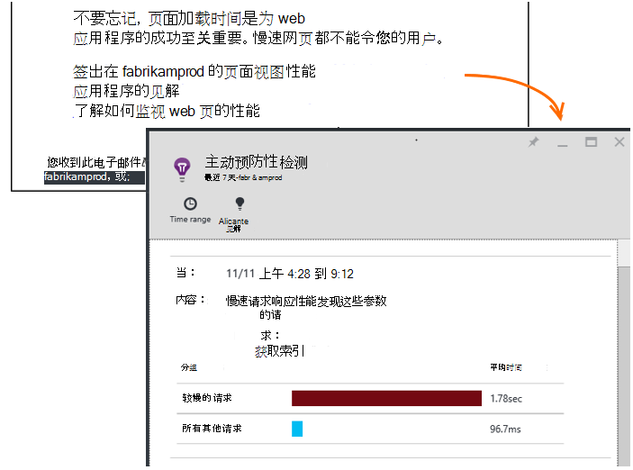

<properties 
    pageTitle="应用程序的见解︰ 主动性能诊断 |Microsoft Azure" 
    description="应用程序见解执行应用遥测的深入分析和潜在问题的警告。" 
    services="application-insights" 
    documentationCenter="windows"
    authors="antonfrMSFT" 
    manager="douge"/>

<tags 
    ms.service="application-insights" 
    ms.workload="tbd" 
    ms.tgt_pltfrm="ibiza" 
    ms.devlang="na" 
    ms.topic="article" 
    ms.date="08/31/2016" 
    ms.author="awills"/>

#  主动预防性性能诊断

*在预览是应用程序的见解。*

[Visual Studio 应用程序建议](app-insights-overview.md)执行深入分析您的应用程序遥测，并警告您关于潜在的性能问题。 可能正在阅读本文由于通过电子邮件收到我们的主动预防性警报。 

此功能要求没有安装程序，并且当您的应用程序生成足够遥测将自动激活。

## 主动预防性性能诊断是什么？

主动预防性性能诊断发现不寻常模式的性能在您的应用程序，通过分析您的应用程序发送到应用程序的见解的遥测数据。 

特别是，它会查找性能问题，只会影响您的部分用户，或只影响用户在某些情况下。

例如，它可以通知如果您的应用程序的页面加载慢得多上一种类型的浏览器比其他，或者请求将更缓慢地由特定服务器。 如慢速网页加载到在一天中的特定时间在一个地理区域，它也可以发现与属性的组合问题。

像这样的异常很难检测只需通过检查数据，但它们比您想象的更常见。 通常他们只出现当客户抱怨。 那时，它已太晚︰ 受影响的用户已经转向您的竞争对手 ！

目前，我们的算法看一下页面加载时间、 请求的响应时间在服务器上和依赖项的响应时间。  

您不必设置的阈值或配置规则。 使用机器学习和数据挖掘算法来检测异常模式。 

我们非常渴望有您的反馈意见。 请让我们知道它是如何帮助您如何改进预防性检测，哪些其他功能您希望我们添加。 您可以提供通过发送反馈微笑/看起来愁眉苦脸的门户或通过电子邮件发送给我们AppInsightsML@microsoft.com。 

## 关于主动预防性警报

* *为什么收到过这封电子邮件？*
 * 主动预防性检测分析的遥测应用程序发送到应用程序的见解，并在您的应用程序中检测到的性能问题。 
* *该通知并不意味着我肯定有问题吗？*
 * 不。 它是只是建议有关一些您可能想要近距离看多。 
* *我应该做什么？*
 * [看看显示的数据](#responding-to-an-alert)。 使用标准浏览器查看随时间变化的性能并钻取到其他度量。 使用搜索筛选出特定的事件，可帮助您确定根本原因。 
* *所以，你们看我的数据吗？*
 * 不。 该服务是完全自动的。 只有您将收到通知。 您的数据是[私有的](app-insights-data-retention-privacy.md)。

## 检测过程

* *什么样的性能异常检测？*
 * 您会发现它非常耗时，要检查自己的模式。 例如，性能不佳的特定组合的位置、 时间和平台。
* *分析应用程序的见解通过收集的所有数据？*
 * 不是在现在。 目前，我们分析请求响应时间、 相关性的响应时间和页面加载时间。 其他标准分析即将登场。 
* *可以创建自己的异常检测规则？*
 * 还没有。 但是，您可以︰
 * [设置通知](app-insights-alerts.md)告诉您当指标超过阈值。
 * [导出遥测](app-insights-export-telemetry.md)[数据库](app-insights-code-sample-export-sql-stream-analytics.md)、 [PowerBI](app-insights-export-power-bi.md)或[其他](app-insights-code-sample-export-telemetry-sql-database.md)工具，其中您可以分析它自己。
* *频率进行分析？*
 * 我们每天都在前一天的遥测数据上运行分析。
* * 因此这会替换[度量警报](app-insights-alerts.md)？
 * 不。  我们不承诺来检测每个您可能需要考虑不正常的行为。

## 如何调查提出的问题

从电子邮件或从异常列表，请打开诊断报告。

* **当**显示检测到问题的时间。
* **哪种**描述
 * 问题已检测到;
 * 我们发现的事件集的特征显示该问题。
* 表比较平均行为的所有其他事件的拙劣的集合。

单击这些链接可打开规格，浏览器和搜索上的时间和较慢的性能集属性筛选的相关报告。

修改时间范围和筛选器，以探究遥测。

## 如何提高性能？

正如您从自己的体验，响应速度慢和失败是 web 站点用户的最大麻烦之一。 因此很重要的问题。

### 会审

首先，是否有关系？ 如果页面总是缓慢加载，但只有 1%的站点的用户不得不看，也许有更重要的事情要考虑。 另一方面，如果只有 1%的用户打开了它，但它每次引发异常，这可能是值得研究。

影响陈述的电子邮件中用作一般指南，但请注意，这并不是全部故事。 收集其他证据，以确认。

考虑问题的参数。 如果它就是地理位置相关，设置[可用性测试](app-insights-monitor-web-app-availability.md)包括该地区︰ 只是可能存在网络问题在该区域中。 

### 诊断慢速网页加载 

哪里有问题？ 是服务器的响应速度变慢、 是页面很长，或没有浏览器需要做大量的工作，以显示它？

打开浏览器规格刀片。 [浏览器页面加载时间的分段的显示](app-insights-javascript.md#explore-your-data)节目时间的什么位置。 

* **发送请求时间**很长，如果服务器响应速度缓慢，或者请求是对大量数据进行开机自检。 查看[性能指标](app-insights-web-monitor-performance.md#metrics)调查的响应时间。 
* 设置[依赖项跟踪](app-insights-dependencies.md)速度慢由于外部服务或数据库。
* 主要**接收响应**时，您的页面和其相关部件的 JavaScript，CSS，等等 （但没有异步加载数据） 的图像都长。 设置[可用性测试](app-insights-monitor-web-app-availability.md)，并请务必设置加载依赖部件的选项。 当您获得一些结果时，打开结果的详细信息并展开以查看不同文件的加载时间。
* 高**客户端处理时间**建议脚本运行缓慢。 原因不是很明显，如果考虑添加一些计时代码和 trackMetric 调用以发送时间。

### 提高慢速网页

没有建议改善您的服务器响应和页面加载时间，因此我们不会试图在这里重复它的完整网站。 下面是您可能已经知道，只是为了让您想到的一些提示︰

* 由于大文件加载速度慢︰ 异步加载脚本和其他部件。 使用脚本绑定。 主页面分成单独加载其数据的构件。 不发送 HTML 的长表︰ 使用脚本来为 JSON 或其他压缩的格式，请请求数据，然后填充的表中的位置。 有很好的框架，有助于所有这些。 （他们也必须承担大的脚本，当然。）
* 降低服务器依赖项︰ 请考虑您的组件的地理位置。 例如，如果您正在使用 Azure，确保 web 服务器和数据库位于同一个地区。 查询检索多于他们所需要的信息？ 将缓存或批处理的帮助吗？
* 产能问题︰ 关注响应时间的服务器指标并对请求进行计数。 如果响应时间不均衡地峰值与峰值的请求计数，则很可能您的服务器被拉伸。 

## 通知电子邮件

* *是否有可以订阅此服务才能接收通知？*
 * 不。 我们 bot 定期调查所有的应用程序理解用户的数据和发送通知，如果它检测到的问题。
* *可以取消订阅或获得而是发送给我的同事的通知？*
 * 单击一个或多个电子邮件中的取消订阅链接。 
 
    当前，它们被发送到那些具有[写访问权限的应用程序理解资源](app-insights-resources-roles-access-control.md)。

    您还可以编辑收件人列表设置主动检测刀片式服务器中。
* *我不想将这些消息所淹没。*
 * 它们是限于每一天的最相关的问题，我们还没有尚未报告有关。 不会重复的任何消息。
* *如果我不做任何事情，我会提醒？*
 * 否，就每个问题有关的消息只有一次。 
* *丢失的电子邮件。在哪里找到的门户的通知？*
 * 在您的应用程序的应用程序的见解概述中，单击**主动预防性检测**拼贴。 有您可以查找所有通知了 7 天后。

## 下一步行动

这些诊断工具可以帮助您检查的遥测数据从您的应用程序︰

* [公制的资源管理器](app-insights-metrics-explorer.md)
* [搜索浏览器](app-insights-diagnostic-search.md)
* [分析-功能强大的查询语言](app-insights-analytics-tour.md)

主动预防性的检测都是完全自动的。 但是，您可能想要设置一些更多的通知呢？

* [手动配置跃点数的警报](app-insights-alerts.md)
* [可用性 web 测试](app-insights-monitor-web-app-availability.md) 

