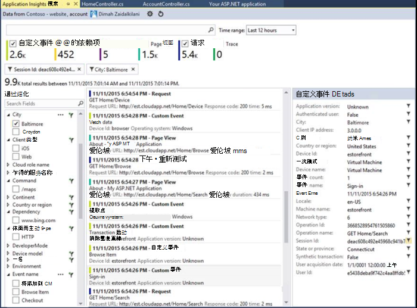

<properties
    pageTitle="发行说明，了解 Visual Studio 开发人员分析扩展"
    description="Visual Studio 工具为开发人员分析最新的更新。"
    services="application-insights"
    documentationCenter=""
    authors="acearun"
    manager="douge"/>
<tags
    ms.service="application-insights"
    ms.workload="tbd"
    ms.tgt_pltfrm="ibiza"
    ms.devlang="na"
    ms.topic="article"
    ms.date="06/09/2016"
    ms.author="acearun"/>

# 发行说明，了解开发分析工具
最新信息︰ 应用程序见解和 HockeyApp 在 Visual Studio 中的分析。
## 7.0 版
### Visual Studio 应用程序见解趋势
Visual Studio 应用程序理解是可用来帮助您分析您的应用程序随着时间的推移的运行方式的 Visual Studio 中的新工具。 首先，**应用程序的见解**工具栏按钮上或在应用程序的见解搜索窗口中，选择**浏览遥测趋势**。 或者，在**视图**菜单上，单击**其他窗口**，然后单击**应用程序的见解趋势**。 请选择一个入门的五种常见查询。 您可以分析不同的数据集基于遥测类型、 时间范围以及其他属性。 以发现数据中的异常现象，在**视图类型**下拉列表中选择另一种异常。 在窗口的底部的筛选选项使得容易关注您遥测的特定子集。

### CodeLens 中的异常
现在在 CodeLens 中显示异常遥测。 如果您的项目连接到应用程序理解服务后，您将看到已经发生在过去的 24 小时内生产的每个方法中的异常数。 从 CodeLens，您可以跳至搜索或趋势调查更详细的异常。

### ASP.NET 核心支持
应用程序的见解现在支持在 Visual Studio 中的 ASP.NET 核心 RC2 项目。 可以从**新建项目**对话框中，如下面的屏幕快照中所示新的 ASP.NET 核心 RC2 项目添加应用程序的见解。 或者，您可以将其添加到现有项目中用鼠标右键单击解决方案资源管理器中的项目，然后单击**添加应用程序的见解遥测**。

5 RC1 的 ASP.NET 和 ASP.NET 核心 RC2 项目诊断工具窗口还有新的支持。 在本地计算机上进行调试时，您将看到类似请求和异常的应用程序理解事件从您的 ASP.NET 应用程序。 从每个事件，请单击**搜索**以向下钻取更多的信息。

### HockeyApp 为通用的 Windows 应用程序的
除了测试分发和用户反馈，HockeyApp 提供了 symbolicated 报告通用的 Windows 应用程序的崩溃。 我们已经变得更加容易，添加 HockeyApp SDK︰ 通用 Windows 项目，击，然后单击**冰球应用程序 — 启用故障分析**。 这安装 SDK、 设置崩溃集合，并规定在云中，一个 HockeyApp 资源完全不将您的应用程序上载到的 HockeyApp 服务。

其他的新功能︰

* 我们已经创建了应用程序的见解搜索体验速度更快且更直观。 现在，时间范围和详细信息筛选器自动应用选择时。
* 另外在搜索应用程序的见解中，现在还有一个选项以跳转到代码直接从请求遥测。
* 我们不应当对 HockeyApp 登录体验的改进。
* 在诊断工具，显示生产遥测信息的异常。

## 5.2 版本
我们很高兴地宣布在 Visual Studio 中的 HockeyApp 方案的介绍。 第一个集成处于 beta 分布的通用的 Windows 应用程序和 Windows 窗体应用程序从 Visual Studio 内。

Beta 分布，通过以下方法将您的应用程序的早期版本上载到 HockeyApp 分发到所选子集的客户或测试人员。 Beta 分布，结合 HockeyApp 崩溃收集和用户反馈功能，可以为您提供有关您的应用程序的有用信息之前进行广泛发行。 可以与您的应用程序使用此信息来解决问题，这样可以避免或尽量减少未来的问题，如较低的应用程序分级、 负面反馈等。

签出要上载是如此简单的 beta 分布从 Visual Studio 内生成。
### 通用的 Windows 应用程序
通用的 Windows 应用程序项目节点的上下文菜单现在包括一个选项，将您的版本上传到 HockeyApp。

选择该项目并上载对话框中打开 HockeyApp。 您将需要上载您的版本的 HockeyApp 帐户。 如果您是新用户，请不要担心。 创建一个帐户是一个简单的过程。

当您连接时，您将看到对话框中的上载窗体。

选择要上载 （.appxbundle 或.appx 文件） 的内容，然后在向导中选择发布选项。 或者，您可以添加在下一页上的发行说明。 选择**完成**以开始上载。

上载完成后，会出现 HockeyApp 通知确认和 HockeyApp 门户中应用程序的链接。

就是这样！ 只是您已上载的生成进行 beta 分布函数，只需几次单击。

您可以管理您应用程序 HockeyApp 门户中的很多方式。 这包括邀请用户，查看崩溃报告和反馈，更改详细信息，等等。

[HockeyApp 知识库](http://support.hockeyapp.net/kb/app-management-2)用于应用程序管理有关的更多详细信息，请参阅。

### Windows 窗体应用程序
Windows 窗体项目节点的上下文菜单现在包括一个选项，将您的版本上传到 HockeyApp。

这将打开 HockeyApp 上载对话框，类似于一个通用的 Windows 应用程序中。

注意在此向导中，新的字段用于指定应用程序的版本。 通用的 Windows 应用程序中，清单中填充信息。 Windows 窗体应用程序，不过，不能等同于此功能。 您将需要手动指定这些项。

流的其余部分是类似于通用的 Windows 应用程序︰ 选择生成和发布选项，添加版本注释、 上载和管理 HockeyApp 门户中。

它是如此简单。 请试一试，让我们知道您的想法。
## 4.3 版本
### 从本地调试会话搜索遥测
此发行版中，现在您可以在 Visual Studio 的调试会话中生成的应用程序的见解遥测的搜索。 之前，您可以使用搜索，仅在应用程序的见解与注册您的应用程序。 现在，您的应用程序只需要具有应用程序深入 SDK 安装搜索本地遥测。

如果您有应用程序深入 SDK 的 ASP.NET 应用程序，请执行下列步骤以使用搜索。

1. 调试您的应用程序。
2. 通过以下方式之一打开应用程序深入搜索︰
    - 在**视图**菜单上，单击**其他窗口**，然后单击**见解搜索应用程序**。
    - 单击**应用程序的见解**工具栏按钮。
    - 在解决方案资源管理器中，展开**ApplicationInsights.config**，，然后单击**搜索调试会话遥测**。
3. 如果您还没有注册与应用程序的见解，搜索窗口将打开调试会话遥测模式。
4. 单击**搜索**图标以查看您本地的遥测。

## 4.2 版
在此版本中，我们添加了一些功能以使搜索数据的事件上下文中更容易跳转到代码从数据事件增多，以及轻松的体验，将您的日志数据发送到应用程序的见解的能力。 此扩展每月更新一次。 如果您有反馈或功能请求，发送到aidevtools@microsoft.com。
### 不单击记录经验
如果您已经在使用 NLog、 log4net 或 System.Diagnostics.Tracing，您不必担心如何将跟踪记录的所有移动到应用程序的见解。 在此版本中，我们整合了应用程序的见解日志记录适配器与普通配置体验。
如果您已经有一个配置这些日志记录框架下, 一节将描述如何获取它。
**如果您已添加应用程序的见解︰**
1. 用鼠标右键单击项目节点，然后单击**应用程序的见解**，然后单击**配置应用程序的见解**。 请确保您看到的选项在配置窗口中添加正确的适配器。
2. 或者，当生成解决方案时，请注意显示在顶部弹出窗口右侧的屏幕，单击**配置**。

安装日志记录适配器后，运行您的应用程序，并确保您看到在诊断工具选项卡中的这样的数据︰

### 跳转到或查找的代码位置发出的遥测事件属性
与新版本用户可以单击的任何值在事件详细信息，这样将搜索当前打开的解决方案中的匹配字符串。 结果将显示在 Visual Studio 的"查找结果"列表如下所示︰

### 当您不在登录为新搜索窗口
我们已经改进了应用程序的见解搜索窗口，可帮助您搜索数据，您的应用程序在生产环境中时的外观。

### 查看所有与该事件关联的遥测事件
我们已经添加了新的选项卡，并查看用户，有关事件的详细信息选项卡旁边的遥测事件相关的所有数据的预定义查询。 例如，请求都有一个称为**操作 ID**字段。 每个与此请求相关联的事件**操作 ID**具有相同的值。 如果操作处理请求时发生异常，异常被赋予相同的请求，以使其更容易查找操作 ID。 如果您正在查看一个请求，请单击**此操作的所有遥测**打开新选项卡，其中显示新的搜索结果。

### 前进和后退历史记录中搜索
现在您可以来回搜索结果之间。

## 4.1 版
此版本中附带了大量的新功能和更新。 必须已安装要安装此版本的更新 1。

### 从异常跳转到源代码中的方法
现在，如果您从您的生产应用程序在应用程序的见解搜索窗口中查看例外，您可以跳转到该方法在代码中发生异常的位置。 只需加载正确的项目和应用程序的见解负责其余 ！ （若要了解有关应用程序的见解搜索窗口的详细信息，请参见发行说明以下各节中的 4.0 版）

它是如何工作的？ 即使在没有打开解决方案时，您可以使用应用程序见解搜索。 堆栈跟踪区域显示的信息性消息，并许多堆栈跟踪中的项都不可用。

如果可用的文件信息，某些项目可能是链接，但解决方案信息项目仍然可以看到。

如果您单击该超链接，您将跳转到所选方法的位置在您的代码中。 可能有的不同的版本号，但功能要跳转到正确的版本的代码，会在以后的版本中。

### 在解决方案资源管理器中遇到了到搜索的新入口点
现在您可以通过解决方案资源管理器访问搜索。

### 显示一条通知发布时完成
弹出对话框中显示联机，发布项目时，以便您可以查看您的应用程序理解数据在生产环境中。

## 4.0 版

### 从 Visual Studio 内搜索应用程序理解数据
如在应用程序理解门户网站，现在在 Visual Studio 中，您可以筛选和事件类型、 属性值和文本，搜索的搜索功能，然后检查单个事件。

### 数据来自于您的本地计算机中的诊断工具，请参阅

在 Visual Studio 诊断工具页上，您可以查看您遥测，除了其他调试数据。 支持仅 ASP.NET 4.5。

### 添加到项目的 SDK，而无需登录到 Azure

您不再需要登录到 Azure 来将应用程序的见解程序包添加到项目中，通过**新建项目**对话框中或者从项目上下文菜单。 如果您进行登录，则将安装并配置为发送到门户为之前的遥测 SDK。 如果您不在登录，SDK 将被添加到您的项目，它将生成诊断中心的遥测数据。 如果需要，您可以从以后配置它。

### 设备支持

在*Connect();* 2015，我们[宣布](https://azure.microsoft.com/blog/deep-diagnostics-for-web-apps-with-application-insights/)我们设备的移动开发经验是 HockeyApp。 HockeyApp 可以帮助您分发给您的测试人员的测试生成、 收集和分析所有的崩溃，从您的应用程序，和直接从客户收集反馈信息。
HockeyApp 在您选择生成，无论该 iOS、 Android，或窗口，或者像 Xamarin，Cordova 或 Unity 的跨平台解决方案取决于哪种平台上支持您的应用程序。

在将来版本的应用程序的见解扩展中，我们将介绍 Visual Studio HockeyApp 之间享受高集成度的带来。 现在，您可以通过从开始 HockeyApp 只添加了 NuGet 引用。 请参阅[文档](http://support.hockeyapp.net/kb/client-integration-windows-and-windows-phone)以了解更多信息。
