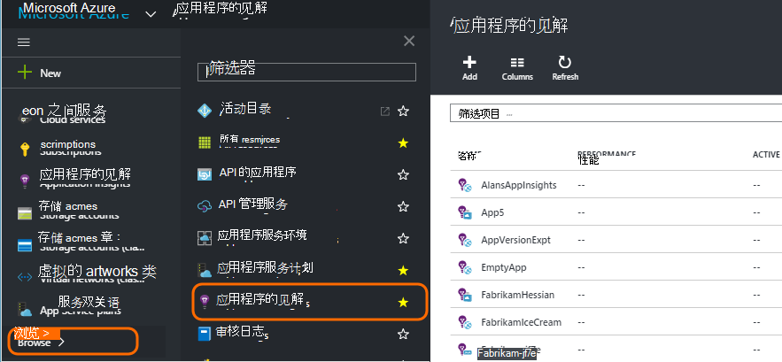
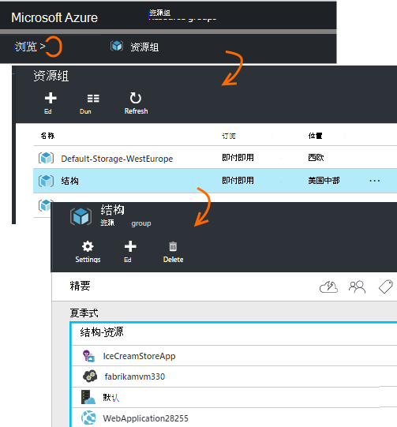
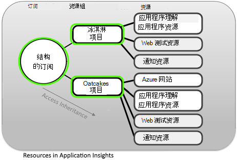
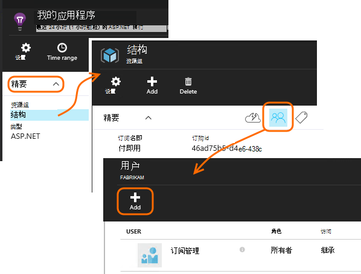
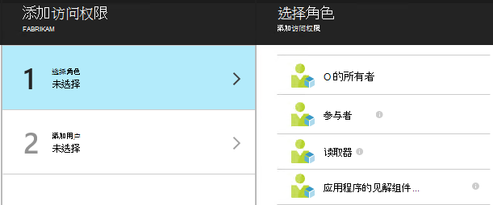
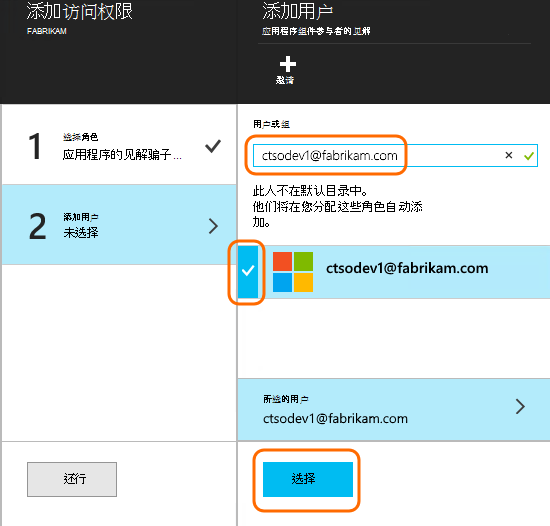

<properties
    pageTitle="资源、 角色和应用程序的见解中的访问控制"
    description="所有者、 参与者和读者您的组织的见解。"
    services="application-insights"
    documentationCenter=""
    authors="alancameronwills"
    manager="douge"/>

<tags
    ms.service="application-insights"
    ms.workload="tbd"
    ms.tgt_pltfrm="ibiza"
    ms.devlang="na"
    ms.topic="article"
    ms.date="05/07/2016"
    ms.author="awills"/>

# 资源、 角色和应用程序的见解中的访问控制

您可以控制谁具有读取和更新对 Visual Studio[应用程序理解]数据访问权限[start]，通过使用[Microsoft Azure 中的基于角色的访问控制](../active-directory/role-based-access-control-configure.md)。

> [AZURE.IMPORTANT] 分配给用户的**资源组或订阅**应用程序资源所属-不在本身的资源的访问。 分配**应用程序理解组件参与者**角色。 这将确保统一控制 web 测试和警报以及您的应用程序资源的访问权限。 [了解更多](#access)。

## 资源、 组和订阅

首先，一些定义︰

* **资源**-Microsoft Azure 服务的实例。 您的应用程序理解资源收集、 分析和显示从应用程序发送的遥测数据。  其他类型的 Azure 的资源包括 web 应用程序、 数据库和虚拟机。

    要查看所有资源，请转到[Azure 门户网站][portal]，登录，然后单击浏览。

    

* [**资源组**][group]的每个资源属于一个组。 一组是管理相关的资源，特别是访问控制的一种简便方法。 例如，到一个资源组，您可以将 Web 应用程序、 可以监视该应用程序，应用程序的见解资源和存储资源来保存导出的数据。

    

* [**订阅**](https://manage.windowsazure.com)的使用应用程序的见解或其他 Azure 的资源，您登录到 Azure 的订阅。 每个资源组属于一个 Azure 的预订，其中您选择价格包，如果它是组织订阅，选择的成员和他们的访问权限。
* [**Microsoft 客户**][ account] -用户名和密码用于登录到 Microsoft Azure 订阅、 XBox Live，Outlook.com 和其他 Microsoft 服务。

## 在资源组中的控件访问

务必要了解，除了您的应用程序创建的资源，也有单独隐藏的资源的通知和 web 测试的。 它们连接到与您的应用程序相同的[资源组](#resource-group)。 您可能也已经让其他 Azure 服务中存在，例如，网站或存储。

控制对因此建议对这些资源的访问权限︰

* 控制访问**资源组或订阅**级别。
* 将**应用程序的见解组件参与者**角色分配给用户。 这样，他们才能编辑 web 测试、 警报和应用程序建议的资源，而不提供对组中的任何其他服务的访问。

## 若要为其他用户提供访问权限

您必须为订阅或资源组的所有权。

用户必须有[Microsoft 客户][account]，或访问其[组织的 Microsoft 客户](..\active-directory\sign-up-organization.md)。 您可以访问到的个人，以及定义 Azure Active Directory 中的用户组。

#### 导航到该资源组

添加用户。

或者转到了另一个级别，向订阅中添加用户。

#### 选择角色

角色 | 在资源组
---|---
所有者 | 可以更改任何字符，包括用户的访问权限
参与者 | 可以编辑任何字符，包括所有的资源
应用程序组件的见解参与者 | 可以编辑应用程序的见解资源、 web 测试和警报
读取器 | 可以查看但不是能更改任何内容

编辑，包括创建、 删除和更新︰

* 资源
* Web 测试
* 警报
* 连续的导出

#### 选择的用户

如果您希望的用户不在目录中，您可以邀请任何人使用 Microsoft 帐户。
（如果他们使用如 Outlook.com、 OneDrive、 Windows Phone 或 XBox Live 服务，它们拥有 Microsoft 帐户。）

## 用户和角色

* [基于角色的访问控制在 Azure 中](../active-directory/role-based-access-control-configure.md)

<!--Link references-->

[account]: https://account.microsoft.com
[group]: ../resource-group-overview.md
[portal]: https://portal.azure.com/
[start]: app-insights-overview.md
