<properties 
    pageTitle="演练︰ 监视 Microsoft Dynamics CRM 应用程序的见解与" 
    description="遥测得到 Microsoft Dynamics CRM Online 使用应用程序的见解。 获取数据、 可视化和导出的设置、 演练。" 
    services="application-insights" 
    documentationCenter=""
    authors="mazharmicrosoft" 
    manager="douge"/>

<tags 
    ms.service="application-insights" 
    ms.workload="tbd" 
    ms.tgt_pltfrm="ibiza" 
    ms.devlang="na" 
    ms.topic="article" 
    ms.date="11/17/2015" 
    ms.author="awills"/>
 
# 演练︰ 实现遥测的 Microsoft Dynamics CRM Online 使用应用程序的见解

本文演示如何从[Microsoft Dynamics CRM Online](https://www.dynamics.com/)获取遥测数据使用[Visual Studio 应用程序理解](https://azure.microsoft.com/services/application-insights/)。 我们将引导您完成将应用程序的见解脚本添加到您的应用程序的完整过程捕获数据，以及数据可视化。

>[AZURE.NOTE] [浏览示例解决方案](https://dynamicsandappinsights.codeplex.com/)。

## 向新的或现有 CRM Online 的实例中添加应用程序的见解 

要监视您的应用程序，您添加到您的应用程序应用程序深入 SDK。 SDK 将遥测发送到[应用程序的见解门户](https://portal.azure.com)，您可以使用我们的功能强大的分析和诊断工具，或将数据导出到存储。

### 在 Azure 中创建的应用程序理解资源

1. 获取[在 Microsoft Azure 中的帐户](http://azure.com/pricing)。 
2. 登录到[Azure 门户](https://portal.azure.com)并添加新的应用程序理解资源。 这是将处理和显示数据。

    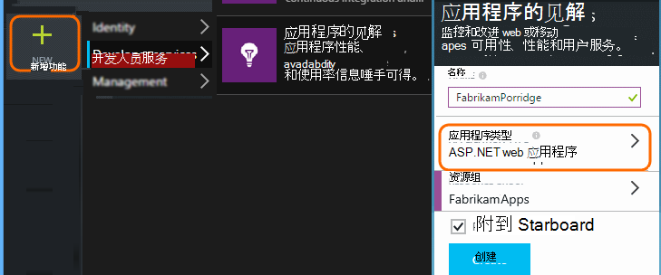

    作为应用程序类型，选择 ASP.NET。

3. 打开快速入门选项卡并打开代码脚本。

    

在另一个浏览器窗口中**保持打开状态的代码页**时执行下一步步骤。 您很快就需要该代码。 

### 在 Microsoft Dynamics CRM 中创建一个 JavaScript web 资源

1. 使用管理员权限打开您的 CRM Online 的实例和登录。
2. 打开 Microsoft Dynamics CRM 的设置，自定义，自定义系统

    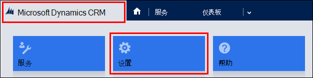
    
    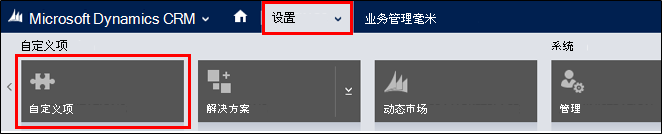

    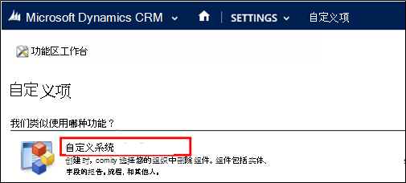

3. 创建一个 JavaScript 资源。

    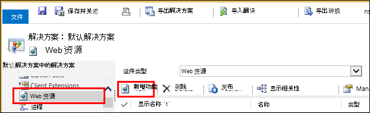

    为它指定一个名称，选择**脚本 (JScript)**然后打开文本编辑器。

    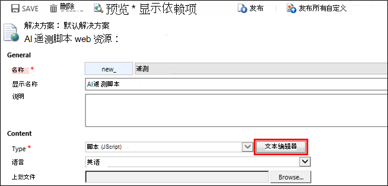
    
4. 从应用程序的见解中复制代码。 在复制时一定要忽略脚本标记。 下面的屏幕快照，请︰

    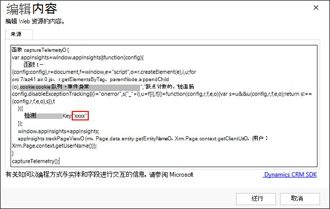

    代码包含标识您的应用程序理解资源的检测项。

5. 保存并发布。

    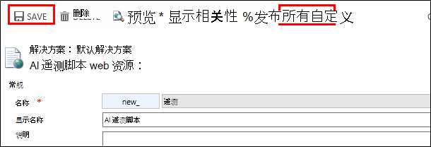

### 检测窗体

1. 在 Microsoft CRM 联机中打开客户表单

    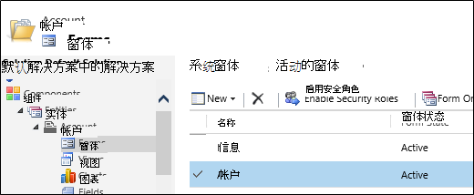

2. 打开窗体属性

    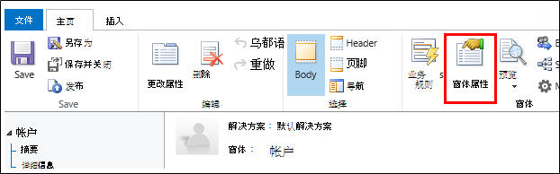

3. 添加创建 JavaScript web 资源

    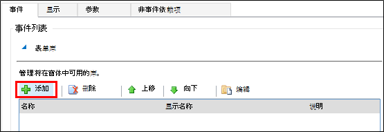

    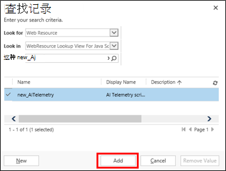

4. 保存并发布窗体自定义项。

## 捕获的指标

现在已经设置为窗体的遥测捕获。 每当使用它时，数据将发送到您的应用程序理解资源。

下面是示例，您将看到的数据。

#### 应用程序运行状况

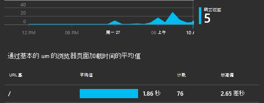

浏览器异常︰

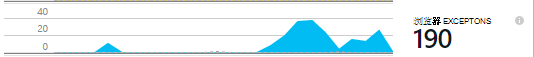

单击该图表以获取更多详细信息︰

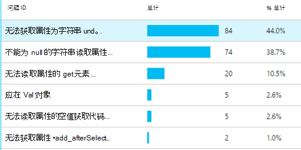

#### 使用

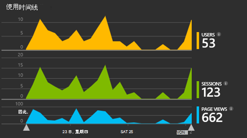

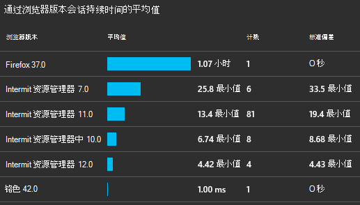

#### 浏览器

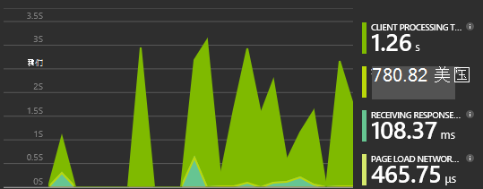

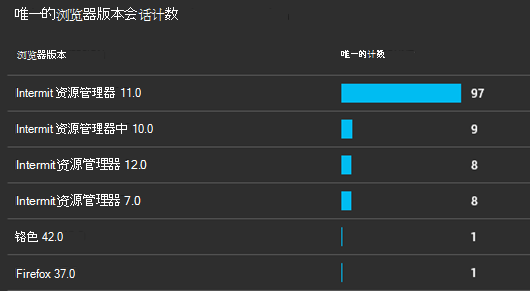

#### 地理位置

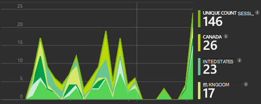

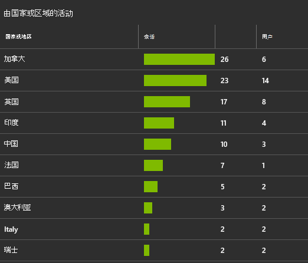

#### 内部页查看请求

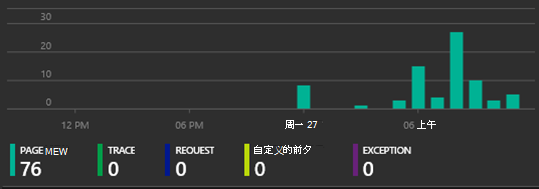

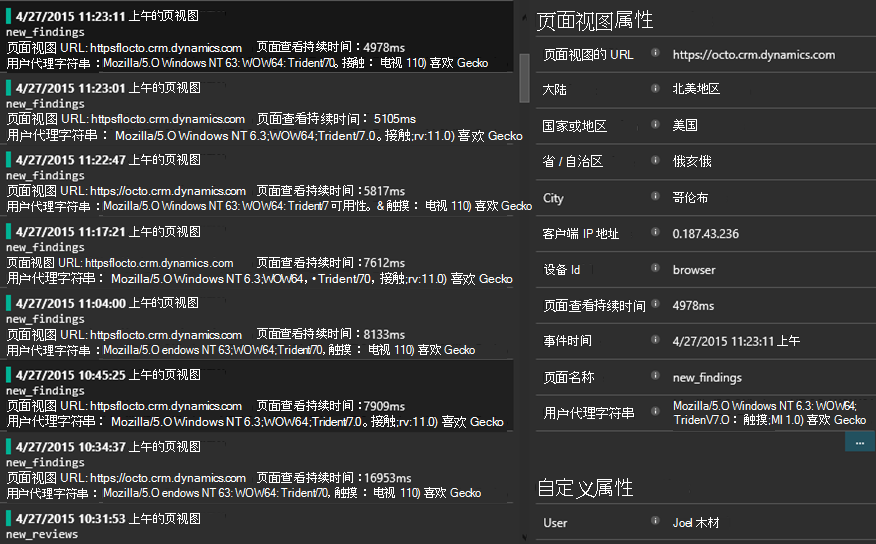

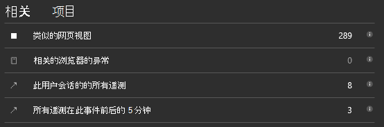

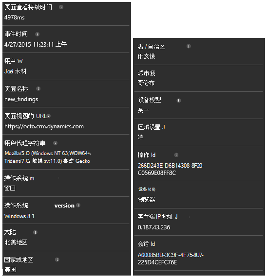

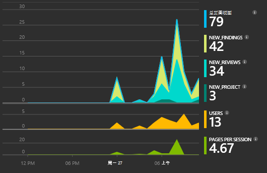

## 示例代码

[浏览代码示例](https://dynamicsandappinsights.codeplex.com/)。

## 双电源

可以执行甚至更深层次的分析，如果您[将数据导出到 Microsoft 电源 BI](app-insights-export-power-bi.md)。

## 示例 Microsoft Dynamics CRM 解决方案

[以下是示例解决方案在 Microsoft Dynamics CRM 的实施](https://dynamicsandappinsights.codeplex.com/)。

## 了解更多信息

* [应用程序的见解是什么？](app-insights-overview.md)
* [应用程序的 web 页的见解](app-insights-javascript.md)
* [更多示例和演练](app-insights-code-samples.md)

 
