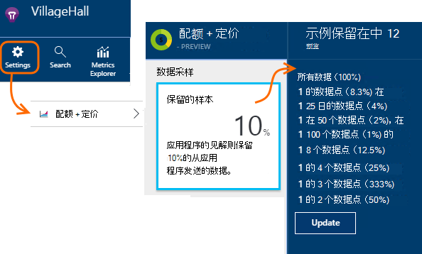

<properties 
    pageTitle="遥测采样中应用程序的见解 |Microsoft Azure" 
    description="如何使遥测控制下的卷。" 
    services="application-insights" 
    documentationCenter="windows"
    authors="vgorbenko" 
    manager="douge"/>

<tags 
    ms.service="application-insights" 
    ms.workload="tbd" 
    ms.tgt_pltfrm="ibiza" 
    ms.devlang="na" 
    ms.topic="article" 
    ms.date="08/30/2016" 
    ms.author="awills"/>

#  <a name="sampling-in-application-insights"></a>在应用程序的见解中的取样

*在预览是应用程序的见解。*


采样是[Visual Studio 应用程序理解](app-insights-overview.md)中的功能是降低遥测通信和存储，同时保留应用程序数据的统计正确分析的推荐的方式。 筛选器选择，以便您可以进行诊断调查时的项之间导航相关的项。
跃点计数向您显示在门户中，当它们被重新标准化考虑的采样，以最小化任何影响的统计数据。

采样降低流量，可以帮助您保持在每月的数据配额，并可帮助您避免限制。

## <a name="in-brief"></a>简而言之︰

* 采样保留 1 中的*n*条记录并将其余部分丢弃。 例如，它可能保留 1/5 的事件，采样率为 20%。 
* 如果您的应用程序发送大量的遥测，ASP.NET web 服务器应用程序中，采样会自动发生。
* 您还可以设置手动采样在门户上的定价页;或在.config 文件中，ASP.NET SDK 还可以减少网络通讯量。
* 如果您想要的一组事件是保留还是放弃在一起确保记录的自定义事件，请确保它们具有相同的 OperationId 值。
* 属性中的每个记录中报告采样除数*n* `itemCount`，好记的名称"请求计数"或"事件计数"下将显示该搜索中。 当采样在操作中，不是`itemCount==1`。
* 如果您编写分析查询，您应该[考虑的采样](app-insights-analytics-tour.md#counting-sampled-data)。 特别是，而不是简单地对记录进行计数，您应使用`summarize sum(itemCount)`。


## <a name="types-of-sampling"></a>类型的采样


有三种可选采样方法︰

* **自适应采样**自动调整遥测从 ASP.NET 应用程序中的 SDK 发送的量。 来自 SDK v 2.0.0-beta3 的默认值。 当前可用于仅 ASP.NET 服务器端遥测。 
* **固定速率采样**可以减少从两个 ASP.NET 服务器和用户浏览器发送的遥测的卷。 您设置的速率。 在客户端和服务器同步其采样以便请求相关的页面视图之间导航，在搜索。
* **摄取取样**可以降低遥测见解应用程序服务，您设置的速率由保留的卷。 它不会降低遥测通信，但可以帮助您保持您的每月配额内。 

如果随样性或固定速率采样操作中，摄取采样被禁用。

## <a name="ingestion-sampling"></a>摄取采样

这种形式的采样点在从您的 web 服务器、 浏览器和设备的遥测数据达到应用程序理解服务终结点的操作。 尽管它并未减少从您的应用程序发送的遥测通信，它确实会降低量处理和保留 （和收取） 的应用程序的见解。

如果您的应用程序通常需要经过其每月的配额，并且您没有选择使用基于 SDK 的采样类型之一，使用这种类型的采样。 

在配额和价格刀片式服务器设置采样率︰



与其他类型的采样，类似算法保留相关的遥测项。 例如，当您正在检查中搜索的遥测数据，将能够找到特定的异常与相关的请求。 如请求速率计算跃点数，异常率并且正确保留。

不可用在任何应用程序的见解特征如[连续导出](app-insights-export-telemetry.md)放弃通过采样的数据点。

摄取采样不运行在基于 SDK 的自适应或固定速率采样过程中操作。 如果 SDK 的采样速率，小于 100%摄取采样率设置将被忽略。

> [AZURE.WARNING] 图块上显示的值指示对摄取采样所设置的值。 如果 SDK 取样是在操作中，它并不代表实际采样率。


## <a name="adaptive-sampling-at-your-web-server"></a>在您的 web 服务器的自适应采样

自适应采样可用于应用程序的见解 SDK ASP.NET v 2.0.0-beta3 及更高版本，并默认处于启用状态。 


自适应采样将影响从您的 web 服务器应用程序发送到应用程序理解服务的遥测的卷。 该卷将自动调整，以将成本保持在指定的最大速率的通信。

它不会运行在低增长的遥测，因此在调试应用程序，或使用低使用率的网站将不会受到影响。

为了实现目标卷，某些生成的遥测数据将被丢弃。 但像其他类型的采样，该算法保留了相关的遥测项。 例如，当您正在检查中搜索的遥测数据，将能够找到特定的异常与相关的请求。 

如请求速率计算跃点数，异常率将调整以弥补的采样速率，以使其显示正确值约度量资源管理器中。

**更新项目的 NuGet**程序包添加到最新的*预发行*版本的应用程序的见解︰ 用鼠标右键单击解决方案资源管理器中的项目，选择管理 NuGet 程序包，检查**包括预发布版**和 Microsoft.ApplicationInsights.Web 的搜索。 

在[ApplicationInsights.config](app-insights-configuration-with-applicationinsights-config.md)，您可以调整中的几个参数`AdaptiveSamplingTelemetryProcessor`节点。 显示的数字均为默认值︰

* `<MaxTelemetryItemsPerSecond>5</MaxTelemetryItemsPerSecond>`

    自适应算法的目的是为**每个服务器主机上**目标速率。 如果在多个主机上运行您的 web 应用程序，降低此值使其保持在您目标速率的通信应用程序的见解门户。

* `<EvaluationInterval>00:00:15</EvaluationInterval>` 

    当前的遥测速率是重新计算时间间隔。 移动平均趋势线作为执行评估。 您可能想要缩短此时间间隔，如果您遥测是承担的激增。

* `<SamplingPercentageDecreaseTimeout>00:02:00</SamplingPercentageDecreaseTimeout>`

    当采样百分比值的更改，多久之后我们允许降低采样百分比再次捕获更少的数据。

* `<SamplingPercentageIncreaseTimeout>00:15:00</SamplingPercentageIncreaseTimeout>`

    当采样百分比值的更改，多久之后我们允许增加采样百分比再次捕获更多的数据。

* `<MinSamplingPercentage>0.1</MinSamplingPercentage>`

    随着采样百分比各不相同，允许我们设置的最小值是什么。

* `<MaxSamplingPercentage>100.0</MaxSamplingPercentage>`

    随着采样百分比各不相同，允许我们设置的最大值是什么。

* `<MovingAverageRatio>0.25</MovingAverageRatio>` 

    在移动平均计算，权重分配给最新的值。 使用等于或小于 1 的值。 较小的值进行算法不太被动为突然更改。

* `<InitialSamplingPercentage>100</InitialSamplingPercentage>`

    分配应用程序刚刚开始时的值。 不将此时间减少调试时。 

### <a name="alternative-configure-adaptive-sampling-in-code"></a>备选方法︰ 配置代码中的自适应采样

而不是调整采样.config 文件中的，您可以使用代码。 这允许您指定重新计算采样率时调用的回调函数。 可以使用此操作，例如，来找出正使用哪种采样速率。

删除`AdaptiveSamplingTelemetryProcessor`.config 文件中的节点。


*C#*

```C#

    using Microsoft.ApplicationInsights;
    using Microsoft.ApplicationInsights.Extensibility;
    using Microsoft.ApplicationInsights.WindowsServer.Channel.Implementation;
    using Microsoft.ApplicationInsights.WindowsServer.TelemetryChannel;
    ...

    var adaptiveSamplingSettings = new SamplingPercentageEstimatorSettings();

    // Optional: here you can adjust the settings from their defaults.

    var builder = TelemetryConfiguration.Active.TelemetryProcessorChainBuilder;
    
    builder.UseAdaptiveSampling(
         adaptiveSamplingSettings,

        // Callback on rate re-evaluation:
        (double afterSamplingTelemetryItemRatePerSecond,
         double currentSamplingPercentage,
         double newSamplingPercentage,
         bool isSamplingPercentageChanged,
         SamplingPercentageEstimatorSettings s
        ) =>
        {
          if (isSamplingPercentageChanged)
          {
             // Report the sampling rate.
             telemetryClient.TrackMetric("samplingPercentage", newSamplingPercentage);
          }
      });

    // If you have other telemetry processors:
    builder.Use((next) => new AnotherProcessor(next));

    builder.Build();

```

（[关于遥测处理器](app-insights-api-filtering-sampling.md#filtering)）。


<a name="other-web-pages"></a>
## <a name="sampling-for-web-pages-with-javascript"></a>采样使用 JavaScript 的 web 页的

您可以配置固定速率采样从任何服务器的 web 页。 

当您[配置应用程序理解网页](app-insights-javascript.md)，修改获得应用程序的见解门户代码段。 （在 ASP.NET 应用程序，代码段通常发生在 _Layout.cshtml。） 插入水平线，如同`samplingPercentage: 10,`之前的检测项︰

    <script>
    var appInsights= ... 
    }({ 


    // Value must be 100/N where N is an integer.
    // Valid examples: 50, 25, 20, 10, 5, 1, 0.1, ...
    samplingPercentage: 10, 

    instrumentationKey:...
    }); 
    
    window.appInsights=appInsights; 
    appInsights.trackPageView(); 
    </script> 

采样百分比，请选择已接近 100/N，N 是整数百分比。  当前采样不支持其他值。

如果您还启用了服务器上的固定速率采样，以便请求相关的页面视图之间导航该，在搜索时，将同步客户机和服务器。


## <a name="fixed-rate-sampling-for-aspnet-web-sites"></a>对于 ASP.NET web 站点固定速率采样

固定的速率采样可以减少从您的 web 服务器和 web 浏览器发送的通信。 与不同的自适应采样，它减少了遥测以固定速率由您决定。 它还将同步的客户端和服务器采样以便保留相关的项目-例如，以便如果您看一下搜索中的页视图中，您可以找到其相关的请求。

采样算法保留相关的项。 每个 HTTP 请求的事件，它和它相关的事件被丢弃，或者传输。 

在测量数据资源管理器，例如请求和异常计数率都乘以系数来弥补它的采样速率，以便它们正确。

1. 最新的*预发行*版本的应用程序理解**更新项目的 NuGet 程序包**。 用鼠标右键单击解决方案资源管理器中的项目、 选择管理 NuGet 程序包、 检查**包括预发布版**和 Microsoft.ApplicationInsights.Web 的搜索。 

2. **禁用自适应采样**︰ 在[ApplicationInsights.config](app-insights-configuration-with-applicationinsights-config.md)，删除或注释掉`AdaptiveSamplingTelemetryProcessor`节点。

    ```xml

    <TelemetryProcessors>
    <!-- Disabled adaptive sampling:
      <Add Type="Microsoft.ApplicationInsights.WindowsServer.TelemetryChannel.AdaptiveSamplingTelemetryProcessor, Microsoft.AI.ServerTelemetryChannel">
        <MaxTelemetryItemsPerSecond>5</MaxTelemetryItemsPerSecond>
      </Add>
    -->
    

    ```

2. **启用固定速率采样模块。** 将此代码段添加到[ApplicationInsights.config](app-insights-configuration-with-applicationinsights-config.md)中︰

    ```XML

    <TelemetryProcessors>
     <Add  Type="Microsoft.ApplicationInsights.WindowsServer.TelemetryChannel.SamplingTelemetryProcessor, Microsoft.AI.ServerTelemetryChannel">

      <!-- Set a percentage close to 100/N where N is an integer. -->
     <!-- E.g. 50 (=100/2), 33.33 (=100/3), 25 (=100/4), 20, 1 (=100/100), 0.1 (=100/1000) -->
      <SamplingPercentage>10</SamplingPercentage>
      </Add>
    </TelemetryProcessors>

    ```

> [AZURE.NOTE] 采样百分比，请选择已接近 100/N，N 是整数百分比。  当前采样不支持其他值。


### <a name="alternative-enable-fixed-rate-sampling-in-your-server-code"></a>备选方法︰ 启用在服务器代码中的固定速率采样


而不是在.config 文件中设置采样参数，您可以使用代码。 

*C#*

```C#

    using Microsoft.ApplicationInsights.Extensibility;
    using Microsoft.ApplicationInsights.WindowsServer.TelemetryChannel;
    ...

    var builder = TelemetryConfiguration.Active.GetTelemetryProcessorChainBuilder();
    builder.UseSampling(10.0); // percentage

    // If you have other telemetry processors:
    builder.Use((next) => new AnotherProcessor(next));

    builder.Build();

```

（[关于遥测处理器](app-insights-api-filtering-sampling.md#filtering)）。


## <a name="when-to-use-sampling"></a>何时使用取样？

自适应采样会自动启用，如果使用 ASP.NET SDK 版本 2.0.0-beta3 或更高版本。 无论您使用何种 SDK 版本，您可以使用 （在我们的服务器） 摄取采样。

对于大多数的中小型应用程序，您不需要采样。 最有用的诊断信息和最准确的统计信息通过收集有关您的所有用户活动的数据。 

 
采样的主要优点是︰

* 应用程序的见解服务下降 （"限制"） 数据点当您的应用程序发送的遥测非常快的速率以短时间间隔。 
* 要保留您的定价层的数据点的[配额](app-insights-pricing.md)内。 
* 若要从集合中遥测减少网络通讯量。 

### <a name="which-type-of-sampling-should-i-use"></a>应使用哪种类型的采样？


**使用接收取样，如果︰**

* 您通常需要经过遥测您每月配额。
* 您使用的版本不支持采样的 SDK，Java SDK 或 ASP.NET 版本早于 2。
* 用户的 web 浏览器中，您将获得大量的遥测。

**使用固定速率采样，如果︰**

* 使用 ASP.NET web 服务版本 2.0.0 应用程序深入 SDK 或更高版本，并
* 您希望客户端与服务器之间的同步采样，这样，当正在研究中[搜索](app-insights-diagnostic-search.md)的事件，可以在客户端和服务器，例如页面视图和 http 请求的相关事件之间导航。
* 确信适当的采样百分比为您的应用程序。 它应该足够高，可以获得准确的指标，但频之下超过您定价的配额和限制的限制。 


**使用自适应采样︰**

否则，建议自适应采样。 这默认情况下，ASP.NET 服务器 SDK 版本 2.0.0-beta3 中启用或更高版本。 它不会直到某个最低收益率，减少通信量，这样它不会影响使用率较低的站点。


## <a name="how-do-i-know-whether-sampling-is-in-operation"></a>如何知道是否取样是在操作中？

以发现实际采样率无论应用的场合，使用此[分析查询](app-insights-analytics.md)︰

    requests | where timestamp > ago(1d)
  	| summarize 100/avg(itemCount) by bin(timestamp, 1h) 
  	| render areachart 

在每个保留记录，`itemCount`指示它所表示的原始记录数等于 1 + 以前放弃的记录数。 


## <a name="how-does-sampling-work"></a>采样是如何工作的？

固定费率和自适应采样是在 ASP.NET 版本 2.0.0 此后从 SDK 的功能。 摄取采样是一种功能的应用程序理解服务，并可以在操作中如果不执行采样的 SDK。 

采样算法决定哪些遥测项若要删除，以及哪些照片需要保留 （无论它是在 SDK 中或在应用程序的见解服务）。 采样决策取决于几个旨在保留所有相互关联的数据点不变，维护诊断经验中是可行和可靠甚至与精简数据集的应用程序理解的规则。 例如，如果失败请求为您的应用程序发送其他遥测项目 （如异常和跟踪记录此请求），取样不将拆分此请求和其他遥测。 它将保留或删除它们组合在一起时。 因此，当您查看应用程序的见解中请求的详细信息，您始终可以看到以及与其相关联的遥测项请求。 

为应用程序定义"用户"(即，最典型的 web 应用程序)，取样决策基于哈希的用户 id，这意味着任何特定用户的所有遥测数据被保留或删除。 类型的应用程序没有定义的用户 （如 web 服务） 采样决策取决于请求的操作 id。 最后，既不具有设置 （用于从使用任何 http 上下文在异步线程报告的示例遥测项目） 的用户也不能操作 id 的遥测项抽样只捕获遥测的每种类型的项目的百分比。 

当给您提供遥测，见解应用程序服务时的集合，用来弥补缺失的数据点相同的采样百分比调整指标。 因此，在考察中应用程序建议的遥测数据，用户会看到进行很少的真实数字的统计上正确近似值。

近似的精度很大程度上取决于所配置的采样百分比。 此外，准确性提高为处理大量的来自大量用户通常类似请求的应用程序。 另一方面，对于应用程序不使用巨大的负载，取样不需要为这些应用程序通常可以在保持的限额，而不会导致数据丢失，从调节时发送所有其遥测。 

请注意，应用程序的见解采样指标和会话遥测类型，因为这些类型的精度的缩减可以是非常令人不快。 

### <a name="adaptive-sampling"></a>自适应采样

自适应采样添加一个组件来监视当前的 SDK，从传输速率，并调整采样百分比来尝试保持在目标的最大速率。 调整定期重新计算，并根据传出传输速率的移动平均趋势线。

## <a name="sampling-and-the-javascript-sdk"></a>采样和 JavaScript SDK

客户端 (JavaScript) SDK 参与配合服务器端 SDK 的固定速率采样。 指定检测后的页面才会从服务器端进行"sample 中。"其决定的同一用户发送客户端的遥测 这种逻辑旨在维护跨客户端的和服务器-边的用户会话的完整性。 因此，从应用程序的见解中的任何特定遥测项目可以找到该用户或会话的所有其他遥测项目。 

*我的客户端和服务器端遥测不显示协调的采样，如上面描述。*

* 验证已启用固定速率采样同时在服务器和客户端上。
* 确保 SDK 版本 2.0 或更高。
* 请检查您的客户端和服务器中设置相同的采样百分比。


## <a name="frequently-asked-questions"></a>常见问题 

*为什么不采样简单"收集 X 的每个遥测类型 %"？*

 *  虽然此采样方法可提供在指标的近似精度非常高的它会破坏关联诊断数据，每个用户、 会话和请求，这对于诊断是至关重要的能力。 因此，取样工作更好地与"收集所有遥测项目为 X %的应用程序用户"，或"都收集所有遥测的 X 应用程序需求的百分比"的逻辑。 回退到遥测项目不关联的请求 （例如，在后台异步处理），是"收集 X %的遥测中的每个类型的所有项目。" 

*可随时间变化的采样百分比？*

 * 是的自适应采样逐渐改变采样百分比，根据目前观测到量的遥测。

 

*如果使用固定速率采样时，如何知道哪些采样百分比将工作最适合我的应用程序？*

* 一种方法开始自适应采样，找出什么其分级结算上 （请参阅上述问题），然后切换到固定速率采样使用的汇率。 

    否则，您需要猜测。 分析当前遥测 AI 中的使用情况、 观察所发生的任何限制和估计的收集遥测数据的卷。 这些三个输入，以及您所选的定价层建议多少要减少的收集遥测数据的卷。 但是，在您的用户数增加或遥测卷中的某些其他班次可能导致无效评估。

*如果配置太低的采样百分比，怎么样？*

* 过低的采样百分比 （over-aggressive 采样） 减少了准确性的近似值，当尝试补偿的缩减数据卷的数据可视化应用程序的见解。 此外，诊断的经验可能会产生负面影响，如一些很少失败的或速度缓慢的请求可能要抽样出。

*如果配置采样百分比太高，？*

* 配置过高的采样百分比 （不严格足够） 结果的收集遥测数据的数量减少了不足。 仍然可能会遇到与调节，遥测数据丢失和使用应用程序的见解的成本可能高于您由于超额费用的计划。

*在哪种平台上可以使用采样？*

* 摄取采样可以为任何特定卷，上面的遥测自动发生，如果 SDK 未执行采样。 这将起作用，例如，如果您的应用程序使用 Java 服务器，或者如果您使用的较旧版本的 ASP.NET SDK。

* 如果您使用的 ASP.NET SDK 版本 2.0.0 及以上 （承载 Azure 中或在您自己的服务器上），您得到自适应采样，默认情况下，但如上面所述，可以切换到固定速率。 与固定速率采样 SDK 的浏览器会自动同步采集相关的事件。 

*有我总是想看到某些罕见事件。过去的采样模块，如何可以获得它们？*

 * 初始化新的 TelemetryConfiguration （不是默认处于活动状态） 与 TelemetryClient 的单独实例。 使用的发送您罕见的事件。


## <a name="next-steps"></a>下一步行动

* [筛选](app-insights-api-filtering-sampling.md)可以提供的 SDK 的发送更多严格的控制。
