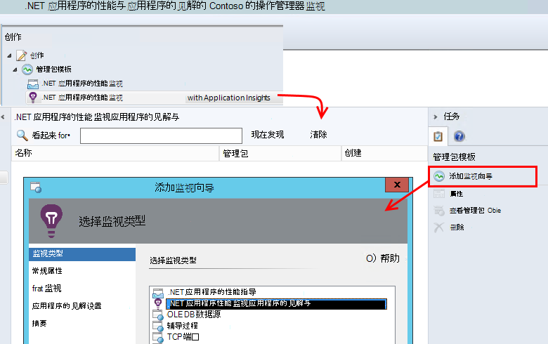
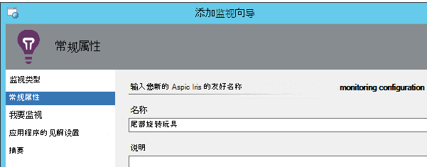
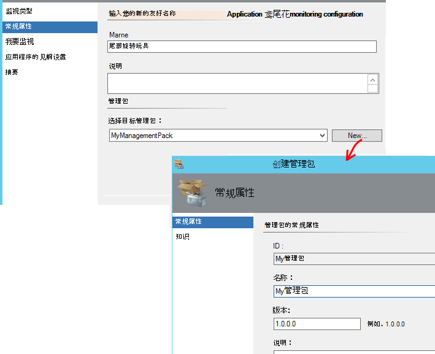
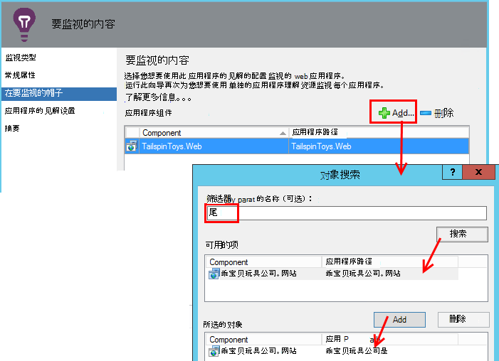
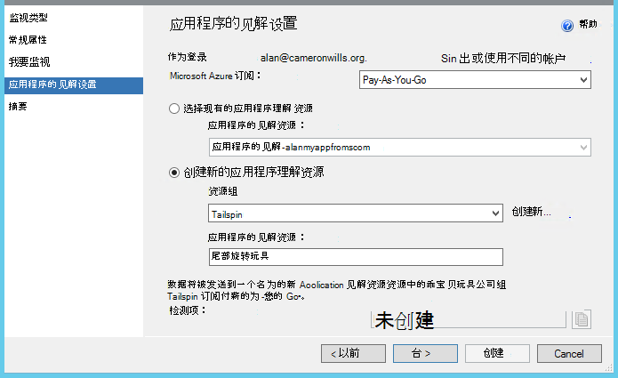
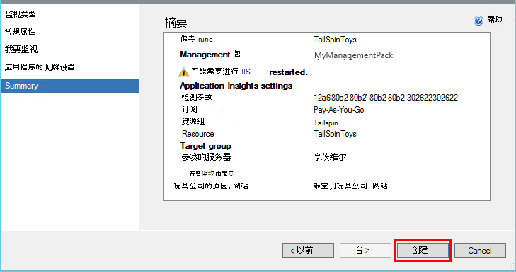
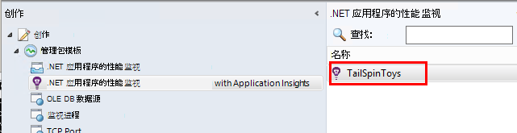
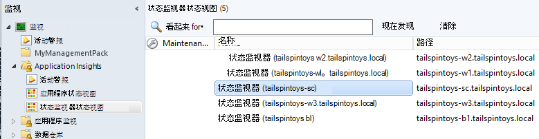

<properties 
    pageTitle="与应用程序的见解 SCOM 集成 |Microsoft Azure" 
    description="如果您是 SCOM 用户，监视性能和诊断与应用程序的见解问题。 综合控制板、 智能报警、 功能强大的诊断工具和分析查询。" 
    services="application-insights" 
    documentationCenter=""
    authors="alancameronwills" 
    manager="douge"/>

<tags 
    ms.service="application-insights" 
    ms.workload="tbd" 
    ms.tgt_pltfrm="ibiza" 
    ms.devlang="na" 
    ms.topic="article" 
    ms.date="08/12/2016" 
    ms.author="awills"/>
 
# 应用程序性能监控对于 SCOM 使用应用程序的见解

如果您使用系统中心操作管理器 (SCOM) 来管理您的服务器，可以监视性能和诊断性能问题与[Visual Studio 应用程序理解](app-insights-asp-net.md)的帮助。 应用程序的见解监视 web 应用程序的传入请求，传出的其余部分和 SQL 调用、 异常和跟踪日志。 它通过此遥测与指标的图表和智能警报，以及诊断功能强大的搜索和分析查询提供仪表板。 

您可以切换使用 SCOM 管理包监视应用程序的见解。

## 在开始之前

我们假定︰

* 您熟悉 SCOM，以及您使用 SCOM 2012 R2 或 2016年来管理您的 IIS web 服务器。
* 您已经安装在服务器上的 web 应用程序要使用应用程序的见解来监视。
* 应用程序框架版本是.NET 4.5 或更高版本。
* 您可以访问[Microsoft Azure](https://azure.com)中的订阅，可以登录到[Azure 的门户](https://portal.azure.com)。 您的组织可能有订阅，并且可向其添加 Microsoft 帐户。

（开发团队可能到 web 应用程序生成[应用程序的见解 SDK](app-insights-asp-net.md) 。 此生成时间检测为其提供更大的灵活性，在编写自定义的遥测。 但是，它并不重要︰ 您可以按照与或没有内置的 SDK 此处介绍的步骤。)

## （一次）安装应用程序的见解管理包

在机器运行操作管理器的位置︰

2. 卸载任何旧版本的管理包︰
 1. 在操作管理器中，打开管理，管理包。 
 2. 删除旧版本。
1. 下载并安装管理包目录中。
2. 重新启动操作管理器。

## 创建管理包

1. 操作管理器中打开**创作**、 **.NET 应用程序的见解与...**、**添加监视向导**，并再次选择**.NET 应用程序的见解与...**。

    

2. 名称在您的应用程序的配置。 （您必须检测一次那个应用程序。）
    
    

3. 在同一个向导页上，请创建新管理包，或者选择您先前创建的应用程序理解的包。

     （应用程序理解[管理包](https://technet.microsoft.com/library/cc974491.aspx)是一个模板，从中创建实例。 您可以以后重新使用同一个实例。）

    

4. 选择一个您想要监视的应用程序。 在您的服务器上安装的应用程序中搜索搜索功能。

    

    可以使用可选的监视作用域字段来指定您的服务器的一个子集如果您不想要监视该应用程序中的所有服务器。

5. 在下一个向导页上，您必须先提供您的凭据，以用于登录到 Microsoft Azure。

    在此页上，您可以选择的遥测数据进行分析并显示应用程序的见解资源。 

 * 如果应用程序在开发过程中进行配置的应用程序的见解，选择其现有的资源。
 * 否则，创建一个名为应用程序的新资源。 如果有其他应用程序是相同的系统的组件，请将它们放在同一资源组中，为了便于访问到遥测管理。

    您以后可以更改这些设置。

    

6. 完成该向导。

    
    
对于每个要监视的应用程序中重复此过程。

如果您需要以后可以更改设置，重新打开显示器与创作窗口的属性。

## 验证监视

显示器上的每个服务器安装了搜索您的应用程序。 它将在其中找到该应用程序，配置应用程序的见解状态监视器来监视应用程序。 如有必要，它将首先在服务器上安装状态监视器。

您可以验证已找到应用程序的实例︰

## 在应用程序的见解中的视图遥测

在[Azure 的门户网站](https://portal.azure.com)，浏览到您的应用程序的资源。 您从您的应用程序[请参见图表显示了遥测](app-insights-dashboards.md)。 （如果它没有显示在主页上还，单击测量数据的实时流。

## 下一步行动

* [设置仪表板](app-insights-dashboards.md)将组合在一起最重要图表监视此服务器和其他应用程序。
* [了解有关指标](app-insights-metrics-explorer.md)
* [设置通知](app-insights-alerts.md)
* [诊断性能问题](app-insights-detect-triage-diagnose.md)
* [功能强大的分析查询](app-insights-analytics.md)
* [可用性 web 测试](app-insights-monitor-web-app-availability.md)
