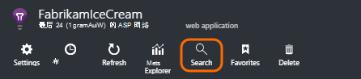
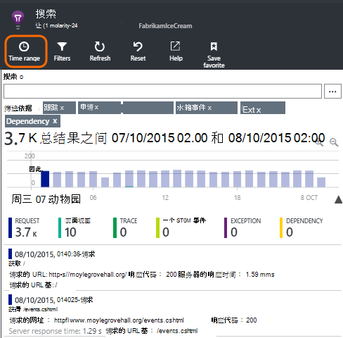
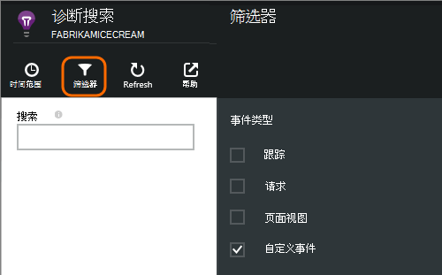
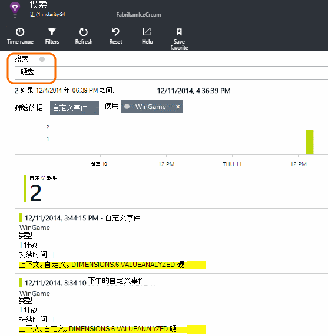
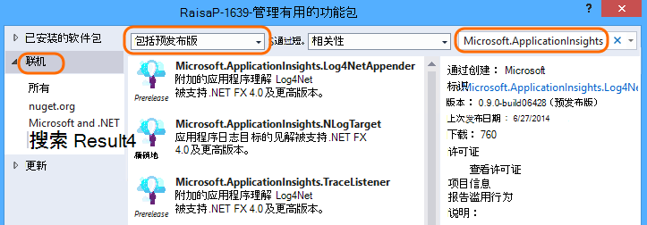
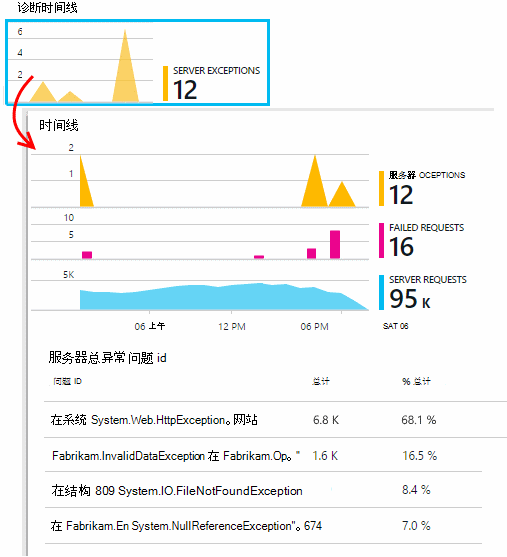

<properties 
    pageTitle="日志、 异常和自定义的 ASP.NET 应用程序的见解中的诊断程序" 
    description="通过搜索请求、 异常和跟踪、 NLog 或 Log4Net 与生成日志诊断 ASP.NET web 应用程序中的问题。" 
    services="application-insights" 
    documentationCenter=""
    authors="alancameronwills" 
    manager="douge"/>

<tags 
    ms.service="application-insights" 
    ms.workload="tbd" 
    ms.tgt_pltfrm="ibiza" 
    ms.devlang="na" 
    ms.topic="article" 
    ms.date="04/08/2016" 
    ms.author="awills"/>
 
# 日志、 异常和自定义的 ASP.NET 应用程序的见解中的诊断程序

[应用程序的见解][start]包括强大的[诊断搜索][diagnostic]的工具，使您能够浏览和钻取从应用程序发送的应用程序的见解 SDK 的遥测。 很多事件，例如用户页面视图将被自动发送通过 SDK。

您还可以编写代码来发送自定义事件、 异常报告和跟踪。 如果您已经使用 log4J、 log4net、 NLog，和 System.Diagnostics.Trace 日志记录框架，可以捕获这些日志并将它们包括在搜索中。 这便于用户操作、 异常和其他事件关联日志跟踪。

## 之前您编写自定义的遥测

如果您还没有[设置为您的项目的应用程序理解][start]，现在做到这一点。

当您运行您的应用程序，它将发送诊断搜索，包括接收到服务器的请求中将会显示一些遥测页视图记录在客户端，且未能捕获异常。

打开诊断搜索，请参阅 SDK 将自动发送的遥测数据。

一个应用程序类型的详细信息会因。 您可以单击通过任何个别的事件，以获取更多详细信息。

## 取样 

如果您正在使用的 ASP.NET 版本 2.0.0-beta3 或更高版本应用程序的见解 SDK 应用程序发送大量的数据，自适应采样功能可能运行和发送只有您遥测的百分比。 [了解有关采样。](app-insights-sampling.md)

##自定义事件

自定义事件显示在[诊断搜索][diagnostic]和[规格，资源管理器][metrics]。 您可以从设备、 web 页和服务器应用程序发送它们。 出于诊断目的，又可以为[了解使用模式]，可以使用它们[track]。

自定义事件都有一个名称，还可以执行您可以过滤，以及数字度量值的属性。

在客户端 JavaScript

    appInsights.trackEvent("WinGame",
         // String properties:
         {Game: currentGame.name, Difficulty: currentGame.difficulty},
         // Numeric measurements:
         {Score: currentGame.score, Opponents: currentGame.opponentCount}
         );

C# 在服务器上

    // Set up some properties:
    var properties = new Dictionary <string, string> 
       {{"game", currentGame.Name}, {"difficulty", currentGame.Difficulty}};
    var measurements = new Dictionary <string, double>
       {{"Score", currentGame.Score}, {"Opponents", currentGame.OpponentCount}};

    // Send the event:
    telemetry.TrackEvent("WinGame", properties, measurements);

VB 在服务器

    ' Set up some properties:
    Dim properties = New Dictionary (Of String, String)
    properties.Add("game", currentGame.Name)
    properties.Add("difficulty", currentGame.Difficulty)

    Dim measurements = New Dictionary (Of String, Double)
    measurements.Add("Score", currentGame.Score)
    measurements.Add("Opponents", currentGame.OpponentCount)

    ' Send the event:
    telemetry.TrackEvent("WinGame", properties, measurements)

### 运行您的应用程序并查看结果。

打开诊断搜索。

选择自定义事件并选择一个特定的事件的名称。

通过对属性值输入一个搜索词更多的数据进行筛选。  

深入到单个事件可查看其详细的属性。

##网页视图

在[您在您的 web 页中插入的 JavaScript 代码段]中的 trackPageView() 调用发送页面视图遥测[usage]。 其主要目的是参加看概述页的网页视图计数。

通常它被调用一次在每个 HTML 页，但可以插入多个调用-例如，如果您有一个单页面应用程序并且想要登录一个新页，每当用户获取更多的数据。

    appInsights.trackPageView(pageSegmentName, "http://fabrikam.com/page.htm"); 

有时它可附加属性，可以使用与在诊断搜索筛选器︰

    appInsights.trackPageView(pageSegmentName, "http://fabrikam.com/page.htm",
     {Game: currentGame.name, Difficulty: currentGame.difficulty});

##跟踪遥测

跟踪遥测是专为创建诊断日志，以插入的代码。 

例如，可以插入电话如下︰

    var telemetry = new Microsoft.ApplicationInsights.TelemetryClient();
    telemetry.TrackTrace("Slow response - database01");

####  安装日志记录框架的适配器

您还可以搜索日志生成的日志记录框架-log4Net，NLog 或 System.Diagnostics.Trace。 

1. 如果您计划使用 log4Net 或 NLog，则将其安装在您的项目。 
2. 在解决方案资源管理器中右击项目，选择**管理 NuGet 程序包**。
3. 选择联机 >，选择**包括预发布版**，然后搜索"Microsoft.ApplicationInsights"

    

4. 选择适当的包内的一种︰
  + Microsoft.ApplicationInsights.TraceListener （以捕获 System.Diagnostics.Trace 调用）
  + Microsoft.ApplicationInsights.NLogTarget
  + Microsoft.ApplicationInsights.Log4NetAppender

NuGet 程序包安装必需的程序集，并还修改 web.config 或 app.config。

#### 插入诊断日志调用

如果您使用 System.Diagnostics.Trace，将是一个典型的调用︰

    System.Diagnostics.Trace.TraceWarning("Slow response - database01");

如果您希望使用 log4net 或 NLog:

    logger.Warn("Slow response - database01");

在调试模式下运行您的应用程序或对其进行部署。

当您选择的跟踪筛选器时，您将看到在诊断搜索中的邮件。

### 例外情况

在应用程序的见解得到异常报告提供了非常强大的体验，特别是因为您可以切换失败的请求和异常，并阅读异常堆栈。

在某些情况下，您需要[插入几行代码][exceptions]若要确保自动捕获您的异常。

您也可以编写显式发送异常遥测的代码︰

JavaScript

    try 
    { ...
    }
    catch (ex)
    {
      appInsights.TrackException(ex, "handler loc",
        {Game: currentGame.Name, 
         State: currentGame.State.ToString()});
    }

C#

    var telemetry = new TelemetryClient();
    ...
    try 
    { ...
    }
    catch (Exception ex)
    {
       // Set up some properties:
       var properties = new Dictionary <string, string> 
         {{"Game", currentGame.Name}};

       var measurements = new Dictionary <string, double>
         {{"Users", currentGame.Users.Count}};

       // Send the exception telemetry:
       telemetry.TrackException(ex, properties, measurements);
    }

VB

    Dim telemetry = New TelemetryClient
    ...
    Try
      ...
    Catch ex as Exception
      ' Set up some properties:
      Dim properties = New Dictionary (Of String, String)
      properties.Add("Game", currentGame.Name)

      Dim measurements = New Dictionary (Of String, Double)
      measurements.Add("Users", currentGame.Users.Count)
  
      ' Send the exception telemetry:
      telemetry.TrackException(ex, properties, measurements)
    End Try

属性和度量值的参数是可选的但可用于筛选和添加额外的信息。 例如，如果您有一个应用程序，可以运行多个游戏，您可以找到与某个特定游戏相关的异常报告。 您可以添加任意数量的项目，根据需要为每个字典。

#### 查看例外

您将看到摘要的异常报告概述刀片式服务器，并且可以通过单击以查看更多详细信息。 例如︰

[]

若要查看特定事件的任何异常类型上，请单击︰

[]

您可以直接打开诊断搜索、 筛选的异常，并选择您想要查看的异常类型。

### 报告未处理的异常

应用程序的见解报告未处理的异常，它可以从[web 浏览器]的设备[usage]，或 web 服务器，是否通过[状态监视器]检测[redfield]或[应用程序的见解 SDK][greenbrown]。 

但是，它并不总是能够这样做有时是因为.NET framework 捕获异常。  若要确保您看到的所有异常，因此需要编写一个小的异常处理程序。 最佳的过程因技术而异。 请参阅[ASP.NET 的异常遥测][exceptions]的详细信息。 

### 生成与关联

当读取诊断日志时，则很可能因为实时代码部署源代码将已更改。

因此它可将生成的信息，如 URL 的当前版本中，放入每个异常或跟踪的属性。 

而不是对每个异常调用单独添加属性，您可以在默认上下文中设置信息。 

    // Telemetry initializer class
    public class MyTelemetryInitializer : ITelemetryInitializer
    {
        public void Initialize (ITelemetry telemetry)
        {
            telemetry.Properties["AppVersion"] = "v2.1";
        }
    }

在 Global.asax.cs 如应用程序初始值设定项︰

    protected void Application_Start()
    {
        // ...
        TelemetryConfiguration.Active.TelemetryInitializers
        .Add(new MyTelemetryInitializer());
    }

###服务器的 Web 请求

请求时自动发送遥测[安装在 web 服务器上的状态监视器][redfield]，或当您[添加到您的 web 项目的应用程序理解][greenbrown]。 它还进到请求和响应时间图表中度量资源管理器和概述页。

如果您想要发送附加事件，您可以使用 TrackRequest() API。

## 问与答

### 获取错误"检测键不能为空"

看起来您安装日志记录适配器 Nuget 程序包不安装应用程序的见解。

在解决方案资源管理器中，右击`ApplicationInsights.config`，然后选择**更新应用程序的见解**。 您将获得一个对话，邀请您登录到 Azure 并且必须要么创建应用程序建议的资源，或重新使用现有。 它能解决它。

### 保留的数据量？

每秒钟从每个应用程序的事件达 500 个。 事件保留七天。

### 某些事件或跟踪不显示

如果您正在使用的 ASP.NET 版本 2.0.0-beta3 或更高版本应用程序的见解 SDK 应用程序发送大量的数据，自适应采样功能可能运行和发送只有您遥测的百分比。 [了解有关采样。](app-insights-sampling.md)

## 下一步行动

* [设置的可用性和响应能力测试][availability]
* [故障排除][qna]

<!--Link references-->

[availability]: app-insights-monitor-web-app-availability.md
[diagnostic]: app-insights-diagnostic-search.md
[exceptions]: app-insights-asp-net-exceptions.md
[greenbrown]: app-insights-asp-net.md
[metrics]: app-insights-metrics-explorer.md
[qna]: app-insights-troubleshoot-faq.md
[redfield]: app-insights-monitor-performance-live-website-now.md
[start]: app-insights-overview.md
[track]: app-insights-api-custom-events-metrics.md
[usage]: app-insights-web-track-usage.md

 
