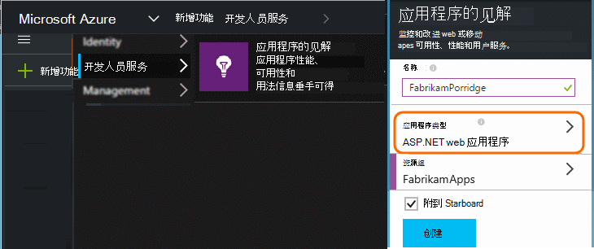
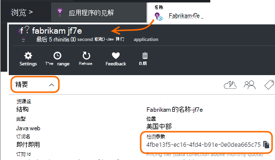

<properties 
    pageTitle="单独的应用程序理解资源用于开发、 测试和生产" 
    description="监视的性能和用法的不同阶段开发的应用程序" 
    services="application-insights" 
    documentationCenter=""
    authors="alancameronwills" 
    manager="douge"/>

<tags 
    ms.service="application-insights" 
    ms.workload="tbd" 
    ms.tgt_pltfrm="ibiza" 
    ms.devlang="na" 
    ms.topic="article" 
    ms.date="05/04/2016" 
    ms.author="awills"/>

# 将应用程序的见解资源分开

应该从不同的组件和应用程序版本的遥测数据发送给不同的应用程序理解资源或合并成一个？ 本文主要论述在最佳做法和所需的技巧。

首先，我们来了解一下这个问题。 从应用程序接收到的数据存储和处理应用程序理解 Microsoft Azure 的*资源*中。 每个资源都由*检测密钥*(iKey) 标识。 在您的应用程序，该密钥提供给应用程序深入 SDK 以便它可以发送的数据，它可以收集到相应的资源。 可以在代码中或在 ApplicationInsights.config 中提供密钥。 通过更改在 SDK 中的键，可以将数据复制到不同的资源。 

在简单的情况下，当您创建新的应用程序，代码也创建新资源在应用程序的见解。 在 Visual Studio 时，*新建项目*对话框中会为您做这。

如果它是高容量网站，它可能在多个服务器实例上进行部署。

在更复杂的情况下，您可以组成多个组件-例如，一个网站和一个后端处理器的系统。 

## 何时使用单独的 iKeys

下面是一些一般的指导原则︰

* 您具有运行的服务器独立于其他组件，可以扩展的实例上/下一组，通常会为单个资源的映射，然后可单独部署应用程序单元，即它将具有一个单一检测键 (iKey)。
* 与此相反，使用单独的 iKeys 的原因包括︰
 - 从单独的组件轻松阅读不同的衡量标准。
 - 将量较少的遥测与高容量分开，以便限制，配额，和上一个流采样并不影响其他。
 - 单独的警报、 导出和工作项的配置。
 - 如遥测配额，调节，和 web 测试计数分布[限制](app-insights-pricing.md#limits-summary)。
 - 正在开发的代码和测试应置于单独的生产标记比 iKey。  

大量的应用程序理解的门户体验设计注意这些准则。 例如，服务器在服务器实例做出的假设是关于一个逻辑组件可以来自多个服务器实例的遥测视图段。

## 一个 iKey

在您发送遥测中多个组件到一个 iKey:

* 将属性添加到段和上的组件标识筛选器允许您所有的遥测数据。 角色 ID 将自动添加到遥测从服务器角色实例，但在其他情况下不可以使用[遥测初始值设定项](app-insights-api-filtering-sampling.md#add-properties)添加属性。
* 在同一时间更新应用程序的见解 Sdk 中的不同组件。 一个 iKey 遥测数据应源于相同版本的 SDK。

## 单独的 iKeys

您有多个不同应用程序组件的 iKeys:

* 创建[仪表板](app-insights-dashboards.md)视图的关键遥测从逻辑应用程序，不同的应用程序组件的结合而成。 可以共享仪表板，因此可以由不同的团队使用单个逻辑系统视图。
* 组织团队级别上的[资源组](app-insights-resources-roles-access-control.md)。 分配的资源组的访问权限，其中包括设置通知的权限。 
* 使用[Azure 资源管理器模板和 Powershell](app-insights-powershell.md)有助于管理项目，如预警规则和 web 测试。

## 单独的开发/测试和生产 iKeys

以方便您释放您的应用程序时自动更改密钥，请在 ApplicationInsights.config 而不是设置在代码中，iKey。

### 动态检测键

在初始化方法中，如 ASP.NET 服务中的 global.aspx.cs 设置项︰

*C#*

    protected void Application_Start()
    {
      Microsoft.ApplicationInsights.Extensibility.
        TelemetryConfiguration.Active.InstrumentationKey = 
          // - for example -
          WebConfigurationManager.AppSettings["ikey"];
      ...

在此示例中，ikeys 不同的资源放置在不同版本的 web 配置文件中。 换用 web 配置文件-这可以作为释放脚本的一部分来完成-会交换的目标资源。

### Web 页

IKey 用于您的应用程序中的 web 页，[你从快速入门刀片式服务器的脚本](app-insights-javascript.md)。 而不是编码它字面意义到脚本，生成它的服务器状态。 例如，在 ASP.NET 应用程序︰

*JavaScript 在 Razor 中*

    <script type="text/javascript">
    // Standard Application Insights web page script:
    var appInsights = window.appInsights || function(config){ ...
    // Modify this part:
    }({instrumentationKey:  
      // Generate from server property:
      "@Microsoft.ApplicationInsights.Extensibility.
         TelemetryConfiguration.Active.InstrumentationKey"
    }) // ...

## 创建附加的应用程序理解资源
  
如果您决定来分隔为不同的应用程序组件的同一组件的不同戳 （测试/开发/生产）; 二是遥测，您将需要创建新的应用程序理解资源。

在[portal.azure.com](https://portal.azure.com)中，添加应用程序理解的资源︰

* **应用程序类型**将影响概述刀片和[公制的资源管理器](app-insights-metrics-explorer.md)中可用的属性上看到的内容。 如果您看不到您的应用程序类型，选择一个网页的网站类型。
* **资源组**是管理属性，如[访问控制](app-insights-resources-roles-access-control.md)提供了便利。 您可以使用单独的资源组用于开发、 测试和生产。
* **订阅**是 Azure 您的付款帐户。
* **位置**是，我们在其中保存您的数据。 目前无法更改它。 
* **添加到仪表板**将 Azure 主页上的所需资源的快速访问拼贴。 

创建资源需要几秒钟。 完成后，您将看到一个警报。

（您可以编写[PowerShell 脚本](app-insights-powershell-script-create-resource.md)自动创建的资源）。

## 获取检测键

检测关键字标识了您所创建的资源。 

您需要使用您的应用程序将数据发送给它的所有资源的检测密钥。

 
